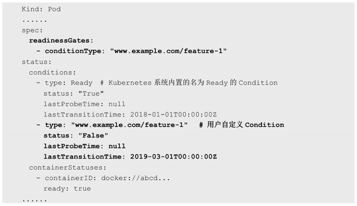

<!-- @import "[TOC]" {cmd="toc" depthFrom=1 depthTo=6 orderedList=false} -->

<!-- code_chunk_output -->


<!-- /code_chunk_output -->

Kubernetes 对 Pod 的健康状态可以通过**两类探针**来检查：**LivenessProbe** 和**ReadinessProbe**，**kubelet**定期执行这两类探针来诊断容器的健康状况。

(1) LivenessProbe探针：用于判断**容器是否存活**（Running状态），如果LivenessProbe探针探测到**容器不健康**，则**kubelet将杀掉该容器**，并根据容器的重启策略做相应的处理。如果一个容器不包含LivenessProbe探针，那么kubelet认为该容器的LivenessProbe探针返回的值永远是Success。

(2) ReadinessProbe探针：用于判断容器服务是否可用（Ready状态），达到Ready状态的Pod才可以接收请求。对于被Service管理的Pod，Service与Pod Endpoint的关联关系也将基于Pod是否Ready进行设置。如果在运行过程中Ready状态变为False，则系统自动将其从Service的后端Endpoint列表中隔离出去，后续再把恢复到Ready状态的Pod加回后端Endpoint列表。这样就能保证客户端在访问Service时不会被转发到服务不可用的Pod实例上。

LivenessProbe和ReadinessProbe均可配置以下三种实现方式。

（1）ExecAction：在容器内部执行一个命令，如果该命令的返回码为0，则表明容器健康。
在下面的例子中，通过执行“cat /tmp/health”命令来判断一个容器运行是否正常。在该Pod运行后，将在创建/tmp/health文件10s后删除该文件，而LivenessProbe健康检查的初始探测时间（initialDelaySeconds）为15s，探测结果是Fail，将导致kubelet杀掉该容器并重启它：

```yaml
---
apiVersion: v1
kind: Pod
metadata:
  labels:
    test: liveness
  name: liveness-exec
spec:
  containers:
  - name: liveness
    image: gcr.io/google_containers/busybox
    args:
    - /bin/sh
    - -c
    - echo ok > /tmp/health; sleep 10; rm -rf /tmp/health; sleep 600
    livenessProbe:
      exec:
        command:
        - cat
        - /tmp/health
      initialDelaySeconds: 15
      timeoutSeconds: 1
```

（2）TCPSocketAction：通过**容器的IP地址**和**端口号**执行TCP检查，如果能够建立TCP连接，则表明容器健康。

在下面的例子中，通过与容器内的localhost:80建立TCP连接进行健康检查：

```yaml
---
apiVersion: v1
kind: Pod
metadata:
  name: pod-with-healthcheck
spec:
  containers:
  - name: nginx
    image: nginx
    ports:
    - containerPort: 80
    livenessProbe:
      tcpSocket:
        port: 80
      initialDelaySeconds: 30
      timeoutSeconds: 1
```

（3）HTTPGetAction：通过容器的IP地址、端口号及路径调用HTTP Get方法，如果响应的状态码大于等于200且小于400，则认为容器健康。

在下面的例子中，kubelet定时发送HTTP请求到localhost:80/_status/healthz来进行容器应用的健康检查：

```yaml
---
apiVersion: v1
kind: Pod
metadata:
  name: pod-with-healthcheck
spec:
  containers:
  - name: nginx
    image: nginx
    ports:
    - containerPort: 80
    livenessProbe:
      httpGet:
        path: /_status/healthz
        port: 80
      initialDelaySeconds: 30
      timeoutSeconds: 1
```

对于每种探测方式，都需要设置initialDelaySeconds和timeoutSeconds两个参数，它们的含义分别如下。

- initialDelaySeconds：启动容器后进行首次健康检查的等待时间，单位为s。
- timeoutSeconds：健康检查发送请求后等待响应的超时时间，单位为s。当超时发生时，kubelet会认为容器已经无法提供服务，将会重启该容器。

Kubernetes的ReadinessProbe机制可能无法满足某些复杂应用对容器内服务可用状态的判断，所以Kubernetes从1.11版本开始，引入Pod Ready\+\+特性对Readiness探测机制进行扩展，在1.14版本时达到GA稳定版，称其为Pod Readiness Gates。

通过Pod Readiness Gates机制，用户可以将自定义的ReadinessProbe探测方式设置在Pod上，辅助Kubernetes设置Pod何时达到服务可用状态（Ready）。为了使自定义的ReadinessProbe生效，用户需要提供一个外部的控制器（Controller）来设置相应的Condition状态。

Pod的Readiness Gates在Pod定义中的ReadinessGate字段进行设置。下面的例子设置了一个类型为www.example.com/feature\-1的新Readiness Gate：



新增的自定义Condition的状态（status）将由用户自定义的外部控制器设置，默认值为False。Kubernetes将在判断全部readinessGates条件都为True时，才设置Pod为服务可用状态（Ready为True）。