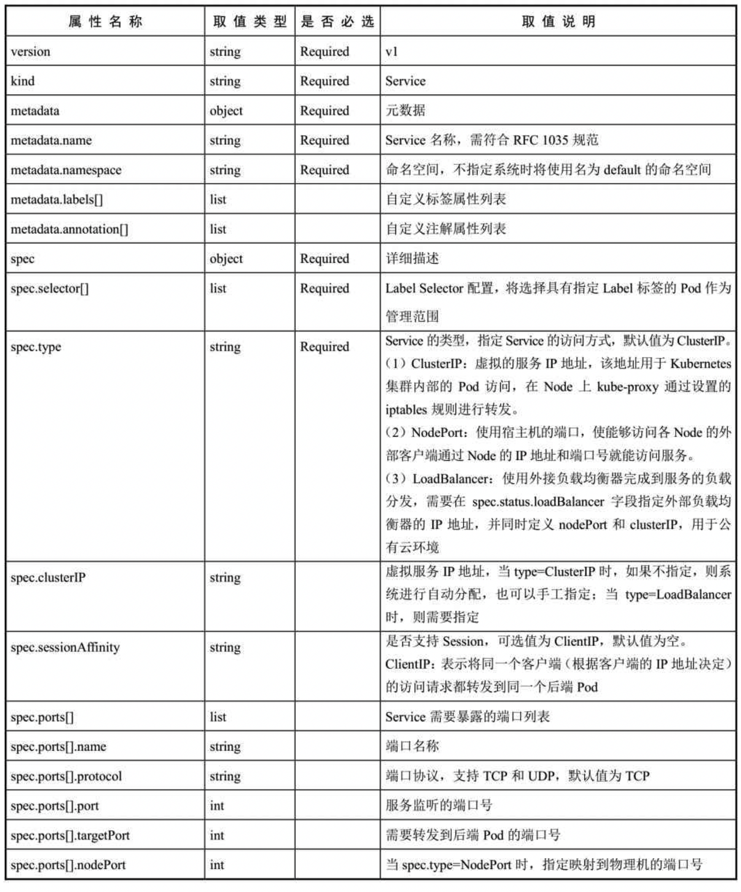
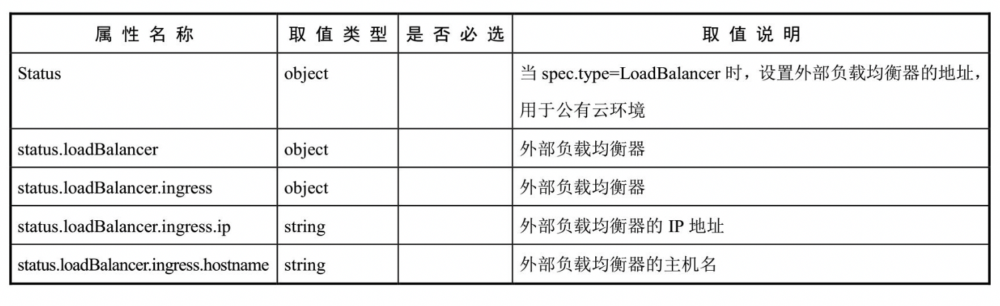

<!-- @import "[TOC]" {cmd="toc" depthFrom=1 depthTo=6 orderedList=false} -->

<!-- code_chunk_output -->

- [2 Service的基本用法](#2-service的基本用法)

<!-- /code_chunk_output -->

YAML格式的Service定义文件的完整内容如下：

```yaml
apiVersion: v1          # Required
kind: Service           # Required
metadata:               # Required
  name: string          # Required
  namespace: string     # Required
  labels: 
    - name: string
  annotations:
    - name: string
spec:                   # Required
  selector: []          # Required
  type: string          # Required
  clusterIP: string
  sessionAffinity: string
  ports:
  - name: string
    protocol: string
    port: int
    targetPort: int
    nodePort: int
  status:
    loadBalancer:
      ingress:
        ip: string
        hostname: string
```

对各属性的说明如表4.1所示。

表4.1　对Service的定义文件模板的各属性的说明:





# 2 Service的基本用法

一般来说，**对外提供服务的应用程序**需要通过**某种机制**来实现，对于**容器应用**最简便的方式就是通过**TCP/IP机制**及**监听IP和端口号**来实现。

例如，定义一个**提供Web服务的RC**，由**两个Tomcat容器副本**组成，**每个容器**都通过**containerPort设置**提供服务的端口号为8080：

```yaml
# webapp-rc.yaml
---
apiVersion: v1
kind: ReplicationController
metadata:
  name: webapp
spec:
  replicas: 2
  template:
    metadata:
      name: webapp
      labels:
        app: webapp
    spec:
      containers:
      - name: webapp
        image: tomcat
        ports:
        - containerPort: 8080
```

创建该RC:

```
# kubectl create -f webapp-rc.yaml
replicationcontroller "webapp" created
```

获取Pod的IP地址：

```
# kubectl get pods -l app=webapp -o yaml | grep podIP
    podIP: 172.17.1.4
    podIP: 172.17.1.3
```

可以直接通过这两个Pod的IP地址和端口号访问Tomcat服务：

```
# curl 172.17.1.3:8080
<!DOCTYPE html>
<html lang="en">
    <head>
        <meta charset="UTF-8" />
        <title>Apache Tomcat/8.0.35</title>
......

# curl 172.17.1.4:8080
<!DOCTYPE html>
<html lang="en">
    <head>
        <meta charset="UTF-8" />
        <title>Apache Tomcat/8.0.35</title>
......
```

**直接通过Pod的IP地址和端口号**可以**访问到容器应用内的服务**，但是Pod的IP地址是不可靠的，例如当Pod所在的**Node发生故障**时，Pod将被Kubernetes重新调度到另一个Node，**Pod的IP地址将发生变化**。

更重要的是，如果**容器应用**本身是**分布式的部署方式**，通过多个实例共同提供服务，就需要在**这些实例的前端**设置一个**负载均衡器**来实现请求的分发。

Kubernetes中的**Service**就是用于**解决这些问题**的核心组件。

以前面创建的webapp应用为例，为了让**客户端应用**访问到**两个Tomcat Pod实例**，需要**创建一个Service**来提供服务。Kubernetes提供了一种**快速的方法**，即通过**kubectl expose命令**来**创建Service**：

```
# kubectl expose rc webapp
service "webapp" exposed
```

查看**新创建的Service**，可以看到系统为它分配了一个**虚拟的IP地址（ClusterIP**），**Service所需的端口号**则从**Pod中的containerPort**复制而来：

```
# kubectl get svc
NAME        CLUSTER-IP      EXTERNAL-IP     PORT(S)     AGE
webapp      169.169.235.79  <none>          8080/TCP    3s
```

接下来就可以通过Service的IP地址和Service的端口号访问该Service了：

```
# curl 169.169.235.79:8080
<!DOCTYPE html>
<html lang="en">
    <head>
        <meta charset="UTF-8" />
        <title>Apache Tomcat/8.0.35</title>
```

这里，对**Service地址169.169.235.79:8080**的访问被**自动负载分发**到了**后端两个Pod之一**：172.17.1.3:8080或172.17.1.4:8080。

除了使用**kubectl expose命令**创建**Service**，我们也可以通过配置文件**定义Service**，再通过kubectl create命令进行创建。例如对于前面的webapp应用，我们可以设置一个Service，代码如下：

```

```