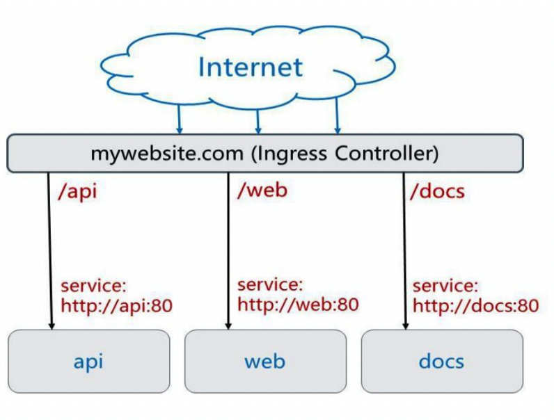
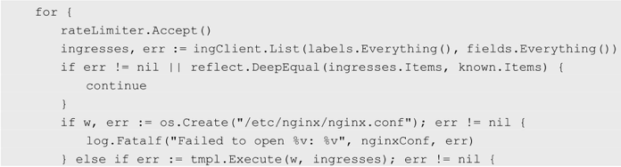
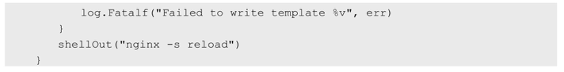

<!-- @import "[TOC]" {cmd="toc" depthFrom=1 depthTo=6 orderedList=false} -->

<!-- code_chunk_output -->

- [0 不同URL地址不同HTTP服务](#0-不同url地址不同http服务)
- [1 创建Ingress Controller和默认的backend服务](#1-创建ingress-controller和默认的backend服务)

<!-- /code_chunk_output -->

# 0 不同URL地址不同HTTP服务

根据前面对Service的使用说明，我们知道**Service**的**表现形式为IP:Port**，即**工作**在**TCP/IP层**。

而对于**基于HTTP的服务**来说，**不同的URL地址**经常对应到**不同的后端服务**或者**虚拟服务器（Virtual Host**），这些应用层的**转发机制**仅通过Kubernetes的**Service机制**是**无法实现**的。

从Kubernetes **1.1版本**开始新增**Ingress资源对象**，用于将**不同URL的访问请求！！！** 转发到**后端不同的Service！！！**，以实现**HTTP层**的**业务路由机制**。

Kubernetes使用了**一个Ingress策略定义**和**一个具体的Ingress Controller**，两者结合并实现了一个**完整的Ingress负载均衡器**。

使用Ingress进行**负载分发**时，Ingress Controller基于**Ingress规则**将客户端请求直接转发到**Service对应的后端Endpoint（Pod**）上，这样会**跳过kube\-proxy的转发功能！！！**，**kube\-proxy不再起作用**。如果Ingress Controller提供的是**对外服务**，则实际上实现的是**边缘路由器的功能**。

图4.6显示了一个典型的HTTP层路由的例子。



其中：

- 对 http://mywebsite.com/api 的访问将被路由到后端名为**api的Service**；
- 对 http://mywebsite.com/web 的访问将被路由到后端名为**web的Service**；
- 对 http://mywebsite.com/docs 的访问将被路由到后端名为**docs的Service**。

为使用Ingress，需要**创建Ingress Controller**（带一个**默认backend服务**）和**Ingress策略设置**来共同完成。

下面通过一个例子分三步说明Ingress Controller和Ingress策略的配置方法，以及客户端如何访问Ingress提供的服务。

# 1 创建Ingress Controller和默认的backend服务

在定义Ingress策略之前，需要先**部署Ingress Controller**，以实现为**所有后端Service！！！都提供一个统一的入口**。

**Ingress Controller**需要实现基于**不同HTTP URL**向后转发的**负载分发规则**，并可以**灵活设置7层负载分发策略**。如果**公有云服务商**能够提供**该类型的HTTP路由LoadBalancer**，则也可**设置其为Ingress Controller**。

在Kubernetes中，Ingress Controller将**以Pod的形式运行**，**监控API Server的/ingress接口后端的backend services**，如果Service发生变化，则Ingress Controller应自动更新其转发规则。

下面的例子使用**Nginx**来实现一个Ingress Controller，需要实现的基本逻辑如下。

（1）**监听API Server**，获取**全部Ingress的定义**。

（2）基于Ingress的定义，生成**Nginx**所需的配置文件/**etc/nginx/nginx.conf**。

（3）执行nginx \-s reload命令，重新加载nginx.conf配置文件的内容。

基于Go语言的核心代码实现如下：





本例使用**谷歌**提供的**nginx\-ingress\-controller镜像**来创建**Ingress Controller**。该Ingress Controller以**daemonset的形式**进行创建，在**每个Node**上都将**启动一个Nginx服务**。

这里为**Nginx容器**设置了**hostPort**，将**容器应用监听的80**和**443端口号**映射到**物理机上**，使得客户端应用可以通过URL地址“ http://物理机IP:80 ”或“ https://物理机IP:443 ”来**访问该Ingress Controller**。这使得**Nginx**类似于通过**NodePort**映射到物理机的**Service**，成为**代替kube\-proxy**的**HTTP层的Load Balancer**：

```yaml
# nginx-ingress-daemonset.yaml
---
apiVersion: extensions/v1beta1
kind: DaemonSet
metadata:
  name: nginx-ingress-lb
  labels:
    name: nginx-ingress-lb
  namespace: kube-system
spec:
  template:
    metadata:
      labels:
        name: nginx-ingress-lb
    spec:
      terminationGracePeriodSeconds: 60
      containers:
      - image: gcr.io/google_containers/nginx-ingress-controller:0.9.0-beta.2
        name: nginx-ingress-lb
        readinessProbe:
          httpGet:
            path: /healthz
            port: 10254
            scheme: HTTP
        livenessProbe:
          httpGet:
            path: /healthz
            port: 10254
            scheme: HTTP
          initialDelaySeconds: 10
          timeoutSeconds: 1
        ports:
        - containerPort: 80
          hostPort: 80          # 重点
        - containerPort: 443
          hostPort: 443         # 重点
        env:
          - name: POD_NAME
            valueFrom:
              fieldRef:
                fieldPath: metadata.name
          - name: POD_NAMESPACE
            valueFrom:
              fieldRef:
                fieldPath: metadata.namespace
        args:                   # 重点
        - /nginx-ingress-controller     
        - --default-backend-service=$(POD_NAMESPACE)/default-http-backend
```

