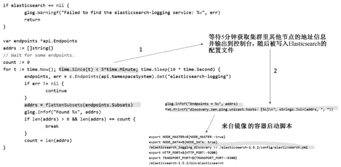
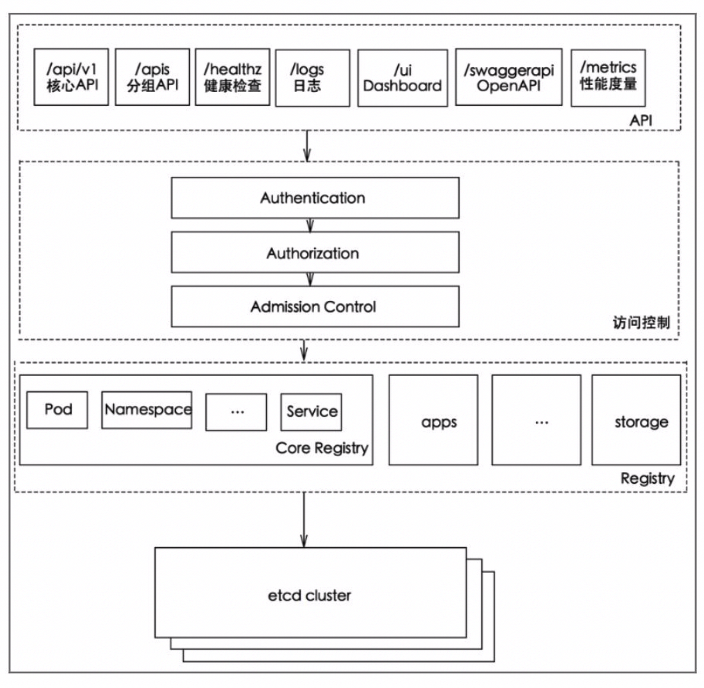
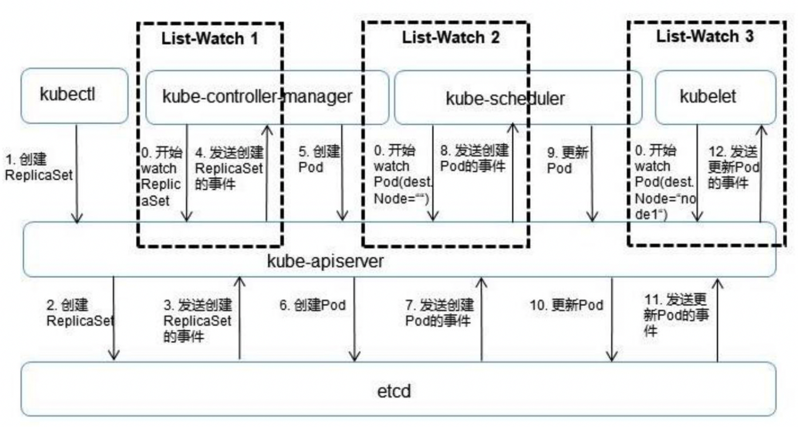
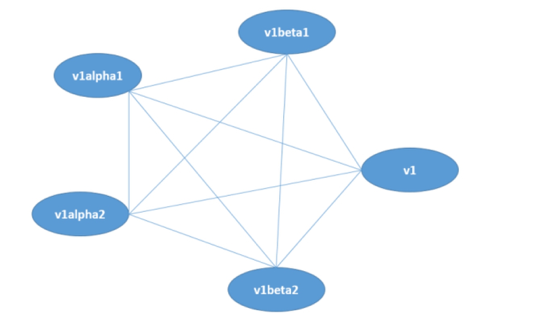
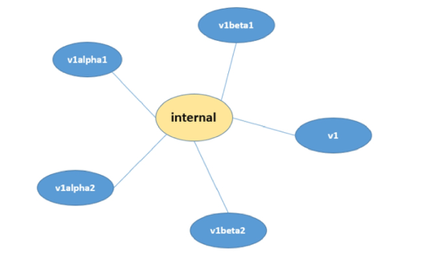

<!-- @import "[TOC]" {cmd="toc" depthFrom=1 depthTo=6 orderedList=false} -->

<!-- code_chunk_output -->

- [1. Kubernetes API Server概述](#1-kubernetes-api-server概述)
  - [1.1. 访问API Server方式](#11-访问api-server方式)
    - [1.1.1. kubectl命令行工具](#111-kubectl命令行工具)
    - [1.1.2. curl命令行工具](#112-curl命令行工具)
      - [1.1.2.1. 获取API版本信息](#1121-获取api版本信息)
      - [1.1.2.2. 获取支持的资源对象种类](#1122-获取支持的资源对象种类)
- [2. API Server架构解析](#2-api-server架构解析)
- [3. 独特的Kubernetes Proxy API接口](#3-独特的kubernetes-proxy-api接口)

<!-- /code_chunk_output -->

总体来看，Kubernetes **API Server**的**核心功能**是提供Kubernetes**各类资源对象**（如Pod、RC、Service等）的增、删、改、查及Watch等**HTTP Rest接口**，成为集群内各个功能模块之间数据交互和通信的中心枢纽，是整个系统的**数据总线**和**数据中心**。

除此之外，它还有以下一些功能特性。

(1) **集群管理**的API入口

(2) **资源配额控制**的入口

(3) 提供了完备的**集群安全机制**

# 1. Kubernetes API Server概述

Kubernetes API Server通过一个名为**kube\-apiserver**的**进程**提供服务，该进程运行在**Master**上。

在**默认情况**下，kube\-apiserver进程在**本机的8080端口**（对应参数\-\-**insecure\-port**）提供REST服务。

可以同时**启动HTTPS安全端口**（\-\-**secure\-port**=**6443**）来启动**安全机制**，加强REST API访问的安全性。

## 1.1. 访问API Server方式

### 1.1.1. kubectl命令行工具

通常可以通过**命令行工具kubectl**来与Kubernetes **API Server交互**，它们之间的接口是**RESTful API**。

### 1.1.2. curl命令行工具

为了测试和学习Kubernetes API Server所提供的接口，我们也可以使用**curl命令行工具**进行快速验证。

#### 1.1.2.1. 获取API版本信息

比如, **登录Master**并运行下面的curl命令, 得到以JSON方式返回的Kubernetes **API的版本信息**

```
# curl localhost:8080/api
{
    "kind": "APIVersions",
    "verdions": [
        "v1"
    ],
    "serverAddressByClientCIDRs": [
        {
            "clientCIDR": "0.0.0.0/0",
            "serverAddress": "192.168.18.131:6443"
        }
    ]
}
```

#### 1.1.2.2. 获取支持的资源对象种类

可以运行下面命令查看Kubernetes **API Server**目前支持的**资源对象的种类**:

```
# curl localhost:8080/api/v1
```

根据以上命令的输出，我们可以运行下面的curl命令，分别返回**集群中的Pod列表**、**Service列表**、**RC列表**等：

```
# curl localhost:8080/api/v1/pods
# curl localhost:8080/api/v1/services
# curl localhost:8080/api/v1/replicationcontrollers
```

如果**只**想对外暴露**部分REST服务**, 则可以在**Mater**或**其他节点**上运行**kubectl proxy进程**启动一个**内部代理**来实现.

运行下面命令, 在**8001端口启动代理**, 并且**拒绝客户端访问RC的API**:

```
# kubectl proxy --reject-paths="^/api/v1/replicationcontrollers" --port=8001 --v=2
Starting to server on 127.0.0.1:8001
```

运行下面命令进行验证:

```
# curl localhost:8001/api/v1/replicationcontrollers
<h3>Unauthorized</h3>
```

kubectl **proxy**具有很多特性，**最实用**的一个特性是提供**简单有效的安全机制**，比如在采用**白名单限制非法客户端**访问时，只需增加下面这个参数即可：

```
--accept-hosts="^localhost$,^127\\.0\\.0\\.1$,^\\[::1\\]$"
```

最后一种方式就是通过**编程方式**调用kubernetes API Server. 具体场景又细分为以下两种.

第1种使用场景：运行在**Pod里的用户进程**调用Kubernetes API，通常用来实现**分布式集群搭建**的目标。

比如下面这段来自谷歌官方的Elasticsearch集群例子中的代码，Pod在启动的过程中通过访问Endpoints的API，找到属于elasticsearch\-logging这个Service的所有Pod副本的IP地址，用来构建集群，如图5.1所示。

图5.1 应用程序编程访问API Server:



在上述使用场景中，**Pod中的进程**如何知道**API Server的访问地址**呢？答案很简单：Kubernetes **API Server**本身也是一个**Service**，它的名称就是**kubernetes**，并且它的**Cluster IP地址**是**Cluster IP地址池**里的**第1个地址**！另外，它所服务的端口是HTTPS端口443，通过kubectl get service命令可以确认这一点：

```
# kubectl get service
NAME        CLUSTER-IP          EXTERNAL-IP         PORT(S)     AGE
kubernetes  169.169.0.1         <none>              443/TCP     30d
```

第2种使用场景：开发基于Kubernetes的管理平台。

比如调用Kubernetes API来完成Pod、Service、RC等资源对象的图形化创建和管理界面，此时可以使用Kubernetes及各开源社区为开发人员提供的**各种语言版本**的 **Client Library**。后面会介绍通过编程方式访问API Server的一些细节技术。

由于**API Server**是Kubernetes集群数据的**唯一访问入口！！！**，因此**安全性**与**高性能**就成为API Server设计和实现的**两大核心目标**。

通过采用**HTTPS安全传输通道**与**CA签名数字证书强制双向认证**的方式，API Server的**安全性**得以保障。此外，为了**更细粒度**地控制**用户或应用**对Kubernetes**资源对象的访问权限**，Kubernetes启用了**RBAC访问控制策略**，之后会深入讲解这一安全策略。

API Server的**性能**是决定Kubernetes集群整体性能的关键因素，因此Kubernetes的设计者综合运用以下方式来最大程度地保证API Server的性能。

（1）API Server拥有**大量高性能的底层代码**。在API Server源码中使用**协程（Coroutine**） \+ **队列（Queue**）这种轻量级的高性能并发代码，使得单进程的API Server具备了超强的多核处理能力，从而以很快的速度并发处理大量的请求。

（2）普通List接口结合异步Watch接口，不但完美解决了Kubernetes中各种资源对象的高性能同步问题，也极大提升了Kubernetes集群实时响应各种事件的灵敏度。

（3）采用了**高性能的etcd数据库**而非传统的关系数据库，不仅解决了数据的可靠性问题，也极大提升了API Server数据访问层的性能。在常见的公有云环境中，一个3节点的etcd集群在轻负载环境中处理一个请求的时间可以低于1ms，在重负载环境中可以每秒处理超过30000个请求。

正是由于采用了上述提升性能的方法，API Server可以支撑很大规模的Kubernetes集群。截至1.13版本时，Kubernetes已经可以支持最多5000节点规模的集群，同时Kubernetes API Server也淘汰了etcd 2.0，只支持etcd 3.0以上版本。

# 2. API Server架构解析

API Server的架构从上到下可以分为以下几层，如图5.2所示。

（1）**API层**：主要以**REST方式**提供**各种API接口**，除了有Kubernetes资源对象的**CRUD**和**Watch**等主要API，还有健康检查、UI、日志、性能指标等运维监控相关的API。Kubernetes从1.11版本开始废弃Heapster监控组件，转而使用**Metrics Server**提供**Metrics API接口**，进一步完善了自身的**监控**能力。

（2）**访问控制层**：当客户端访问API接口时，访问控制层负责对**用户身份鉴权**，验明用户身份，核准用户对Kubernetes资源对象的访问权限，然后根据配置的**各种资源访问许可逻辑**（**Admission Control**），判断是否允许访问。

（3）**注册表层**：Kubernetes把**所有资源对象**都保存在**注册表（Registry**）中，针对注册表中的**各种资源对象**都定义了：**资源对象的类型**、**如何创建资源对象**、**如何转换资源的不同版本**，以及**如何将资源编码和解码为JSON或ProtoBuf格式**进行存储。

（4）**etcd数据库**：用于**持久化存储Kubernetes资源对象**的**KV数据库**。etcd的**watch API接口**对于API Server来说至关重要，因为通过这个接口，API Server 创新性地设计了**List\-Watch**这种高性能的**资源对象实时同步机制**，使Kubernetes可以管理超大规模的集群，及时响应和快速处理集群中的各种事件。



从本质上看，API Server与常见的MIS或ERP系统中的DAO模块类似，可以将主要处理逻辑视作对数据库表的CRUD操作。这里解读API Server中资源对象的List-Watch机制。图5.3以一个完整的Pod调度过程为例，对API Server的List-Watch机制进行说明。



首先，借助etcd提供的Watch API接口，API Server可以监听（Watch）在etcd上发生的数据操作事件，比如Pod创建事件、更新事件、删除事件等，在这些事件发生后，etcd会及时通知API Server。图5.3中API Server与etcd之间的交互箭头表明了这个过程：当一个ReplicaSet对象被创建并被保存到etcd中后（图中的2.Create RepliatSet箭头），etcd会立即发送一个对应的Create事件给API Server（图中的3.Send RepliatSet Create Event箭头），与其类似的6、7、10、11箭头都是针对Pod的创建、更新事件的。

然后，为了让Kubernetes中的其他组件在不访问底层etcd数据库的情况下，也能及时获取资源对象的变化事件，API Server模仿etcd的Watch API接口提供了自己的Watch接口，这样一来，这些组件就能近乎实时地获取它们感兴趣的任意资源对象的相关事件通知了。图5.3中controller-manager、scheduler、kublet等组件与API Server之间的3个标记有List-Watch的虚框表明了这个过程。同时，在监听自己感兴趣的资源的时候，客户端可以增加过滤条件，以List-Watch 3为例，node1节点上的kubelet进程只对自己节点上的Pod事件感兴趣。

最后，Kubernetes List-Watch用于实现数据同步的代码逻辑。客户端首先调用API Server的List接口获取相关资源对象的全量数据并将其缓存到内存中，然后启动对应资源对象的Watch协程，在接收到Watch事件后，再根据事件的类型（比如新增、修改或删除）对内存中的全量资源对象列表做出相应的同步修改，从实现上来看，这是一种全量结合增量的、高性能的、近乎实时的数据同步方式。

接下来说说API Server中的另一处精彩设计。我们知道，对于不断迭代更新的系统，对象的属性一定是在不断变化的，API接口的版本也在不断升级，此时就会面临版本问题，即同一个对象不同版本之间的数据转换问题及API接口版本的兼容问题。后面这个问题解决起来比较容易，即定义不同的API版本号（比如v1alpha1、v1beta1）来加以区分，但前面的问题就有点麻烦了，比如数据对象经历v1alpha1、v1beta1、v1beta1、v1beta2等变化后最终变成v1版本，此时该数据对象就存在5个版本，如果这5个版本之间的数据两两直接转换，就存在很多种逻辑组合，变成一种典型的网状网络，如图5.4所示，为此我们不得不增加很多重复的转换代码。

上述直接转换的设计模式还存在另一个不可控的变数，即每增加一个新的对象版本，之前每个版本的对象就都需要增加一个到新版本对象的转换逻辑。如此一来，对直接转换的实现就更难了。于是，API Server针对每种资源对象都引入了一个相对不变的internal版本，每个版本只要支持转换为internal版本，就能够与其他版本进行间接转换。于是对象版本转换的拓扑图就简化成了如图5.5所示的星状图。

图5.4 对象版本转换的拓扑图



图5.5　星状图:



本节最后简单说说Kubernetes中的CRD在API Server中的设计和实现机制。根据Kubernetes的设计，每种官方内建的资源对象如Node、Pod、Service等的实现都包含以下主要功能。

（1）资源对象的元数据（Schema）的定义：可以将其理解为数据库Table的定义，定义了对应资源对象的数据结构，官方内建资源对象的元数据定义是固化在源码中的。

（2）资源对象的校验逻辑：确保用户提交的资源对象的属性的合法性。

（3）资源对象的CRUD操作代码：可以将其理解为数据库表的CRUD代码，但比后者更难，因为API Server对资源对象的CRUD操作都会保存到etcd数据库中，对处理性能的要求也更高，还要考虑版本兼容性和版本转换等复杂问题。

（4）资源对象相关的“自动控制器”（如RC、Deployment等资源对象背后的控制器）：这是很重要的一个功能。因为Kubernetes是一个以自动化为核心目标的平台，用户给出期望的资源对象声明，运行过程中则由资源背后的“自动控制器”负责，确保对应资源对象的数量、状态、行为都始终符合用户的预期。

类似地，每个自定义CRD的开发人员都需要实现上面这些功能。为了减小编程的难度与工作量，API Server的设计者们做出了大量的努力，使得上面前3个功能无须编程实现，直接编写YAML定义文件即可实现。对于唯一需要编程的第4个功能来说，由于API Server提供了大量的基础API库，特别是易用的List-Watch的编程框架，也使得CRD自动控制器的编程难度大大减小。

# 3. 独特的Kubernetes Proxy API接口

前面讲到，Kubernetes API Server最主要的REST接口是资源对象的增、删、改、查接口，除此之外，它还提供了一类很特殊的REST接口—Kubernetes Proxy API接口，这类接口的作用是代理REST请求，即Kubernetes API Server把收到的REST请求转发到某个Node上的kubelet守护进程的REST端口，由该kubelet进程负责响应。

首先来说说Kubernetes Proxy API里关于Node的相关接口。该接口的REST路径为/api/v1/proxy/nodes/{name}，其中{name}为节点的名称或IP地址，包括以下几个具体接口：


例如，当前Node的名称为k8s-node-1，用下面的命令即可获取该节点上所有运行中的Pod：
