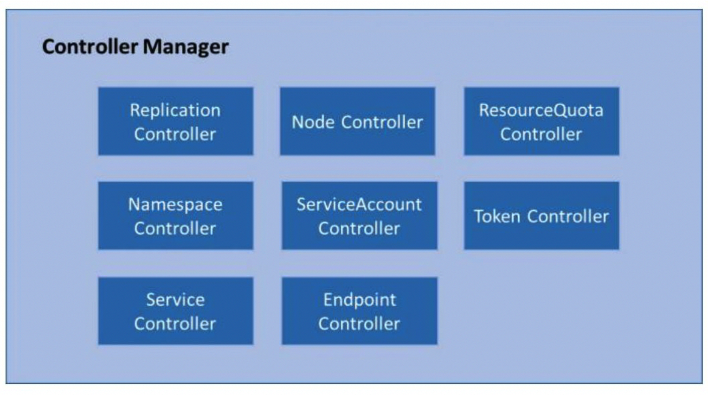
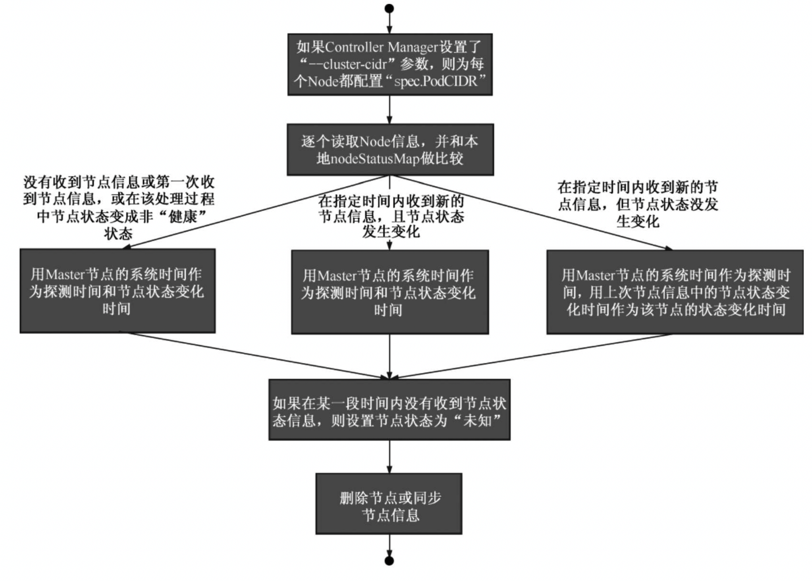

<!-- @import "[TOC]" {cmd="toc" depthFrom=1 depthTo=6 orderedList=false} -->

<!-- code_chunk_output -->

- [1. 概述](#1-概述)
  - [1.1. 作用: 自动修正系统](#11-作用-自动修正系统)
  - [1.2. Controller Manager结构](#12-controller-manager结构)
  - [1.3. Scheduler作用](#13-scheduler作用)
- [2. Replication Controller](#2-replication-controller)
  - [2.1. 核心作用: 某个RC关联的Pod副本数量](#21-核心作用-某个rc关联的pod副本数量)
  - [2.2. 职责总结](#22-职责总结)
  - [2.3. 使用场景总结](#23-使用场景总结)
- [3. Node Controller](#3-node-controller)

<!-- /code_chunk_output -->

# 1. 概述

## 1.1. 作用: 自动修正系统

一般来说，**智能系统**和**自动系统**通常会通过一个“**操作系统**”来**不断修正系统的工作状态**。

在Kubernetes集群中，**每个Controller！！！** 都是这样的一个“**操作系统**”，它们通过**API Server**提供的（**List\-Watch）接口**实时监控集群中**特定资源的状态变化**，当发生**各种故障**导致**某资源对象的状态发生变化**时，Controller会尝试将其状态调整为期望的状态。

比如当**某个Node意外宕机**时，**Node Controller**会及时发现此故障并**执行自动化修复流程**，确保集群始终处于预期的工作状态。**Controller Manager**是Kubernetes中**各种操作系统的管理者**，是集群内部的**管理控制中心**，也是Kubernetes自动化功能的核心。

## 1.2. Controller Manager结构

如图5.7所示，**Controller Manager**内部包含**Replication Controller**、Node Controller、ResourceQuota Controller、Namespace Controller、ServiceAccount Controller、Token Controller、Service Controller及Endpoint Controller这**8种Controller**，**每种Controller**都负责**一种特定资源的控制流程**，而**Controller Manager**正是**这些Controller**的**核心管理者！！！**。

图5.7　Controller Manager结构图:

由于**ServiceAccount Controller**与**Token Controller**是与**安全相关的两个控制器**，并且与Service Account、Token密切相关，所以我们将对它们的分析放到后面讲解。

## 1.3. Scheduler作用

在Kubernetes集群中与Controller Manager并重的另一个组件是Kubernetes **Scheduler**，它的作用是将**待调度的Pod**（包括通过API Server新创建的Pod及RC为补足副本而创建的Pod等）通过一些复杂的调度流程**计算出最佳目标节点**，然后**绑定到该节点**上。本章最后会介绍Kubernetes Scheduler调度器的基本原理。

# 2. Replication Controller

为了区分**Controller Manager**中的**Replication Controller（副本控制器！！！**）和**资源对象Replication Controller！！！**，我们将**资源对象Replication Controller**简写为**RC**，而**本节**中的**Replication Controller**是指“**副本控制器**”，以便于后续分析。

## 2.1. 核心作用: 某个RC关联的Pod副本数量

Replication Controller的**核心作用**是确保在任何时候集群中**某个RC关联的Pod副本数量**都保持预设值。

如果发现**Pod的副本数量超过预期值**，则**Replication Controller**会**销毁一些Pod副本**；反之，Replication Controller会**自动创建新的Pod副本**，直到符合条件的Pod副本数量达到预设值。

需要注意：只有当**Pod的重启策略是Always**时（RestartPolicy=Always），**Replication Controller**才会**管理该Pod的操作**（例如创建、销毁、重启等）。

在通常情况下，**Pod对象**被成功创建后**不会消失**，**唯一的例外**是当Pod处于succeeded或failed状态的时间过长（超时参数由系统设定）时，该Pod会被**系统自动回收**，管理该Pod的副本控制器将在其他工作节点上重新创建、运行该Pod副本。

**RC**中的**Pod模板**就像**一个模具**，模具制作出来的东西**一旦离开模具**，它们之间就再也**没关系**了。同样，**一旦Pod被创建完毕**，无论模板如何变化，甚至**换成一个新的模板**，也**不会影响到已经创建的Pod！！！** 了。此外，**Pod**可以通过**修改它的标签！！！** 来**脱离RC的管控！！！**。该方法可以用于将**Pod从集群中迁移**、**数据修复**等调试。对于**被迁移的Pod副本**，RC会自动创建一个**新的副本**替换被迁移的副本。需要注意的是，**删除一个RC不会影响它所创建的Pod！！！**。如果想**删除一个被RC所控制的Pod**，则需要将该RC的**副本数（Replicas）属性**设置为**0**，这样所有的Pod副本就都会被**自动删除**。

最好**不要越过RC直接创建Pod！！！**，因为**Replication Controller！！！** 会**通过RC管理Pod副本**，实现自动创建、补足、替换、删除Pod副本，这样能提高系统的容灾能力，减少由于节点崩溃等意外状况造成的损失。即使你的应用程序只用到一个Pod副本，我们也强烈建议你使用RC来定义Pod。

## 2.2. 职责总结

总结一下Replication Controller的职责，如下所述。

（1）确保在当前集群中有且仅有N个Pod实例，N是在RC中定义的Pod副本数量。

（2）通过调整**RC的spec.replicas属性值**来实现系统**扩容或者缩容**。

（3）通过改变RC中的**Pod模板**（主要是**镜像版本**）来实现系统的**滚动升级**。

## 2.3. 使用场景总结

最后总结一下Replication Controller的典型使用场景，如下所述。

（1）**重新调度（Rescheduling**）。如前面所述，不管想运行1个副本还是1000个副本，副本控制器都能确保指定数量的副本存在于集群中，即使发生节点故障或Pod副本被终止运行等意外状况。

（2）**弹性伸缩（Scaling**）。手动或者通过自动扩容代理修改副本控制器的spec.replicas属性值，非常容易实现增加或减少副本的数量。

（3）**滚动更新（Rolling Updates**）。副本控制器被设计成通过逐个替换Pod的方式来辅助服务的滚动更新。推荐的方式是创建一个只有一个副本的新RC，若新RC副本数量加1，则旧RC的副本数量减1，直到这个旧RC的副本数量为0，然后删除该旧RC。通过上述模式，即使在滚动更新的过程中发生了不可预料的错误，Pod集合的更新也都在可控范围内。在理想情况下，滚动更新控制器需要将准备就绪的应用考虑在内，并保证在集群中任何时刻都有足够数量的可用Pod。

# 3. Node Controller

**kubelet进程**在**启动时**通过**API Server注册自身的节点信息**，并**定时**向**API Server汇报状态信息**，API Server在接收到这些信息后，会将这些信息**更新到etcd**中。

在etcd中存储的节点信息包括**节点健康状况**、**节点资源**、**节点名称**、**节点地址信息**、**操作系统版本**、**Docker版本**、**kubelet版本**等。

节点健康状况包含“**就绪**”（True）“**未就绪**”（False）和“**未知**”（Unknown）三种。

**Node Controller**通过**API Server**实时获取**Node的相关信息**，实现**管理和监控集群**中的**各个Node**的**相关控制功能**，Node Controller的核心工作流程如图5.8所示。

图5.8　Node Controller的核心工作流程:

对流程中关键点的解释如下。

（1）**Controller Manager**在**启动时**如果设置了\-\-**cluster\-cidr**参数，那么为每个**没有设置Spec.PodCIDR的Node**都生成一个**CIDR地址**，并用该CIDR地址设置节点的Spec.PodCIDR属性，这样做的目的是**防止不同节点的CIDR地址发生冲突**。

（2）**逐个读取Node信息**，多次尝试修改**nodeStatusMap**中的**节点状态信息**，将该节点信息和Node Controller的nodeStatusMap中保存的节点信息做比较。如果判断出没有收到kubelet发送的节点信息、第1次收到节点kubelet发送的节点信息，或在该处理过程中节点状态变成非“健康”状态，则在nodeStatusMap中保存该节点的状态信息，并用Node Controller所在节点的系统时间作为探测时间和节点状态变化时间。如果判断出在指定时间内收到新的节点信息，且节点状态发生变化，则在nodeStatusMap中保存该节点的状态信息，并用Node Controller所在节点的系统时间作为探测时间和节点状态变化时间。如果判断出在指定时间内收到新的节点信息，但节点状态没发生变化，则在nodeStatusMap中保存该节点的状态信息，并用Node Controller所在节点的系统时间作为探测时间，将上次节点信息中的节点状态变化时间作为该节点的状态变化时间。如果判断出在某段时间（gracePeriod）内没有收到节点状态信息，则设置节点状态为“未知”，并且通过API Server保存节点状态。

（3）逐个读取节点信息，如果节点状态变为非“就绪”状态，则将节点加入待删除队列，否则将节点从该队列中删除。如果节点状态为非“就绪”状态，且系统指定了Cloud Provider，则Node Controller调用Cloud Provider查看节点，若发现节点故障，则删除etcd中的节点信息，并删除和该节点相关的Pod等资源的信息。

