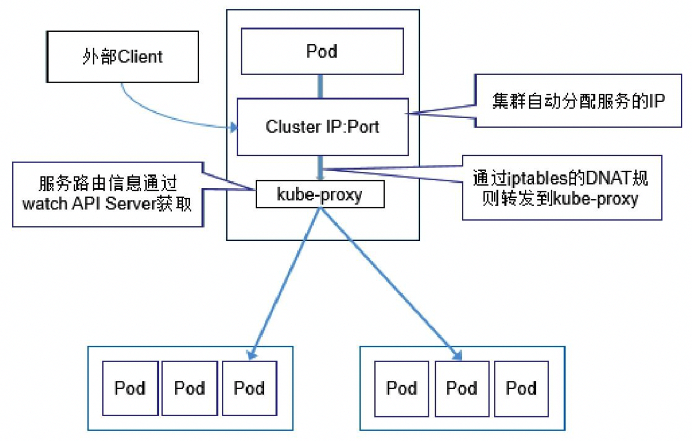
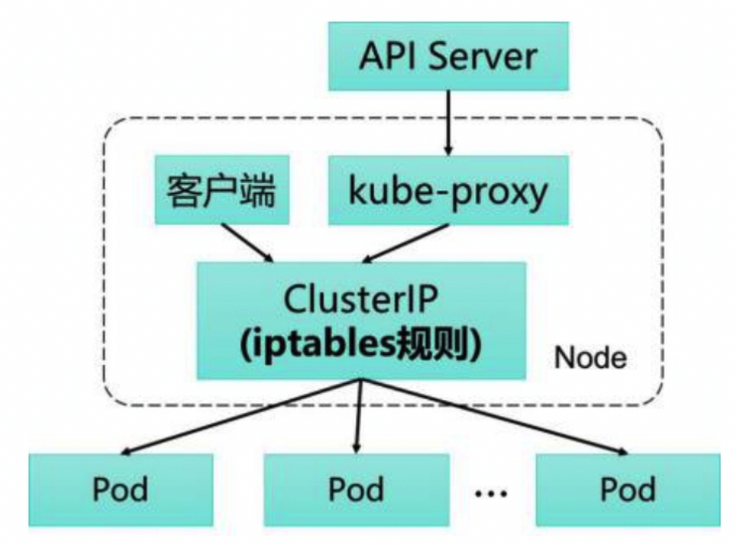

<!-- @import "[TOC]" {cmd="toc" depthFrom=1 depthTo=6 orderedList=false} -->

<!-- code_chunk_output -->

<!-- /code_chunk_output -->

我们在前面已经了解到，为了支持集群的水平扩展、高可用性，Kubernetes抽象出了Service的概念。Service是对一组Pod的抽象，它会根据访问策略（如负载均衡策略）来访问这组Pod。

Kubernetes在创建服务时会为服务分配一个虚拟的IP地址，客户端通过访问这个虚拟的IP地址来访问服务，服务则负责将请求转发到后端的Pod上。这不就是一个反向代理吗？没错，这就是一个反向代理。但是，它和普通的反向代理有一些不同：首先，它的IP地址是虚拟的，想从外面访问还需要一些技巧；其次，它的部署和启停是由Kubernetes统一自动管理的。

在很多情况下，Service只是一个概念，而真正将Service的作用落实的是它背后的kube-proxy服务进程。只有理解了kube-proxy的原理和机制，我们才能真正理解Service背后的实现逻辑。

在Kubernetes集群的每个Node上都会运行一个kube-proxy服务进程，我们可以把这个进程看作Service的透明代理兼负载均衡器，其核心功能是将到某个Service的访问请求转发到后端的多个Pod实例上。此外，Service的Cluster IP与NodePort等概念是kube-proxy服务通过iptables的NAT转换实现的，kube-proxy在运行过程中动态创建与Service相关的iptables规则，这些规则实现了将访问服务（Cluster IP或NodePort）的请求负载分发到后端Pod的功能。由于iptables机制针对的是本地的kube-proxy端口，所以在每个Node上都要运行kube-proxy组件，这样一来，在Kubernetes集群内部，我们可以在任意Node上发起对Service的访问请求。综上所述，由于kube-proxy的作用，在Service的调用过程中客户端无须关心后端有几个Pod，中间过程的通信、负载均衡及故障恢复都是透明的。

起初，kube-proxy进程是一个真实的TCP/UDP代理，类似HA Proxy，负责从Service到Pod的访问流量的转发，这种模式被称为userspace（用户空间代理）模式。如图5.13所示，当某个Pod以Cluster IP方式访问某个Service的时候，这个流量会被Pod所在本机的iptables转发到本机的kube-proxy进程，然后由kube-proxy建立起到后端Pod的TCP/UDP连接，随后将请求转发到某个后端Pod上，并在这个过程中实现负载均衡功能。

图5.13　Service的负载均衡转发规则:

关于Cluster IP与Node Port的实现原理，以及kube-proxy与API Server的交互过程，图5.14给出了较为详细的说明，由于这是最古老的kube-proxy的实现方式，所以不再赘述。

图5.14　kube-proxy工作原理示意:

如图5.15所示，Kubernetes从1.2版本开始，将iptables作为kube-proxy的默认模式。iptables模式下的kube-proxy不再起到Proxy的作用，其核心功能：通过API Server的Watch接口实时跟踪Service与Endpoint的变更信息，并更新对应的iptables规则，Client的请求流量则通过iptables的NAT机制“直接路由”到目标Pod。

图5.15　应用程序编程访问API Server:

根据Kubernetes的网络模型，一个Node上的Pod与其他Node上的Pod应该能够直接建立双向的TCP/IP通信通道，所以如果直接修改iptables规则，则也可以实现kube-proxy的功能，只不过后者更加高端，因为是全自动模式的。与第1代的userspace模式相比，iptables模式完全工作在内核态，不用再经过用户态的kube-proxy中转，因而性能更强。
iptables模式虽然实现起来简单，但存在无法避免的缺陷：在集群中的Service和Pod大量增加以后，iptables中的规则会急速膨胀，导致性能显著下降，在某些极端情况下甚至会出现规则丢失的情况，并且这种故障难以重现与排查，于是Kubernetes从1.8版本开始引入第3代的IPVS（IP Virtual Server）模式，如图5.16所示。IPVS在Kubernetes 1.11中升级为GA稳定版。
