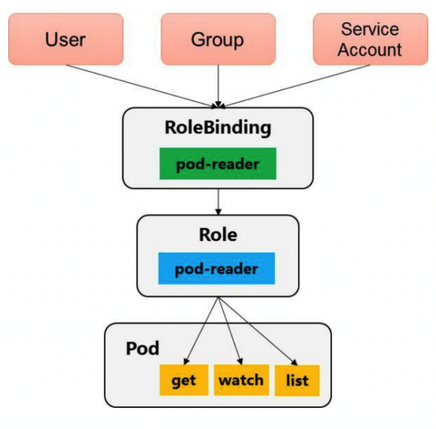

<!-- @import "[TOC]" {cmd="toc" depthFrom=1 depthTo=6 orderedList=false} -->

<!-- code_chunk_output -->

- [ABAC授权模式详解](#abac授权模式详解)
- [Webhook授权模式详解](#webhook授权模式详解)
- [RBAC授权模式详解](#rbac授权模式详解)

<!-- /code_chunk_output -->

当客户端发起API Server调用时，API Server内部要**先**进行**用户认证**，然后执行**用户授权流程**，即通过**授权策略**来决定一个**API调用是否合法**。

**对合法用户进行授权**并且随后在**用户访问时进行鉴权**，是权限与安全系统的重要一环。简单地说，授权就是授予不同的用户不同的访问权限。API Server目前支持以下几种授权策略（通过API Server的启动参数“--authorization-mode”设置）。

◎　AlwaysDeny：表示拒绝所有请求，一般用于测试。
◎　AlwaysAllow：允许接收所有请求，如果集群不需要授权流程，则可以采用该策略，这也是Kubernetes的默认配置。
◎　ABAC（Attribute-Based Access Control）：基于属性的访问控制，表示使用用户配置的授权规则对用户请求进行匹配和控制。
◎　Webhook：通过调用外部REST服务对用户进行授权。
◎　RBAC：Role-Based Access Control，基于角色的访问控制。
◎　Node：是一种专用模式，用于对kubelet发出的请求进行访问控制。

API Server在接收到请求后，会读取该请求中的数据，生成一个访问策略对象，如果在该请求中不带某些属性（如Namespace），则这些属性的值将根据属性类型的不同，设置不同的默认值（例如，为字符串类型的属性设置一个空字符串；为布尔类型的属性设置false；为数值类型的属性设置0）。然后将这个访问策略对象和授权策略文件中的所有访问策略对象逐条匹配，如果至少有一个策略对象被匹配，则该请求被鉴权通过，否则终止API调用流程，并返回客户端的错误调用码。

# ABAC授权模式详解

在API Server启用ABAC模式时，需要指定授权策略文件的路径和名称（--authorization- policy-file=SOME_FILENAME），授权策略文件里的每一行都以一个Map类型的JSON对象进行设置，这被称为“访问策略对象”。通过设置访问策略对象中的apiVersion、kind、spec属性来确定具体的授权策略，其中，apiVersion当前版本为abac.authorization.kubernetes.io/v1beta1；kind被设置为Policy；spec指详细的策略设置，包括主题属性、资源属性、非资源属性这三个字段，如下所述。

（1）主体属性

◎　user（用户名）：字符串类型，该字符串类型的用户名来源于Token文件（--token-auth-file参数设置的文件）或基本认证文件中用户名称段的值。
◎　group（用户组）：在被设置为“system:authenticated”时表示匹配所有已认证的请求，在被设置为“system:unauthenticated”时表示匹配所有未认证的请求。

（2）资源属性

◎　apiGroup（API组）：字符串类型，表明匹配哪些API Group，例如extensions或*（表示匹配所有API Group）。
◎　namespace（命名空间）：字符串类型，表明该策略允许访问某个Namespace的资源，例如kube-system或*（表示匹配所有Namespace）。
◎　resource（资源）：字符串类型，API资源对象，例如pods或*（表示匹配所有资源对象）。

（3）非资源属性

◎　nonResourcePath（非资源对象类路径）：非资源对象类的URL路径，例如/version或/apis，\*表示匹配所有非资源对象类的请求路径，也可以设置为子路径，/foo/\*表示匹配所有/foo路径下的所有子路径。
◎　readonly（只读标识）：布尔类型，当它的值为true时，表明仅允许GET请求通过。

下面对ABAC授权算法、使用kubectl时的授权机制、常见ABAC授权示例、以及如何对Service Account进行授权进行说明。

1.ABAC授权算法

API Server进行ABAC授权的算法为：在API Server收到请求之后，首先识别出请求携带的策略对象的属性，然后根据在策略文件中定义的策略对这些属性进行逐条匹配，以判定是否允许授权。如果有至少一条匹配成功，那么这个请求就通过了授权（不过还是可能在后续其他授权校验中失败）。常见的策略配置如下。

◎　要允许所有认证用户做某件事，可以写一个策略，将group属性设置为system:authenticated。
◎　要允许所有未认证用户做某件事，可以把策略的group属性设置为system:unauthenticated。
◎　要允许一个用户做任何事，将策略的apiGroup、namespace、resource和nonResourcePath属性设置为“*”即可。

2.使用kubectl时的授权机制

kubectl使用API Server的/api和/apis端点来获取版本信息。要验证kubectl create/update命令发送给服务器的对象，kubectl需要向OpenAPI进行查询，对应的URL路径为/openapi/v2。

当使用ABAC授权模式时，下列特殊资源必须显式地通过nonResourcePath属性进行设置。

◎　API版本协商过程中的/api、/api/\*、/apis、和/apis/\*。
◎　使用kubectl version命令从服务器获取版本时的/version。
◎　create/update操作过程中的/swaggerapi/\*。

在使用kubectl操作时，如果需要查看发送到API Server的HTTP请求，则可以将日志级别设置为8，例如：

```
# kubectl --v=8 version
```

3.常见的ABAC授权示例

下面通过几个授权策略文件（JSON格式）示例说明ABAC的访问控制用法。

（1）允许用户alice对所有资源做任何操作：


（2）kubelet可以读取任意Pod：


（3）kubelet可以读写Event对象：


（4）用户bob只能读取projectCaribou中的Pod：


（5）任何用户都可以对非资源类路径进行只读请求：


如果添加了新的ABAC策略，则需要重启API Server以使其生效。

4.对Service Account进行授权

Service Account会自动生成一个ABAC用户名（username），用户名按照以下命名规则生成：

```
system:serviceaccount:<namespace>:<serviceaccountname>
```

创建新的命名空间时，会产生一个如下名称的Service Account：

```
system:serviceaccount:<mamespace>:default
```

如果希望kube-system命名空间中的Service Account“default”具有全部权限，就要在策略文件中加入如下内容：


# Webhook授权模式详解

Webhook定义了一个HTTP回调接口，实现Webhook的应用会在指定事件发生时，向一个URL地址发送（POST）通知信息。启用Webhook授权模式后，Kubernetes会调用外部REST服务对用户进行授权。

Webhook模式用参数--authorization-webhook-config-file=SOME_FILENAME来设置远端授权服务的信息。

配置文件使用的是kubeconfig文件的格式。文件里user一节的内容指的是API Server。相对于远程授权服务来说，API Server是客户端，也就是用户；cluster一节的内容指的是远程授权服务器的配置。下面的例子为设置一个使用HTTPS客户端认证的配置：


在授权开始时，API Server会生成一个api.authorization.v1beta1.SubjectAccessReview对象，用于描述操作信息，在进行JSON序列化之后POST出来。在这个对象中包含用户尝试访问资源的请求动作的描述，以及被访问资源的属性。

Webhook API对象和其他API对象一样，遵循同样的版本兼容性规则，在实现时要注意apiVersion字段的版本，以实现正确的反序列化操作。另外，API Server必须启用authorization.k8s.io/v1beta1 API扩展（--runtime-config=authorization.k8s.io/v1beta1=true）。

下面是一个希望获取Pod列表的请求报文示例：


远端服务需要填充请求中的SubjectAccessReviewStatus字段，并返回允许或不允许访问的结果。应答报文中的spec字段是无效的，也可以省略。

一个返回“运行访问”的应答报文示例如下：


一个返回“不允许访问”的应答报文示例如下：

非资源的访问请求路径包括/api、/apis、/metrics、/resetMetrics、/logs、/debug、/healthz、/swagger-ui/、/swaggerapi/、/ui和/version。通常可以对/api、/api/\*、/apis、/apis/\*和/version对于客户端发现服务器提供的资源和版本信息给予“允许”授权，对于其他非资源的访问一般可以禁止，以限制客户端对API Server进行没有必要的查询。

查询/debug的请求报文示例如下：

```json
{
    "apiVersion": "authorization.k8s.io/v1beta1",
    "kind": "SubjectAccessReview",
    "spec": {
        "nonResourceAttribures": {
            "path": "/debug",
            "verb": "get"
        },
        "user": "jane",
        "group": {
            "group1",
            "group2"
        }
    }
}
```

# RBAC授权模式详解

RBAC（Role-Based Access Control，基于角色的访问控制）在Kubernetes的1.5版本中引入，在1.6版本时升级为Beta版本，在1.8版本时升级为GA。作为kubeadm安装方式的默认选项，足见其重要程度。相对于其他访问控制方式，新的RBAC具有如下优势。

◎　对集群中的资源和非资源权限均有完整的覆盖。
◎　整个RBAC完全由几个API对象完成，同其他API对象一样，可以用kubectl或API进行操作。
◎　可以在运行时进行调整，无须重新启动API Server。

要使用RBAC授权模式，需要在API Server的启动参数中加上--authorization-mode=RBAC。

下面对RBAC的原理和用法进行说明。

1.RBAC的API资源对象说明

RBAC引入了4个新的顶级资源对象：Role、ClusterRole、RoleBinding和ClusterRoleBinding。同其他API资源对象一样，用户可以使用kubectl或者API调用等方式操作这些资源对象。

1）角色（Role）

一个角色就是一组权限的集合，这里的权限都是许可形式的，不存在拒绝的规则。在一个命名空间中，可以用角色来定义一个角色，如果是集群级别的，就需要使用ClusterRole了。

角色只能对命名空间内的资源进行授权，在下面例子中定义的角色具备读取Pod的权限：

```yaml
---
kind: Role
apiVersion: rbac.authorization.k8s.io/v1
metadata:
  namespace: default
  name: pod-reader
rules:
- apiGroups: [""]   # "" 空字符串, 表示核心API群
  resources: ["pods"]
  verbs: ["get", "watch", "list"]
```

rules中的参数说明如下。

◎　apiGroups：支持的API组列表，例如“apiVersion: batch/v1”“apiVersion: extensions:v1beta1”“apiVersion: apps/v1beta1”等，详细的API组说明参见第9章的说明。
◎　resources：支持的资源对象列表，例如pods、deployments、jobs等。
◎　verbs：对资源对象的操作方法列表，例如get、watch、list、delete、replace、patch等，详细的操作方法说明参见第9章的说明。

2）集群角色（ClusterRole）

集群角色除了具有和角色一致的命名空间内资源的管理能力，因其集群级别的范围，还可以用于以下特殊元素的授权。

◎　集群范围的资源，例如Node。
◎　非资源型的路径，例如“/healthz”。
◎　包含全部命名空间的资源，例如pods（用于kubectl get pods --all-namespaces这样的操作授权）。

下面的集群角色可以让用户有权访问任意一个或所有命名空间的secrets（视其绑定方式而定）：

```yaml
---
kind: ClusterRole
apiVersion: rbac.authorization.k8s.io/v1
metadata:   # ClusterRole不受限于命令空间, 所以无须设置Namespace的名称
rules:
- apiGroups: [""]
  resources: ["secrets"]
  verbs: ["get", "watch", "list"]
```

3）角色绑定（RoleBinding）和集群角色绑定（ClusterRoleBinding）

角色绑定或集群角色绑定用来把一个角色绑定到一个目标上，绑定目标可以是User（用户）、Group（组）或者Service Account。使用RoleBinding为某个命名空间授权，使用ClusterRoleBinding为集群范围内授权。

RoleBinding可以引用Role进行授权。下面的例子中的RoleBinding将在default命名空间中把pod-reader角色授予用户jane，这一操作可以让jane读取default命名空间中的Pod：

```yaml
---
kind: RoleBinding       # 重点1
apiVersion: rbac.authorization.k8s.io/v1
metadata:
  name: read-pods
  namespace: default    # 重点2
subjects:
- kind: User            # 重点3
  name: jane            # 重点4
  apiGroup: rbac.authorization.k8s.io
roleRef:    
  kind: Role            # 重点5
  name: pod-reader      # 重点6
  apiGroup: rbac.authorization.k8s.io
```

RoleBinding也可以引用ClusterRole，对属于同一命名空间内ClusterRole定义的资源主体进行授权。一种常见的做法是集群管理员为集群范围预先定义好一组ClusterRole，然后在多个命名空间中重复使用这些ClusterRole。

例如，在下面的例子中，虽然secret-reader是一个集群角色，但是因为使用了RoleBinding，所以dave只能读取development命名空间中的secret：

```yaml
---
kind: RoleBinding           # 重点1
apiVersion: rbac.authorization.k8s.io/v1
metadata:
  name: read-secrets
  namespace: development    # 集群角色中, 只有development命令空间中的权限才能赋予dave
subjects:
- kind: User                # 重点2
  name: dave                # 重点3
  apiGroup: rbac.authorization.k8s.io
roleRef:
  kind: ClusterRole         # 重点4
  name: secret-reader       # 重点5
  apiGroup: rbac.authorization.k8s.io
```

集群角色绑定中的角色只能是集群角色，用于进行集群级别或者对所有命名空间都生效的授权。下面的例子允许manager组的用户读取任意Namespace中的secret：

```yaml
---
kind: ClusterRoleBinding        # 重点1
apiVersion: rbac.authorization.k8s.io/v1
metadata:
  name: read-secrets-global
subjects:
- kind: Group                   # 重点2
  name: manager                 # 重点3
  apiGroup: rbac.authorization.k8s.io
roleRef:
  kind: ClusterRole             # 重点4
  name: secret-reader           # 重点5
  apiGroup: rbac.authorization.k8s.io
```

图6.2展示了上述对Pod的get/watch/list操作进行授权的Role和RoleBinding的逻辑关系。

图6.2　RoleBinding、Role与对Pod的操作授权:



2.对资源的引用方式

多数资源可以用其名称的字符串来表达，也就是Endpoint中的URL相对路径，例如pods。然而，某些Kubernetes API包含下级资源，例如Pod的日志（logs）。Pod日志的Endpoint是GET/ api/v1/namespaces/{namespace}/pods/{name}/log。

在这个例子中，Pod是一个命名空间内的资源，log就是一个下级资源。要在一个RBAC角色中体现，就需要用斜线“/”来分隔资源和下级资源。若想授权让某个主体同时能够读取Pod和Pod log，则可以配置resources为一个数组：

```yaml
# resources reference
---
kind: Role
apiVersion: rbac.authorization.k8s.io/v1
metadata:
  namespace: default
  name: pod-and-pod-logs-reader
rules:
- apiGroups: [""]
  resources: ["pods", "pods/log"]   # 重点
  verbs: ["get", "list"]
```

资源还可以通过名称（ResourceName）进行引用。在指定ResourceName后，使用get、delete、update和patch动词的请求，就会被限制在这个资源实例范围内。例如，下面的声明让一个主体只能对一个ConFigmap进行get和update操作：

```yaml
---
kind: Role
apiVersion: rbac.authorization.k8s.io/v1
metadata:
  namespace: default
  name: configmap-updater
rules:
- apiGroups: [""]
  resources: ["configmap"]
  resourceNames: ["my-configmap"]
  verbs: ["update", "get"]
```

可想而知，resourceName这种用法对list、watch、create或deletecollection操作是无效的，这是因为必须要通过URL进行鉴权，而资源名称在list、watch、create或deletecollection请求中只是请求Body数据的一部分。

下面对常见的角色和角色绑定给出示例，提供参考用法。

3.常用的角色示例

注意，下面的例子只展示了rules部分的内容。

（1）允许读取核心API组中的Pod资源：

```yaml

```