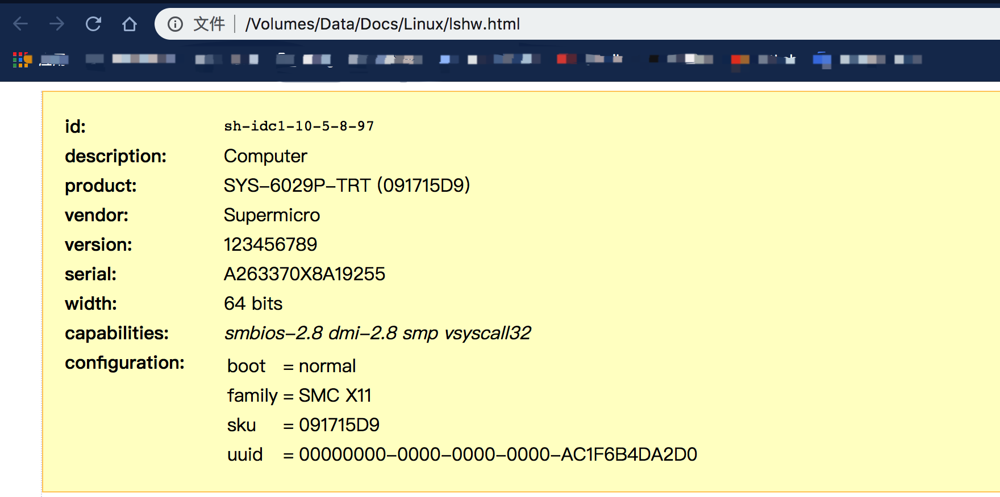

<!-- @import "[TOC]" {cmd="toc" depthFrom=1 depthTo=6 orderedList=false} -->

<!-- code_chunk_output -->

* [1 查看系统信息](#1-查看系统信息)
* [2 查看Linux系统硬件信息](#2-查看linux系统硬件信息)
* [3 查看Linux CPU信息](#3-查看linux-cpu信息)
* [参考](#参考)

<!-- /code_chunk_output -->

# 1 查看系统信息

使用uname命令没有任何选项将打印**系统信息**或**UNAME \-s**命令将打印**系统的内核名称**。

```
[root@SH-IDC1-10-5-8-97 ~]# uname
Linux
[root@SH-IDC1-10-5-8-97 ~]# uname -s
Linux
```

要查看**网络的主机名**，请使用uname命令“\-n”开关，如图所示。

```
[root@SH-IDC1-10-5-8-97 ~]# uname -n
SH-IDC1-10-5-8-97
```

要获取有关**内核版本**，使用'\-v'开关信息。可看到这是2017年8月版本的.

```
[root@SH-IDC1-10-5-8-97 ~]# uname -v
#1 SMP Tue Aug 22 21:09:27 UTC 2017
```

**内核版本的信息(即发行编号**)，请使用“-r”开关。

```
[root@SH-IDC1-10-5-8-97 ~]# uname -r
3.10.0-693.el7.x86_64
```

**机器硬件的名称**，使用“-m”开关：

```
[root@SH-IDC1-10-5-8-97 ~]# uname -m
x86_64
```

**所有这些信息**可以通过一次如下所示运行“的uname -a”命令进行打印。

```
[root@SH-IDC1-10-5-8-97 ~]# uname -a
Linux SH-IDC1-10-5-8-97 3.10.0-693.el7.x86_64 #1 SMP Tue Aug 22 21:09:27 UTC 2017 x86_64 x86_64 x86_64 GNU/Linux
```

# 2 查看Linux系统硬件信息

在这里，您可以使用**lshw工具**来收集有关您的**硬件部件**，如CPU， 磁盘 ， 内存 ，USB控制器等大量信息 lshw是一个相对较小的工具，也有一些可以在提取信息，它使用几个选项。 

通过**lshw提供的信息**聚集形成**不同的/proc文件**。 

注 ：请注意，以超级用户（root）或sudo用户执行的lshw命令。 

```
[root@SH-IDC1-10-5-8-97 ~]# lshw | more
sh-idc1-10-5-8-97
    description: Computer
    product: SYS-6029P-TRT (091715D9)
    vendor: Supermicro
    version: 123456789
    serial: A263370X8A19255
    width: 64 bits
    capabilities: smbios-2.8 dmi-2.8 smp vsyscall32
    configuration: boot=normal family=SMC X11 sku=091715D9 uuid=00000000-0000-0000-0000-AC1F6B4DA2D0
  *-core
       description: Motherboard
       product: X11DPi-NT
       vendor: Supermicro
       physical id: 0
       version: 1.21
       serial: NM188S036398
       slot: Default string
     *-firmware
          description: BIOS
          vendor: American Megatrends Inc.
          physical id: 0
          version: 2.1
          date: 06/29/2018
          size: 64KiB
          capacity: 32MiB
          capabilities: pci upgrade shadowing cdboot bootselect socketedrom edd int13floppy1200 int13floppy720 int13floppy2880 int5printscreen int14serial int17printer acpi usb b
iosbootspecification uefi
     *-memory
          description: System Memory
......
```

可以通过使用\-short选择打印您的**硬件信息的汇总**。

```
[root@SH-IDC1-10-5-8-97 ~]# lshw -short
H/W path          Device          Class          Description
============================================================
                                  system         SYS-6029P-TRT (091715D9)
/0                                bus            X11DPi-NT
/0/0                              memory         64KiB BIOS
/0/13                             memory         128GiB System Memory
/0/13/0                           memory         32GiB DIMM DDR4 Synchronous 2666 MHz (0.4 ns)
/0/13/1                           memory         [empty]
/0/13/2                           memory         [empty]
/0/13/3                           memory         [empty]
/0/13/4                           memory         32GiB DIMM DDR4 Synchronous 2666 MHz (0.4 ns)
/0/13/5                           memory         [empty]
/0/13/6                           memory         [empty]
/0/13/7                           memory         [empty]
/0/13/8                           memory         32GiB DIMM DDR4 Synchronous 2666 MHz (0.4 ns)
......
```

如果想生成**一个HTML文件输出**，可以使用该选项-html。

```
[root@SH-IDC1-10-5-8-97 ~]# lshw -html > /root/lshw.html
```



# 3 查看Linux CPU信息

要查看你的CPU信息，请使用lscpu命令，因为它显示你的CPU体系结构的信息，如从sysfs中和的/ proc内/ cpuinfo CPU的数量，内核，CPU系列型号，CPU高速缓存，线程等。


# 参考

- 该目录下: <获取CPU信息的命令>
- https://www.howtoing.com/tag/linux-tricks/