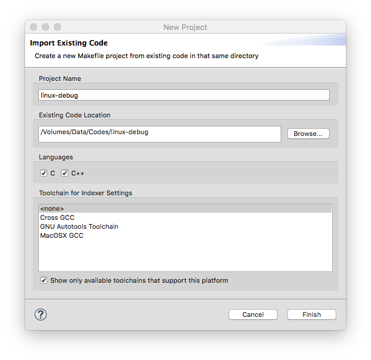

<!-- @import "[TOC]" {cmd="toc" depthFrom=1 depthTo=6 orderedList=false} -->

<!-- code_chunk_output -->

* [1 两个环境(远程调试)](#1-两个环境远程调试)
	* [1.1 初始化环境配置](#11-初始化环境配置)
	* [1.2 连接调试测试](#12-连接调试测试)
	* [1.3 配置eclipse](#13-配置eclipse)
		* [1.3.1 创建项目](#131-创建项目)
		* [1.3.2 配置debug选项](#132-配置debug选项)

<!-- /code_chunk_output -->

使用QEMU \+ GDB \+ Eclipse调试Linux内核

有两种情况, 一种是内核虚拟机和eclipse在同一个环境, 另一种分属两个环境

# 1 两个环境(远程调试)

## 1.1 初始化环境配置

本地安装Eclipse for Cpp

本地checkout一份代码出来, 该代码和编译的调试用的kernel commit信息一致

本地安装gdb

远端的bzImage作为虚拟机启动镜像

本地vmlinux是带有调试信息的镜像, 与上面的对应

## 1.2 连接调试测试

启动远端gdbserver

```
qemu-system-x86_64 -smp 2 -m 1024 -kernel arch/x86/boot/bzImage -nographic -append "rdinit=/linuxrc loglevel=8 console=ttyS0" -S -s
```

或

```
qemu-system-x86_64 -smp 2 -m 1024 -kernel arch/x86/boot/bzImage -append "rdinit=/linuxrc loglevel=8" -S -s -daemonize
```

在当前节点

```
# gdb
(gdb) target remote 10.1.194.104:1234
(gdb) b start_kernel
(gdb) c
```

## 1.3 配置eclipse

### 1.3.1 创建项目

New → "Makefile Project with Existing Code", 这里代码目录选择上面说的与调试内核代码一致的目录, Toolchain选为None.



右上角"Debug", 选择"C/C\+\+"


### 1.3.2 配置debug选项

配置debug选项, "Run" → "Debug Configurations", 选择"C\/C\+\+ Remote Application", 右击"New", 创建一个远程调试配置, 起个名字


如果安装的CDT插件不全，可能没有“C\/C\+\+ Remote Application”这个类型，意味着CDT没有远程调试功能。这时需要安装一个叫“Remote System Explorer End-User Runtime ”的插件


选择"C/C\+\+ Attach to Application"双击, 新建一个配置, 起个名字

Main中

Project选择刚才创建的project, C/C\+\+ Application选择上面所说的vmlinux. 


Debugger中

Debugger选择"gdbserver"

Main中, 如下


connection中, 如下, 对端IP填写, 端口为1234


点击右下的"debug"


