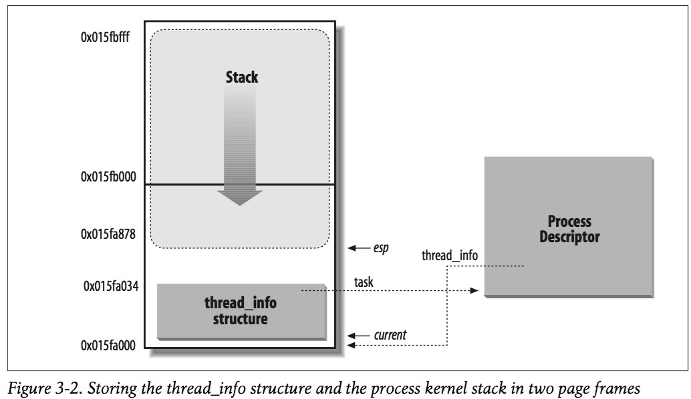

<!-- @import "[TOC]" {cmd="toc" depthFrom=1 depthTo=6 orderedList=false} -->

<!-- code_chunk_output -->

* [1 编译调试版内核](#1-编译调试版内核)
* [2 构建initramfs根文件系统](#2-构建initramfs根文件系统)
* [3 调试](#3-调试)
* [4 获取当前进程](#4-获取当前进程)
* [5 参考](#5-参考)

<!-- /code_chunk_output -->

用qemu+GDB来调试内核和ko，当然我们需要准备如下：

- 带调试信息的内核vmlinux
- 一个压缩的内核vmlinuz或者bzImage
- 一份裁剪过的文件系统initrd

# 1 编译调试版内核

对内核进行调试需要解析符号信息，所以得编译一个调试版内核。

```
make menuconfig
make -j 20
```

这里需要开启内核参数CONFIG_DEBUG_INFO和CONFIG_GDB_SCRIPTS。GDB提供了Python接口来扩展功能，内核基于Python接口实现了一系列辅助脚本，简化内核调试，开启CONFIG\_GDB\_SCRIPTS参数就可以使用了。

```
Kernel hacking  ---> 
    [*] Kernel debugging
    Compile-time checks and compiler options  --->
        [*] Compile the kernel with debug info
        [*]   Provide GDB scripts for kernel debugging
```

编译后，**bzImage**这个是**被压缩了的**，**不带调试信息的**内核，供qemu虚拟机使用（**arch/x86/boot/bzImage**），**vmlinux(当前目录**)里面带了**调试信息**，没有压缩，供**gdb使用**。

当编译结束后，可以将vmlinux和bzImage文件copy到一个干净的目录下。

# 2 构建initramfs根文件系统

Linux系统启动阶段，boot loader加载完**内核文件vmlinuz后**，内核**紧接着**需要挂载磁盘根文件系统，但如果此时内核没有相应驱动，无法识别磁盘，就需要先加载驱动，而驱动又位于/lib/modules，得挂载根文件系统才能读取，这就陷入了一个两难境地，系统无法顺利启动。于是有了**initramfs根文件系统**，其中包含必要的设备驱动和工具，boot loader加载initramfs到内存中，内核会将其挂载到根目录/,然后**运行/init脚本**，挂载真正的磁盘根文件系统。

这里借助BusyBox构建极简initramfs，提供基本的用户态可执行程序。

编译BusyBox，配置**CONFIG\_STATIC参数**，编译**静态版BusyBox**，编译好的可执行文件busybox**不依赖动态链接库**，可以独立运行，方便构建initramfs。

```
make menuconfig
```

```
Settings  --->
    [*] Build static binary (no shared libs)
General Configuration  --->
    [*] Don't use /usr
```

Don't use \/usr也一定要选,否则make install后busybox将安装在原系统的/usr下,这将覆盖掉系统原有的命令。选择这个选项后,make install后会在busybox目录下生成一个叫\_install的目录,里面有busybox和指向它的链接.

```
make -j 20
make install
```

会安装在\_install目录:

```
# ls _install/
bin  linuxrc  sbin
```

创建initramfs，其中包含**BusyBox可执行程序**、必要的**设备文件**、**启动脚本init**。这里没有内核模块，如果需要调试内核模块，可将需要的**内核模块**包含进来。**init脚本只挂载了虚拟文件系统procfs和sysfs，没有挂载磁盘根文件系统**，所有调试操作都**在内存中进行**，不会落磁盘。

```
$ mkdir initramfs
$ cd initramfs
$ cp ../_install/* -rf ./
$ mkdir dev proc sys
$ sudo cp -a /dev/{null, console, tty, tty1, tty2, tty3, tty4} dev/
$ rm linuxrc
$ vim init
$ chmod a+x init
$ ls
bin   dev  init  proc  sbin  sys   usr
```

init文件内容：

```
#!/bin/busybox sh         
mount -t proc none /proc  
mount -t sysfs none /sys  

exec /sbin/init
```

打包initramfs:

```
$ find . -print0 | cpio --null -ov --format=newc | gzip -9 > ../initramfs.cpio.gz
```

# 3 调试

qemu 是一款虚拟机，可以模拟x86 & arm 等等硬件平台<似乎可模拟的硬件平台很多...>，而qemu 也内嵌了一个 gdbserver。

这个gdbserver于是就可以和gdb构成一个远程合作伙伴，通过ip:port 网络方式或者是通过串口/dev/ttyS\*来进行工作，一个在这头，一个在那头。

启动内核：

```
$ cd busybox-1.28.0
$ qemu-system-x86_64 -s -S -m 512 -kernel arch/x86/boot/bzImage -initrd initramfs.cpio.gz -nographic -append "console=ttyS0, loglevel=8"
```

- \-s是-gdb tcp::1234缩写，监听1234端口，在GDB中可以通过target remote localhost:1234连接；
- \-S表示 QEMU 虚拟机会冻结 CPU 直到远程的 GDB 输入相应控制命令，所以运行后看不到任何输出；
- \-kernel指定编译好的调试版内核；
- \-initrd指定制作的initramfs，这个文件可以从 /boot/initrd.img\-3.13.0\-43\-generic  拷贝而来，关于它是什么东西呢？ 可以参考这个： http://www.linuxfly.org/post/94/ ，或者是这个 http://blog.csdn.net/chrisniu1984/article/details/3907874;
- \-nographic取消图形输出窗口，使QEMU成简单的命令行程序；
- \-append "console=ttyS0"将输出重定向到console，将会显示在标准输出stdio。\-append 后面跟的是**虚拟机的cmdline**

**内核安装**的vmlinuz-2.6.32-504.el6.x86_64是bzImage格式（需要使用arch/x86/boot/bzImage文件），而内核编译完，内核源码\{KERNEL}根目录下的vmlinux是ELF格式。

**启动后的根目录**, 就是**initramfs**中包含的内容：

```
/ # ls                    
bin   dev  init  proc  root  sbin  sys   usr
```

由于系统自带的GDB版本为7.2，内核辅助脚本无法使用，重新编译了一个**新版GDB**：

```
$ cd gdb-7.9.1
$ ./configure --with-python=$(which python2.7)
$ make -j 20
$ sudo make install
```

```
./configure --prefix=../../tools/
make 
make install
```

上面是重新编译gdb，gdb-7.8/目录下并没有Makefile文件，需要使用\./configure来生产。在配置的时候，如果要指定gdb安装的路径(目录)，那么就需要跟上\-\-prefix=$PATH的相关参数，一般这种情况可能会针对系统已经有一个gdb了但无法使用，同时也未删除，那么新编译的gdb可能需要安装在另外的目录了。当然我自己的是安装在 ../../tools/ 目录下。

启动GDB:

```
$ cd linux-4.14
$ /usr/local/bin/gdb vmlinux
(gdb) target remote localhost:1234
```

或者

```
$ cd linux-4.14
$ /usr/local/bin/gdb 
(gdb) file vmlinux
(gdb) target remote localhost:1234
```

```
break *0x7c00
```

使用内核提供的GDB辅助调试功能：

```
(gdb) apropos lx                                    
function lx_current -- Return current task          
function lx_module -- Find module by name and return the module variable                                 
function lx_per_cpu -- Return per-cpu variable      
function lx_task_by_pid -- Find Linux task by PID and return the task_struct variable                    
function lx_thread_info -- Calculate Linux thread_info from task variable                                
function lx_thread_info_by_pid -- Calculate Linux thread_info from task variable found by pid            
lx-cmdline --  Report the Linux Commandline used in the current kernel                                   
lx-cpus -- List CPU status arrays                   
lx-dmesg -- Print Linux kernel log buffer           
lx-fdtdump -- Output Flattened Device Tree header and dump FDT blob to the filename                      
lx-iomem -- Identify the IO memory resource locations defined by the kernel                              
lx-ioports -- Identify the IO port resource locations defined by the kernel                              
lx-list-check -- Verify a list consistency          
lx-lsmod -- List currently loaded modules           
lx-mounts -- Report the VFS mounts of the current process namespace                                      
lx-ps -- Dump Linux tasks                           
lx-symbols -- (Re-)load symbols of Linux kernel and currently loaded modules                             
lx-version --  Report the Linux Version of the current kernel
(gdb) lx-cmdline 
console=ttyS0
```

在函数cmdline\_proc\_show设置断点，虚拟机中运行cat /proc/cmdline命令即会触发。

```
(gdb) b cmdline_proc_show                           
Breakpoint 1 at 0xffffffff81298d99: file fs/proc/cmdline.c, line 9.                                      
(gdb) c                                             
Continuing.                                         

Breakpoint 1, cmdline_proc_show (m=0xffff880006695000, v=0x1 <irq_stack_union+1>) at fs/proc/cmdline.c:9
9               seq_printf(m, "%s\n", saved_command_line);                                              
(gdb) bt
#0  cmdline_proc_show (m=0xffff880006695000, v=0x1 <irq_stack_union+1>) at fs/proc/cmdline.c:9
#1  0xffffffff81247439 in seq_read (file=0xffff880006058b00, buf=<optimized out>, size=<optimized out>, ppos=<optimized out>) at fs/seq_file.c:234
#2  0xffffffff812908b3 in proc_reg_read (file=<optimized out>, buf=<optimized out>, count=<optimized out>, ppos=<optimized out>) at fs/proc/inode.c:217
#3  0xffffffff8121f174 in do_loop_readv_writev (filp=0xffff880006058b00, iter=0xffffc900001bbb38, ppos=<optimized out>, type=0, flags=<optimized out>) at fs/read_write.c:694
#4  0xffffffff8121ffed in do_iter_read (file=0xffff880006058b00, iter=0xffffc900001bbb38, pos=0xffffc900001bbd00, flags=0) at fs/read_write.c:918
#5  0xffffffff81220138 in vfs_readv (file=0xffff880006058b00, vec=<optimized out>, vlen=<optimized out>, pos=0xffffc900001bbd00, flags=0) at fs/read_write.c:980
#6  0xffffffff812547ed in kernel_readv (offset=<optimized out>, vlen=<optimized out>, vec=<optimized out>, file=<optimized out>) at fs/splice.c:361
#7  default_file_splice_read (in=0xffff880006058b00, ppos=0xffffc900001bbdd0, pipe=<optimized out>, len=<optimized out>, flags=<optimized out>) at fs/splice.c:416
#8  0xffffffff81253c7c in do_splice_to (in=0xffff880006058b00, ppos=0xffffc900001bbdd0, pipe=0xffff8800071a1f00, len=16777216, flags=<optimized out>) at fs/splice.c:880
#9  0xffffffff81253f77 in splice_direct_to_actor (in=<optimized out>, sd=0xffffc900001bbe18, actor=<optimized out>) at fs/splice.c:952
#10 0xffffffff812540e3 in do_splice_direct (in=0xffff880006058b00, ppos=0xffffc900001bbec0, out=<optimized out>, opos=<optimized out>, len=<optimized out>, flags=<optimized out>) at fs/splice.c:1061
#11 0xffffffff8122147f in do_sendfile (out_fd=<optimized out>, in_fd=<optimized out>, ppos=0x0 <irq_stack_union>, count=<optimized out>, max=<optimized out>) at fs/read_write.c:1434
#12 0xffffffff812216f5 in SYSC_sendfile64 (count=<optimized out>, offset=<optimized out>, in_fd=<optimized out>, out_fd=<optimized out>) at fs/read_write.c:1495
#13 SyS_sendfile64 (out_fd=1, in_fd=3, offset=0, count=<optimized out>) at fs/read_write.c:1481
#14 0xffffffff8175edb7 in entry_SYSCALL_64_fastpath () at arch/x86/entry/entry_64.S:203
#15 0x0000000000000000 in ?? ()
(gdb) p saved_command_line
$2 = 0xffff880007e68980 "console=ttyS0"
```

# 4 获取当前进程

《深入理解Linux内核》第三版第三章–进程，讲到内核采用了一种精妙的设计来获取当前进程。



Linux把跟一个进程相关的thread\_info和内核栈stack放在了同一内存区域，内核通过esp寄存器获得当前CPU上运行进程的内核栈栈底地址，该地址正好是thread\_info地址，由于进程描述符指针task字段在thread\_info结构体中偏移量为0，进而获得task。相关汇编指令如下：

```
movl $0xffffe000, %ecx      /* 内核栈大小为8K，屏蔽低13位有效位。
andl $esp, %ecx
movl (%ecx), p
```

指令运行后，p就获得当前CPU上运行进程的描述符指针。

然而在调试器中调了下，发现**这种机制早已经被废弃掉了**。thread\_info结构体中只剩下一个字段flags，进程描述符字段task已经删除，无法通过thread\_info获取进程描述符了。

而且进程的thread\_info也不再位于进程内核栈底了，而是放在了进程描述符task\_struct结构体中，见提交sched/core: Allow putting thread\_info into task\_struct和x86: Move thread\_info into task\_struct，这样也无法通过esp寄存器获取thread\_info地址了。

```
(gdb) p $lx_current().thread_info
$5 = {flags = 2147483648}
```

这样做是从安全角度考虑的，一方面可以防止esp寄存器泄露后进而泄露进程描述符指针，二是防止内核栈溢出覆盖thread_info。

Linux内核从2.6引入了Per-CPU变量，获取当前指针也是通过Per-CPU变量实现的。

```
(gdb) p $lx_current().pid
$50 = 77
(gdb) p $lx_per_cpu("current_task").pid
$52 = 77
```

# 5 参考

- [Tips for Linux Kernel Development](http://eisen.io/slides/jeyu_tips_for_kernel_dev_cmps107_2017.pdf)
- [How to Build A Custom Linux Kernel For Qemu](http://mgalgs.github.io/2015/05/16/how-to-build-a-custom-linux-kernel-for-qemu-2015-edition.html)
- [Linux Kernel System Debugging](https://blog.0x972.info/?d=2014/11/27/18/45/48-linux-kernel-system-debugging-part-1-system-setup)
- [Debugging kernel and modules via gdb](https://www.kernel.org/doc/html/latest/dev-tools/gdb-kernel-debugging.html)
- [BusyBox simplifies embedded Linux systems](https://www.ibm.com/developerworks/library/l-busybox/index.html)
- [Custom Initramfs](https://wiki.gentoo.org/wiki/Custom_Initramfs)
- [Per-CPU variables](https://0xax.gitbooks.io/linux-insides/content/Concepts/per-cpu.html)
- [Linux kernel debugging with GDB: getting a task running on a CPU](http://slavaim.blogspot.com/2017/09/linux-kernel-debugging-with-gdb-getting.html)