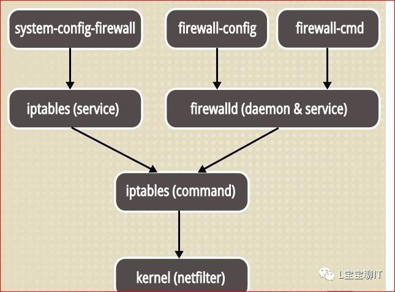

<!-- @import "[TOC]" {cmd="toc" depthFrom=1 depthTo=6 orderedList=false} -->

<!-- code_chunk_output -->

* [1 概述](#1-概述)
* [2 什么是FirewallD](#2-什么是firewalld)
* [参考](#参考)

<!-- /code_chunk_output -->

# 1 概述

防火墙是一种位于内部网络与外部网络之间的网络安全系统。一项信息安全的防护系统，依照特定的规则，允许或是限制传输的数据通过。防火墙通常工作在网络层，也即IPv4或IPv6的IP包上。

是否允许包通过防火墙，取决于防火墙配置的规则。这些规则既可以是内建的，也可以是用户自定义的。每一个包要进出防火墙，均需要满足防火墙配置的规则。

每一条规则均有一个目标动作，具有相同动作的规则可以分组在一起。

RHEL7 中有几种防火墙共存：firewalld、iptables、ebtables等等，默认使用 firewalld 作为防火墙，管理工具是firewall-cmd。使用 firewalld 来管理netfilter, 不过底层调用的命令仍然是 iptables等。

最常用的防火墙有：FirewallD或iptables。Linux的发行版种类极多，但是公认的仍然是这两种。

RedhatEnterprise Linux7 已经默认使用firewalld 作为防火墙，其使用方式已经变化。基于 iptables 的防火墙被默认不启动，但仍然可以继续使用。

因为这几种是冲突的，所以建议禁用其他几种服务。

# 2 什么是FirewallD

FirewallD即**Dynamic Firewall Manager of Linux systems**，Linux系统的**动态防火墙管理器**。是redhat7系统中对于netfilter内核模块的管理工具.

iptables service 管理防火墙规则的模式（静态）：用户将新的防火墙规则添加进 /etc/sysconfig/iptables 配置文件当中，再执行命令 /etc/init.d/iptables reload 使变更的规则生效。在这整个过程的背后，iptables service 首先对旧的防火墙规则进行了清空，然后重新完整地加载所有新的防火墙规则，如果加载了防火墙的模块，需要在重新加载后进行手动加载防火墙的模块；

firewalld 管理防火墙规则的模式（动态）:任何规则的变更都不需要对整个防火墙规则列表进行重新加载，只需要将变更部分保存并更新到运行中的 iptables 即可。还有命令行和图形界面配置工具，它仅仅是替代了 iptables service 部分，其底层还是使用 iptables 作为防火墙规则管理入口。

firewalld 使用 python 语言开发，在新版本中已经计划使用 c\+\+ 重写 daemon 部分(见下图)。

**FirewallD**是一个服务，用于**配置网络连接**，从而那些内外部网络的数据包可以允许穿过网络或阻止穿过网络。

**FirewallD**允许**两种类型的配置**：**永久类型**和**运行时类型**。

- 运行时类型的配置在**防火墙被重启后会丢失**相应的规则配置；
- 而永久类型的配置即使遇到系统重启，也会保留生效。

对应于上面两种类型的配置，FirewallD相应的有两个目录：

- 针对运行时类型配置的目录/usr/lib/firewall；
- 以及针对永久类型配置的目录/etc/firewall.

在RHEL/CentOS 7或Fedora 18的默认服务可以看到。

防火墙栈的整体图如下： 

Firewalld 提供了支持**网络/防火墙区域(zone**)定义**网络链接**以及**接口安全等级**的**防火墙管理工具**。拥有运行时配置和永久配置选项。它也支持允许服务或者应用程序直接添加防火墙规则的接口。以前的 system-config-firewall 防火墙模型是静态的，每次修改都要求防火墙完全重启。这个过程包括内核 netfilter 防火墙模块的卸载和新配置所需模块的装载等。相反，firewalldaemon 动态管理防火墙，不需要重启整个防火墙便可应用更改。因而也就没有必要重载所有内核防火墙模块了。

查看防火墙几种服务的运行状态：

# 参考

- Linux基础——Firewalld防火墙: https://cloud.tencent.com/developer/article/1152579
- CentOS 7防火墙服务FirewallD指南: https://www.linuxidc.com/Linux/2016-10/136431.htm
- Centos7-----firewalld详解: https://blog.51cto.com/11638832/2092203