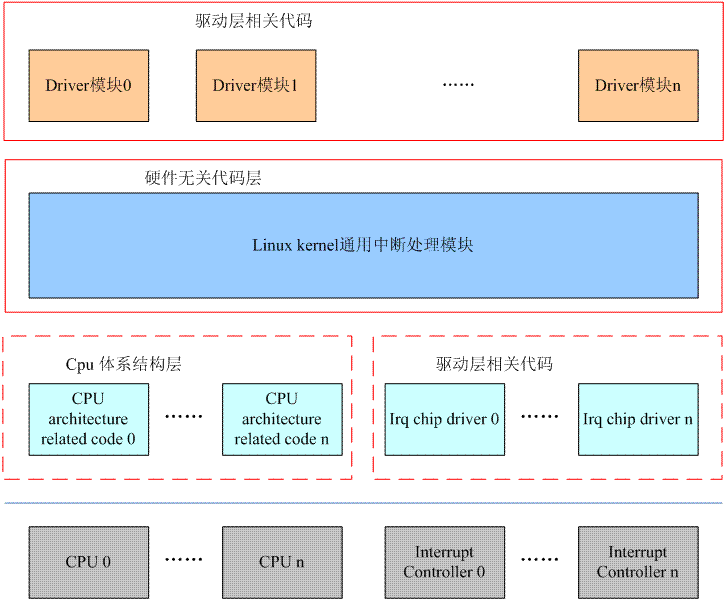

<!-- @import "[TOC]" {cmd="toc" depthFrom=1 depthTo=6 orderedList=false} -->

<!-- code_chunk_output -->

* [1 前言](#1-前言)
* [2 中断系统相关硬件描述](#2-中断系统相关硬件描述)
	* [2.1 HW中断系统的逻辑block图](#21-hw中断系统的逻辑block图)
	* [2.2 多个Interrupt controller和多个cpu之间的拓扑结构](#22-多个interrupt-controller和多个cpu之间的拓扑结构)
	* [2.3 Interrupt controller把中断事件送给哪个CPU？](#23-interrupt-controller把中断事件送给哪个cpu)
	* [2.4 更多的思考](#24-更多的思考)
* [3 中断子系统相关的软件框架](#3-中断子系统相关的软件框架)
* [4 中断子系统文档规划](#4-中断子系统文档规划)

<!-- /code_chunk_output -->

# 1 前言

一个合格的linux驱动工程师需要对kernel中的中断子系统有深刻的理解，只有这样，在写具体driver的时候才能：

1、**正确的使用linux kernel提供的的API**，例如最著名的**request\_threaded\_irq**（**request\_irq**）接口

2、正确使用**同步机制**保护驱动代码中的**临界区**

3、正确的使用kernel提供的**softirq、tasklet、workqueue等机制**来完成具体的中断处理

基于上面的原因，我希望能够通过一系列的文档来描述清楚linux kernel中的中断子系统方方面面的知识。一方面是整理自己的思绪，另外一方面，希望能够对其他的驱动工程师（或者想从事linux驱动工作的工程师）有所帮助。

# 2 中断系统相关硬件描述

中断硬件系统主要有**三种器件参与**，各个**外设**、**中断控制器**和**CPU**。各个**外设**提供**irq request line**，在**发生中断事件**的时候，通过irq request line上的**电气信号**向CPU系统请求处理。**外设的irq request line太多**，CPU需要一个小伙伴帮他，这就是**Interrupt controller**。Interrupt Controller是**连接外设中断系统**和**CPU系统的桥梁**。根据外设irq request line的多少，Interrupt Controller可以级联。**CPU**的主要功能是**运算**，因此**CPU并不处理中断优先级**，那是Interrupt controller的事情。

对于CPU而言，一般有**两种中断请求**，例如：对于ARM，是IRQ和FIQ信号线，分别让ARM进入IRQ mode和FIQ mode。对于X86，有可屏蔽中断和不可屏蔽中断。

本章节不是描述具体的硬件，而是使用了HW block这样的概念。例如CPU HW block是只ARM core或者X86这样的实际硬件block的一个逻辑描述，实际中，可能是任何可能的CPU block。

## 2.1 HW中断系统的逻辑block图

系统中有**若干个CPU block**用来**接收中断事件并进行处理**，**若干个Interrupt controller**形成**树状的结构**，**汇集**系统中**所有外设的irq request line**，并将**中断事件分发**给**某一个CPU block**进行处理。从**接口层面**看，主要有**两类接口**，一种是**中断接口**。有的实现中，具体中断接口的形态就是**一个硬件的信号线**，通过**电平信号**传递**中断事件**（ARM以及GIC组成的中断系统就是这么设计的）。有些系统采用了**其他的方法**来传递中断事件，比如**x86＋APIC**（Advanced Programmable Interrupt Controller）组成的系统，每个x86的核有一个Local APIC，这些**Local APIC们**通过**ICC（Interrupt Controller Communication）bus**连接到**IO APIC**上。**IO APIC**收集**各个外设的中断**，并**翻译成总线上的message**，传递给**某个CPU**上的**Local APIC**。因此，上面的红色线条也是逻辑层面的中断信号，可能是实际的PCB上的铜线（或者SOC内部的铜线），也可能是一个message而已。除了中断接口，CPU和Interrupt Controller之间还需要有控制信息的交流。Interrupt Controller会开放一些寄存器让CPU访问、控制。

## 2.2 多个Interrupt controller和多个cpu之间的拓扑结构

Interrupt controller有的是支持**多个CPU core的（例如GIC、APIC等**），有的**不支持**（例如S3C2410的中断控制器，X86平台的**PIC**等）。

如果硬件平台中**只有一个GIC**的话，那么通过**控制该GIC的寄存器**可以将**所有的外设中断**，分发给**连接在该interrupt controller**上的**CPU**。

如果有多个GIC呢（或者级联的interrupt controller都支持multi cpu core）？假设我们要设计一个非常复杂的系统，系统中有**8个CPU**，有**2000个外设中断**要处理，这时候你如何设计系统中的interrupt controller？如果使用**GIC**的话，我们需要**两个GIC（一个GIC最多支持1024个中断源**），一个是**root GIC**，另外一个是**secondary GIC**。这时候，你有两种方案：

（1）把**8个cpu**都连接到**root GIC**上，secondary GIC不接CPU。这时候原本挂接在secondary GIC的外设中断会输出到某个cpu，现在，只能是（通过某个cpu interface的irq signal）输到root GIC的某个SPI上。对于软件而言，这是一个比较简单的设计，secondary GIC的cpu interface的设定是固定不变的，永远是从一个固定的CPU interface输出到root GIC。这种方案的坏处是：这时候secondary GIC的PPI和SGI都是没有用的了。此外，在这种设定下，所有连接在secondary GIC上的外设中断要送达的target CPU是统一处理的，要么送去cpu0，要么cpu 5，不能单独控制。

（2）当然，你也可以让每个GIC分别连接4个CPU core，root GIC连接CPU0\~CPU3，secondary GIC连接CPU4\~CPU7。这种状态下，连接在root GIC的中断可以由CPU0\~CPU3分担处理，连接在secondary GIC的中断可以由CPU4\~CPU7分担处理。但这样，在中断处理方面看起来就体现不出8核的威力了。

注：上一节中的逻辑block示意图采用的就是方案一。

## 2.3 Interrupt controller把中断事件送给哪个CPU？

毫无疑问，只有支持multi cpu core的中断控制器才有这种幸福的烦恼。一般而言，中断控制器可以把中断事件上报给一个CPU或者一组CPU（包括广播到所有的CPU上去）。对于**外设类型的中断**，当然是送到一个cpu上就OK了，我看不出来要把这样的中断送给多个CPU进行处理的必要性。如果送达了多个cpu，实际上，也**应该只有一个handler实际和外设进行交互**，另外**一个cpu上的handler**的动作应该是这样的：发现该**irq number对应的中断**已经被**另外一个cpu处理**了，直接**退出handler**，返回**中断现场**。IPI的中断不存在这个限制，**IPI**更像一个**CPU之间通信的机制**，对这种中断广播应该是毫无压力。

实际上，从用户的角度看，其需求是相当复杂的，我们的目标可能包括：

（1）让**某个IRQ number**的中断由**某个特定的CPU**处理

（2）让**某个**特定的中断由**几个CPU轮流处理**

......

当然，具体的需求可能更加复杂，但是如何**区分软件和硬件的分工**呢？让硬件处理那么复杂的策略其实是不合理的，复杂的逻辑如果由硬件实现，那么就意味着更多的晶体管，更多的功耗。因此，最普通的做法就是为Interrupt Controller支持的**每一个中断**设定一个**target cpu的控制接口**（当然应该是**以寄存器形式**出现，对于**GIC**，这个寄存器就是**Interrupt processor target register**）。系统有多个cpu，这个控制接口就有多少个bit，每个bit代表一个CPU。如果该bit设定为1，那么该interrupt就上报给该CPU，如果为0，则不上报给该CPU。这样的硬件逻辑比较简单，剩余的控制内容就交给软件好了。例如如果系统有两个cpu core，某中断想轮流由两个CPU处理。那么当CPU0相应该中断进入interrupt handler的时候，可以将Interrupt processor target register中本CPU对应的bit设定为0，另外一个CPU的bit设定为1。这样，在下次中断发生的时候，interupt controller就把中断送给了CPU1。对于CPU1而言，在执行该中断的handler的时候，将Interrupt processor target register中CPU0的bit为设置为1，disable本CPU的比特位，这样在下次中断发生的时候，interupt controller就把中断送给了CPU0。这样软件控制的结果就是实现了特定中断由2个CPU轮流处理的算法。

## 2.4 更多的思考

面对这个HW中断系统之逻辑block diagram，我们其实可以提出更多的问题：

（1）中断控制器发送给CPU的中断是否可以收回？重新分发给另外一个CPU？

（2）系统中的中断如何分发才能获得更好的性能呢？

（3）中断分发的策略需要考虑哪些因素呢？

……

很多问题其实我也没有答案，慢慢思考，慢慢逼近真相吧。

# 3 中断子系统相关的软件框架

linux kernel的中断子系统相关的软件框架图如下所示：

由上面的block图，我们可知linux kernel的中断子系统分成4个部分：

（1）硬件无关的代码，我们称之Linux kernel**通用中断处理模块**。无论是哪种CPU，哪种controller，其中断处理的过程都有一些相同的内容，这些相同的内容被抽象出来，和HW无关。此外，**各个外设的驱动代码中**，也希望能用一个统一的接口实现irq相关的管理（不和具体的中断硬件系统以及CPU体系结构相关）这些“通用”的代码组成了linux kernel interrupt subsystem的核心部分。

（2）**CPU architecture相关的中断处理**。 和系统使用的具体的CPU architecture相关。

（3）**Interrupt controller驱动代码**。和系统使用的Interrupt controller相关。

（4）**普通外设的驱动**。这些驱动将使用Linux kernel**通用中断处理模块的API**来实现自己的驱动逻辑。

# 4 中断子系统文档规划

中断相关的文档规划如下：

1、linux kernel的中断子系统之（一），也就是本文，其实是一个导论，没有实际的内容，主要是给读者一个大概的软硬件框架。

2、linux kernel的中断子系统之（二）：irq domain介绍。主要描述如何将一个HW interrupt ID转换成IRQ number。

3、linux kernel的中断子系统之（三）：IRQ number和中断描述符。主要描述中断描述符相关的数据结构和接口API。

4、linux kernel的中断子系统之（四）：high level irq event handler。

5、linux kernel的中断子系统之（五）：driver API。主要以一个普通的驱动程序为视角，看待linux interrupt subsystem提供的API，如何利用这些API，分配资源，是否资源，如何处理中断相关的同步问题等等。

6、linux kernel的中断子系统之（六）：ARM中断处理过程，这份文档以ARM CPU为例，描述ARM相关的中断处理过程

7、linux kernel的中断子系统之（七）：GIC代码分析，这份文档是以一个具体的interrupt controller为例，描述irq chip driver的代码构成情况。

8、linux kernel的中断子系统之（八）：softirq

9、linux kernel的中断子系统之（九）：tasklet