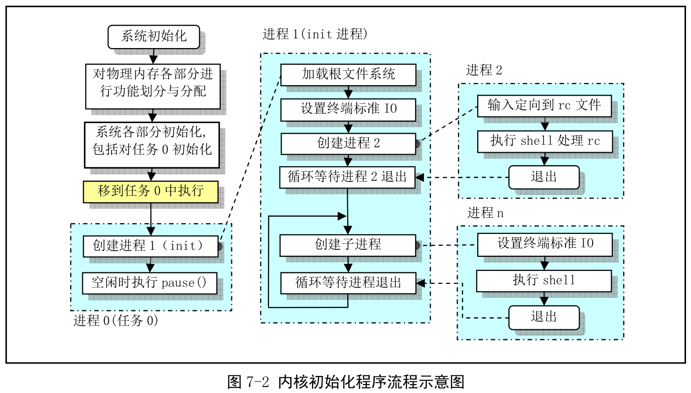

init/main.c包括了内核初始化的所有工作。

## 1. 功能描述

main.c首先利用前面setup.s程序取得的系统参数设置系统的根文件设备号以及一些内存全局变量。这些内存变量指明了主内存的开始地址、系统的内存容量和作为高速缓冲区内存的末端地址。若还定义虚拟盘（RAMDISK），则主内存将适当减少。整个内存映像如图。


图中，高速缓冲部分还要扣除被显存和ROM BIOS占用的部分。**高速缓存区用于磁盘等块设备临时存放数据的地方，以1K（1024）字节为一个数据块单位**。**主内存区**的内存由**内存管理模块mm通过分页机制**进行管理分配，以4KB为一个内存页单位。内核可以自由访问**高速缓冲区数据**，但需要**通过mm**才能使用分配到的内存页面。

然后，内核进行所有方面的硬件初始化工作。包括陷阱门、块设备、字符设备和tty，还包括人工第一个任务（task 0）。初始化完成后设置中断允许以开启中断，并切换到任务0。

内核初始化完成后，内核将执行权切换到用户模式（任务0），即从特权级0切换到特权级3。此时main的主程序工作在任务0中。然后系统第一次调用进程创建函数fork()，创建一个用于运行init()的子进程（通常被称为init进程）。系统整个初始化如图。



main首先确定系统物理内存分配，然后调用内核各部分初始化函数对内存管理、中断处理、块设备和字符设备、进程管理以及硬盘和软盘等硬件初始化处理。完成后，系统处于可运行状态。此后**程序将自己“手工”移动到任务0（进程0）中运行**，并使用fork()首次创建出进程1（init进程），并调用init()函数。该函数会继续初始化应用环境并执行shell登录程序。原进程0会在系统空闲时被调用执行，因此进程0通常被称为idle进程。此时进程0仅执行pause()系统调用，并又会调用调度函数。

init()函数功能可分为4部分：安装根文件系统、显示系统信息、运行系统初始资源配置文件rc中命令、执行用户登录shell程序。

代码首先调用系统调用setup()，用来收集硬盘设备分区表信息并安装根文件系统。安装根文件系统之前，系统会先判断是否需要建立虚拟盘。若编译内核时设置了虚拟盘大小，并在前面内核初始化中开辟了一块内存作为虚拟盘，则内核会首先尝试将根文件系统加载到内存的虚拟盘区中。

然后打开一个终端设备tty0，并复制其文件描述符以产生标准输入stdin、标准输出stdout和错误输出设备stderr设备。内核随后利用这些描述符在终端上显示一些系统信息，例如高速缓冲区中缓冲块总数、主内存区空闲总字节数等。

接着创建一个进程（进程2），并在其中为建立用户交互使用环境而执行一些初始配置操作，即在用户可以使用shell命令行环境前，内核调用/bin/sh程序运行配置文件etc/rc中设置的命令。这段代码首先通过关闭文件描述符0，并立刻打开/etc/rc，从而把标准输入stdin定向到etc/rc文件上。这样，所有标准输入数据将从该文件读取。然后内核以非交互形式执行/bin/sh，从而实现执行/etc/rc文件中的命令。当该文件中的命令执行完毕后，/bin/sh立刻退出。因此进程2也就随之结束。

init()函数最后一部分用于在新建进程中为用户建立一个新会话，并运行用户登录shell程序/bin/sh。在系统执行进程2中的程序时，父进程（init进程）一直等待着它的结束。随着进程2的退出，父进程（init进程）就进入无限循环中。在该循环中，父进程会再次生成一个新进程，然后在该进程中创建一个新的会话，并以登录shell方式再次执行程序/bin/sh，以创建用户交互shell环境。然后父进程继续等待该子进程。登录shell虽然与前面的非交互式shell是同一个程序/bin/sh，但命令行参数（argv[]）不同。登录shell的第0个命令行参数的第1个字符一定是“-”。这个特定标志会在/bin/sh执行时通知这不是一次普通的运行，而是作为登录shell运行/bin/sh的。从这时开始，用户就可以正常使用Linux命令行环境了，而父进程随之进入等待状态。此后若用户在命令行上执行了exit或logout命令，那么在显示一条当前登录shell退出的信息后，系统就会在这个无限循环中再次重复以上创建登录shell进程的过程。

任务1中运行的init()函数的后两部分实际上应该是独立的环境初始化程序init等功能。

创建新进程是通过完全复制父进程代码段和数据段方式实现，因此首次通过fork()创建新进程init时，为确保新进程**用户态栈**中没有进程0的多余信息，要求进程0在创建第1个新进程（进程1）之前不要使用其用户态栈，即要求任务0不要调用函数。因此在main.c主程序移动到任务0执行后，任务0中代码fork()不能以函数形式进行调用。程序中实现方法是采用如下所示的gcc函数内嵌（内联）形式来执行这个系统调用（见程序23行）：


```
static inline _syscall0(int, fork)
```

\_syscall0以嵌入汇编形式调用Linux的系统调用中断int 0x80（这个中断在sched\_init阶段设置的）。根据include/unistd.h文件第133行宏定义，展开就能看到这实际上是int fork()创建进程系统调用，如下：

```
//unistd.h文件中_syscall0()的定义。即不带参数的系统调用宏函数：type name(void)
#define _syscall0(type, name)\
type name(void)\
{\
long __res;\
__asm__ volatile("int $0x80"\               //调用系统中断0x80
    : "=a"(__res)\                          //返回值eax(__res)
    : "0"(__NR_##name));\                   //输入为系统中断调用号__NR_name
if (__res >= 0)\                            //如果返回值>=0，直接返回
    return (type)__res;\
errno = -__res;\                            //否则设置出错号，并返回-1
return -1;\
}

//根据上面定义把_syscall0(int, fork)展开带进23行后：
static inline int fork(void)
{
    long __res;
    __asm__ volatile("int $0x80" : "=a"(__res) : "0"(__NR_fork));
    if (__res >= 0)
        return (int)__res;
    errno = -__res;
    return -1;
}
```

执行fork()不会引起函数调用。另外，宏名称“syscall0”中最后的0表示无参数，1表示带1个参数。如果系统调用带有1个参数，就应使用宏_syscall1()。

**系统调用使用任务的内核态栈而非用户栈，并且每个任务都有自己独立的内核态栈，所以系统调用不影响用户态栈**。

另外,在创建新进程init (即进程1)的过程中,系统对其进行了一些**特殊处理**。进程0和进程init实际上同时使用着内核代码区内(小于1MB的物理内存)相同的代码和数据物理内存页面(640KB)，只是执行的代码不在一处，因此实际上它们也同时使用着相同的用户堆栈区。在为新进程init复制其父进程(进程0)的页目录和页表项时,**进程0的640KB页表项属性没有改动过(仍然可读写)，但是进程1的640KB对应的页表项却被设置成了只读**。因此当进程1开始执行时，其对用户栈的出入栈操作将导致页面写保护异常，从而会使得内核的内存管理程序为进程1在主内存区中分配一内存页面，并**把任务0栈中相应页面内容复制到此新页面上**。从此时起，任务1的用户态栈开始有自己独立的内存页面。即从任务1执行过出/入栈操作后，任务0和任务1的用户栈才变成相互独立的栈。为了不出现冲突问题,就必须要求任务0在任务1执行栈操作之前禁止使用到用户堆栈区域，而让进程init能单独使用堆栈。因为在内核调度进程运行时次序是随机的，有可能在任务0创建了任务1后仍然先运行任务0。因此任务0执行fork()操作后，随后的pause()函数也必须采用内嵌函数形式来实现,以避免任务0在任务1之前使用用户栈。

当系统中一个进程(例如init进程的子进程，进程2)执行过execve()调用后,进程2的代码和数据区会位于系统的主内存区中，因此系统此后可以随时利用写时复制技术 (Copy on Write)来处理其他新进程的创建和执行。

对于Linux来说，**所有任务都是在用户模式下运行的**，包括很多系统应用程序，如shell程序、网络子系统程序等。内核源代码lib/目录下的库文件(除了其中的string.c程序)就是专门为这里新创建的进程提供函数支持，内核代码本身并不使用这些库函数。

## 2. 代码注释

## 3. 其他信息

### 3.1 CMOS信息

PC的CMOS内存是电池供电的64或128甚至更大字节内存块，通常是系统实时钟芯片RTC（Real Time Chip）的一部分。该64字节的CMOS原先在IBM PC-XT机器上用于保存时钟和日期信息，存放格式是BCD码。由于仅用14字节，剩余字节就用来存放一些系统配置数据。

CMOS是独立编址。访问通过端口0x70、0x71进行。0x70是地址端口、0x71是数据端口。

```
[root@dell-cicada ~]# cat /proc/ioports  | grep rtc
  0070-0071 : rtc0
```

### 3.2 调用fork()创建新进程

fork是一个系统调用函数。复制当前进程并在进程表中创建一个与原进程（父进程）几乎一样的新表项，并执行同样的代码，但新进程（子进程）拥有自己的数据空间和环境参数。创建新进程的主要用途在于在新进程中使用exec()簇函数去执行其他不同的程序。

在fork调用返回位置处，父进程将恢复执行，而子进程则开始执行。父进程中，调用fork返回是子进程的进程标识号PID，而在子进程中fork返回是0值。如图。


init就是用fork返回值区分和执行不同的代码段的。main第201和216行是子进程的判断并开始执行子进程代码块的执行（利用execve()系统调用执行其他程序，这里执行sh），208和224行是父进程执行的代码块。

程序调用exit()退出执行。该函数会终止进程并释放其占用的内核资源。而父进程则可使用wait()查看或等待子进程的退出，并获取被终止进程的退出状态信息。

### 3.3 关于会话期（session）的概念

程序是文件，进程（process）是一个执行中的程序实例。内核中，每个进程都使用进程标识号（Process ID，PID）。一个进程通过fork创建多个子进程，这些进程就构成一个进程组。例如：

```
# cat main.c | grep for | more
```

其中每个命令：cat、grep和more都属于一个进程组。

每个进程组有一个唯一的进程组标识号（Group ID，gid）。每个进程组有一个称为组长的进程，组长进程就是其进程号pid等于进程组号gid的进程。一个进程可通过调用setpgid()参加一个现有的进程组或创建一个新的进程组。最常见进程组用途是在终端上向前台执行程序发出终止信号，同时终止整个进程组中的所有进程。

会话期（session，会话）是一个或多个进程组的集合。通常，用户登录后所执行的所有程序都属于一个会话期，而其登录shell则是会话期首进程（session leader），并且它所使用的终端就是会话期的控制终端（Controlling Terminal），因此会话期首进程通常也称为控制进程（Controlling process）。当退出登录logout时，所有属于这个会话期的进程都将被终止。setsid()函数用于建立一个新的会话期。通常该函数由环境初始化程序调用，见下节。关系如图。


一个会话期中几个进程组被分为一个前台进程组（Foreground process group）和一个或多个后台进程组（Background process group）。一个终端只能作为一个会话期的控制终端，前台进程组就是会话期中拥有控制终端的一个进程组，而会话期中的其他进程组则成为后台进程组。控制终端对应于/dev/tty设备文件，因此若一个进程需要访问控制终端，则可直接对/dev/tty文件读写。