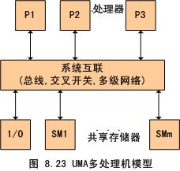
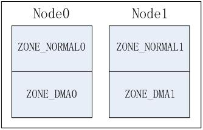
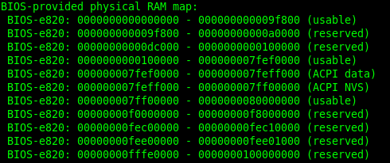
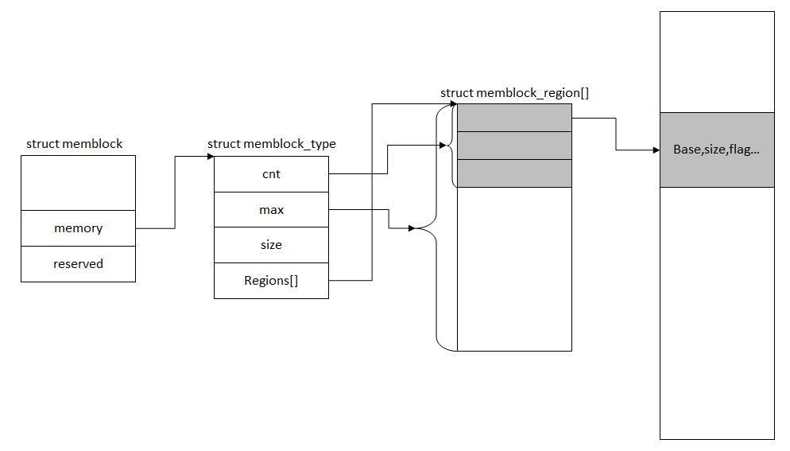

[TOC]

# 1 学习路线

很多Linux内存管理从**malloc**()这个C函数开始，从而知道**虚拟内存**。**虚拟内存是什么，怎么虚拟**？早期系统没有虚拟内存概念，**为什么**现代OS都有？要搞清楚虚拟内存，可能需要了解**MMU、页表、物理内存、物理页面、建立映射关系、按需分配、缺页中断和写时复制**等机制。

MMU，除了MMU工作原理，还会接触到Linux内核**如何建立页表映射**，其中也包括**用户空间页表的建立**和**内核空间页表**的建立，以及内核是如何**查询页表和修改页表**的。

当了解**物理内存**和**物理页面**时，会接触到**struct pg\_data\_t、struct zone和 struct page**等数据结构，这3个数据结构描述了系统中**物理内存的组织架构**。struct page数据结构除了描述一个4KB大小（或者其他大小）的物理页面外，还包含很多复杂而有趣的成员。

当了解**怎么分配物理页面**时，会接触到**伙伴系统机制**和**页面分配器**（**page allocator**),页面分配器是内存管理中最复杂的代码之一。

有了**物理内存**，那**怎么和虚拟内存建立映射关系**呢？在 Linux内核中，描述**进程的虚拟内存**用**struct vm\_area\_struct**数据结构。**虚拟内存**和**物理内存**采用**建立页表**的方法来**完成建立映射关系**。为什么**和进程地址空间建立映射的页面**有的叫**匿名页面**，而有的叫**page cache页面**呢？

当了解**malloc()怎么分配出物理内存**时，会接触到**缺页中断**，缺页中断也是内存管理中最复杂的代码之一。

这时，**虚拟内存和物理内存己经建立了映射关系**，这是**以页为基础**的，可是有时内核需要**小于一个页面**大小的内存，那么**slab机制**就诞生了。

上面己经建立起虚拟内存和物理内存的基本框图，但是如果用户**持续分配和使用内存**导致**物理内存不足**了怎么办？此时**页面回收机制**和**反向映射机制**就应运而生了。

虚拟内存和物理内存的映射关系经常是**建立后又被解除**了，时间长了，系统**物理页面布局变得凌乱**不堪，碎片化严重，这时内核如果需要**分配大块连续内存**就会变得很困难，那么**内存规整机制**（Memory Compaction) 就诞生了。

# 2 3种系统架构与2种存储器共享方式

从**系统架构**来看，目前的商用服务器大体可以分为三类

- 对称多处理器结构(SMP：Symmetric Multi\-Processor)

- 非一致存储访问结构(NUMA：Non\-Uniform Memory Access)

- 海量并行处理结构(MPP：Massive Parallel Processing)。

**共享存储型**多处理机有两种模型

- 均匀存储器存取（Uniform\-Memory\-Access，简称UMA）模型

- 非均匀存储器存取（Nonuniform\-Memory\-Access，简称NUMA）模型

## 2.1 SMP

服务器中**多个CPU对称工作**，**无主次或从属关系**。

**各CPU**共享**相同的物理内存**，**每个CPU**访问**内存中的任何地址**所需**时间是相同的**，因此SMP也被称为**一致存储器访问结构(UMA：Uniform Memory Access)**



**每个CPU**必须通过**相同的内存总线**访问**相同的内存资源**.

## 2.2 NUMA


NUMA服务器的基本特征是具有**多个CPU模块**，**每个CPU模块由多个CPU(如4个)组成**，并且具有独立的**本地内存、I/O槽口等**(这些**资源都是以CPU模式划分本地的，一个CPU模块可能有多个CPU！！！**)。

其**共享存储器**物理上是分布在**所有处理机的本地存储器上**。**所有本地存储器**的集合组成了**全局地址空间**，可被所有的处理机访问。**处理机**访问**本地存储器是比较快**的，但访问属于**另一台处理机的远程存储器**则比较**慢**，因为通过互连网络会产生附加时延。

## 2.3 MPP

其基本特征是由多个SMP服务器(**每个SMP服务器称节点**)通过**节点互联网络**连接而成，**每个节点只访问自己的本地资源**(内存、存储等)，是一种完全**无共享(Share Nothing)结构**，协同工作，**完成相同的任务**. **在MPP系统中，每个SMP节点也可以运行自己的操作系统、数据库等**。**每个节点内的CPU不能访问另一个节点的内存**。

目前业界对**节点互联网络暂无标准**

# 3 内存空间分层

内存空间分三层


| 层次 | 描述 |
|:---:|:----|
| **用户空间层** |可以理解为Linux 内核内存管理**为用户空间暴露的系统调用接口**. 例如**brk**(), **mmap**()等**系统调用**. 通常libc库会将系统调用封装成大家常见的C库函数, 比如malloc(), mmap()等. |
| **内核空间层** | 包含的模块相当丰富, 用户空间和内核空间的接口时系统调用, 因此内核空间层首先需要处理这些内存管理相关的系统调用, 例如sys\_brk, sys\_mmap, sys\_madvise等. 接下来就包括VMA管理, 缺页中断管理, 匿名页面, page cache, 页面回收, 反向映射, slab分配器, 页面管理等模块. |
| **硬件层** | 包含**处理器**的**MMU**, **TLB**和**cache**部件, 以及板载的**物理内存**, 例如LPDDR或者DDR |

# 4 Linux物理内存组织形式

Linux把**物理内存**划分为**三个层次**来管理

| 层次 | 描述 |
|:----|:----|
| **存储节点(Node**) |  CPU被划分为**多个节点(node**), **内存则被分簇**, **每个CPU**对应一个**本地物理内存**, 即**一个CPU\-node**对应一个**内存簇bank**，即**每个内存簇**被认为是**一个节点** |
| **管理区(Zone**)   | **每个物理内存节点node**被划分为**多个内存管理区域**, 用于表示**不同范围的内存**, 内核可以使用**不同的映射方式(！！！**)映射物理内存 |
| **页面(Page**) | 内存被细分为**多个页面帧**, **页面**是**最基本的页面分配的单位**　｜

pg\_data\_t对应一个node，node\_zones包含了不同zone；**zone**下又**定义了per\_cpu\_pageset**，将**page和cpu绑定**。

## 4.1 Node

为了支持**NUMA模型**，也即CPU对不同内存单元的访问时间可能不同，此时系统的物理内存被划分为几个节点(node), 一个node对应一个内存簇bank，即每个内存簇被认为是一个节点

CPU被划分为**结点**, **内存**则被**分簇**, 每个CPU对应一个本地物理内存, 即一个CPU-node对应一个内存簇bank，即每个内存簇被认为是一个节点.

在**分配一个页面**时, Linux采用节点**局部分配的策略**,从最靠近运行中的CPU的节点分配内存,由于**进程往往是在同一个CPU上运行**, 因此**从当前节点**得到的内存很可能被用到.

Linux使用**struct pglist\_data**描述一个**node**(typedef pglist\_data pg\_data\_t)

### 4.1.1 结点的内存管理域

```cpp
typedef struct pglist_data {
	/*  包含了结点中各内存域的数据结构 , 可能的区域类型用zone_type表示*/
    struct zone node_zones[MAX_NR_ZONES];
    /*  指点了备用结点及其内存域的列表，以便在当前结点没有可用空间时，在备用结点分配内存   */
    struct zonelist node_zonelists[MAX_ZONELISTS];
    /*  保存结点中不同内存域的数目    */
    int nr_zones;
} pg_data_t;
```

注意, **当前节点内存域和备用节点内存域用的数据结构不同！！！**

### 4.1.2 结点的内存页面

```cpp
typedef struct pglist_data
{
    /*  指向page实例数组的指针，用于描述结点的所有物理内存页，它包含了结点中所有内存域的页。    */
    struct page *node_mem_map;

	/* 起始页面帧号，指出该节点在全局mem_map中的偏移
    系统中所有的页帧是依次编号的，每个页帧的号码都是全局唯一的（不只是结点内唯一）  */
    unsigned long node_start_pfn;
    /* total number of physical pages 结点中页帧的数目 */
    unsigned long node_present_pages; 
    /*  该结点以页帧为单位计算的长度，包含内存空洞 */
    unsigned long node_spanned_pages; /* total size of physical page range, including holes  */
    /*  全局结点ID，系统中的NUMA结点都从0开始编号  */
    int node_id;		
} pg_data_t;
```

### 4.1.3 交换守护进程

```cpp
typedef struct pglist_data
{
    /*  交换守护进程的等待队列 */
    wait_queue_head_t kswapd_wait;
    wait_queue_head_t pfmemalloc_wait;
    /* 指向负责该结点的交换守护进程的task_struct, 在将页帧换出结点时会唤醒该进程 */
    struct task_struct *kswapd;     /* Protected by  mem_hotplug_begin/end() */
};
```

### 4.1.4 节点状态

| 状态 | 描述 |
|:-----:|:-----:|
| N\_POSSIBLE | 结点在某个时候可能变成联机 |
| N\_ONLINE | 节点是联机的 |
| N\_NORMAL\_MEMORY | 结点是普通内存域 |
| N\_HIGH\_MEMORY | 结点是普通或者高端内存域 |
| **N\_MEMORY** | 结点是普通，高端内存或者MOVEABLE域 |
| N\_CPU | 结点有一个或多个CPU |

其中**N\_POSSIBLE, N\_ONLINE和N\_CPU用于CPU和内存的热插拔**.

对内存管理有必要的标志是N\_HIGH\_MEMORY和N\_NORMAL\_MEMORY

- 如果结点有**普通或高端内存**(**或者！！！**)则使用**N\_HIGH\_MEMORY**
- 仅当结点**没有高端内存**时才设置**N\_NORMAL\_MEMORY**

### 4.1.5 查找内存节点

node\_id作为**全局节点id**。系统中的NUMA结点都是**从0开始编号**的

NUMA系统, 定义了一个**大小为MAX\_NUMNODES类型为pg\_data\_t**的**指针数组node\_data**,数组的大小根据**CONFIG\_NODES\_SHIFT**的配置决定.

对于UMA来说，NODES\_SHIFT为0，所以MAX\_NUMNODES的值为1.  只使用了struct pglist\_data **contig\_page\_data**.

可以使用NODE\_DATA(node\_id)来查找系统中编号为node\_id的结点

```c
[[arch/x86/include/asm/mmzone_64.h]]
extern struct pglist_data *node_data[];
#define NODE_DATA(nid)          (node_data[(nid)])
```

UMA结构下由于只有一个结点, 因此该宏总是返回**全局的contig\_page\_data**.

## 4.2 zone

因为实际的**计算机体系结构**有**硬件的诸多限制**, 这限制了页框可以使用的方式. 尤其是, Linux内核必须处理**80x86体系结构**的**两种硬件约束**.

- **ISA总线的直接内存存储DMA**（**DMA操作！！！**）处理器有一个严格的限制 : 他们**只能对RAM的前16MB进行寻址**

- 在具有大容量RAM的现代**32位计算机(32位才有这个问题！！！**)中, CPU**不能**直接访问**所有的物理地址**, 因为**线性地址空间太小**, 内核不可能直接映射**所有物理内存**到**线性地址空间**.

因此对于内核来说, **不同范围的物理内存**采用**不同的管理方式和映射方式**

Linux使用enum zone\_type来标记内核所支持的所有内存区域

```cpp
enum zone_type
{
#ifdef CONFIG_ZONE_DMA
    ZONE_DMA,
#endif
#ifdef CONFIG_ZONE_DMA32
    ZONE_DMA32,
#endif
    ZONE_NORMAL,
#ifdef CONFIG_HIGHMEM
    ZONE_HIGHMEM,
#endif
    ZONE_MOVABLE,
#ifdef CONFIG_ZONE_DEVICE
    ZONE_DEVICE,
#endif
    __MAX_NR_ZONES
};
```

| 管理内存域 | 描述 |
|:---------|:-------|
| ZONE\_DMA | 标记了适合DMA的内存域.该区域的**长度依赖于处理器类型**.这是由于古老的ISA设备强加的边界. 但是为了兼容性,现代的计算机也可能受此影响 |
| ZONE\_DMA32 | 标记了**使用32位地址字可寻址,适合DMA的内存域**(**4GB？？？**).显然,只有在**53位系统中ZONE\_DMA32才和ZONE\_DMA有区别**,在**32位系统中,本区域是空的**, 即长度为0MB,在Alpha和AMD64系统上,该内存的长度可能是从0到4GB |
| ZONE\_NORMAL | 标记了可**直接映射到内存段的普通内存域**.这是在**所有体系结构上保证会存在的唯一内存区域**(**任何体系结构中都会有ZONE\_NORMAL,但是可能是空的!!!**),但**无法保证该地址范围对应了实际的物理地址**(**!!!**). 例如,如果**AMD64系统只有两2G内存**,那么**所有的内存都属于ZONE\_DMA32范围**,而**ZONE\_NORMAL则为空** |
| ZONE\_HIGHMEM | 标记了**超出内核虚拟地址空间**的**物理内存段**,因此这段地址**不能被内核直接映射** |
| ZONE\_MOVABLE | 内核定义了一个伪内存域ZONE\_MOVABLE,在**防止物理内存碎片的机制memory migration中需要使用**该内存域.供防止**物理内存碎片的极致使用** |
| ZONE\_DEVICE | 为支持**热插拔设备**而分配的Non Volatile Memory非易失性内存 |
| MAX\_NR\_ZONES | 充当结束标记, 在内核中想要迭代系统中所有内存域, 会用到该常量 |

根据编译时候的配置, 可能无需考虑某些内存域. 例如**在64位系统**中, 并**不需要高端内存**, ZONE\_HIGHMEM区域总是空的, 可以参见**Documentation/x86/x86\_64/mm.txt**.

一个管理区(zone)由struct zone结构体来描述, 通过typedef被重定义为zone\_t类型

### 4.2.1 高速缓存行

zone数据结构**不需要**像struct page一样**关心数据结构的大小**.

ZONE\_PADDING()让两个自旋锁zone->lock和zone\_lru\_lock这两个很热门的锁可以分布在不同的Cahe Line中, 用空间换取时间, .

内核还对整个zone结构用了\_\_\_\_cacheline\_internodealigned\_in\_smp, 来实现**最优的高速缓存行对齐方式**.

### 4.2.2 水位watermark[NR\_WMARK]与kswapd内核线程

```cpp
struct zone{
    unsigned long watermark[NR_WMARK];
}

enum zone_watermarks
{
        WMARK_MIN,
        WMARK_LOW,
        WMARK_HIGH,
        NR_WMARK
};

#define min_wmark_pages(z) (z->watermark[WMARK_MIN])
#define low_wmark_pages(z) (z->watermark[WMARK_LOW])
#define high_wmark_pages(z) (z->watermark[WMARK_HIGH])
```

| 标准 | 描述 |
|:----:|:---|
| watermark[WMARK\_MIN] | 当空闲页面的数量达到page\_min所标定的数量的时候， 说明页面数非常紧张, **分配页面的动作**和**kswapd线程同步运行**.<br>WMARK\_MIN所表示的**page的数量值**，是在**内存初始化**的过程中调用**free\_area\_init\_core**中计算的。这个数值是根据zone中的page的数量除以一个大于1的系数来确定的。通常是这样初始化的**ZoneSizeInPages/12** |
| watermark[WMARK\_LOW] | 当空闲页面的数量达到WMARK\_LOW所标定的数量的时候，说明页面刚开始紧张, 则**kswapd线程将被唤醒**，并开始释放回收页面 |
| watermark[WMARK\_HIGH] | 当空闲页面的数量达到page\_high所标定的数量的时候， 说明内存页面数充足, 不需要回收, kswapd线程将重新休眠，**通常这个数值是page\_min的3倍** |

kswapd和这3个参数的互动关系如下图：


### 4.2.3 内存域统计信息vm\_stat

```cpp
[include/linux/mmzone.h]
struct zone
{
	  atomic_long_t vm_stat[NR_VM_ZONE_STAT_ITEMS];
}
```

由enum zone\_stat\_item枚举变量标识

### 4.2.4 zone等待队列表(zone wait queue table)

struct zone中实现了一个**等待队列**,可用于**等待某一页的进程**,内核**将进程排成一个列队**,等待某些条件. 在**条件变成真**时, 内核会**通知进程恢复工作**.

```cpp
struct zone
{
	wait_queue_head_t *wait_table;
	unsigned long      wait_table_hash_nr_entries;
	unsigned long      wait_table_bits;
}
```

| 字段 | 描述 |
|:-----:|:-----:|
| wait\_table | **待一个page释放**的**等待队列哈希表**。它会被wait\_on\_page()，unlock\_page()函数使用. 用**哈希表**，而**不用一个等待队列**的原因，防止进程长期等待资源 |
| wait\_table\_hash\_nr\_entries | **哈希表**中的**等待队列的数量** |
| wait\_table\_bits | **等待队列散列表数组大小**, wait\_table\_size == (1 << wait\_table\_bits)  |

当对**一个page做I/O操作**的时候，I/O操作需要**被锁住**，防止不正确的数据被访问。

**进程在访问page前**，**wait\_on\_page\_locked函数**，使进程**加入一个等待队列**

访问完成后，**unlock\_page函数解锁**其他进程对page的访问。其他正在**等待队列**中的进程**被唤醒**。

- **每个page**都**可以有一个等待队列**，但是太多的**分离的等待队列**使得花费**太多的内存访问周期**。替代的解决方法，就是将**所有的队列**放在**struct zone数据结构**中

- 也可以有一种可能，就是**struct zone中只有一个队列**，但是这就意味着，当**一个page unlock**的时候，访问这个zone里**内存page的所有休眠的进程**(**所有的，而不管是不是访问这个page的进程！！！**)将都**被唤醒**，这样就会出现拥堵（thundering herd）的问题。建立**一个哈希表**管理**多个等待队列**，能解决这个问题，zone->wait\_table就是这个哈希表。哈希表的方法**可能**还是会**造成一些进程不必要的唤醒**。但是这种事情发生的机率不是很频繁的。下面这个图就是进程及等待队列的运行关系：


**等待队列的哈希表的分配和建立**在**free\_area\_init\_core**函数中进行。哈希表的表项的数量在wait\_table\_size() 函数中计算，并且保持在**zone\->wait\_table\_size成员**中。最大**4096个等待队列**。最小是NoPages / PAGES\_PER\_WAITQUEUE的2次方，NoPages是zone管理的**page的数量**，PAGES\_PER\_WAITQUEUE被定义**256**

### 4.2.5 冷热页与Per\-CPU上的页面高速缓存

内核经常**请求和释放单个页框**.为了提升性能,**每个内存管理区**(**zone级别定义！！！**)都定义了一个每CPU(Per\-CPU)的**页面高速缓存**.所有"每CPU高速缓存"包含一些**预先分配的页框**

struct zone的**pageset**成员用于实现**冷热分配器(hot\-cold allocator**)

```cpp
struct zone
{
    struct per_cpu_pageset __percpu *pageset;
};
```
尽管**内存域**可能属于一个**特定的NUMA结点**,因而**关联**到某个**特定的CPU**。但**其他CPU**的**高速缓存**仍然可以包含**该内存域中的页面**（也就是说**CPU的高速缓存可以包含其他CPU的内存域的页！！！**）. 最终的效果是, **每个处理器**都可以访问系统中的**所有页**,尽管速度不同.因而,**特定于内存域的数据结构**不仅要考虑到**所属NUMA结点相关的CPU**, 还必须照顾到系统中**其他的CPU**.

pageset是一个指针, 其容量与系统能够容纳的**CPU的数目的最大值相同**.

### 4.2.6 zonelist内存域存储层次

#### 4.2.6.1 内存域之间的层级结构

**当前结点**与系统中**其他结点**的**内存域**之间存在一种等级次序

我们考虑一个例子, 其中内核想要**分配高端内存**. 

1.	它首先企图在**当前结点的高端内存域**找到一个大小适当的空闲段.如果**失败**,则查看**该结点**的**普通内存域**. 如果还失败, 则试图在**该结点**的**DMA内存域**执行分配.

2.	如果在**3个本地内存域**都无法找到空闲内存, 则查看**其他结点**. 在这种情况下, **备选结点**应该**尽可能靠近主结点**, 以最小化由于访问非本地内存引起的性能损失.

内核定义了内存的一个**层次结构**, 首先试图分配"廉价的"内存. 如果失败, 则根据访问速度和容量, 逐渐尝试分配"更昂贵的"内存.

**高端内存是最廉价的**, 因为内核**没有**任何部分**依赖**于从该内存域分配的内存. 如果**高端内存域用尽**, 对内核**没有任何副作用**, 这也是优先分配高端内存的原因.

**其次是普通内存域**, 这种情况有所不同. **许多内核数据结构必须保存在该内存域**, 而不能放置到高端内存域.

因此如果普通内存完全用尽, 那么内核会面临紧急情况. 所以只要高端内存域的内存没有用尽, 都不会从普通内存域分配内存.

**最昂贵的是DMA内存域**, 因为它用于外设和系统之间的数据传输. 因此从该内存域分配内存是最后一招.

#### 4.2.6.2 备用节点内存域zonelist结构

内核还针对**当前内存结点**的**备选结点**,定义了一个**等级次序**.这有助于在**当前结点所有内存域**的内存都**用尽**时, 确定一个**备选结点**

内核使用pg\_data\_t中的**zonelist数组**, 来**表示所描述的层次结构**.

```cpp
typedef struct pglist_data {
	struct zonelist node_zonelists[MAX_ZONELISTS];
	/*  ......  */
}pg_data_t;
```

node\_zonelists**数组**对每种可能的**内存域类型**, 都配置了一个**独立的数组项**.

```cpp
enum
{
    ZONELIST_FALLBACK,      /* zonelist with fallback */
#ifdef CONFIG_NUMA
    ZONELIST_NOFALLBACK,
#endif
    MAX_ZONELISTS
};
```

**UMA结构**下, 数组大小**MAX\_ZONELISTS = 1**, NUMA下需要多余的**ZONELIST\_NOFALLBACK**用以表示**当前结点**的信息

由于该**备用列表**必须包括**所有结点**的**所有内存域(！！！**)，因此**由MAX\_NUMNODES * MAX\_NZ\_ZONES项**组成，外加一个**用于标记列表结束的空指针**

```cpp
struct zonelist {
    struct zoneref _zonerefs[MAX_ZONES_PER_ZONELIST + 1];
};

struct zoneref {
    struct zone *zone;      /* Pointer to actual zone */
    int zone_idx;       /* zone_idx(zoneref->zone) */
};
```

#### 4.2.6.3 内存域的排列方式

NUMA系统中存在**多个节点**, **每个结点**中可以包含**多个zone**.

- Legacy方式, **每个节点只排列自己的zone**；



- Node方式, 按**节点顺序**依次排列，先排列本地节点的所有zone，再排列其它节点的所有zone。


- Zone方式, 按**zone类型**从高到低依次排列各节点的相同类型zone


可通过启动参数"**numa\_zonelist\_order**"来配置**zonelist order**，内核定义了3种配置

```cpp
#define ZONELIST_ORDER_DEFAULT  0 /* 智能选择Node或Zone方式 */
#define ZONELIST_ORDER_NODE     1 /* 对应Node方式 */
#define ZONELIST_ORDER_ZONE     2 /* 对应Zone方式 */
```

## 4.3 Page

**页帧(page frame**)代表了系统内存的最小单位, 对内存中的**每个页**都会创建一个struct page的一个实例. 内核必须要**保证page结构体足够的小**. 每一页物理内存叫页帧，以页为单位对内存进行编号，该编号可作为页数组的索引，又称为页帧号.

### 4.3.1 mapping & index

**mapping**指定了**页帧**（**物理页！！！**）所在的**地址空间**,**index**是**页帧**在映射的**虚拟空间内部**的偏移量.**地址空间**是一个非常一般的概念.例如,可以用在**向内存读取文件**时. 地址空间用于将**文件的内容**与装载**数据的内存区关联起来**.

mapping不仅能够保存一个指针,而且还能包含一些额外的信息,用于判断页是否属于**未关联到地址空间**的**某个匿名内存区**.

page\->mapping本身是一个**指针**，指针地址的**低几个bit**因为**对齐的原因**都是**无用的bit**，内核就根据这个特性利用这几个bit来让page->mapping实现更多的含义。**一个指针多个用途**，这个也是内核为了**减少page结构大小**的办法之一。目前用到**最低2个bit位**。

```c
#define PAGE_MAPPING_ANON	0x1
#define PAGE_MAPPING_MOVABLE	0x2
#define PAGE_MAPPING_KSM	(PAGE_MAPPING_ANON | PAGE_MAPPING_MOVABLE)
#define PAGE_MAPPING_FLAGS	(PAGE_MAPPING_ANON | PAGE_MAPPING_MOVABLE)
```

1. 如果page->mapping == NULL，说明该**page**属于**交换高速缓存页**（**swap cache**）；当需要使用地址空间时会指定**交换分区的地址空间**swapper\_space。

2. 如果page->mapping != NULL，第0位bit[0] = 0，说明该page属于**页缓存**或**文件映射**，mapping指向**文件的地址空间**address\_space。

3. 如果page->mapping != NULL，第0位bit[0] != 0，说明该page为**匿名映射**，mapping指向**struct anon\_vma对象**。

### 4.3.2 lru链表头

最近、最久未使用**struct slab结构指针**变量

lru：链表头，主要有3个用途：

1.	则**page处于伙伴系统**中时，用于链接**相同阶的伙伴**（只使用伙伴中的**第一个page的lru**即可达到目的）。

2.	**设置PG\_slab**, 则**page属于slab**，page\->lru.next指向page驻留的的缓存的管理结构，page->lru.prec指向保存该page的slab的管理结构。

3.	page被**用户态使用**或被当做**页缓存使用**时，用于将该**page**连入zone中**相应的lru链表**，供**内存回收**时使用。

### 4.3.3 内存页标识pageflags

### 4.3.4 全局页面数组mem\_map

mem\_map是一个**struct page的数组**，管理着系统中**所有的物理内存页面**。在系统启动的过程中，创建和分配mem\_map的内存区域.

UMA体系结构中，**free\_area\_init**函数在系统唯一的struct node对象**contig\_page\_data**中**node\_mem\_map**成员赋值给全局的mem\_map变量

# 5 Linux分页机制

分页的基本方法是将**地址空间**人为地等分成**某一个固定大小的页**；每一**页大小**由**硬件来决定**，或者是由**操作系统来决定**(如果**硬件支持多种大小的页**)。目前，以大小为4KB的分页是绝大多数PC操作系统的选择。

- **逻辑空间（线性空间！！！**）等分为**页**；并**从0开始编号**
- **内存空间（物理空间！！！**）等分为**块**，**与页面大小相同**；**从0开始编号**
- **分配内存**时，**以块为单位**将进程中的**若干个页**分别装入内存空间

关于进程分页。当我们把进程的**虚拟地址空间按页**来分割，**常用的数据和代码**会被装在到**内存**；**暂时没用到的是数据和代码**则保存在**磁盘**中，需要用到的时候，再从磁盘中加载到内存中即可。

这里需要了解三个概念：

1. **虚拟页**(VP, Virtual Page), **虚拟空间**中的**页**；

2. **物理页**(PP, Physical Page), **物理内存**中的**页**；

3. **磁盘页**(DP, Disk Page), **磁盘**中的**页**。

**虚拟内存**的实现需要硬件的支持，从Virtual Address到Physical Address的映射，通过一个叫**MMU**(**Memory Mangement Unit**)的部件来完成

**分页单元(paging unit**)把**线性地址**转换成**物理地址**。其中的一个关键任务就是把**所请求的访问类型**与**线性地址的访问权限相比较**，如果这次内存访问是**无效**的，就产生一个**缺页异常**。
 
- **页**：为了更高效和更经济的管理内存，**线性地址**被分为以固定长度为单位的组，成为**页**。页内部**连续的线性地址空间（页是连续的！！！**）被映射到**连续的物理地址**中。这样，内核可以指定**一个页（！！！**）的物理地址和对应的**存取权限**，而不用指定全部线性地址的存取权限。这里说**页**，同时指**一组线性地址**以及这组地址**包含的数据**

- **页框**：分页单元把所有的**RAM**分成固定长度的**页框**(page frame)(有时叫做**物理页**)。每一个页框包含一个页(page)，也就是说一个页框的长度与一个页的长度一致。页框是主存的一部分，因此也是一个存储区域。区分**一页**和**一个页框**是很重要的，前者只是**一个数据块**，可以存放在**任何页框**或**磁盘（！！！线性空间的数据在物理页帧或磁盘可以是任何位置！！！**）中。

- **页表**：把**线性地址**映射到**物理地址**的数据结构称为**页表**(page table)。页表存放在**主存**中，并在启用分页单元之前必须由内核对页表进行适当的初始化。

关于硬件分页机制看其他资料

## 5.1 Linux中的分页层次

目前的内核的内存管理总是**固定使用四级页表**, 而不管底层处理器是否如此.

| 单元 | 描述 |
|:---:|:----:|
| 页全局目录 | Page Global Directory  |
| 页上级目录	| Page Upper Directory  |
| 页中间目录	| Page Middle Directory |
| 页表	        | Page Table 			|
| 页内偏移      | Page Offset		    |

- **页全局目录**包含若干**页上级目录**的地址；
- **页上级目录**又依次包含若干**页中间目录**的地址；
- 而**页中间目录**又包含若干****页表****的地址；
- 每一个**页表项**指向一个**页框**。

**Linux页表管理**分为两个部分,第一个部分**依赖于体系结构**,第二个部分是**体系结构无关的**.

所有**数据结构**几乎都定义在**特定体系结构的文件**中.这些数据结构的定义可以在**头文件arch/对应体系/include/asm/page.h**和**arch/对应体系/include/asm/pgtable.h**中找到. 但是对于**AMD64**和**IA\-32**已经统一为**一个体系结构**.但是在处理页表方面仍然有很多的区别,因为相关的定义分为**两个不同的文件**arch/x86/include/asm/page\_32.h和arch/x86/include/asm/page\_64.h, 类似的也有pgtable\_xx.h.


对于不同的体系结构，Linux采用的**四级页表目录**的大小有所不同(**页大小**都是**4KB**情况下）：

- 对于**i386**而言，仅采用**二级页表**，即**页上层目录**和**页中层目录**长度为0；**10(PGD)\+0(PUD)\+0(PMD)\+10(PTE)\+12(offset)**。
- 对于启用**PAE**的**i386**，采用了**三级页表**，即**页上层目录**长度为0；**2(PGD)\+0(PUD)\+9(PMD)\+9(PTE)\+12(offset)**。
- 对于**64位**体系结构，可以采用三级或四级页表，具体选择由**硬件决定**。**x86\_64下，9(PGD)\+9(PUD)\+9(PMD)\+9(PTE)\+12(offset)**。

对于**没有启用物理地址扩展(PAE**)的**32位系统**，**两级页表**已经足够了。从本质上说Linux通过使“**页上级目录**”位和“**页中间目录**”位**全为0（！！！**），彻底取消了页上级目录和页中间目录字段。不过，页上级目录和页中间目录在**指针序列中**的位置被**保留**，以便同样的代码在32位系统和64位系统下都能使用。内核为**页上级目录**和**页中间目录**保留了一个位置，这是通过把它们的**页目录项数**设置为**1**，并把这**两个目录项**映射到**页全局目录**的一个合适的**目录项**而实现的。

## 5.2 Linux中分页相关数据结构

Linux分别采用**pgd\_t、pud\_t、pmd\_t和pte\_t**四种数据结构来表示**页全局目录项、页上级目录项、页中间目录项和页表项**。这四种数据结构本质上都是**无符号长整型unsigned long**, 这些都是**表项！！！不是表本身！！！**

linux中使用下列宏简化了页表处理，对于**每一级页表**都使用有以下三个关键描述宏：

| 宏字段| 描述 |
| ------------- |:-------------|
| XXX\_SHIFT| 指定**一个相应级别页表项(！！！)可以映射的区域大小的位数** |
| XXX\_SIZE| **一个相应级别页表项(！！！)可以映射的区域大小** |
| XXX\_MASK| 用以**屏蔽一个相应级别页表项可以映射的区域大小的所有位数**。 |

我们的**四级页表**，对应的宏前缀分别由**PAGE，PMD，PUD，PGDIR**

### 5.2.1 PAGE宏--页表(Page Table)

```
 #define PAGE_SHIFT      12
 #define PAGE_SIZE       (_AC(1,UL) << PAGE_SHIFT)
 #define PAGE_MASK       (~(PAGE_SIZE-1))
```

- 当用于80x86处理器时，**PAGE\_SHIFT**返回的值为**12（这个值是写死的！！！**），**页表项**中存放的是**一个页的基地址**，所以**页表项能映射的区域大小的位数自然就取决于页的位数！！！**。**一个页表项**可以映射的**区域大小的位数**.

- 由于**页内所有地址都必须放在offset字段**，因此80x86系统的页的大小**PAGE\_SIZE**是**2\^{12}**=**4096字节**。一个页表项可以映射的区域的大小.

- PAGE\_MASK宏产生的值为0xfffff000，用以**屏蔽Offset字段的所有位（低12位全为0**）。屏蔽**一个页表项可以映射的区域大小**的**所有位数**。

### 5.2.2 PMD\-Page Middle Directory (页目录)

| 字段| 描述 |
| ------------- |:-------------|
| PMD\_SHIFT| 指定**线性地址的Offset和Table字段**的总位数；换句话说，是**页中间目录项**可以映射的**区域大小的位数** |
| PMD\_SIZE| 用于计算由页中间目录的**一个单独表项**所映射的区域大小，也就是一个**页表的大小** |
| PMD\_MASK| 用于**屏蔽Offset字段与Table字段的所有位** |

**页中间目录项**存放的是**一个页表的基地址**，所以**一个页中间目录项所能映射的区域大小位数**自然取决于(**页表项位数) \+ (页大小位数)！！！**

**当PAE被禁用时**，32\-bit分页的情况下(10 \+ 10 \+12)

- PMD\_SHIFT产生的值为**22**（来自**Offset的12位**加上来自**Table<页表>的10位**）
- PMD\_SIZE产生的值为2\^{22}或**4MB**
- PMD\_MASK产生的值为**0xffc00000（低22位为0**）。

相反，当PAE被激活时（2\+9\+9\+12或IA\-32e的2\+9\+9\+9\+12**），

- PMD\_SHIFT产生的值为**21** (来自**Offset的12**位加上来自**Table的9**位)
- PMD\_SIZE产生的值为**2\^{21}**或**2MB**
- PMD\_MASK产生的值为**0xffe00000**。

**大型页（无论32-bit分页的4MB页、PAE分页的2MB页，IA-32e分页的2MB页！！！Linux是支持这个的！！！**）不使用**最后一级页表**，所以产生大型页尺寸的**LARGE\_PAGE\_SIZE宏**等于**PMD\_SIZE**(**2\^{PMD\_SHIFT}**)，而在大型页地址中用于**屏蔽Offset字段和Table字段的所有位**的**LARGE\_PAGE\_MASK**宏，就等于**PMD\_MASK**。

### 5.2.3 PUD\_SHIFT-页上级目录(Page Upper Directory)

**页上级目录项**存放的是**一个页中间目录的基地址**，所以**一个页上级目录项所能映射的区域大小自然取决于2的（页中间目录项\+页表项\+页大小）位数的平方！！！**。

对于i386而言，仅采用二级页表，即**页上层目录**和**页中层目录长度**为**0**，所以**PUD\_SHIFT总是等价于PMD\_SHIFT(22=10<PTE>\+12<offset**>)，而**PUD\_SIZE**则等于**4MB**。

对于启用PAE的i386，采用了三级页表，即**页上层目录**长度为**0**,页中层目录长度为9，所以**PUD\_SHIFT总是等价于30（=9<PMD>\+9<PTE>\+12<offset**>)，而**PUD\_SIZE**则等于**1GB**

### 5.2.4 PGDIR\_SHIFT\-页全局目录(Page Global Directory)

| 字段| 描述 |
| ------------- |:-------------|
| PGDIR\_SHIFT| 确定**一个全局页目录项**能映射的区域大小的位数 |
| PGDIR\_SIZE| 用于计算页全局目录中一个单独表项所能映射区域的大小 |
| PGDIR\_MASK| 用于屏蔽Offset, Table，Middle Air及Upper Air的所有位 |

**当PAE 被禁止时**，

- PGDIR\_SHIFT 产生的值为**22**（与PMD\_SHIFT 和PUD\_SHIFT 产生的值相同），
- PGDIR\_SIZE 产生的值为 2\^22 或 4 MB，
- PGDIR\_MASK 产生的值为 0xffc00000。

相反，**当PAE被激活时**，

- PGDIR\_SHIFT 产生的值为**30** (**12位Offset** 加**9位Table**再加**9位 Middle** Air), 
- PGDIR\_SIZE 产生的值为2\^30 或 1 GB
- PGDIR\_MASK产生的值为0xc0000000

## 5.3 页表处理函数

内核还提供了许多宏和函数用于**读或修改页表表项**：

.......

查询页表项中任意一个标志的当前值

### 5.3.1 简化页表项的创建和撤消

当使用**两级页表**时，创建或删除一个**页中间目录项**是不重要的。如本节前部分所述，**页中间目录仅含有一个指向下属页表的目录项**。所以，**页中间目录项**只是**页全局目录中的一项**而已。然而当处理页表时，**创建一个页表项**可能很复杂，因为包含页表项的那个页表可能就不存在。在这样的情况下，有必要**分配一个新页框，把它填写为0，并把这个表项加入**。

如果**PAE**被激活，内核使用**三级页表**。当内核创建一个新的**页全局目录**时，同时也**分配四个相应的页中间目录**；只有当**父页全局目录被释放**时，这**四个页中间目录才得以释放**。当使用**两级**或**三级**分页时，**页上级目录项**总是被映射为**页全局目录**中的**一个单独项**。与以往一样，下表中列出的函数描述是针对80x86构架的。

| 函数名称 | 说明 |
| ------------- |:-------------|
| pgd\_alloc(mm) | 分配一个**新的页全局目录**。如果**PAE被激活**，它还分配**三个对应用户态线性地址**的**子页中间目录**。参数mm(内存描述符的地址)在80x86 构架上被忽略 |
| pgd\_free( pgd) | 释放页全局目录中地址为 pgd 的项。如果 PAE 被激活，它还将释放用户态线性地址对应的三个页中间目录 |
| pud\_alloc(mm, pgd, addr) | 在两级或三级分页系统下，这个函数什么也不做：它仅仅返回页全局目录项 pgd 的线性地址 |
| pud\_free(x) | 在**两级或三级分页系统**下，这个宏什么也不做 |
| pmd_alloc(mm, pud, addr) | 定义这个函数以使普通三级分页系统可以为线性地址 addr 分配一个新的页中间目录。如果 PAE 未被激活，这个函数只是返回输入参数 pud 的值，也就是说，返回页全局目录中目录项的地址。如果 PAE 被激活，该函数返回线性地址 addr 对应的页中间目录项的线性地址。参数 mm 被忽略 |
| pmd\_free(x) | 该函数什么也不做，因为页中间目录的分配和释放是随同它们的父全局目录一同进行的 |
| pte\_alloc\_map(mm, pmd, addr) | 接收页中间目录项的地址 pmd 和线性地址 addr 作为参数，并返回与 addr 对应的页表项的地址。如果页中间目录项为空，该函数通过调用函数 pte\_alloc\_one( ) 分配一个新页表。如果分配了一个新页表， addr 对应的项就被创建，同时 User/Supervisor 标志被设置为 1 。如果页表被保存在高端内存，则内核建立一个临时内核映射，并用 pte\_unmap 对它进行释放 |
| pte\_alloc\_kernel(mm, pmd, addr) | 如果与地址 addr 相关的页中间目录项 pmd 为空，该函数分配一个新页表。然后返回与 addr 相关的页表项的线性地址。该函数仅被主内核页表使用 |
| pte\_free(pte) | 释放与页描述符指针 pte 相关的页表 |
| pte\_free\_kernel(pte) | 等价于 pte\_free( ) ，但由主内核页表使用 |
| clear\_page\_range(mmu, start,end) | 从线性地址 start 到 end 通过反复释放页表和清除页中间目录项来清除进程页表的内容 |

## 5.4 线性地址转换

地址转换过程有了上述的基本知识，就很好理解四级页表模式下如何将虚拟地址转化为逻辑地址了。基本过程如下：

- 1.从**CR3寄存器**中读取**页目录所在物理页面的基址**(即所谓的页目录基址)，从线性地址的第一部分获取页目录项的索引，两者相加得到**页目录项的物理地址(！！！**）。

- 2.**第一次读取内存**得到**pgd\_t结构的目录项**，从中取出物理页基址取出(具体位数与平台相关，如果是32系统，则为20位)，即页上级页目录的物理基地址。

- 3.从线性地址的第二部分中取出页上级目录项的索引，与页上级目录基地址相加得到**页上级目录项的物理地址（！！！**）。

- 4.**第二次读取内存**得到**pud\_t结构的目录项**，从中取出页中间目录的物理基地址。

- 5.从线性地址的第三部分中取出页中间目录项的索引，与页中间目录基址相加得到**页中间目录项的物理地址（！！！**）。

- 6.**第三次读取内存**得到**pmd\_t结构的目录项**，从中取出页表的物理基地址。

- 7.从线性地址的第四部分中取出页表项的索引，与页表基址相加得到**页表项的物理地址（！！！**）。

- 8.**第四次读取内存**得到**pte\_t结构的目录项**，从中取出物理页的基地址。

- 9.从线性地址的第五部分中取出物理页内偏移量，与物理页基址相加得到**最终的物理地址（！！！**）。

- 10.**第五次读取内存**得到最终要访问的数据。

整个过程是比较机械的，每次转换先获取物理页基地址，再从线性地址中获取索引，合成物理地址后再访问内存。不管是**页表**还是要访问的**数据**都是**以页为单位存放在主存中**的，因此每次访问内存时都要先获得基址，再通过索引(或偏移)在页内访问数据，因此可以将线性地址看作是若干个索引的集合。


## 5.5 Linux中通过4级页表访问物理内存

linux中**每个进程**有它自己的**PGD**( Page Global Directory)，它是**一个物理页（一个物理页！！！**），并包含一个**pgd\_t数组**, pgd\_t是**表项**, 所以这里是**pgd entry数组, 即表项数组！！！**。

**进程的pgd\_t**数据见task\_struct \-\> mm\_struct \-\> pgd\_t \* pgd;

通过如下如下几个函数, **不断向下索引**, 就可以**从进程的页表**中搜索**特定地址**对应的**页面对象**

| 宏函数| 说明 |
| ------------- |:-------------|
| **pgd\_offset**  | 根据**当前虚拟地址**和**当前进程的mm\_struct**获取**pgd项** |
| **pud\_offset** | 参数为指向**页全局目录项的指针pgd**和**线性地址addr** 。这个宏产生**页上级目录中目录项addr对应的线性地址**。在两级或三级分页系统中，该宏产生 pgd ，即一个页全局目录项的地址 |
| pmd\_offset | 根据通过**pgd\_offset获取的pgd 项**和**虚拟地址**，获取相关的**pmd项(即pte表的起始地址！！!**) |
| **pte\_offset** | 根据通过pmd\_offset获取的**pmd项**和**虚拟地址**，获取**相关的pte项(即物理页的起始地址！！！**) |

根据**虚拟地址**获取**物理页**的示例代码详见mm/memory.c中的函数**follow\_page\_mask**

# 6 内存布局探测

**linux**在**被bootloader加载到内存**后， cpu**最初执行**的内核代码是**arch/x86/boot/header.S**汇编文件中的\_**start例程**，设置好**头部header**，其中包括**大量的bootloader参数**。接着是其中的**start\_of\_setup例程**，这个例程在做了一些**准备工作**后会通过**call main**跳转到**arch/x86/boot/main.c:main()函数**处执行，这就是众所周知的x86下的main函数，它们都工作在**实模式**下。这里面能第一次看到与内存管理相关代码, 这就是调用detect\_memory()检测系统物理内存.

作为**内核的内存布局来源**，BIOS提供了两套内存布局信息，第一个是**legacy启动**时提供的**e820 memory map**，另一个是**efi启动**时提供的**efi memory map**。

**下面内容针对legacy启动**。

```
main()                      #/arch/x86/boot/main.c

+——> detect_memory()        #/arch/x86/boot/main.c

+——>detect_memory_e820()    #/arch/x86/boot/memory.c
```

**循环调用BIOS的0x15中断**, ax赋值为0xe820， 将会返回被BIOS保留内存地址范围以及系统可以使用的内存地址范围。所有通过中断获取的数据将会填充在boot\_params.e820\_map中.

由于历史原因，一些**I/O设备**也会占据一部分**内存物理地址空间**，因此**系统**可以使用的**物理内存空间**是**不连续**的，系统内存被分成了**很多段**，**每个段**的**属性也是不一样**的。**BIOS的int 0x15中断**查询物理内存时**每次返回一个内存段的信息**，因此要想返回系统中所有的物理内存，我们必须以**迭代的方式**去查询。

detect\_memory\_e820()函数把int 0x15放到一个do\-while循环里，每次得到的一个**内存段**放到**struct e820entry**里，而struct e820entry的结构正是e820返回结果的结构。像其它启动时获得的结果一样，最终都会**被放到boot\_params**里，探测到的各个内存段情况被放到了boot\_params.e820\_map。

这里存放**中断返回值的e820entry**结构，以及表示内存图的e820map结构均位于arch/x86/include/asm/e820.h中，如下：

```c
struct e820entry {
    __u64 addr; /* 内存段的开始 */
    __u64 size; /* 内存段的大小 */
    __u32 type; /* 内存段的类型 */
} __attribute__((packed));

struct e820map {
	__u32 nr_map;
	struct e820entry map[E820_X_MAX];
};
```

内存探测用于检测出系统有多少个通常不连续的内存区块。之后要建立一个描述这些内存块的内存图数据结构，这就是上面的e820map结构，其中nr\_map为检测到的系统中内存区块数，不能超过E820\_X\_MAX（定义为128），**map数组**描述各个内存块的情况，包括其开始地址、内存块大小、类型。

这是在**实模式**下完成的内存布局探测，此时**尚未进入保护模式**。

# 5 内存管理的三个阶段

linux内核的**内存管理分三个阶段**。

| 阶段 | 起点 | 终点 | 描述 |
|:-----|:-----|:-----|:-----|
| 第一阶段 | 系统启动 | bootmem或者memblock初始化完成 | 此阶段只能使用**memblock\_reserve函数**分配内存，**早期内核**中使用init\_bootmem\_done = 1标识此阶段结束 |
| 第二阶段 | bootmem或者memblock初始化完 | buddy完成前 | **引导内存分配器bootmem**或者**memblock**接受内存的管理工作, **早期内核**中使用mem\_init\_done = 1标记此阶段的结束 |
| 第三阶段 | buddy初始化完成 | 系统停止运行 | 可以用**cache和buddy分配**内存 |

# 6 系统初始化过程中的内存管理

对于32位的系统，通过调用链arch/x86/boot/main.c:main()--->arch/x86/boot/pm.c:go\_to\_protected\_mode()--->arch/x86/boot/pmjump.S:protected\_mode\_jump()--->arch/i386/boot/compressed/head\_32.S:startup\_32()--->arch/x86/kernel/head\_32.S:startup\_32()--->arch/x86/kernel/head32.c:i386\_start\_kernel()--->init/main.c:start\_kernel()，到达众所周知的**Linux内核启动函数start\_kernel**()

先看start\_kernel如何**初始化系统**的.

截取与内存管理相关部分.

```c
asmlinkage __visible void __init start_kernel(void)
{

    /*  设置特定架构的信息
     *	同时初始化memblock  */
    setup_arch(&command_line);
    mm_init_cpumask(&init_mm);
    setup_per_cpu_areas();
	/*  初始化内存结点和内段区域  */
    build_all_zonelists(NULL, NULL);
    page_alloc_init();

    /*
     * These use large bootmem allocations and must precede
     * mem_init();
     * kmem_cache_init();
     */
    mm_init();
    kmem_cache_init_late();
	kmemleak_init();
    setup_per_cpu_pageset();
    rest_init();
}
```

| 函数  | 功能 |
|:----|:----|
| setup\_arch | 是一个**特定于体系结构**的设置函数, 其中一项任务是负责**初始化自举分配器** |
| mm\_init\_cpumask | 初始化**CPU屏蔽字** |
| **setup\_per\_cpu\_areas** | 函数给**每个CPU分配内存**，并**拷贝.data.percpu段**的数据.为系统中的**每个CPU的per\_cpu变量申请空间**. 在**SMP系统**中, setup\_per\_cpu\_areas初始化源代码中(使用**per\_cpu宏**)定义的**静态per\-cpu变量**, 这种变量对系统中**每个CPU都有一个独立的副本**. 此类变量保存在**内核二进制影像**的一个**独立的段**中, setup\_per\_cpu\_areas的目的就是为系统中**各个CPU分别创建一份这些数据的副本**, 在**非SMP系统**中这是一个**空操作** |
| build\_all\_zonelists | 建立并初始化**结点**和**内存域**的数据结构 |
| **mm\_init** | 建立了内核的**内存分配器(！！！**), 其中通过**mem\_init停用bootmem**分配器并迁移到**实际的内存管理器(比如伙伴系统**), 然后调用**kmem\_cache\_init**函数初始化内核内部**用于小块内存区的分配器** |
| kmem\_cache\_init\_late | 在**kmem\_cache\_init**之后,完善分配器的**缓存机制**,　当前3个可用的内核内存分配器**slab**, **slob**, **slub**都会定义此函数　|
| kmemleak\_init | Kmemleak工作于内核态，Kmemleak提供了一种**可选的内核泄漏检测**，其方法类似于**跟踪内存收集器**。当独立的对象没有被释放时，其报告记录在/sys/kernel/debug/kmemleak中, Kmemcheck能够帮助定位大多数内存错误的上下文 |
| setup\_per\_cpu\_pageset | **初始化CPU高速缓存行**, 为**pagesets**的**第一个数组元素分配内存**, 换句话说, 其实就是**第一个系统处理器分配**. 由于在分页情况下，**每次存储器访问都要存取多级页表**，这就大大降低了访问速度。所以，为了提高速度，在**CPU中**设置一个**最近存取页面**的**高速缓存硬件机制**，当进行**存储器访问**时，**先检查**要访问的**页面是否在高速缓存(！！！**)中. |

## 6.1 特定于体系结构的内存初始化工作

setup\_arch()完成与体系结构相关的一系列初始化工作，其中就包括各种内存的初始化工作，如内存图的建立、管理区的初始化等等。对x86体系结构，setup\_arch()函数在arch/x86/kernel/setup.c中，如下：

```c
void __init setup_arch(char **cmdline_p)
{
	/* ...... */
	x86_init.oem.arch_setup();
	/* 建立内存图 */
	setup_memory_map(); 
	parse_setup_data();

    /* 找出最大可用内存页面帧号 */
	max_pfn = e820_end_of_ram_pfn();

	/* update e820 for memory not covered by WB MTRRs */
	mtrr_bp_init();
	if (mtrr_trim_uncached_memory(max_pfn))
		max_pfn = e820_end_of_ram_pfn();

#ifdef CONFIG_X86_32
	/* max_low_pfn get updated here */
	/* max_low_pfn在这里更新 */
	/* 找出低端内存的最大页帧号 */
	find_low_pfn_range();
#else
	check_x2apic();
    // 非32位获取max_low_pfn
	if (max_pfn > (1UL<<(32 - PAGE_SHIFT)))
		max_low_pfn = e820_end_of_low_ram_pfn();
	else
		max_low_pfn = max_pfn;

	high_memory = (void *)__va(max_pfn * PAGE_SIZE - 1) + 1;
#endif

    // 页表缓冲区申请
	early_alloc_pgt_buf();

	/*
	 * Need to conclude brk, before memblock_x86_fill()
	 *  it could use memblock_find_in_range, could overlap with
	 *  brk area.
	 */
	reserve_brk();

	cleanup_highmap();

	memblock_set_current_limit(ISA_END_ADDRESS);
	// memblock初始化
	memblock_x86_fill();
	
	// 建立低端内存和高端内存固定映射区的页表
	init_mem_mapping();
	// 内存管理框架初始化
	initmem_init();
	// 
	x86_init.paging.pagetable_init();
}
```

几乎所有的内存初始化工作都是在setup\_arch()中完成的，主要的工作包括：

（1）**建立内存图**：setup\_memory_map()；

（2）调用**e820\_end\_of\_ram\_pfn**()找出**最大可用页帧号max\_pfn**，32位情况下调用**find\_low\_pfn\_range**()找出**低端内存区**的**最大可用页帧号max\_low\_pfn**。

（3）初始化**memblock内存分配器**：memblock\_x86\_fill()；

（4）**初始化低端内存和高端内存固定映射区的页表**：init\_mem\_mapping()；

（5）**内存管理框架初始化**, node等初始化: initmem\_init()

### 6.1.1 建立内存图

内存探测完之后，就要建立描述各**内存块情况**的**全局内存图结构**了。

```
start_kernel()
|
└->setup_arch()
   |
   └->setup_memory_map();   //arch/x86/kernel/e820.c
```

如下：

```c
void __init setup_memory_map(void)
{
	char *who;
	/* 调用x86体系下的memory_setup函数 */
	who = x86_init.resources.memory_setup();
	/* 保存到e820_saved中 */
	memcpy(&e820_saved, &e820, sizeof(struct e820map));
	printk(KERN_INFO "BIOS-provided physical RAM map:\n");
	/* 打印输出 */
	e820_print_map(who);
}
```

该函数调用x86\_init.resources.memory\_setup()实现对BIOS e820内存图的设置和优化，然后将**全局e820**中的值保存在**e820\_saved**中，并打印内存图。

Linux的**内存图**保存在一个**全局的e820变量**中，还有**其备份全局变量e820\_saved**，这**两个全局的e820map结构变量**均定义在**arch/x86/kernel/e820.c**中。**memory\_setup**()函数是**建立e820内存图**的**核心函数**，x86\_init.resources.**memory\_setup**()就是e820.c中的**default\_machine\_specific\_memory\_setup**()函数.

内存图设置函数**memory\_setup**()把**从BIOS中探测到的内存块**情况（保存在**boot\_params.e820\_map**中）做重叠检测，把**重叠的内存块去除**，然后调用**append\_e820\_map**()将它们添加到**全局的e820变量**中，具体完成添加工作的函数是\_\_**e820\_add_region**()。到这里，**物理内存**就已经从**BIOS中读出来**存放到**全局变量e820**中，e820是linux内核中用于建立内存管理框架的基础。例如建立初始化页表映射、管理区等都会用到它。

具体过程: 

将**boot\_params.e820\_map**各项的**起始地址**和**结束地址**和**change\_point**关联起来, 然后通过**sort进行排序**. **排序的结果**就是将**各项内存布局信息**所标示的**内存空间起始地址**和**结束地址**由低往高进行排序。如果**两者地址值相等**，则以两者的e820\_map项信息所标示的**内存空间尾做排序依据**，哪个空间尾**更后**，则该项排在**等值项后面**。

每个e820entry由两个change\_member表述

```
e820entry                         change_member(变量名字是change_point)
+-------------------+             +------------------------+
|addr, size         |             |start, e820entry        |
|                   |     ===>    +------------------------+
|type               |             |end,   e820entry        |
+-------------------+             +------------------------+
```

整个表形成了一个change\_member的数组

```
change_member*[]                               change_member[]
+------------------------+                     +------------------------+
|*start1                 |      ------>        |start1, entry1          |
+------------------------+                     +------------------------+
|*end1                   |      ------>        |end1,   entry1          |
+------------------------+                     +------------------------+
|*start2                 |      ------>        |start2, entry2          |
+------------------------+                     +------------------------+
|*end2                   |      ------>        |end2,   entry2          |
+------------------------+                     +------------------------+
|*start3                 |      ------>        |start3, entry3          |
+------------------------+                     +------------------------+
|*end3                   |      ------>        |end3,   entry3          |
+------------------------+                     +------------------------+
|*start4                 |      ------>        |start4, entry4          |
+------------------------+                     +------------------------+
|*end4                   |      ------>        |end4,   entry4          |
+------------------------+                     +------------------------+
```

对change\_member\-\>addr排序, 下面是排序后的change\_member\* 数组

```
change_member*[]                
+------------------------+      
|*start1                 |      
+------------------------+      
|*start2                 |      
+------------------------+      
|*end2                   |      
+------------------------+      
|*end1                   |      
+------------------------+      
|*start3                 |      
+------------------------+      
|*start4                 |      
+------------------------+      
|*end4                   |      
+------------------------+      
|*end3                   |      
+------------------------+   
```

**把已经排序完了的change\_point**做**整合**，将**重叠的内存空间根据属性进行筛选**，并将**同属性的相邻内存空间进行合并处理**。


连续的同类型的合并到一块里面，不同类型的各自为政，不同类型重叠部分根据类型优先级高低拆分，依高优先级顺序保证各类型的内存块的完整性。

接下来就是将整理后的**boot\_params.e820\_map**添加到**全局变量数据e820**里



### 6.1.2 页表缓冲区申请

在**setup\_arch**()函数中调用的**页表缓冲区申请**操作**early\_alloc\_pgt\_buf**()

注意该函数执行是在**memory\_block那些之前**

```
# /arch/x86/mm/init.c
void __init early_alloc_pgt_buf(void)
{
    unsigned long tables = INIT_PGT_BUF_SIZE;
    phys_addr_t base;
 
    base = __pa(extend_brk(tables, PAGE_SIZE));
 
    pgt_buf_start = base >> PAGE_SHIFT;
    pgt_buf_end = pgt_buf_start;
    pgt_buf_top = pgt_buf_start + (tables >> PAGE_SHIFT);
}
```

从系统**开启分页管理（head\_32.s代码**）中**使用**到的\_\_**brk\_base保留空间申请一块内存**出来，申请的空间大小为：

```
#define INIT_PGT_BUF_SIZE        (6 * PAGE_SIZE)
```

也就是**24Kbyte**，同时将\_brk\_end标识的位置后移。里面涉及的几个全局变量作用：

- pgt\_buf\_start：标识**该缓冲空间的起始页框号**；

- pgt\_buf\_end：当前和pgt\_buf\_start等值，但是它用于表示该空间**未被申请使用的空间起始页框号**；

- pgt\_buf\_top：则是用来表示**缓冲空间的末尾**，存放的是该末尾的**页框号**。

在setup\_arch()中，紧接着early\_alloc\_pgt\_buf()还有reserve\_brk()：

```
# /arch/x86/kernel/setup.c

static void __init reserve_brk(void)
{
    if (_brk_end > _brk_start)
        memblock_reserve(__pa_symbol(_brk_start),
                 _brk_end - _brk_start);
 
    /* Mark brk area as locked down and no longer taking any
       new allocations */
    _brk_start = 0;
}
```

其主要是用来将**early\_alloc\_pgt\_buf**()申请的空间在memblock算法中做**reserved保留操作**，避免被其他地方申请使用引发异常。

### 6.1.3 memblock算法

memblock算法的实现是，**它将所有状态都保存在一个全局变量\_\_initdata\_memblock中，算法的初始化以及内存的申请释放都是在将内存块的状态做变更**。

#### 6.1.3.1 struct memblock结构

那么从数据结构入手，\_\_initdata\_memblock是一个memblock结构体。其结构体定义：

```
# /include/linux/memblock.h
struct memblock {
    bool bottom_up;  /* is bottom up direction? 
    如果true, 则允许由下而上地分配内存*/
    phys_addr_t current_limit; /*指出了内存块的大小限制*/	
    /*  接下来的三个域描述了内存块的类型，即预留型，内存型和物理内存*/
    struct memblock_type memory;
    struct memblock_type reserved;
#ifdef CONFIG_HAVE_MEMBLOCK_PHYS_MAP
    struct memblock_type physmem;
#endif
};
```

该结构体包含五个域。

| 字段 | 描述 |
|:---:|:----|
| bottom\_up | 表示分配器分配内存的方式<br>true:从**低地址(内核映像的尾部**)向高地址分配<br>false:也就是top-down,从高地址向地址分配内存. |
| current\_limit | 指出了内存块的大小限制, 用于**限制通过memblock\_alloc等函数的内存申请** |
| memory | **可用内存的集合（不是说未分配的！！！而是所有的！！！**） |
| reserved | **已分配内存的集合** |
| physmem | **物理内存的集合**(需要配置CONFIG\_HAVE\_MEMBLOCK\_PHYS\_MAP参数) |

接下来的三个域描述了内存块的类型

- 预留型

- 内存型

- 物理内存型(需要配置宏CONFIG\_HAVE\_MEMBLOCK\_PHYS\_MAP)

#### 6.1.3.2 内存块类型struct memblock\_type

往下看看memory和reserved的结构体**memblock\_type**定义：

```
# /include/linux/memblock.h

struct memblock_type {
    unsigned long cnt; /* number of regions */
    unsigned long max; /* size of the allocated array */
    phys_addr_t total_size; /* size of all regions */
    struct memblock_region *regions;
};
```

该结构体存储的是**内存类型信息**

| 字段 | 描述 |
|:---:|:----:|
| cnt | 当前集合(memory或者reserved)中记录的**内存区域个数** |
| max | 当前集合(memory或者reserved)中可记录的**内存区域的最大个数** |
| total\_size | 集合记录**区域信息大小（region的size和，不是个数**） |
| regions | 内存区域结构指针 |

#### 6.1.3.3 内存区域struct memblock\_region

```
# /include/linux/memblock.h

struct memblock_region {
    phys_addr_t base;
    phys_addr_t size;
    unsigned long flags;
#ifdef CONFIG_HAVE_MEMBLOCK_NODE_MAP
    int nid;
#endif
};
```

| 字段 | 描述 |
|:---:|:----:|
| base | 内存区域起始地址 |
| size | 内存区域大小 |
| flags | 标记 |
| nid | **node号** |

#### 6.1.3.4 内存区域标识

```cpp
// include/linux/memblock.h
/* Definition of memblock flags. */
enum {
    MEMBLOCK_NONE       = 0x0,  /* No special request */
    MEMBLOCK_HOTPLUG    = 0x1,  /* hotpluggable region */
    MEMBLOCK_MIRROR     = 0x2,  /* mirrored region */
    MEMBLOCK_NOMAP      = 0x4,  /* don't add to kernel direct mapping */
};
```

#### 6.1.3.5 结构总体布局

结构关系图:



#### 6.1.3.6 memblock初始化

##### 6.1.3.6.1 初始化memblock静态变量

在**编译（编译时确定！！！**）时,会分配好**memblock结构所需要的内存空间**. 

结构体memblock的初始化变量名和结构体名相同memblock：

```
# /mm/memblock.c

static struct memblock_region memblock_memory_init_regions[INIT_MEMBLOCK_REGIONS] __initdata_memblock;
static struct memblock_region memblock_reserved_init_regions[INIT_MEMBLOCK_REGIONS] __initdata_memblock;
#ifdef CONFIG_HAVE_MEMBLOCK_PHYS_MAP
static struct memblock_region memblock_physmem_init_regions[INIT_PHYSMEM_REGIONS] __initdata_memblock;
#endif

struct memblock memblock __initdata_memblock = {
    .memory.regions = memblock_memory_init_regions,
    .memory.cnt = 1, /* empty dummy entry */
    .memory.max = INIT_MEMBLOCK_REGIONS,
 
    .reserved.regions = memblock_reserved_init_regions,
    .reserved.cnt = 1, /* empty dummy entry */
    .reserved.max = INIT_MEMBLOCK_REGIONS,

#ifdef CONFIG_HAVE_MEMBLOCK_PHYS_MAP
    .physmem.regions    = memblock_physmem_init_regions,
    .physmem.cnt        = 1,    /* empty dummy entry */
    .physmem.max        = INIT_PHYSMEM_REGIONS,
#endif

    .bottom_up = false,
    .current_limit = MEMBLOCK_ALLOC_ANYWHERE,
};
```

它初始化了部分成员，表示内存申请自高地址向低地址，且current_limit设为\~0，即0xFFFFFFFF，同时通过全局变量定义为memblock的算法管理中的memory和reserved准备了内存空间。

##### 6.1.3.6.2 宏\_\_initdata\_memblock指定了存储位置

```cpp
[include/linux/memblock.h]
#ifdef CONFIG_ARCH_DISCARD_MEMBLOCK
#define __init_memblock __meminit
#define __initdata_memblock __meminitdata
#else
#define __init_memblock
#define __initdata_memblock
#endif
```

启用CONFIG\_ARCH\_DISCARD\_MEMBLOCK宏配置选项，memblock代码会被放**到\.init代码段**,在内核启动完成后memblock代码会从.init代码段释放。

##### 6.1.3.6.3 x86架构下的memblock初始化

在物理内存探测并且整理保存到全局变量e820后, memblock初始化发生在这个之后

```cpp
void __init setup_arch(char **cmdline_p)
{
    /*
     * Need to conclude brk, before memblock_x86_fill()
     *  it could use memblock_find_in_range, could overlap with
     *  brk area.
     */
    reserve_brk();

    cleanup_highmap();

    memblock_set_current_limit(ISA_END_ADDRESS);
    memblock_x86_fill();
}
```

```c
static void __init reserve_brk(void)
{
    if (_brk_end > _brk_start)
        memblock_reserve(__pa_symbol(_brk_start),
                 _brk_end - _brk_start);

    /* Mark brk area as locked down and no longer taking any
       new allocations */
    _brk_start = 0;
}
```

首先**内核建立内核页表**需要**扩展\_\_brk**,而**扩展后的brk**就立即**被声明为已分配**. 这项工作是由**reserve\_brk**通过调用**memblock\_reserve(这也就是第一阶段的使用**)完成的，而其实**并不是真正通过memblock分配**的,因为此时**memblock还没有完成初始化**

此时memblock还没有初始化,只能通过memblock\_reserve来完成内存的分配

函数实现：

```
# /arch/x86/kernel/e820.c

void __init memblock_x86_fill(void)
{
    int i;
    u64 end;
    memblock_allow_resize();
    for (i = 0; i < e820.nr_map; i++) {
        struct e820entry *ei = &e820.map[i];
        end = ei->addr + ei->size;
        if (end != (resource_size_t)end)
            continue;
        if (ei->type != E820_RAM && ei->type != E820_RESERVED_KERN)
            continue;
        memblock_add(ei->addr, ei->size);
    }
    /* throw away partial pages */
    memblock_trim_memory(PAGE_SIZE);
    memblock_dump_all();
}
```

遍历之前的全局变量e820的内存布局信息, 只对E820\_RAM和E820\_RESERVED\_KERN类型的进行添加到系统变量memblock中的**memory**中（**这儿参见上面memblock\_add，其实现中使用nid是2\^CONFIG\_NODES\_SHIFT！！！初始化这儿是不区分node的！！！**）,当做可分配内存, 如果能合并的话就合并.

**后两个函数**主要是修剪内存**使之对齐和输出信息**.

#### 6.1.3.7 memblock操作总结

memblock内存管理是将**所有的物理内存**放到**memblock.memory**中作为可用内存来管理, **分配过**的内存**只加入**到**memblock.reserved**中,并**不从memory中移出**.

同理**释放内存**仅仅从**reserved**中移除.也就是说,**memory**在**fill过后**基本就是**不动**的了. **申请和分配内存**仅仅修改**reserved**就达到目的.

**memory链表**维护系统的**内存信息**(在初始化阶段**通过bios获取**的),对于任何**内存分配**,先去**查找memory链表**,然后**在reserve链表上记录**(新增一个节点，或者合并)

- 可以分配**小于一页的内存**; 

- 从高往低找, **就近查找可用的内存**

### 6.1.4 建立内核页表

**32位**情况下, **每个进程**一般都能寻址**4G的内存空间**. 但如果**物理内存没这么大**的话, 进程怎么能获得4G的内存空间呢？这就是使用了**虚拟地址**的好处。我们经常在程序的反汇编代码中看到一些类似0x32118965这样的地址，**操作系统**中称为**线性地址**，或**虚拟地址**。通常我们使用一种叫做**虚拟内存的技术**来实现，因为可以**使用硬盘中的一部分来当作内存**使用。另外，现在操作系统都划分为**系统空间**和**用户空间**，使用**虚拟地址**可以很好的**保护内核空间不被用户空间破坏**。Linux 2.6内核使用了许多技术来改进对大量虚拟内存空间的使用，以及对内存映射的优化，使得Linux比以往任何时候都更适用于企业。包括**反向映射（reverse mapping**）、使用**更大的内存页**、**页表条目存储在高端内存**中，以及更稳定的管理器。对于**虚拟地址**如何**转为物理地址**,这个**转换过程**有**操作系统**和**CPU**共同完成。**操作系统**为CPU**设置好页表**。**CPU**通过**MMU单元**进行**地址转换**。**CPU**做出**映射**的**前提**是**操作系统**要为其**准备好内核页表**，而对于**页表的设置**，内核在**系统启动的初期(！！！**)和**系统初始化完成后(！！！**)都分别进行了设置。

Linux简化了分段机制，使得虚拟地址与线性地址总是一致，因此Linux的虚拟地址空间也为0～4G. Linux内核将这4G字节的空间分为两部分。将最高的1G字节（从虚拟地址0xC0000000到0xFFFFFFFF）供内核使用，称为“内核空间”。而将较低的3G字节（从虚拟地址0x00000000到0xBFFFFFFF）供各个进程使用，称为“用户空间“。因为每个进程可以通过系统调用进入内核，因此**Linux内核**由**系统内的所有进程共享**。于是，从具体进程的角度来看，每个进程可以拥有4G字节的虚拟空间。

Linux使用两级保护机制：**0级供内核**使用，**3级供用户程序**使用。**每个进程**有各自的**私有用户空间（0～3G**），这个空间对系统中的**其他进程是不可见**的。**最高的1GB字节虚拟内核空间**则为**所有进程以及内核所共享**。**内核空间(！！！**)中存放的是**内核代码和数据(！！！**)，而**进程的用户空间**中存放的是**用户程序的代码和数据**。不管是内核空间还是用户空间，它们都处于虚拟空间中。虽然**内核空间**占据了**每个虚拟空间**中的**最高1GB字节(！！！**)，但映射到**物理内存**却总是**从最低地址（0x00000000）开始**。对**内核空间**来说，其**地址映射是很简单的线性映射**，**0xC0000000**就是**物理地址与线性地址之间的位移量**，在Linux代码中就叫做**PAGE\_OFFSET**。

Linux启动并建立一套**完整的页表机制**要经过以下几个步骤：

1. **临时内核页表的初始化**(setup\_32.s)

2. 启动**分页机制(head\_32.s**)

3. 建立**低端内存**和**高端内存固定映射区**的**页表**(**init\_memory\_mapping**())

4. 建立**高端内存永久映射区**的**页表**并获取**固定映射区的临时映射区页表**(paging\_init())

linux**页表映射机制**的建立分为**两个阶段**，

第一个阶段是**内核进入保护模式之前**要先建立一个**临时内核页表**并**开启分页**功能，因为在**进入保护模式后**，内核**继续初始化**直到建立**完整的内存映射机制之前**，仍然需要用到**页表**来映射相应的内存地址。对**x86 32**位内核，这个工作在保护模式下的内核入口函数arch/x86/kernel/head\_32.S:startup\_32()中完成。

第二阶段是**建立完整的内存映射机制**，在在setup\_arch()--->arch/x86/mm/init.c:**init\_memory\_mapping**()中完成。注意对于**物理地址扩展（PAE)分页机制**，Intel通过在她得处理器上把管脚数从32增加到36已经满足了这些需求，**寻址能力**可以达到**64GB**。不过，只有引入一种新的分页机制把32位线性地址转换为36位物理地址才能使用所增加的物理地址。linux为对多种体系的支持，选择了一套简单的通用实现机制。在这里只分析x86 32位下的实现。

#### 6.1.4.1 临时页表的初始化

**swapper\_pg\_dir**是**临时全局页目录表起址**，它是在**内核编译过程**中**静态初始化**的。内核是在swapper\_pg\_dir的第**768个表项**开始建立页表。其**对应线性地址**就是\_\_**brk\_base**（内核编译时指定其值，默认为**0xc0000000**）以上的地址，即**3GB以上的高端地址**（3GB\-4GB），再次强调这高端的1GB线性空间是内核占据的虚拟空间，在进行实际内存映射时，映射到**物理内存**却总是从最低地址（**0x00000000**）开始。

内核从\_\_**brk\_base开始建立页表**, 然后创建页表相关结构, **开启CPU映射机制**, 继续初始化(包括INIT\_TASK<即第一个进程>, 建立完整中断处理程序, 中心加载GDT描述符), 最后**跳转到init/main.c中的start\_kernel()函数继续初始化**.

#### 6.1.4.2 内存映射机制的完整建立初始化

这一阶段在start\_kernel()--->**setup\_arch**()中完成. 在Linux中，**物理内存**被分为**低端内存区**和**高端内存区**（如果内核编译时**配置了高端内存标志**的话），为了**建立物理内存到虚拟地址空间的映射**，需要先计算出**物理内存总共有多少页面数**，即找出**最大可用页框号**，这**包含了整个低端和高端内存区**。还要计算出**低端内存区总共占多少页面**。

下面就基于RAM大于896MB，而小于4GB，并且**CONFIG\_HIGHMEM(必须配置！！！**）配置了高端内存的环境情况进行分析。

##### 6.1.4.2.1 相关变量与宏的定义

- max\_pfn：**最大物理内存页面帧号**；

- max\_low\_pfn：**低端内存区（直接映射空间区的内存）的最大可用页帧号**；

在**setup\_arch**()，首先调用arch/x86/kernel/e820.c:**e820\_end\_of\_ram\_pfn**()找出**最大可用页帧号（即总页面数**），并保存在**全局变量max\_pfn**中，这个变量定义可以在mm/bootmem.c中找到。它直接调用e820.c中的e820\_end\_pfn()完成工作。

**e820\_end\_of\_ram\_pfn**()直接调用e820\_end\_pfn()找出**最大可用页面帧号**，它会**遍历e820.map数组**中存放的**所有物理页面块**，找出其中**最大的页面帧号**，这就是我们当前需要的**max\_pfn值**。

setup\_arch()会调用arch/x86/mm/init\_32.c:**find\_low\_pfn\_range**()找出**低端内存区**的**最大可用页帧号**，保存在**全局变量max\_low\_pfn**中（也定义在mm/bootmem.c中）。

```
start_kernel()                      #/init/main.c
|
└─>setup_arch()                     #/arch/x86/kernel/setup.c
   |
   └─>e820_end_of_ram_pfn()         #/arch/x86/kernel/e820.c
   |
   └─>find_low_pfn_range()          #/arch/x86/kernel/e820.c
```

```c
/*
 * Determine low and high memory ranges:
 */
void __init find_low_pfn_range(void)
{
    /* it could update max_pfn */
 
    if (max_pfn <= MAXMEM_PFN)
        lowmem_pfn_init();
    else
        highmem_pfn_init();
}
```

根据**max\_pfn**是否大于**MAXMEM\_PFN**，从而判断**是否初始化高端内存**

Linux支持4级页表, 根据上面讲过的PAGE\_SIZE等会逐步推出诸如FIXADDR\_BOOT\_START, PKMAP\_BASE等数值


##### 6.1.4.2.3 低端内存页表和高端内存固定映射区页表的建立init\_mem\_mapping()

有了**总页面数**、**低端页面数**、**高端页面数**这些信息，setup\_arch()接着调用arch/x86/mm/init.c:**init\_mem\_mapping**()函数**建立低端内存页表和高端内存固定映射区的页表**.


该函数**在PAGE\_OFFSET处(！！！**)建立**物理内存的直接映射**，即**把物理内存中0\~max\_low\_pfn\<\<12**地址范围的**低端空间区直接映射**到**内核虚拟空间**（它是从**PAGE\_OFFSET**即**0xc0000000**开始的**1GB线性地址**）。这在**bootmem/memblock初始化之前运行**，并且**直接从物理内存获取页面**，这些页面在前面已经被**临时映射**了。注意高端映射区并没有映射到实际的物理页面，只是这种机制的初步建立，页表存储的空间保留。

调用关系如下：

```cpp
setup_arch()
|
|-->init_mem_mapping()  //低端内存页表和高端内存固定映射区的页表
    |
    |-->probe_page_size_mask() //
    |
    |-->init_memory_mapping(0, ISA_END_ADDRESS);
    |
    |-->early_ioremap_page_table_range_init()  // 高端内存的固定映射区
    |
    |-->load_cr3(swapper_pg_dir);  //将内核PGD地址加载到cr3寄存器
```

### 6.1.5 内存管理框架初始化initmem\_init()


```c
[arch/x86/mm/init_64.c]
#ifndef CONFIG_NUMA
void __init initmem_init(void)
{
	memblock_set_node(0, (phys_addr_t)ULLONG_MAX, &memblock.memory, 0);
}
#endif

[arch/x86/mm/numa_64.c]
void __init initmem_init(void)
{
	x86_numa_init();
}
```

memblock\_set\_node, 该函数用于给早前建立的memblock算法设置node节点信息。这里传参数是全的memblock.memory信息.

```c
[/mm/memblock.c]
/**
 * memblock_set_node - set node ID on memblock regions
 * @base: base of area to set node ID for
 * @size: size of area to set node ID for
 * @type: memblock type to set node ID for
 * @nid: node ID to set
 *
 * Set the nid of memblock @type regions in [@base,@base+@size) to @nid.
 * Regions which cross the area boundaries are split as necessary.
 *
 * RETURNS:
 * 0 on success, -errno on failure.
 */
int __init_memblock memblock_set_node(phys_addr_t base, phys_addr_t size,
				      struct memblock_type *type, int nid)
{
	int start_rgn, end_rgn;
	int i, ret;

	ret = memblock_isolate_range(type, base, size, &start_rgn, &end_rgn);
	if (ret)
		return ret;

	for (i = start_rgn; i < end_rgn; i++)
		memblock_set_region_node(&type->regions[i], nid);

	memblock_merge_regions(type);
	return 0;
}
```

```c
void __init x86_numa_init(void)
{
	if (!numa_off) {
#ifdef CONFIG_ACPI_NUMA
		if (!numa_init(x86_acpi_numa_init))
			return;
#endif
#ifdef CONFIG_AMD_NUMA
		if (!numa_init(amd_numa_init))
			return;
#endif
	}

	numa_init(dummy_numa_init);
}
```


