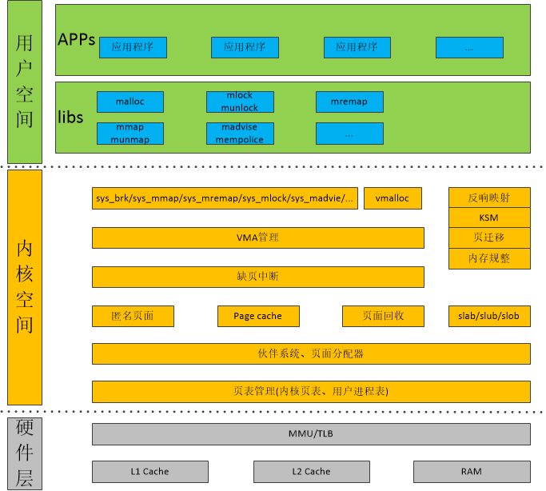

[TOC]

# 1 学习路线

很多Linux内存管理从**malloc**()这个C函数开始，从而知道**虚拟内存**。**虚拟内存是什么，怎么虚拟**？早期系统没有虚拟内存概念，**为什么**现代OS都有？要搞清楚虚拟内存，可能需要了解**MMU、页表、物理内存、物理页面、建立映射关系、按需分配、缺页中断和写时复制**等机制。

MMU，除了MMU工作原理，还会接触到Linux内核**如何建立页表映射**，其中也包括**用户空间页表的建立**和**内核空间页表**的建立，以及内核是如何**查询页表和修改页表**的。

当了解**物理内存**和**物理页面**时，会接触到**struct pg\_data\_t、struct zone和 struct page**等数据结构，这3个数据结构描述了系统中**物理内存的组织架构**。struct page数据结构除了描述一个4KB大小（或者其他大小）的物理页面外，还包含很多复杂而有趣的成员。

当了解**怎么分配物理页面**时，会接触到**伙伴系统机制**和**页面分配器**（**page allocator**),页面分配器是内存管理中最复杂的代码之一。

有了**物理内存**，那**怎么和虚拟内存建立映射关系**呢？在 Linux内核中，描述**进程的虚拟内存**用**struct vm\_area\_struct**数据结构。**虚拟内存**和**物理内存**采用**建立页表**的方法来**完成建立映射关系**。为什么**和进程地址空间建立映射的页面**有的叫**匿名页面**，而有的叫**page cache页面**呢？

当了解**malloc()怎么分配出物理内存**时，会接触到**缺页中断**，缺页中断也是内存管理中最复杂的代码之一。

这时，**虚拟内存和物理内存己经建立了映射关系**，这是**以页为基础**的，可是有时内核需要**小于一个页面**大小的内存，那么**slab机制**就诞生了。

上面己经建立起虚拟内存和物理内存的基本框图，但是如果用户**持续分配和使用内存**导致**物理内存不足**了怎么办？此时**页面回收机制**和**反向映射机制**就应运而生了。

虚拟内存和物理内存的映射关系经常是**建立后又被解除**了，时间长了，系统**物理页面布局变得凌乱**不堪，碎片化严重，这时内核如果需要**分配大块连续内存**就会变得很困难，那么**内存规整机制**（Memory Compaction) 就诞生了。

# 2 3种系统架构与2种存储器共享方式

从**系统架构**来看，目前的商用服务器大体可以分为三类

- 对称多处理器结构(SMP：Symmetric Multi\-Processor)

- 非一致存储访问结构(NUMA：Non\-Uniform Memory Access)

- 海量并行处理结构(MPP：Massive Parallel Processing)。

**共享存储型**多处理机有两种模型

- 均匀存储器存取（Uniform\-Memory\-Access，简称UMA）模型

- 非均匀存储器存取（Nonuniform\-Memory\-Access，简称NUMA）模型

## 2.1 SMP

服务器中**多个CPU对称工作**，**无主次或从属关系**。

**各CPU**共享**相同的物理内存**，**每个CPU**访问**内存中的任何地址**所需**时间是相同的**，因此SMP也被称为**一致存储器访问结构(UMA：Uniform Memory Access)**


**每个CPU**必须通过**相同的内存总线**访问**相同的内存资源**.

## 2.2 NUMA


NUMA服务器的基本特征是具有**多个CPU模块**，**每个CPU模块由多个CPU(如4个)组成**，并且具有独立的**本地内存、I/O槽口等**(这些**资源都是以CPU模式划分本地的，一个CPU模块可能有多个CPU！！！**)。

其**共享存储器**物理上是分布在**所有处理机的本地存储器上**。**所有本地存储器**的集合组成了**全局地址空间**，可被所有的处理机访问。**处理机**访问**本地存储器是比较快**的，但访问属于**另一台处理机的远程存储器**则比较**慢**，因为通过互连网络会产生附加时延。

## 2.3 MPP

其基本特征是由多个SMP服务器(**每个SMP服务器称节点**)通过**节点互联网络**连接而成，**每个节点只访问自己的本地资源**(内存、存储等)，是一种完全**无共享(Share Nothing)结构**，协同工作，**完成相同的任务**. **在MPP系统中，每个SMP节点也可以运行自己的操作系统、数据库等**。**每个节点内的CPU不能访问另一个节点的内存**。

目前业界对**节点互联网络暂无标准**

# 3 内存空间分层

内存空间分三层




| 层次 | 描述 |
|:---:|:----|
| **用户空间层** |可以理解为Linux 内核内存管理**为用户空间暴露的系统调用接口**. 例如**brk**(), **mmap**()等**系统调用**. 通常libc库会将系统调用封装成大家常见的C库函数, 比如malloc(), mmap()等. |
| **内核空间层** | 包含的模块相当丰富, 用户空间和内核空间的接口时系统调用, 因此内核空间层首先需要处理这些内存管理相关的系统调用, 例如sys\_brk, sys\_mmap, sys\_madvise等. 接下来就包括VMA管理, 缺页中断管理, 匿名页面, page cache, 页面回收, 反向映射, slab分配器, 页面管理等模块. |
| **硬件层** | 包含**处理器**的**MMU**, **TLB**和**cache**部件, 以及板载的**物理内存**, 例如LPDDR或者DDR |

# 4 Linux物理内存组织形式

Linux把**物理内存**划分为**三个层次**来管理

| 层次 | 描述 |
|:----|:----|
| **存储节点(Node**) |  CPU被划分为**多个节点(node**), **内存则被分簇**, **每个CPU**对应一个**本地物理内存**, 即**一个CPU\-node**对应一个**内存簇bank**，即**每个内存簇**被认为是**一个节点** |
| **管理区(Zone**)   | **每个物理内存节点node**被划分为**多个内存管理区域**, 用于表示**不同范围的内存**, 内核可以使用**不同的映射方式(！！！**)映射物理内存 |
| **页面(Page**) | 内存被细分为**多个页面帧**, **页面**是**最基本的页面分配的单位**　｜

pg\_data\_t对应一个node，node\_zones包含了不同zone；**zone**下又**定义了per\_cpu\_pageset**，将**page和cpu绑定**。

## 4.1 Node

为了支持**NUMA模型**，也即CPU对不同内存单元的访问时间可能不同，此时系统的物理内存被划分为几个节点(node), 一个node对应一个内存簇bank，即每个内存簇被认为是一个节点

CPU被划分为**结点**, **内存**则被**分簇**, 每个CPU对应一个本地物理内存, 即一个CPU-node对应一个内存簇bank，即每个内存簇被认为是一个节点.

Linux使用**struct pglist\_data**描述一个**node**(typedef pglist\_data pg\_data\_t)

NUMA系统, 定义了一个**大小为MAX\_NUMNODES类型为pg\_data\_t**的**指针数组node\_data**,数组的大小根据**CONFIG\_NODES\_SHIFT**的配置决定.

对于UMA来说，NODES\_SHIFT为0，所以MAX\_NUMNODES的值为1.  只使用了struct pglist\_data **contig\_page\_data**.

可以使用NODE\_DATA(node\_id)来查找系统中编号为node\_id的结点

```c
[[arch/x86/include/asm/mmzone_64.h]]
extern struct pglist_data *node_data[];
#define NODE_DATA(nid)          (node_data[(nid)])
```

UMA结构下由于只有一个结点, 因此该宏总是返回**全局的contig\_page\_data**.

在**分配一个页面**时, Linux采用节点**局部分配的策略**,从最靠近运行中的CPU的节点分配内存,由于**进程往往是在同一个CPU上运行**, 因此**从当前节点**得到的内存很可能被用到.


## 4.2 zone

因为实际的**计算机体系结构**有**硬件的诸多限制**, 这限制了页框可以使用的方式. 尤其是, Linux内核必须处理**80x86体系结构**的**两种硬件约束**.

- **ISA总线的直接内存存储DMA**（**DMA操作！！！**）处理器有一个严格的限制 : 他们**只能对RAM的前16MB进行寻址**

- 在具有大容量RAM的现代**32位计算机**中, CPU**不能**直接访问**所有的物理地址**, 因为**线性地址空间太小**, 内核不可能直接映射**所有物理内存**到**线性地址空间**.

因此对于内核来说, 不同范围的物理内存采用不同的管理方式和映射方式

1. ZONE\_DMA: 这个区包含的**页**用来执行**DMA操作**。

2. ZONE\_NOMAL: 这个区包含的都是能**正常映射的页**。

3. ZONE\_HIGHEM: 这个区"高端内存"，其中的**页**不能永久地映射到**内核地址空间**（**虚拟地址空间！！！**）

而为了兼容一些**设备的热插拔支持**以及**内存碎片化**的处理, 内核也引入一些**逻辑上**的内存区.

1. ZONE\_MOVABLE: 内核定义了一个**伪内存域ZONE\_MOVABLE**, **在防止物理内存碎片的机制memory migration**中需要使用该内存域. 供防止物理内存碎片的极致使用

2. ZONE\_DEVICE: 为支持**热插拔设备**而分配的Non Volatile Memory非易失性内存

- 各个节点又被划分为内存管理区域, 一个**管理区域**通过**struct zone\_struct**描述, 其被定义为**zone\_t**, 用以表示内存的某个范围,**低端范围的16MB**被描述为**ZONE\_DMA**,某些**工业标准体系结构中的(ISA)设备**需要用到它,然后是可**直接映射到内核**的**普通内存域ZONE\_NORMAL**,最后是超出了内核段的物理地址域ZONE\_HIGHMEM, 被称为高端内存. 是系统中预留的可用内存空间, 不能被内核直接映射.

- 最后**页帧(page frame**)代表了系统内存的最小单位, 堆内存中的每个页都会创建一个struct page的一个实例. 传统上，把内存视为连续的字节，即内存为字节数组，内存单元的编号(地址)可作为字节数组的索引. 分页管理时，将若干字节视为一页，比如4K byte. 此时，内存变成了连续的页，即内存为页数组，每一页物理内存叫页帧，以页为单位对内存进行编号，该编号可作为页数组的索引，又称为页帧号.

在一个**单独的节点**内，**任一给定CPU**访问页面**所需的时间都是相同**的。然而，对**不同的CPU**，这个时间可能就不同。对每个CPU而言，内核都试图把耗时节点的访问次数减到最少这就要小心地选择CPU最常引用的内核数据结构的存放位置.


# 2 物理内存初始化

