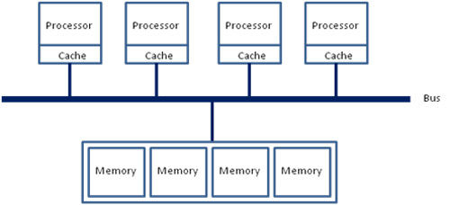
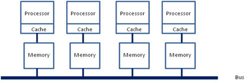

<!-- @import "[TOC]" {cmd="toc" depthFrom=1 depthTo=6 orderedList=false} -->

<!-- code_chunk_output -->

* [1 相关内容](#1-相关内容)
* [2 Intel处理器变化历史](#2-intel处理器变化历史)
	* [2.1 UMA](#21-uma)
	* [2.2 NUMA](#22-numa)
	* [2.2.1](#221)
* [3 Linux](#3-linux)
* [参考](#参考)

<!-- /code_chunk_output -->

# 1 相关内容

- [Linux的NUMA机制](https://link.zhihu.com/?target=http%3A//www.litrin.net/2014/06/18/linux%25e7%259a%2584numa%25e6%259c%25ba%25e5%2588%25b6/)
- [NUMA对性能的影响](https://link.zhihu.com/?target=http%3A//www.litrin.net/2017/08/03/numa%25e5%25af%25b9%25e6%2580%25a7%25e8%2583%25bd%25e7%259a%2584%25e5%25bd%25b1%25e5%2593%258d/)
- [cgroup的cpuset问题](https://link.zhihu.com/?target=http%3A//www.litrin.net/2016/05/18/cgroup%25e7%259a%2584cpuset%25e9%2597%25ae%25e9%25a2%2598/)

# 2 Intel处理器变化历史

## 2.1 UMA

在若干年前，对于x86架构的计算机，那时的**内存控制器还没有整合进CPU**，所有**内存的访问**都需要通过**北桥芯片**来完成。此时的内存访问如下图所示，被称为**UMA（uniform memory access, 一致性内存访问**）。这样的访问对于**软件层面**来说非常**容易**实现：**总线模型**保证了**所有的内存访问是一致的**，不必考虑由不同内存地址之前的差异。

## 2.2 NUMA

之后的x86平台经历了一场从“**拼频率**”到“**拼核心数**”的转变，越来越多的**核心**被尽可能地塞进了**同一块芯片**上，**各个核心**对于**内存带宽的争抢**访问成为了瓶颈；此时软件、OS方面对于SMP多核心CPU的支持也愈发成熟；再加上各种商业上的考量，x86平台也顺水推舟的搞了**NUMA（Non-uniform memory access, 非一致性内存访问**）。

## 2.2.1 

在这种架构之下，**每个Socket**都会有一个**独立的内存控制器IMC（integrated memory controllers, 集成内存控制器**），分属于**不同的socket**之内的**IMC之间**通过**QPI link**通讯。

然后就是进一步的架构演进，由于**每个socket**上都会有**多个core**进行内存访问，这就会在 **每个core(每个socket内部？？？！！！**) 的 **内部** 出现一个**类似最早SMP架构**相似的**内存访问总**线，这个总线被称为**IMC bus**。即, 每个socket内部是SMP的, 不同socket是NUMA的

于是，很明显的，在这种架构之下，**两个socket**各自管理**1/2的内存插槽**，如果要访问**不属于本socket的内存**则必须通过**QPI link**。也就是说**内存的访问**出现了**本地/远程（local/remote**）的概念，内存的延时是会有显著的区别的。这也就是之前那篇文章中提到的为什么NUMA的设置能够明显的影响到JVM的性能。

回到当前世面上的CPU，工程上的实现其实更加复杂了。以[Xeon 2699 v4系列CPU的标准](https://link.zhihu.com/?target=https%3A//ark.intel.com/products/96899/Intel-Xeon-Processor-E5-2699A-v4-55M-Cache-2_40-GHz)来看，**两个Socket**之之间通过各自的一条**9.6GT/s的QPI link互访**。而**每个Socket里面！！！** 事实上有 **2个内存控制器！！！**。**双通道**的缘故，**每个控制器**又有**两个内存通道（channel**），**每个通道**最多支持**3根内存条（DIMM**）。理论上最大**单socket**支持**76.8GB/s的内存带宽**，而**两个QPI link**，每个**QPI link**有**9.6GT/s**的速率（\~57.6GB/s）事实上QPI link已经出现瓶颈了。所以出现了UPI总线。

嗯，事情变得好玩起来了。

**核心数**还是源源不断的**增加**，Skylake桌面版本的i7 EE已经有了**18个core**，下一代的Skylake Xeon妥妥的28个Core。为了塞进更多的core，原本核心之间类似环网的设计变成了复杂的路由。由于这种架构上的变化，导致内存的访问变得更加复杂。**两个IMC(也就是同一个socket里面！！！**)也有了**local/remote**的区别，在保证兼容性的前提和性能导向的纠结中，系统允许用户进行更为灵活的**内存访问架构划分**。于是就有了“**NUMA之上的NUMA**”这种妖异的设定（**SNC**）。

# 3 Linux

回到Linux，内核mm/mmzone.c, include/linux/mmzone.h文件定义了NUMA的数据结构和操作方式。

# 参考

- 本文来自于知乎专栏, 链接: https://zhuanlan.zhihu.com/p/33621500?utm_source=wechat_session&utm_medium=social&utm_oi=50718148919296