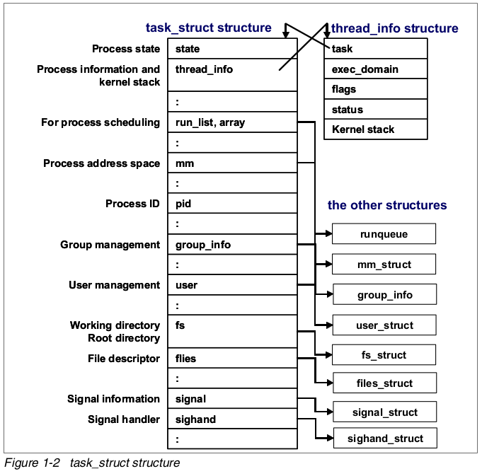
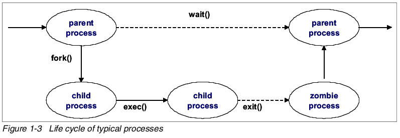

[TOC]

# 1 什么是进程

进程是在处理器中执行的实例，内核调度各类资源来满足进程的需求。

所有运行在Linux操作系统的进程都被task\_struct这个结构体管理，task\_struct也被称为进程描述符。进程描述符包含一个进程运行所需的所有信息，比如进程的id、进程的属性以及构建进程的资源。

# 2 进程的生命周期

下图展示了一般进程的生命周期

当一个进程**创建一个新的进程**，创建进程的进程（父进程）使用名为**fork**()的系统调用。当fork()被调用的时候，它会为**新创建的进程（子进程**）获得一个**进程描述符**，并且设置**新的进程ID**。复制父进程的进程描述符给子进程。这时候，**不会复制父进程的地址空间**，而是父子进程使用同样的地址空间。

**exec**()系统调用**把新程序复制到子进程的地址空间**。由于共享同样的地址空间，**写入新进程的数据**会引发**页错误的异常**。此时，内核给子进程分配**新的物理页**。

这个延迟的操作叫做Copy On Write。子进程和父进程执行的程序通常不一样，它执行自己的程序。这个操作避免了不必要的开销，因为，**复制整个地址空间**是很慢且低效率的，还会**消耗很多的处理器时间和资源**。

当程序**执行完成**，子进程使用**exit**()系统调用**终止**。exit()会**释放进程的大部分数据结构**，并且把这个**终止的消息通知给父进程**。这时候，**子进程**被称为**zombie process(僵尸进程**)。

直到**父进程**通过**wait**()系统调用**知悉子进程终止之前**，子进程都**不会被完全的清除(！！！**)。一旦父进程知道子进程终止，它会清除子进程的所有数据结构和进程描述符。

# 3 线程

线程是单个进程中生成的执行单元。多个线程在同一个进程中并发运行。它们共享内存、地址空间、打开文件等等资源。还能访问同样的应用数据集。线程也被称为轻量级进程（Light Weight Process）。由于**线程间共享资源**，线程**不能同时**改变它们**共享的资源**。**互斥**、**锁**、**序列化**等等都是由**用户应用程序**来实现。

从**性能**的角度看，创建**线程**比创建**进程**更加**低消耗**，因为创建线程不需要复制资源。另一方面，从进程和线程在调度上看，他们拥有相似的行为。内核用类似的方法来处理他们。

 

在当前的Linux实现中，线程由POSIX（Portable Operating System Interface for UNIX，可移植操作系统接口）的兼容库(pthread)提供。Linux支持多线程。如下是已经被广泛使用的。

