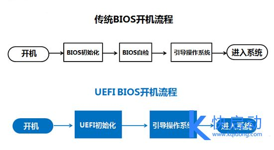

https://zhuanlan.zhihu.com/p/22510295

GPT+UEFI是近年来流行的一种U盘装系统模式，与传统的Bios+MBR相比具有着更好的可操作性、安全性、兼容性、可扩展性等诸多优点，对此快启动U盘启动盘制作工具的UEFI版应运而生，同时还支持GPT分区，但是，GPT+UEFI与BIOS+MBR究竟有什么区别，因此整理了以下关于GPT+UEFI与BIOS+MBR一些明显的区别之处:

#### 不同点：

1. BIOS+MBR安装系统要求硬盘只要存在**非隐藏、活动的主分区**就可以了；而UEFI+GPT要求硬盘上除了存在**ESP分区**，还必须**存在至少一个主分区**；

2. BIOS+MBR一旦系统安装好之后，如果系统引导文件在单独的分区，此分区可以在操作系统中可见，也可以设置此分区为隐藏，系统都可以正常启动；而UEFI+GPT系统引导文件所在的ESP分区在操作系统中为不可见；

3. BIOS+MBR启动要求的活动的主分区不是唯一固定的，可以任意设定某一分区为活动的主分区，然后MBR就可以通过分区表指引操作系统从此分区启动，也就是说，可以在任意分区（主分区无论是否活动或者扩展分区）安装操作系统，只要存在任意的活动主分区，就可以从此分区启动操作系统；而UEFI+GPT只能把系统引导文件放置在ESP分区；

4.BIOS+MBR的系统引导文件可以和系统文件在同一分区的根目录，也可以不与系统文件同一分区，只要系统引导文件所在分区为活动的主分区即可启动操作系统；而UEFI+GPT只能把系统引导文件放置在ESP分区，且操作系统必须在另外的主分区，也就是说，UEFI+GPT强制要求系统启动文件与系统文件必须分离，不在同一分区；

5.从上图可知，理论上GPT+UEFI比BIOS+MBR模式的开机速度更快，但事实上并不明显。