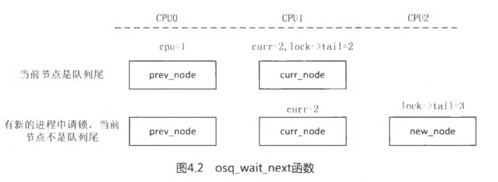

[TOC]

# 0 概述

思考如下问题.

- Linux内核已经实现了信号量机制，为何要单独设置一个**Mutex机制**呢？
- 请简述**MCS锁**机制的实现原理。
- 在编写内核代码时，该如何选择**信号量**和**Mutex**?

在**Linux内核**中，**除信号量以外**，还有一个类似的实现叫作**互斥体Mutex**。**信号量**是在**并行处理环境**中对**多个处理器**访问**某个公共资源**进行**保护的机制**，**Mutex**用于**互斥操作**。

信号量根据**初始化count的大小**，可以分为**计数信号量**和**互斥信号量**。根据操作系统书籍上著名的**洗手间理论**，**信号量**相当于一个可以**同时容纳N个人的洗手间**，只要人不满就可以进去，如果人满了就要在外面等待。 Mutex类似街社的**移动洗手间**，每次只能**一个人进去**，里面的人出来后才能让排队中的下一个人使用。那既然**Mutex类似count计数等于1的信号量**，为什么内核社区要重新开发Mutex, 而不是复用信号量的机制呢？

Mutex最早是在Linux 2.6.16中由RedHat公司的资源内核专家 Ingo Molnar 设计和实现的。信号量的count成员可以初始化为1，并且DOWN和UP操作也可以实现类似Mutex的作用，那为什么要单独实现Mutex机制呢？在设计之初，Ingo Molnar解释信号量在Linux内核中的实现没有任何问题，但是**Mutex的语义**相对于信号量要**简单轻便一些**，在锁争用激烈的测试场景下，**Mutex比信号量执行速度更快**，可扩展性更好，另外**Mutex数据结构的定义比信号量小**，这些都是在Mutex设计之初 Ingo Molnar 提到的优点。Mutex上的一些优化方案己经移植到了读写信号量中，例如自旋等待已应用在读写信号量上。

下面来看Mutex数据结构的定义。

```c
[include/linux/mutex.h]
struct mutex {
	/* 1: unlocked, 0: locked, negative: locked, possible waiters */
	atomic_t		count;
	spinlock_t		wait_lock;
	struct list_head	wait_list;
#if defined(CONFIG_MUTEX_SPIN_ON_OWNER)
	struct task_struct	*owner;
#endif
#ifdef CONFIG_MUTEX_SPIN_ON_OWNER
	struct optimistic_spin_queue osq; /* Spinner MCS lock */
#endif
};
```

- count: 原子计数，1 表示没人持有锁；0 表示锁被持有；负数表示**锁被持有**且**有人在等待队列中等待**。
- wait\_lock: **spinlock锁**，用于**保护wait\_list睡眠等待队列**。
- wait_list: 用于管理所有**在该Mutex上睡眠的进程**，没有成功获取锁的进程会睡眠在此链表上。
- owner: 要打开**CONFIG\_MUTEX\_SPIN\_ON\_OWNER**选项才会有owner, 用于指向**锁持有者的task\_struct数据结构**。
- osq: 用于实现MCS锁机制。

**Mutex**实现了**自旋等待的机制(optimistic spinning**)，准确地说，应该是Mutex比读写信号量更早地实现了自旋等待机制。**自旋等待机制**的核心原理是当发现**持有锁者正在临界区执行**并且**没有其他优先级高的进程**要被调度(need\_resched)时，那么**当前等待进程**坚信锁持有者会很快离开临界区并释放锁，因此与其睡眠等待不如乐观地自旋等待，以**减少睡眠唤醒的开销**。在实现自旋等待机制时，内核实现了一套**MCS锁机制**来保证**只有一个人自旋等待持锁者释放锁**。

# 1 MCS锁机制

**MCS锁**是一种**自旋锁的优化方案**，它是由两个发明者Mellor\-Crummey和 Scott的名字来命名的. 自旋锁是Linux内核使用最广泛的一种锁机制.在Linux 2.6.25内核中**自旋锁**已经采用**排队自旋算法**进行优化，以**解决早期自旋锁争用不公平**的问题。但是在**多处理器和NUMA系统**中，**排队自旋锁**仍然存在一个**比较严重的问题**。假设在一个锁争用激烈的系统中，**所有自旋等待锁的线程**都在**同一个共享变量**上**自旋**，**申请和释放锁**都在**同一个变量**上修改，由**cache—致性原理(例如MESI协议**)导致**参与自旋的CPU**中的**cache line变得无效**。在锁争用激烈过程中，导致严重的**CPU高速缓存行颠簸现象(CPU cacheline bouncing**)现象，即**多个CPU上的cache line反复失效**，大大降低系统整体性能。

MCS算法可以解决自旋锁遇到的问题，显著**减少CPU cacheline bouncing问题**。MCS算法的核心思想是**每个锁的申请者**只在**本地CPU**的**变量上自旋**，而**不是全局的变量**。虽然MCS算法的设计是**针对自旋锁**的，但是目前Linux 4.0内核中依然**没有把MCS算法用在自旋锁**上，其中一个很重要的原因是**MCS算法的实现**需要**比较大的数据结构**，而**spinlock**常常嵌入到系统中一些比较**关键的数据结构**中，例如物理页面数据结构struct page, 这类数据结构对**大小相当敏感**，因此目前**MCS算法**只用在**读写信号量**和**Mutex的自旋等待机制**中。Linux内核版本的**MCS锁**最早是由社区专家Waiman Long在 Linux 3.10中实现的, 后来经过其他的社区专家的不断优化后成为现在的**osq\_lock**, 可以说**OSQ锁**是**MCS锁机制**的**一个具体的实现**，本节内容混用了这两个概念。

MCS锁本质上是一种**基于链表结构的自旋锁**，OSQ锁的实现需要**两个数据结构**。

```c
[include/linux/osq_lock.h]
struct optimistic_spin_node {
	struct optimistic_spin_node *next, *prev;
	int locked; /* 1 if lock acquired */
	int cpu; /* encoded CPU # + 1 value */
};

struct optimistic_spin_queue {
	/*
	 * Stores an encoded value of the CPU # of the tail node in the queue.
	 * If the queue is empty, then it's set to OSQ_UNLOCKED_VAL.
	 */
	atomic_t tail;
};
```

**每个MCS锁**有一个**optimistic\_spin\_queue**数据结构，该数据结构只有一个成员**tail，初始化为0**。struct optimistic\_spin\_node数据结构表示**本地CPU上的节点**，它可以组织成一个**双向链表**，包含**next和prev指针**，lock成员用于表示**加锁状态**，cpu成员用于**重新编码CPU编号**，表示该node是在哪个CPU上。**struct optimistic\_spin\_node**数据结构会定义成**per\-CPU变量**，即**每个CPU有一个node结构**。

```c
[kernel/locking/osq_lock.c]
static DEFINE_PER_CPU_SHARED_ALIGNED(struct optimistic_spin_node, osq_node);
```

MCS锁在osq\_lock\_init()函数中初始化，例如Mutex初始化时会初始化一个MCS锁, 详见\_\_mutex\_init()函数中的osq\_lock\_init()函数。

```c
[kernel/locking/mutex.c]
void
__mutex_init(struct mutex *lock, const char *name, struct lock_class_key *key)
{
	atomic_set(&lock->count, 1);
	spin_lock_init(&lock->wait_lock);
	INIT_LIST_HEAD(&lock->wait_list);
	mutex_clear_owner(lock);
#ifdef CONFIG_MUTEX_SPIN_ON_OWNER
	osq_lock_init(&lock->osq);
#endif

	debug_mutex_init(lock, name, key);
}
EXPORT_SYMBOL(__mutex_init);

[include/linux/osq_lock.h]
static inline void osq_lock_init(struct optimistic_spin_queue *lock)
{
	atomic_set(&lock->tail, OSQ_UNLOCKED_VAL);
}
```

osq\_lock()函数用于**申请MCS锁**，下面来看该函数是如何实现的。

```c
[kernel/locking/osq_lock.c]
bool osq_lock(struct optimistic_spin_queue *lock)
{
    // 位置1
	struct optimistic_spin_node *node = this_cpu_ptr(&osq_node);
	struct optimistic_spin_node *prev, *next;
	// 位置2
	int curr = encode_cpu(smp_processor_id());
	int old;

	node->locked = 0;
	node->next = NULL;
	node->cpu = curr;
    // 位置3
	old = atomic_xchg(&lock->tail, curr);
	if (old == OSQ_UNLOCKED_VAL)
		return true;
```

位置1, node指向**当前CPU**的struct optimistic\_spin\_node节点。

位置2，struct optimistic\_spin\_node数据结构中**cpu成员**用于表示**CPU编号**，它的**编号方式和CPU编号方式不太一样**，**0表示没有CPU** , **1表示CPU0**, 以此类推。

位置3，使用**原子交换函数atomic\_xchg**()交换**全局lock->tail和当前CPU编号**，如果**lock->tail的旧值等于初始化值OSQ\_UNLOCKED\_VAL**(值为0), 说明还**没有人持有锁**，那么让**lock\->tail等于当前CPU编号**表示**当前CPU成功持有了锁**，这是最快捷的方式。如果lock\->tail的旧值**不等于**OSQ\_UNLOCICED\_VAL, 获取锁失败。下面看看**如果没能成功获取锁**的情况，即**lock\->tail的值指向其他CPU编号**，说明**有人持有了该锁**。

```c
[osq_lock()]
    prev = decode_cpu(old);
    // 位置1
	node->prev = prev;
	ACCESS_ONCE(prev->next) = node;

    // 位置2
	while (!ACCESS_ONCE(node->locked)) {
		/*
		 * If we need to reschedule bail... so we can block.
		 */
		// 位置3
		if (need_resched())
			goto unqueue;

		cpu_relax_lowlatency();
	}
	return true;
```

之前获取锁失败，变量old的值（**lock->tail的旧值**）指向某个CPU编号，那么**decode\_cpu**()函数返回的是**变量old指向的CPU所属的节点**。

位置1后两行代码, 把**当前curr\_node节点**插入**MCS链表**中，**当前节点**curr\_node\->prev指向**前继节点**，而前继节点prev\_node\->next指向当前节点。

位置2，**while循环**一直**查询当前节点curr\_node->locked是否变成了1**，因为**前继节点prev\_node释放锁**时会把它的**下一个节点中的locked成员设置为1(！！！**)，然后才能成功**释放锁**。在理想情况下，**前继节点释放锁**，那么**当前进程也退出自旋**，返回true。

位置3，在**自旋等待过程**中，如果有**更高优先级进程抢占**或者**被调度器要求调度出去**，那应该**放弃自旋等待**，**退出MCS链表(！！！**)，跳转到unqueue标签处处理**MCS链表删除节点**的情况。unqueue标签处是异常情况处理，正常情况是要在while循环中等待锁。

OSQ锁的实现比较复杂的原因在于**OSQ锁**必须要处理**need\_resched**()的异常情况，否则可以设计得很简洁。

unqueue标签处实现**删除链表操作**，这里仅仅使用了原子比较交换指令，并没有使用其他的锁，这是无锁并发编程的精髓体现。

```c
[osq_lock()]
unqueue:
	/*
	 * Step - A  -- stabilize @prev
	 *
	 * Undo our @prev->next assignment; this will make @prev's
	 * unlock()/unqueue() wait for a next pointer since @lock points to us
	 * (or later).
	 */

	for (;;) {
	    // 位置1
		if (prev->next == node &&
		    cmpxchg(&prev->next, node, NULL) == node)
			break;

		/*
		 * We can only fail the cmpxchg() racing against an unlock(),
		 * in which case we should observe @node->locked becomming
		 * true.
		 */
		// 位置2
		if (smp_load_acquire(&node->locked))
			return true;

		cpu_relax_lowlatency();

		/*
		 * Or we race against a concurrent unqueue()'s step-B, in which
		 * case its step-C will write us a new @node->prev pointer.
		 */
		// 位置3
		prev = ACCESS_ONCE(node->prev);
	}

	/*
	 * Step - B -- stabilize @next
	 *
	 * Similar to unlock(), wait for @node->next or move @lock from @node
	 * back to @prev.
	 */

	next = osq_wait_next(lock, node, prev);
	if (!next)
		return false;

	/*
	 * Step - C -- unlink
	 *
	 * @prev is stable because its still waiting for a new @prev->next
	 * pointer, @next is stable because our @node->next pointer is NULL and
	 * it will wait in Step-A.
	 */

	ACCESS_ONCE(next->prev) = prev;
	ACCESS_ONCE(prev->next) = next;

	return false;
```

删除MCS链表节点分为3步.

(1) 解除前继节点(prev\_node)的next指针的指向.

(2) 解除当前节点(curr\_node)的next指针的指向，并且找出当前节点下一个确定的节点next\_node。

(3) 让前继节点prev\_node\->next指向next\_node，next\_node\->prev指针指向prev\_node.

位置1, prev\_node节点是之前获取的前继节点。如果前继节点的next指针指向当前节点，说明这期间还没有人来修改链表，接着用cmpxchg()函数原子地判断前继节点的next指针是否指向当前节点。如果是，则把prev\->next指针指向NULL，并且判断返回的前继节点的next指针是否指向当前节点。如果上述判断都正确，那么就达到步 骤 （1 ) 解除前继节点next指针指向的目的了。

位置2，如果上述原子比较并交换指令判断失败，说明这期间有人修改了MCS链表。利用这个间隙，smp\_load\_acquire()宏再一次判断当前节点是否持有了锁。smp\_load\_acquire()宏定义如下：

```c
[arch/arm/include/asm/barrier.h]
#define smp_load_acquire(p)						\
({									\
	typeof(*p) ___p1 = ACCESS_ONCE(*p);				\
	compiletime_assert_atomic_type(*p);				\
	smp_mb();							\
	___p1;								\
})
```

ACCESS\_ONCE()宏使用volatile关键字强制重新加载p的值，smp\_mb()保证内存屏障之前的读写指令都执行完毕。如果这时判断当前节点curr\_node->locked为1，说明当前节点持有了锁，返回true。读者可能会有疑问，为什么当前节点莫名其妙地持有了锁呢？这是前继节点释放锁并且把锁传递给当前节点的。

位置3, 之前cmpxchg()判断失败说明当前节点的前继节点prev\_node发生了变化，这里重新加载新的前继节点，继续下一次循环。

步骤(1)是处理前继节点prev\_node的next指针指向问题，步骤(2)处理当前节点curr\_node的 next指针指向问题，关键实现是在osq\_wait\_next()函数里。

```c
[osq_lock() ->osci_wait_next()]
[kernel/locking/osq_lock.c]

static inline struct optimistic_spin_node *
osq_wait_next(struct optimistic_spin_queue *lock,
	      struct optimistic_spin_node *node,
	      struct optimistic_spin_node *prev)
{
	struct optimistic_spin_node *next = NULL;
	int curr = encode_cpu(smp_processor_id());
	int old;

	old = prev ? prev->cpu : OSQ_UNLOCKED_VAL;

	for (;;) {
	    // 位置1
		if (atomic_read(&lock->tail) == curr &&
		    atomic_cmpxchg(&lock->tail, curr, old) == curr) {
			break;
		}
        // 位置2
		if (node->next) {
			next = xchg(&node->next, NULL);
			if (next)
				break;
		}

		cpu_relax_lowlatency();
	}

	return next;
}
```

变量curr指当前进程所在的CPU编号，变量old指前继节点prev\_node所在的CPU编号。如果前继节点为空，那么old值为0。

位置1, 判断当前节点curr\_node是否为MCS链表中的最后一个节点，如果是，说明当前节点是队列尾，即没有后继节点，直接返回next为NULL。为什么利用原子地判断lock\->tail值是否等于curr即可判断当前节点是否在队列尾呢？

如图4.2所示，如果当前节点curr\_node是MCS链表的队列尾，curr值和lock\->tail值相等。如果在这期间有人正在申请锁，那么curr值为2, 但是lock\->tail值会变成其他值，这是osq\_lock()函数的第11行代码中的atomic\_xchg()函数修改了lock\->tail值。如图4.2所示，CPU2 加入该锁的争斗，lock\->tail=3。



位置2, 如果当前节点curr\_node有后继节点，那么把当前节点curr\_node\->next指针设置为NULL，解除当前节点next指针的指向，并且返回后继节点next\_node，这样就完成了步骤(2)的目标。第23行的cpu\_relax\_lowlatency()函数在ARM中是一条barrier()指令。

步骤(3), 后继节点next\_node的prev指针指向前继节点prev\_node，前继节点prev\_node的next指针指向后继节点next\_node，这样就完成了当前节点curr\_node脱离MCS链表的操作。最后返回false, 因为没有成功获取锁。

如图4.3所示是MCS锁的架构图。


接下来看MCS锁是如何解锁的。

```c
[kernel/locking/osq_lock.c]
void osq_unlock(struct optimistic_spin_queue *lock)
{
	struct optimistic_spin_node *node, *next;
	int curr = encode_cpu(smp_processor_id());

	/*
	 * Fast path for the uncontended case.
	 */
	// 位置1
	if (likely(atomic_cmpxchg(&lock->tail, curr, OSQ_UNLOCKED_VAL) == curr))
		return;

	/*
	 * Second most likely case.
	 */
	node = this_cpu_ptr(&osq_node);
	next = xchg(&node->next, NULL);
	if (next) {
		ACCESS_ONCE(next->locked) = 1;
		return;
	}

	next = osq_wait_next(lock, node, NULL);
	if (next)
		ACCESS_ONCE(next->locked) = 1;
}
```

位置1, 如果lock\->tail保存的CPU编号正好是当前进程的CPU编号，说明没有人来竞争该锁，那么直接把lock->tail设置为0 释放锁，这是最理想的情况，代码中把此情况描述为“fastpath”快车道。注意此处依然要使用原子比较交换函数atomic\_cmpxchg()。

下面进入慢车道，首先当前节点的next指针指向NULL。如果当前节点有后继节点，那么把后继节点next_n〇de->locked 成员设置为1 , 相当于把锁传递给后继节点，这里相当于告诉后继节点，锁己经传递给你了。

如果后继节点next\_node为空，说明在执行osq\_unlock()期间有人擅自离队，那么只能调用osq\_wait\_next()函数来确定或者等待确定的后继节点，也许当前节点就在队列尾，当然也会有“后继无人”的情况。

# 2 Mutex锁的实现

**Mutex锁的初始化**有两种方式，一种是**静态使用DEFINE\_MUTEX宏**，另一种是在内核代码中**动态使用mutex\_init()函数**。

```c
[include/linux/mutex.h]
#define DEFINE_MUTEX(mutexname) \
	struct mutex mutexname = __MUTEX_INITIALIZER(mutexname)
	
#define __MUTEX_INITIALIZER(lockname) \
		{ .count = ATOMIC_INIT(1) \
		, .wait_lock = __SPIN_LOCK_UNLOCKED(lockname.wait_lock) \
		, .wait_list = LIST_HEAD_INIT(lockname.wait_list) 
		}
```

看mutex\_lock()函数是如何实现的。

```c
[include/linux/mutex.c]

```

进入申请Mutex锁的快车道的条件是count计数原子地减1后等于0。如果count计数原子地减1之后小于0，说明该锁己经被人持有，那么要进入慢车道\_\_mutex\_lock\_slowpath()。第8行代码，mutex\_set\_owner()和读写信号量一样，在成功持有锁之后要设置lock\->owner指向当前进程的task\_struct数据结构。

\_\_mutex_lock_slowpath()函数调用_ mutex_lock_common()来实现。