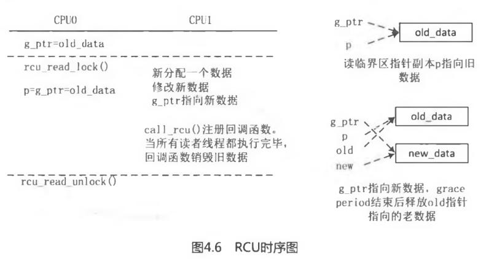
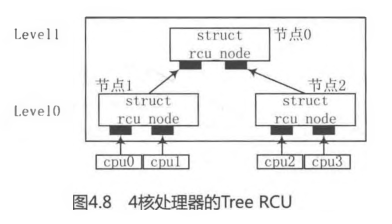
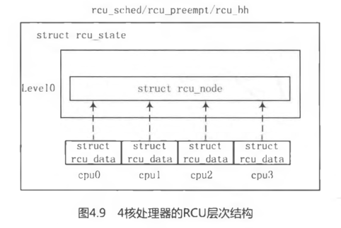

[TOC]

在阅读本节前请思考如下小问题。

- RCU相比读写锁有哪些优势？
- 请解释Quiescent State和Grace Period。
- 请简述RCU实现的基本原理。
- 在大型系统中，经典RCU遇到了什么问题？ Tree RCU又是如何解决该问题的？
- 在RCU实现中，为什么要使用ULONG\_CMP\_GE()和ULONG\_CMP\_LT()宏来比较两个数的大小，而不直接使用大于号或者小于号来比较？
- 请简述一个Grace Period的生命周期及其状态机的变化。

# 0 概述

RCU全称**read\-copy\-update**，是 Linux内核中一种重要的**同步机制**。

Linux内核中己经有
了**原子操作**、**spinlock**、**读写spinlock**、**读写信号量**、**mutex**等锁机制，为什么要单独设计一个比它们实现要复杂得多的新机制呢？

回忆**spinlock**、**读写信号量**和**mutex**的实现，它们都使用了**原子操作指令**，即**原子地访问内存**，**多CPU**争用**共享的变量**会让**cache—致性变得很糟(！！！**)，使得**性能下降**。

以**读写信号量**为例，除了**上述缺点**外，读写信号量还有一个**致命弱点**，它**只允许多个读者同时存在**，但是**读者和写者不能同时存在(！！！**)。

那么**RCU机制要实现的目标**是，希望**读者线程(！！！)没有同步开销**，或者说**同步开销变得很小**，甚至可以忽略不计，**不需要额外的锁**，不需要使用**原子操作**指令和**内存屏障**，即可**畅通无阻地访问(！！！**)；而把需要**同步的任务**交给**写者线程(！！！**)，**写者线程**等待**所有读者线程**完成后才会把**旧数据销毁**。在RCU中，如果有**多个写者(！！！**)同时存在，那么需要**额外的保护机制(！！！**)。

RCU机制的**原理**可以概括为**RCU记录**了**所有指向共享数据的指针的使用者**，当要**修改**该共享数据时，首先**创建一个副本**，在**副本中修改**。**所有读访问线程**都离开读临界区之后，**指针**指向新的**修改后副本的指针**，并且**删除旧数据**。

RCU的一个重要的应用场景是**链表**，有效地**提高遍历读取数据的效率**。**读取链表**成员数据时通常只需要**rcu\_read\_lock**(), 允许**多个线程(！！！)同时读取该链表**，并且允许**一个线程(！！！**)同时**修改链表**。那为什么这个过程能**保证链表访问的正确性**呢？

在**读者遍历链表**时，假设**另外一个线程删除了一个节点**。**删除线程**会把这个**节点从链表中移出**，但**不会直接销毁**它。RCU会等到**所有读线程读取**完成后，才会**销毁**这个节点。

RCU提供的接口如下。

- rcu\_read\_lock()/rcu\_read\_unlock(): 组成一个**RCU读临界**。
- rcu\_dereference(): 用于获取**被RCU保护的指针**(RCU protected pointer)，**读者线程**要访问**RCU保护的共享数据**，需要使用**该函数创建一个新指针**，并且**指向RCU被保护的指针**。
- rcu\_assign\_pointer(): 通常用在**写者线程**。在**写者线程**完成新数据的**修改**后，调用该接口可以让**被RCU保护的指针**指向**新创建的数据**，用RCU的术语是发布(Publish) 了更新后的数据。
- synchronize\_rcu(): 同步等待**所有现存的读访问完成**。
- call\_rcu(): 注册一个**回调函数**，当**所有**现存的**读访问完成**后，调用这个回调函数**销毁旧数据**。

下面通过一个RCU简单的例子来理解上述接口的含义，该例子来源于内核源代码中Documents/RCU/whatisRCU.txt ， 并且省略了一些异常处理情况。

```c
[RCU的一个简单例子]

```

该例子的目的是通过RCU机制保护my\_test\_init()分配的共享数据结构g\_ptr，另外创建了一个读者线程和一个写者线程来模拟同步场景。

对于**读者线程**myrcu\_reader\_thread:

- 通过**rcu\_read\_lock**()和**rcu\_read\_unlock**()来构建一个**读者临界区**。
- 调用rcu\_dereference()获取**被保护数据g\_ptr指针**的一个**副本**，即**指针p**，这时**p和g\_ptr**都指向**旧的被保护数据**。
- 读者线程每隔200毫秒读取一次被保护数据。

对于写者线程myrcu\_writer\_thread:

- 分配一个新的保护数据new\_ptr，并修改相应数据。
- **rcu\_assign\_pointer**()让g\_ptr指向新数据。
- call\_rcua注册一个回调函数，确保所有对旧数据的引用都执行完成之后，才调用
回调函数来删除旧数据old\_data。
- 写者线程每隔400毫秒修改被保护数据。

上述过程如图4.6所示。



在所有的读访问完成之后，内核可以释放旧数据，对于**何时释放旧数据**，内核提供了两个API函数：synchronize\_rcu()和 call\_rcu().

# 1 经典RCU和Tree RCU

本章重点介绍**经典RCU**和**Tree RCU的实现**，**可睡眠**和**可抢占RCU**留给读者自行阅读。

RCU 里有两个很重要的概念，分别是**宽限期(Grace Period, GP**)和**静止状态(Quiescent State, QS**).

- Grace Period, **宽限期**。GP有**生命周期**，有**开始**和**结束**之分。在**GP开始那一刻**算起，当**所有处于读者临界区**的CPU都**离开**了临界区，也就是**都至少发生了一次Quiescent State**, 那么认为**一个GP可以结束**了。GP**结束**后，RCU会调用注册的**回调函数**，例如销毁旧数据等。
- Quiescent State, **静止状态**。在RCU设计中，如果**一个CPU处于RCU读者临界区**中，说明它的状态是**活跃**的；相反，如果在**时钟tick**中检测到该CPU处于**用户模式或idle模式(！！！**)，说明该CPU已经离开了读者临界区，那么它是**静止状态**。在**不支持抢占的RCU实现(！！！**)中，只要检测到CPU有**上下文切换**，就可以知道**离开了读者临界区**。

RCU在Linux 2.5内核开发时己经加入到Linux内核，但是在**Linux 2.6.29之前**的RCU通常被称为**经典RCU(Classic RCU**)。经典RCU在**大型系统**中遇到了**性能问题**，后来在Linux **2.6.29**中IBM的内核专家 Paul E.McKenney 提出了**Tree RCU**的实现，Tree RCU也被称为**Hierarchical RCU**。

经典RCU实现在超级大系统中遇到了问题，特别是**有些系统**的**CPU核心超过了1024个**，甚至达到**4096**个。**经典RCU**在判断**是否完成一次GP**时采用**全局的cpumask位图**，每个比特位表示一个CPU，那么在1024个CPU核心的系统中，cpumask位图就有1024个比特位。**每个CPU**在**GP开始**时要**设置位图中对应的比特位**，**GP结束**时要**清相应的比特位**。**全局的cpumask位图**会导致**很多CPU竞争使用**，那么**需要spinlock锁来保护位图**。这样导致该**锁争用变得很惨烈**，惨烈程度随着**CPU的个数线性递增**。以4核处理器为例，经典RCU的实现如图4.7所示。


**Tree RCU**实现巧妙地解决了**cpumask位图竞争锁**的问题。以上述的4核处理器为例，假设Tree RCU把**两个CPU**分成**1个rcu\_node节点**，这样**4个CPU**被分配到**两个rcu\_node**节点上，另外还有**1个根rcu\_node**节点来**管理这两个rcu\_node节点**。如图4.8所示，节点1管理cpuO和cpul，节点2管理cpu2和cpu3，而节点0是根节点，管理节点1和节点2。**每个节点**只需要**两个比特位的位图**就可以**管理各自的CPU**或者节点，**每个节点(！！！**)都有**各自的spinlock锁(！！！**)来**保护相应的位图**。



假设**4个CPU**都经历过**一个QS状态**，那么**4个CPU**首先在**Level 0层级**的**节点1**和**节点2**上**修改位图**。对于**节点1**或者**节点2**来说，**只有两个CPU来竞争锁**，这比经典RCU上的锁争用要减少一半。当**Level 0**上**节点1**和**节点2**上**位图都被清除干净后(！！！**)，才会清除**上一级节点的位图**，并且**只有最后清除节点的CPU(！！！**)才有机会去**尝试清除上一级节点的位图**。因此对于节点0来说，还是两个CPU来争用锁。整个过程都是只有两个CPU去争用一个锁，比经典RCU实现要减少一半。这类似于足球比赛，进入四强的4只队伍被分成上下半区，每个半区有两只球队，只有半决赛获胜的球队才能进入决赛。

Tree RCU为了实现**分层的结构**，定义了**3个很重要的数据结构**，分别是**struct rcu\_data**、**struct rcu\_node**和**struct rcu\_state**，另外还维护了一个比较隐晦的**状态机**。

```c
[kernel/rcu/tree.h]
struct rcu_data {
	unsigned long	completed;
	unsigned long	gpnum;
	bool		passed_quiesce;
	bool		qs_pending;
	struct rcu_node *mynode;
	unsigned long grpmask;
	struct rcu_head *nxtlist;
	struct rcu_head **nxttail[RCU_NEXT_SIZE];
	unsigned long	nxtcompleted[RCU_NEXT_SIZE];
	int cpu;
	struct rcu_state *rsp;
	...
};
```

struct **rcu\_data**数据结构定义成**Per\-CPU变量**，每个CPU有一个独立的struct rcu\_data，有如下的重要的成员。

- gpnum: RCU内部对GP的一个**计数**。系统初始化时该值从\-300开始计数，每当**新建一个GP**，该值会**加1**。
- completed: 当**GP完成**时，该成员会**加1**。系统初始化时，completed和gpnum成员都等于\-300, 从这**两个成员值的变化**可以窥探出**GP状态机的运行状态**。
- passed\_quiesce: 当在**时钟tick处理函数**中检测到**rcu\_data对应的CPU**完成一次**Quiescent State**时，该成员**设置为true**.
- qs\_pending: 表示CPU正在**等待Quiescent State**。
- mynode：指向**父节点rcu\_node**。
- grpmask: **父节点rcu\_node**中有一个**qsmark位图**。该**位图中每个比特位**代表一个**子节点**或**对应的rcu\_data**。grpmask代表**在qsmark位图**中的**相应的比特位**。
- nxtlist和nxttail: 组成一个**多层次的链表**。
- cpu: 指**该rcu\_data所属的CPU ID**。
- rsp: 指向**rcu\_state**数据结构。

```c
[kernel/rcu/tree.h]
struct rcu_node {
	raw_spinlock_t lock;
	unsigned long gpnum;
	unsigned long completed;
	unsigned long qsmask;
	unsigned long qsmaskinit;
	unsigned long grpmask;
	int	grplo;
	int	grphi;
	u8	level;
	struct rcu_node *parent;
	...
} ____cacheline_internodealigned_in_smp;
```

struct rcu\_node是**Tree RCU**中重要的**组成节点**，它有**根节点(Root Node**)和**叶节点**之分。如果**Tree RCU只有一层**，那么**根节点**下面**直接管理着一个或多个rcu\_data**;如果Tree RCU有**多层**结构，那么**根节点管理着多个叶节点**，**最底层的叶节点**管理者**一个或多个rcu_data**。

- lock: rcu\_node节点**内部的spinlock锁**，用于**该节点所管辖**的**rcu\_data或叶节点之间的互斥操作**。
- gpnum: 表示**当前GP**在**该节点的计数**。系统初始化为\-300，每当开始一个GP, 该值会增加1。
- completed: 表示**该节点上一次GP完成**时的计数。系统**初始化**时，和gpnum—样为-300。当**一个GP完成**时，**completed才会加1**。
- qsmark: 该**节点**用于管理**所属的rcu\_data或子节点的位图**。**每个比特位**表示**一个rcu\_data**或**子节点**。每当**rcu\_data或子节点**完成了**Quiescent State状态**，相应的**比特位会被清除**。
- qsmaskinit: 每个G P 初始化时，qsmaskinit等于qsmark的初始值。
- grpmask: 对应**其父节点中的qsmark位图相应比特位**。
- grplo: 该节点**最少管理CPU**或**子节点**的数量。
- grphi: 该节点最多管理CPU或子节点的数量。
- level: 表示该节点在Tree RCU中的**第几层**，**根节点在第0层**。
- parent: 指向父节点。

```c
[kernel/rcu/tree.h]
struct rcu_state {
	struct rcu_node node[NUM_RCU_NODES];
	struct rcu_node *level[RCU_NUM_LVLS];
	u32 levelcnt[MAX_RCU_LVLS + 1];
	u8 levelspread[RCU_NUM_LVLS];
	struct rcu_data __percpu *rda;
	void (*call)(struct rcu_head *head,
		     void (*func)(struct rcu_head *head));
	unsigned long gpnum;
	unsigned long completed;
	struct task_struct *gp_kthread;
	wait_queue_head_t gp_wq;
	short gp_state;
	const char *name;
	struct list_head flavors;
	...
};
```

RCU系统支持**多个不同类型的RCU状态**，例如rcu\_sched\_state、rcu\_bh\_state和rcu\_preempt\_state，它们分别使用struct rcu\_state数据结构来描述这些状态。**每种RCU类型**都有**独立的层次结构**，即**根节点和rcu\_data**数据结构。

- node: **所有的rcu\_node**节点都存放到**此数组**中，方便进行**全部的节点扫描**，例如rcu\_for\_each\_node\_breadth\_first()宏。
- level: **指针数组**，每个成员指向Tree RCU**每一层**中的**第一个rcu\_node节点**。
- levelcnt: **数组**, **每一层**包含**rcu\_node节点的个数**。
- levelspread: **数组**, **每一层**管理可以管理的**CPU或子节点的个数**。
- rda: 指向**rcu\_data的Per\-CPU 变量**。
- **call**: 指向RCU的call\_rcu\_sched()、call\_rcu\_bh()和call\_rcu()函数。
- gpnum、completed: 与rcu\_node和rcu\_data数据结构中的成员含义类似。
- gp\_kthread: **RCU内核线程**，处理函数为**rcu\_gp\_kthread**()。
- gp\_wq: 在RCU**内核线程**中管理**睡眠唤醒的等待队列**。
- gp\_state: 管理RCU内核线程睡眠唤醒的状态。
- name: 该rcu\_state 的名字。
- flavors: 几个独立的rcu\_state串成一个链表。

# 2 Tree RCU设计

## 2.1 初始化RCU层次结构

Tree RCU根据**CPU数量的大小**按照**树形结构**来组成其层次结构，称为**RCU Hierarchy**。内核中有**两个宏**帮助构建RCU层次结构，其中**CONFIG\_RCU\_FANOUT\_LEAF**表示一个**子叶子的CPU数量(！！！**)，**CONFIG\_RCU\_FANOUT**表示**每个层数**最多支持的**叶子数量**，**MAX\_RCU_LVLS**等于4表示**内核最多支持4层结构(！！！**)。

```c
[arch/arm/configs/vexpress_defconfig]
CONFIG_RCU_FANOUT=32
CONFIG_RCU_FANOUT_LEAF=16

[kernel/rcu/tree.h]
#define MAX_RCU_LVLS 4
#define RCU_FANOUT_1	      (CONFIG_RCU_FANOUT_LEAF)
#define RCU_FANOUT_2	      (RCU_FANOUT_1 * CONFIG_RCU_FANOUT)
#define RCU_FANOUT_3	      (RCU_FANOUT_2 * CONFIG_RCU_FANOUT)
#define RCU_FANOUT_4	      (RCU_FANOUT_3 * CONFIG_RCU_FANOUT)

#if NR_CPUS <= RCU_FANOUT_1
#  define RCU_NUM_LVLS	      1
#  define NUM_RCU_LVL_0	      1
#  define NUM_RCU_LVL_1	      (NR_CPUS)
#  define NUM_RCU_LVL_2	      0
#  define NUM_RCU_LVL_3	      0
#  define NUM_RCU_LVL_4	      0
#elif NR_CPUS <= RCU_FANOUT_2
#  define RCU_NUM_LVLS	      2
#  define NUM_RCU_LVL_0	      1
#  define NUM_RCU_LVL_1	      DIV_ROUND_UP(NR_CPUS, RCU_FANOUT_1)
#  define NUM_RCU_LVL_2	      (NR_CPUS)
#  define NUM_RCU_LVL_3	      0
#  define NUM_RCU_LVL_4	      0
#elif NR_CPUS <= RCU_FANOUT_3
#  define RCU_NUM_LVLS	      3
#  define NUM_RCU_LVL_0	      1
#  define NUM_RCU_LVL_1	      DIV_ROUND_UP(NR_CPUS, RCU_FANOUT_2)
#  define NUM_RCU_LVL_2	      DIV_ROUND_UP(NR_CPUS, RCU_FANOUT_1)
#  define NUM_RCU_LVL_3	      (NR_CPUS)
#  define NUM_RCU_LVL_4	      0
#elif NR_CPUS <= RCU_FANOUT_4
#  define RCU_NUM_LVLS	      4
#  define NUM_RCU_LVL_0	      1
#  define NUM_RCU_LVL_1	      DIV_ROUND_UP(NR_CPUS, RCU_FANOUT_3)
#  define NUM_RCU_LVL_2	      DIV_ROUND_UP(NR_CPUS, RCU_FANOUT_2)
#  define NUM_RCU_LVL_3	      DIV_ROUND_UP(NR_CPUS, RCU_FANOUT_1)
#  define NUM_RCU_LVL_4	      (NR_CPUS)
#else
# error "CONFIG_RCU_FANOUT insufficient for NR_CPUS"
#endif /* #if (NR_CPUS) <= RCU_FANOUT_1 */
```

假设CONFIG\_RCU\_FANOUT\_LEAF等于16, CONFIG\_RCU\_FANOUT等于32, 那么可计算出该系统RCU最大支持的CPU个数为524288, 这已经远远大于一般超级系统的CPU个数。以ARM Vexpress平台为例，最多支持4个Cortex A9, 那么它的RCU层次结构如图4.9所不，系统**只有一个层级**即Level 0, 并且**Level 0**层级中**只需要一个struct rcu\_node**节点就可以容纳**4个struct rcu\_data**数据结构。struct **rcu\_data**数据结构是**Per\-CPU变量**，每个CPU有一个独立的struct rcu\_data数据结构，其中**mynode**成员指向所属的**struct rcu\_node**节点。

**系统初始化3个独立的struct rcu\_state(！！！**)用于不同的场景，分别为**rcu\_sched\_state**、**rcu\_bh\_state**和**rcu\_preempt\_state**。**每个struct rcu\_state(！！！**)都有**一套上述的RCU层次结构(！！！**)。

- **普通进程上下文**的RCU使用**rcu\_sched\_state**状态；
- **软中断上下文**则使用**rcu\_bh\_state**; 
- 如果系统配置了**CONFIG\_PREEMPT\_RCU**, 那么系统**默认使用rcu\_preempt\_state**, 它在**read\_lock**期间**允许其他进程抢占**。



下面以两个层级的RCU结构为例，假设在一个32核的处理器中，CONFIG\_RCU\_FANOUT\_LEAF等于16，CONFIG\_RCU\_FANOUT等32，该处理器的RCU层次结构如图4.10所示。


在 32核处理器中，层次结构分成两层，**Level 0**包括**两个struct rcu\_node**，其中**每个struct rcu\_node**管理**16个struct rcu\_data**数据结构，分别表示**16个CPU的独立struct rcu\_data**数据结构; 在**Level 1**层级，有**一个struct rcu\_node**节点**管理**着**Level 0层级**的**两个rcu\_node**节点，**Level 1**层级中的**rcu\_node**节点称为**根节点**，**Level 0**层级的**两个rcu\_node**节点是**叶节点**。

下面以4核处理器为例，详细介绍系统第一个GP的生命周期。

**struct rcu\_state**数据结构釆用**静态初始化**的方式，由**RCU\_STATE\_INITIALIZER**()来初始化一些重要的成员。

```c
[kernel/rcu/tree.c]
#define RCU_STATE_INITIALIZER(sname, sabbr, cr) \
DEFINE_RCU_TPS(sname) \
struct rcu_state sname##_state = { \
	.level = { &sname##_state.node[0] }, \
	.call = cr, \
	.fqs_state = RCU_GP_IDLE, \
	.gpnum = 0UL - 300UL, \
	.completed = 0UL - 300UL, \
	.orphan_lock = __RAW_SPIN_LOCK_UNLOCKED(&sname##_state.orphan_lock), \
	.orphan_nxttail = &sname##_state.orphan_nxtlist, \
	.orphan_donetail = &sname##_state.orphan_donelist, \
	.barrier_mutex = __MUTEX_INITIALIZER(sname##_state.barrier_mutex), \
	.onoff_mutex = __MUTEX_INITIALIZER(sname##_state.onoff_mutex), \
	.name = RCU_STATE_NAME(sname), \
	.abbr = sabbr, \
}; \
DEFINE_PER_CPU_SHARED_ALIGNED(struct rcu_data, sname##_data)
```

其中g**pnum和completed初始化为(0UL \- 300UL**)。读者可以会有疑问，这两个成员定义为**unsigned long类型**，为什么这里初始化为OUL \- 300UL呢？unsigned long类型为什么定义负数？以**32位CPU**为例，**unsigned long类型**的**最大值是ULONG\_MAX(\~0UL**), 即0Xffff,ffff。如果用有符号类型来表示就是\-1 , 所以(0UL \- 300UL)用无符号类型来表示是4294966996,用十六进制来表示是0xffiffed4, 用有符号类型来表示是-300。gpnum和completed成员在R C U 系统中会一直在增长，也就是初始化的0xffiffed4 (有符号类型等于-300) —直 增 长 到 ( 有 符 号 类 型 等 于 - 1),然后变成0x0 , 然后一直增长到然后又从0x0 开始增长，一直循环下去。有符号类型变量有溢出问题，所以这里都使用无符号类型变量。为了描述方便和读者容易理解，抛开溢出问题，本章假设gpnum和 completed是有符号类型变量，初始值从-300开始，虽然这样表述不准确。

RCU 的初始化在内核启动时会调用rcu\_init〇函数，R C U 层次结构的构建在rcu\_init\_geometry()和 rcu\_init\_one()函数中实现。

# 3 小结

总结Tree RCU的实现中有如下几点需要大家再仔细体会。

- Tree RCU为了避免**修改CPU位图带来的锁争用**，巧妙设置了树形的层次结构，**rcu\_data**、**rcu\_node**和**rcu\_state**这 3 个数据结构组成一棵完美的树。
- Tree RCU的实现维护了一个**状态机**，这个状态机若隐若现，只有把**trace功能打开**了才能感觉到该状态机的存在，trace函数是trace\_rcu\_grace\_period()。
- 维护了一些以rcu\_data\-\>nxttail\[\]二级指针为首的链表，该链表的实现很巧妙地运用了二级指针的指向功能。
- rcu\_data、rcu\_node和rcu\_state这3个数据结构中的gpnum、completed、grpmask、passed\_quiesce、qs\_pending、qsmask等成员，正是这些成员的值的变化推动了Tree RCU状态机的运转。

如图4.17所示是Tree RCU状态机的运转情况和一些重要数据的变化情况。


RCU很复杂, 例如中断/NMI对RCU的处理、可睡眠RCU、可抢占RCU等内容都没有提及到。可以参考《Is Parallel Programming Hard, And, If So, What Can You Do About It?》(中文名《深入理解并行编程》)