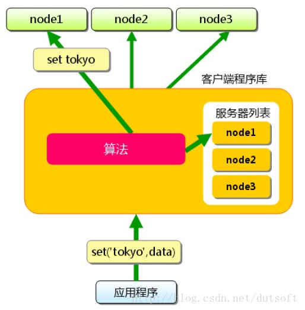

https://blog.csdn.net/dutsoft/article/details/71101809

许多**Web应用**都将数据保存到MySQL这样的**关系型数据库**管理系统中，**应用服务器**从中**读取数据**并在浏览器中显示。但随着**数据量的增大**、**访问的集中**，就会出现**数据库**的**负担加重**、**数据库响应恶化**、 **网站显示延迟**等不良影响。**分布式缓存**是**优化网站性能**的重要手段，**大量站点**都通过**可伸缩的服务器集群**提供**大规模热点数据缓存服务**。通过**缓存数据库查询结果**，**减少数据库访问次数**，可以显著提高动态Web应用的速度和可扩展性。业界常用的有**redis**、**memcached**等，今天要讲的就是在python项目中如何使用memcached缓存服务。

# 1 memcached

memcached是一款开源、高性能、**分布式内存对象缓存系统**，可应用各种需要缓存的场景，其**主要目的**是通过**降低对Database的访问**来加速web应用程序。 

memcached本身其实**不提供分布式解决方案！！！**。在**服务端**，**memcached集群**环境实际就是**一个个memcached服务器**的堆积，环境搭建较为简单；**cache的分布式**主要是在**客户端实现**，通过**客户端**的**路由处理**来达到**分布式解决方案**的目的。**客户端**做**路由**的**原理非常简单**，**应用服务器**在每次存取某key的value时，通过路由算法把key映射到某台memcached服务器nodeA上，因此这个key所有操作都在nodeA上进行。只要服务器还缓存着该数据，就能保证缓存命中。 



# 2 路由算法

## 2.1 简单路由算法

简单路由算法，使用余数Hash：用缓存数据key的hash值，除以服务器的数目，余数为服务器列表的下表编号。这个算法可以让缓存数据在整个memcached集群中均匀的分布，也能满足大多数的缓存路由需求。 

但是，当memcached集群要扩容的时候，就会引发问题。例如：网站需要将3台缓存服务器扩容成4台。在更改服务器列表后，若仍使用余数hash，很容易就计算出，75%的请求不能命中缓存。随着服务器集群规模增大，不能命中的比率就越高。

```
1%3 = 1    1%4 = 1
2%3 = 2    2%4 = 2
3%3 = 0    3%4 = 3
4%4 = 1    4%4 = 0
```