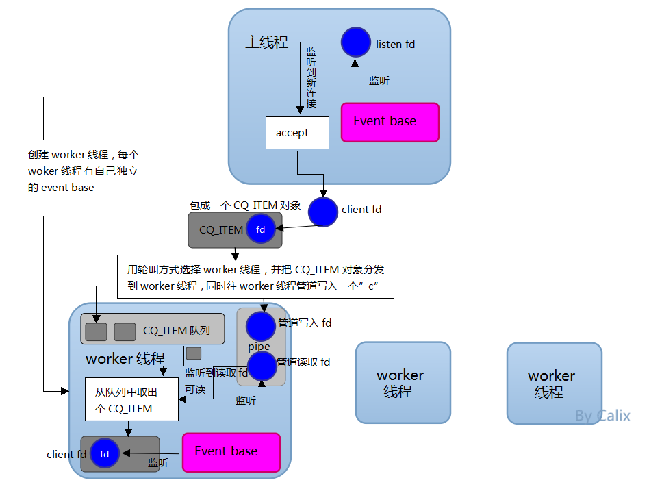

# 1 模型分析

memcached到底是如何处理我们的网络连接的？

memcached通过epoll（使用libevent，下面具体再讲）实现异步的服务器，但仍然使用多线程，主要有两种线程，分别是“主线程”和“worker线程”，一个主线程，多个worker线程。

主线程负责监听网络连接，并且accept连接。当监听到连接时，accept后，连接成功，把相应的client fd丢给其中一个worker线程。

worker线程接收主线程丢过来的client fd，加入到自己的epoll监听队列，负责处理该连接的读写事件。

所以说，主线程和worker线程都各自有自己的监听队列，主线程监听的仅是listen fd，而worker线程监听的则是主线程accept成功后丢过来的client fd。

memcached使用libevent实现事件监听。在这简单介绍一下libevent的使用，一般有以下几步：

1）event_base = event_init(); 初始化事件基地。

2）event_set(event, fd, event_flags, event_handler, args); 创建事件event，fd为要监听的fd，event_flags为监听的事件类型，event_handler为事件发生后的处理函数，args为调用处理函数时传递的参数。

3）event_base_set(event_base, event); 为创建的事件event指定事件基地。

4）event_add(event, timeval); 把事件加入到事件基地进行监听

5）event_base_loop(event_base, flag); 进入事件循环，即epoll_wait

memcached主线程和worker线程各有自己的监听队列，故有主线程和每个worker线程都有一个独立的event_base，事件基地。

了解libevent的简单使用后，我们回到memcache线程模型上，先看看下面的图片了解它线程模型的构建逻辑：

memcached线程模型



1）主线程首先为自己分配一个event_base，用于监听连接，即listen fd。

2）主线程创建n个worker线程，同时每个worker线程也分配了独立的event_base。

3）每个worker线程通过管道方式与其它线程（主要是主线程）进行通信，调用pipe函数，产生两个fd，一个是管道写入fd，一个是管道读取fd。worker线程把管道读取fd加到自己的event_base，监听管道读取fd的可读事件，即当主线程往某个线程的管道写入fd写数据时，触发事件。

4）主线程监听到有一个连接到达时，accept连接，产生一个client fd，然后选择一个worker线程，把这个client fd包装成一个CQ_ITEM对象（该结构体下面再详细讲，这个对象实质是起主线程与worker线程之间通信媒介的作用，主线程把client fd丢给worker线程往往不止“client fd”这一个参数，还有别的参数，所以这个CQ_ITEM相当于一个“参数对象”，把参数都包装在里面），然后压到worker线程的CQ_ITEM队列里面去（每个worker线程有一个CQ_ITEM队列），同时主线程往选中的worker线程的管道写入fd中写入一个字符“c”（触发worker线程）。

5）主线程往选中的worker线程的管道写入fd中写入一个字符“c”，则worker线程监听到自己的管道读取fd可读，触发事件处理，而此是的事件处理是：从自己的CQ_ITEM队列中取出CQ_ITEM对象（相当于收信，看看主线程给了自己什么东西），从4）可知，CQ_ITEM对象中包含client fd，worker线程把此client fd加入到自己的event_base，从此负责该连接的读写工作。

# 2 代码实现

https://www.cnblogs.com/wenqiang/p/5404081.html

memcached使用libevent实现事件监听

对于一个服务器而言，流程大致如下：

1 获取待监听的内容的fd；
2 创建一个event_base；
3 创建一个event,指定待监听的fd，待监听事件的类型，以及事件放生时的回调函数及传给回调函数的参数；
4 将event添加到event_base的事件管理器中；
5 开启event_base的事件处理循环；
6 （异步）当事件发生的时候，调用前面设置的回调函数。


main函数中初始化和线程相关的:

```
main_base = event_init(); //全局的main_base变量

//初始化主线程，参数是worker线程个数，和当前主线程的event_base
memcached_thread_init(settings.num_threads, main_base);
 
//建立sockets, 
if (settings.port && server_sockets(settings.port, tcp_transport, portnumber_file)) {
        vperror("failed to listen on TCP port %d", settings.port);
        exit(EX_OSERR);
}

//进入事件循环
if (event_base_loop(main_base, 0) != 0) {
    retval = EXIT_FAILURE;
}
```

server_sockets调用server_socket: 先是new_socket(), 然后调用conn_new()

```
conn_new(sfd, conn_listening, EV_READ | EV_PERSIST, 1, transport, main_base)))
```

注：libevent支持的事件及属性包括（使用bitfield实现）

- EV_TIMEOUT:超时；
- EV_READ:只要网络缓冲中还有数据，回调函数就会被触发；
- EV_WRITE:只要塞给网络缓冲的数据被写完，回调函数就会被触发；
- EV_SIGNAL:POSIX信号量；
- EV_PERSIST:不指定这个属性，回调函数被触发后事件会被删除；
- EV_ET:Edge-Trigger边缘触发（这个还不懂是什么意思）

再调用

```
// 事件处理函数为event_handler
event_set(&c->event, sfd, event_flags, event_handler, (void *)c);
// 设定event_base
event_base_set(base, &c->event);
// 添加事件
event_add(&c->event, 0)
```


