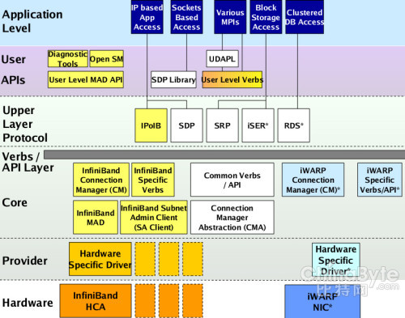
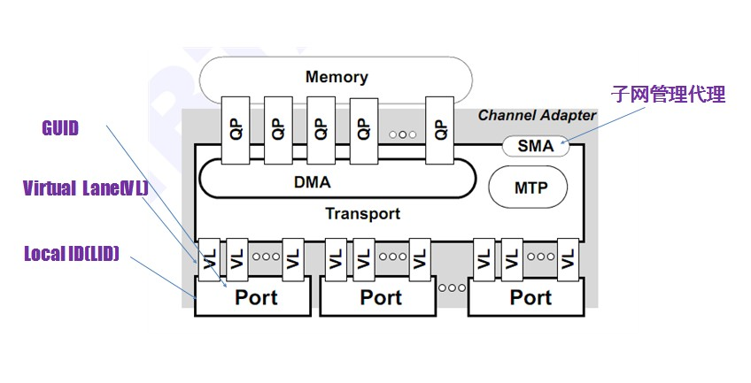
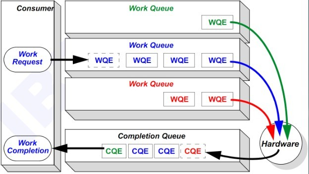

[TOC]

# 1 InfiniBand简介

InfiniBand架构是一种支持**多并发链接**的“**转换线缆**”技术，在这种技术中，**每种链接**都可以达到**2.5 Gbps**的运行速度。这种架构在一个链接的时候速度是500 MB/秒，四个链接的时候速度是2 GB/秒，12个链接的时候速度可以达到6 GB /秒。IBTA成立于1999年8月31日，由Compaq、惠普、IBM、戴尔、英特尔、微软和Sun七家公司牵头，共同研究发展的高速先进的I/O标准。最初的命名为System I/O，1999年10月，正式改名为InfiniBand。InfiniBand是一种长缆线的连接方式，具有**高速、低延迟**的传输特性。

InfiniBand用于**服务器系统内部(内部总线！！！**)并没有发展起来，原因在于英特尔和微软在2002年就退出了IBTA。在此之前，英特尔早已另行倡议**Arapahoe**，亦称为**3GIO(3rd Generation I/O，第三代I/O**)，即今日鼎鼎大名的**PCI Express(PCI\-E**)，InfiniBand、3GIO经过一年的并行，英特尔终究还是选择了PCI\-E。因此，现在应用InfiniBand，主要是用于在**服务器集群**，**系统之间的互联(！！！不是服务器内部总线！！！**)。 

随着CPU性能的飞速发展，**I/O系统的性能**成为制约服务器性能的瓶颈。于是人们开始重新审视使用了十几年的PCI总线架构。虽然PCI总线结构把数据的传输从8位/16位一举提升到32位，甚至当前的64位，但是它的一些先天劣势限制了其继续发展的势头。PCI总线有如下缺陷：

(1)由于采用了**基于总线的共享传输模式！！！**，在**PCI总线**上**不可能同时传送两组以上的数据**，当一个PCI设备占用总线时，其他设备只能等待；

(2)随着总线频率从33MHz提高到66MHz，甚至133MHz（PCI-X），**信号线之间的相互干扰**变得越来越严重，在一块主板上布设多条总线的难度也就越来越大；

(3)由于**PCI设备**采用了**内存映射I/O地址！！！**的方式建立与内存的联系，**热添加PCI设备！！！**变成了一件非常困难的工作。目前的做法是**在内存中**为**每一个PCI设备**划出一块**50M到100M的区域**，这段空间**用户是不能使用**的，因此如果**一块主板上支持的热插拔PCI接口越多！！！**，用户损失的内存就越多；

(4)PCI的总线上虽然有**buffer**作为**数据的缓冲区**，但是它**不具备纠错的功能**，如果在**传输的过程**中发生了**数据丢失或损坏**的情况，**控制器！！！**只能触发一个**NMI中断**通知操作系统在PCI总线上发生了错误。

InfiniBand 采用**双队列程序提取技术**, 使**应用程序**直接将**数据**从**适配器**送入到**应用内存(称为远程直接存储器存取或RDMA！！！**), 反之依然。

在**TCP/IP协议**中,来自**网卡的数据**先拷贝到**核心内存(现在一般是DMA操作**), 然后**再拷贝到应用存储空间**,或从**应用空间将数据**拷贝到**核心内存**,再经由**网卡**发送到**Internet**。这种I/O操作方式,**始终需要经过核心内存的转换！！！**,它不仅**增加了数据流传输路径的长度**,而且大大**降低了I/O的访问速度**,增加了**CPU的负担**。

而SDP则是将**来自网卡的数据**直接拷贝到**用户的应用空间**,从而避免了**核心内存参入**。这种方式就称为**零拷贝！！！**,它可以在进行大量数据处理时,达到该协议所能达到的最大的吞吐量。

# 2 InfiniBand Stack

# 3 Structure

每个端口具有一个GUID(Globally Unique Identifier)，GUID是全局唯一的，类似于以太网MAC地址。运行过程中，子网管理代理（SMA）会给端口分配一个本地标识（LID），LID仅在子网内部有用。

# 4 QP

QP是infiniband的一个重要概念，它是指**发送队列**和**接收队列的组合**，用户调用API**发送接收数据**的时候，实际上是**将数据放入QP**当中，然后**以轮询的方式将QP中的请求一条条的处理**，其模式**类似于生产者\-消费者模式**。

# 5 InfiniBand网络拓扑

Infiniband的网络拓扑结构如图，其**组成单元**主要分为**四类**：

（1）HCA（Host Channel Adapter），它是连接**内存控制器**和**TCA**的桥梁；

（2）TCA(Target Channel Adapter)，它将**I/O设备（例如网卡、SCSI控制器**）的**数字信号打包**发送给**HCA**；

（3）Infiniband link，它是连接HCA和TCA的光纤，InfiniBand架构允许硬件厂家以1条、4条、12条光纤3种方式连结TCA和HCA；

（4）交换机和路由器；

