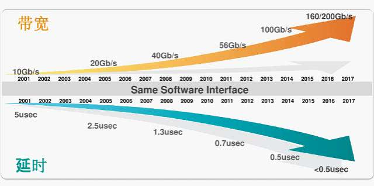
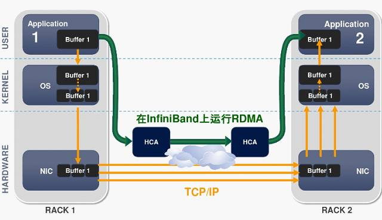
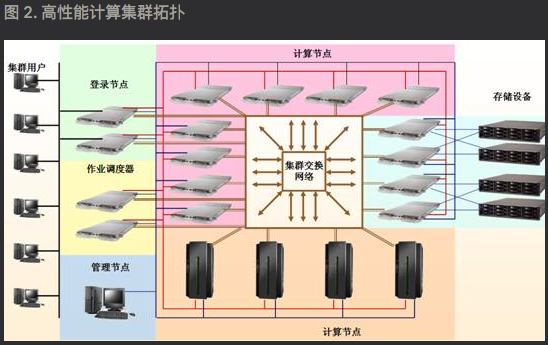

https://cloud.tencent.com/developer/news/384580

https://www.ibm.com/developerworks/cn/aix/library/1105_luoming_infiniband/index.html

Infiniband开放标准技术简化并加速了**服务器之间的连接**,同时支持**服务器**与**远程存储和网络设备的连接(！！！**)。OpenFabrics Enterprise Distribution (**OFED**)是一组开源软件驱动、核心内核代码、中间件和**支持InfiniBand Fabric的用户级接口程序**。

2005年由OpenFabrics Alliance(OFA)发布第一个版本。**Mellanox OFED**用于Linux，Windows (WinOF)，包括各种诊断和性能工具，用于**监视InfiniBand网络**的运行情况，包括监视传输带宽和监视Fabric内部的拥塞情况。

OpenFabrics Alliance (OFA)是一个基于开源的组织，它开发、测试、支持OpenFabrics企业发行版。该联盟的任务是开发并推广软件，通过将高效消息、低延迟和最大带宽技术架构直接应用到最小CPU开销的应用程序中，从而实现最大应用效率。

该联盟成立于2004年6月，最初是OpenIB联盟，致力于开发独立于供应商、基于Linux的InfiniBand软件栈。2005，联盟致力于支持Windows，此举将使软件栈真正跨平台。

2006年，该组织再次扩展其章程，包括对iWARP的支持，在2010年增加了对RoCE (RDMA over Converged)支持通过以太网交付高性能RDMA和内核旁路解决方案。2014年，随着OpenFabrics Interfaces工作组的建立，联盟再次扩大，实现对其他高性能网络的支持

# 1 IB技术的发展

1999年开始起草规格及标准规范，2000年正式发表，但发展速度不及Rapid I/O、PCI-X、PCI-E和FC，加上Ethernet从1Gbps进展至10Gbps。所以直到2005年之后，InfiniBand Architecture(IBA)才在集群式超级计算机上广泛应用。全球HPC高算系统TOP500大效能的超级计算机中有相当多套系统都使用上IBA。

除了InfiniBand Trade Association (IBTA)9个主要董事成员CRAY、Emulex、HP、IBM、intel、Mellanox、Microsoft、Oracle、Qlogic专门在应用和推广InfiniBand外，其他厂商正在加入或者重返到它的阵营中来，包括Cisco、Sun、NEC、LSI等。InfiniBand已经成为目前主流的高性能计算机互连技术之一。为了满足HPC、企业数据中心和云计算环境中的高I/O吞吐需求，新一代高速率56Gbps的FDR (Fourteen Data Rate) 和100Gpb EDR InfiniBand技术已经广泛应用。

# 2 IB技术的优势

Infiniband大量用于**FC/IP SAN**、**NAS**和**服务器之间的连接**,作为iSCSI RDMA的存储协议iSER已被IETF标准化。目前EMC全系产品已经切换到Infiniband组网，IBM/TMS的FlashSystem系列，IBM的存储系统XIV Gen3，DDN的SFA系列都采用Infiniband网络。

相比FC的优势主要体现在性能是FC的3.5倍，Infiniband交换机的延迟是FC交换机的1/10，支持SAN和NAS。

存储系统已不能满足于传统的FC SAN所提供的服务器与裸存储的网络连接架构。HP SFS和IBM GPFS 是在Infiniband fabric连接起来的服务器和iSER Infiniband存储构建的并行文件系统，完全突破系统的性能瓶颈。

Infiniband采用**PCI串行高速带宽链接**，从SDR、DDR、QDR、FDR到EDR HCA连接，可以做到1微妙、甚至纳米级别极低的时延，基于链路层的流控机制实现先进的拥塞控制。

InfiniBand采用虚通道(VL即Virtual Lanes)方式来实现QoS，虚通道是一些共享一条物理链接的相互分立的逻辑通信链路，每条物理链接可支持多达15条的标准虚通道和一条管理通道(VL15)

RDMA技术实现内核旁路，可以提供远程节点间RDMA读写访问，完全卸载CPU工作负载，基于硬件传出协议实现可靠传输和更高性能。

相比TCP/IP网络协议，IB使用基于信任的、流控制的机制来确保连接的完整性，数据包极少丢失，接受方在数据传输完毕之后，返回信号来标示缓存空间的可用性，所以IB协议消除了由于原数据包丢失而带来的重发延迟，从而提升了效率和整体性能。

TCP/IP具有转发损失的数据包的能力，但是由于要不断地确认与重发，基于这些协议的通信也会因此变慢，极大地影响了性能。

# 3 IB基本概念

**网络**是常常被认为是**路由器**、**交换机**和插在服务器和存储设备上的**电缆**的集合。在大部分人的印象里，网络用来连接服务器到其他服务器、存储和其他网络。其实，这是一种普遍存在的对网络的片面看法，它将过多的注意力集中在处于网络底层结构的电缆和交换机上。这是典型的“**以网络为中心！！！**的”观点：认为**网络的构成架构**应该**决定应用程序的通讯模式**。

**Infiniband 网络**则基于“**以应用程序为中心**”的新观点。它的提出来源于一个简单的问题：如何让**应用程序**访问其他**应用程序**以及**存储**尽可能的**简单、高效和直接**？如果以“应用程序为中心”的观点来思考 I/O 问题，就能得到一种与传统完全不同的网络架构。

**Infiniband** 基于一种非常简单的原则：提供一种**易于使用的消息服务！！！**。这个服务可以被用来与**其他应用程序**、**进程**或者**存储**进行**通信**。**应用程序不再向操作系统提交访问其他资源的申请，而是直接使用 Infiniband 消息服务！！！**。Infiniband 消息服务是一个非常**高效、直接的消息服务**，它摒弃了传统网络和应用程序之间消息传递的复杂结构。直接使用 Infiniband 服务意味着**应用程序不再依赖操作系统来传递消息**，这大大提高了通信效率。

如图 1，Infiniband 消息服务可以在**两个应用程序之间创建一个管道**，来使应用程序之间直接进行通信，从而**绕过了操作系统**，大大提高了效率。

IB是以**通道为基础**的**双向**、**串行式传输**，在**连接拓朴**中是采用**交换、切换式结构(Switched Fabric**)，在线路不够长时可用**IBA中继器(Repeater**)进行延伸。**每一个IBA网络**称为**子网(Subnet**)，**每个子网**内最高可有**65,536个节点(Node**)，IBA Switch、IBARepeater仅适用于Subnet范畴，若要通跨多个IBASubnet就需要用到IBA路由器(Router)或IBA网关器(Gateway)。

每个节点(Node) 必须透过配接器(Adapter)与IBA Subnet连接，节点CPU、内存要透过HCA(Host Channel Adapter)连接到子网；节点硬盘、I/O则要透过TCA(TargetChannel Adapter)连接到子网，这样的一个拓扑结构就构成了一个完整的IBA。

IB的传输方式和介质相当灵活，在设备机内可用印刷电路板的铜质线箔传递(Backplane背板)，在机外可用铜质缆线或支持更远光纤介质。若用铜箔、铜缆最远可至17m，而光纤则可至10km，同时IBA也支持热插拔，及具有自动侦测、自我调适的Active Cable活化智能性连接机制。

# 4 IB协议简介

InfiniBand也是一种**分层协议(类似TCP/IP协议**)，每层负责不同的功能，下层为上层服务，不同层次相互独立。 IB采用IPv6的报头格式。其数据包报头包括本地路由标识符LRH，全局路由标示符GRH，基本传输标识符BTH等。

# Infiniband 在 HPC（High performance computing）领域的应用

**高性能计算（HPC**）是一个涵盖面很广的领域，它覆盖了从最大的“TOP 500”高性能集群到微型桌面集群。这篇文章里的我们谈及的 HPC 是这样一类系统，它**所有的计算能力**在一段时间内都被用来**解决同一个大型问题**。换句话说，我们这里讨论的 HPC 系统不会被用来运行传统的企业应用，例如：邮件、计费、web 等。一些典型的 HPC 应用包括：大气建模、基因研究、汽车碰撞模拟、流体动态分析等。

图 2 显示了一个标准的高性能集群（HPC）的拓扑结构。可以看到，在**高性能计算集群**中，**各种设备**是通过**集群的交换网络！！！**连接到一起的。所以，**高性能计算系统**除了需要**高性能的中央处理器**外，还需要**高性能的存储**和**低延迟的进程间通信**来满足科学运算的需求。在**大型集群**中**高速的交换网络**扮演了非常重要的角色，甚至比 CPU 还要关键，处于**集群的核心位置**。大量的实验数据表明，集群的性能和可扩展性主要和消息在节点之间的传递速度有关，这意味着低延迟的消息传递是被迫切需求的，而这正是 Infiniband 的优势。下面我们就介绍下 Infiniband 为什么比传统网络更适合高性能计算系统。

