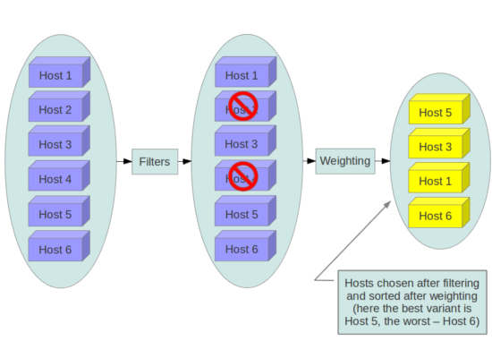
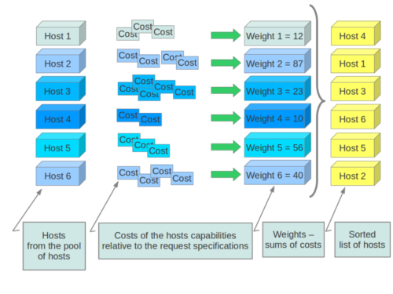

<!-- @import "[TOC]" {cmd="toc" depthFrom=1 depthTo=6 orderedList=false} -->

<!-- code_chunk_output -->

* [1 概述](#1-概述)
	* [1.1 标准过滤器](#11-标准过滤器)
	* [1.2 权重计算](#12-权重计算)
* [参考](#参考)

<!-- /code_chunk_output -->

# 1 概述

在创建一个新虚拟机实例时，Nova Scheduler通过配置好的Filter Scheduler对所有计算节点进行过滤（filtering）和称重（weighting），最后根据称重高低和用户请求节点个数返回可用主机列表。如果失败，则表明没有可用的主机。

## 1.1 标准过滤器



- AllHostsFilter - 不进行过滤，所有可见的主机都会通过。

- ImagePropertiesFilter - 根据镜像元数据进行过滤。

- AvailabilityZoneFilter - 根据可用区域进行过滤（Availability Zone元数据）。

- ComputeCapabilitiesFilter - 根据计算能力进行过滤，通过请求创建虚拟机时指定的参数与主机的属性和状态进行匹配来确定是否通过，可用的操作符如下：

    * = (equal to or greater than as a number; same as vcpus case)
    * == (equal to as a number)
    * != (not equal to as a number)
    * \>= (greater than or equal to as a number)
    * \<= (less than or equal to as a number)
    * s== (equal to as a string)
    * s!= (not equal to as a string)
    * s\>= (greater than or equal to as a string)
    * s\> (greater than as a string)
    * s\<= (less than or equal to as a string)
    * s\< (less than as a string)
    * \<in\> (substring)
    * \<all\-in\> (all elements contained in collection)
    * \<or\> (find one of these)

Examples are: 

```
">= 5", "s== 2.1.0", "<in> gcc", "<all-in> aes mmx", and "<or> fpu <or> gpu"
```

部分可用的属性：

    * free_ram_mb (compared with a number, values like ">= 4096")
    * free_disk_mb (compared with a number, values like ">= 10240")
    * host (compared with a string, values like: "<in> compute","s== compute_01")
    * hypervisor_type (compared with a string, values like: "s== QEMU", "s== powervm")
    * hypervisor_version (compared with a number, values like : ">= 1005003", "== 2000000")
    * num_instances (compared with a number, values like: "<= 10")
    * num_io_ops (compared with a number, values like: "<= 5")
    * vcpus_total (compared with a number, values like: "= 48", ">=24")
    * vcpus_used (compared with a number, values like: "= 0", "<= 10")

- AggregateInstanceExtraSpecsFilter - 根据额外的主机属性进行过滤（Host Aggregate元数据），与ComputeCapabilitiesFilter类似。

- ComputeFilter - 根据主机的状态和服务的可用性过滤。

- CoreFilter AggregateCoreFilter - 根据剩余可用的CPU个数进行过滤。

- IsolatedHostsFilter - 根据nova.conf中的image_isolated、 host_isolated，和restrict_isolated_hosts_to_isolated_images 标志进行过滤，用于节点隔离。

- JsonFilter - 根据JSON语句来过滤。

- RamFilter AggregateRamFilter - 根据内存来过滤。

- DiskFilter AggregateDiskFilter - 根据磁盘空间来过滤。

- NumInstancesFilter AggregateNumInstancesFilter - 根据节点实例个数来过滤。

- IoOpsFilter AggregateIoOpsFilter - 根据IO状况过滤。

- PciPassthroughFilter - 根据请求的PCI设备进行过滤。

- SimpleCIDRAffinityFilter - 在同一个IP子网上创建虚拟机。

- SameHostFilter - 在与一个实例相同的主机上启动实例。

- RetryFilter - 过滤掉已经尝试过的主机。

- AggregateTypeAffinityFilter - 限定一个Aggregate中创建的实例类型（Flavor类型）。

- ServerGroupAntiAffinityFilter - 尽量把实例部署在不同主机。

- ServerGroupAffinityFilter - 尽量把实例部署在相同主机。

- AggregateMultiTenancyIsolation - 把租户隔离在指定的Aggregate。

- AggregateImagePropertiesIsolation - 根据镜像属性和Aggregate属性隔离主机。

- MetricsFilter - 根据weight_setting 过滤主机，只有具备可用测量值的主机被通过。

- NUMATopologyFilter - 根据实例的NUMA要求过滤主机。

## 1.2 权重计算



当过滤后如果有多个主机，则需要进行权重计算，最后选出权重最高的主机，公式如下：


# 参考 

- https://my.oschina.net/LastRitter/blog/1649954

