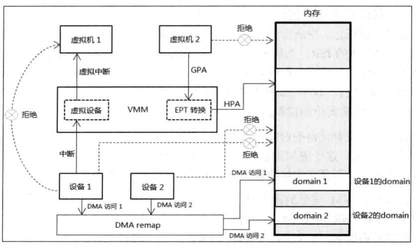

- 2.1 虚拟化概述
    - 2.1.0 概述
    - 2.1.1 虚拟设备
    - 2.1.2 地址转换
    - 2.1.3 设备的I/O访问

# 0 概述

虚拟机的运用需要以**处理器平台提供Virtualization Technology(VT, 虚拟化技术**)为前提, 是以资源的虚拟化管理的结果. 在虚拟化技术之前, 软件运行在物理机器上, 对物理资源进行直接控制, 譬如设备的中断请求, guest的内存访问, 设备的I/O访问等. 软件更改这些资源的状态将直接反映在物理资源上, 或设备的请求得到直接响应.

在**CPU端的虚拟化**里, 实现了VMX(Virtual\-Machine Extensions, 虚拟机扩展)架构. 这个虚拟机架构中, 存在两种角色环境: **VMM(Virtual Machine Monitor, 虚拟机监管者**)和**VM(Virtual Machine, 虚拟机**). **host端软件**运行在**VMM环境**中, 可以**仅作为hypervisor角色**存在(作为**全职的虚拟机管理者**), 或者**包括VMM(虚拟机监管者**)职能的**host OS**.

guest端软件运行在VM环境中. 一个VM代表一个虚拟机实例, 一个处理器平台可以有多个虚拟机实例, 由于VM里的资源被虚拟化, 每个MV彼此独立.

**guest软件**访问的**资源受到VMM监管**, **guest**希望**修改某些物理资源**时, **VMM**返回一个**虚拟化后的结果给guest**. 例如, **guest**软件对**8259控制器**的状态进行修改, **VMM拦截**这个修改, 进行**虚拟化操作**, 实时修改或不修改8259控制器的物理状态, 反馈一个不真实的结果给guest软件.

下图展示前面提到的虚拟化环境里的三种虚拟化管理:

(1) 设备中断请求

(2) guest内存访问

(3) 设备的I/O访问

设备的**中断请求**经由**VMM监管**, 模拟出**虚拟设备**反馈一个**虚拟中断**给guest执行, 在这个模型中, **设备中断请求不直接发给guest执行**. 而**guest访问的物理地址**也**不是最终的物理地址**, 而是**经过EPT进行转换**才得到的最终物理地址. 设备1和设备2使用**DMA访问**时, 它们**最终的目标物理地址**经过**VT\-d**技术的**DMA重新映射功能**映射到**属于自己的domain(区域**).

# 1 虚拟设备

在**设备发生中断请求**时, 这就产生设备的ISR(中断服务例程)是由**VMM(或host OS)处理**, 还是**直接由VM(guest OS)处理**(或由**VMM转发给VM**)的问题, 即**ISR**是**运行在host**还是**guest端**的问题.

依赖于VMM对外部设备所有权的设计产生两种模型:

- 设备是属于**host所有**, 物理设备的ISR由**VMM来执行**.
- 设备分配给**VM使用**, 那么ISR将在**guest环境**里运行.

host和guest都有自己的IDT(中断描述符表), host vector对应物理设备ISR在host IDT的位置, 而guest vector对应VMM反馈给guest的中断请求在guest IDT上的位置. **中断请求**通过**VMM**给**VM**使用**injection event(注入事件**)的手段来实现.

**host vector**和**guest vector**并**不相等**, 但在**设备分配给VM**使用的模型里, 若**外部中断控制权在guest**手上, 那么**guest vector**可以对应**物理设备ISR在guest IDT**的位置, 也就是**物理设备ISR完全由guest执行**, 而**VMM并不监管或转发**.

如果**外部中断的控制权**需要掌握在**VMM(即host**)手中, 通过**开启"external\-interrupt exiting**"功能, 并且结合"**acknowledge interrupt on exit"位**的设置来实现. 当发生**外部中断**时, **VM停止工作**, 处理器**控制权切换回VMM**.

