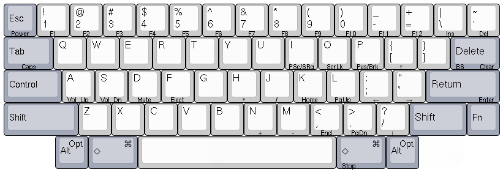
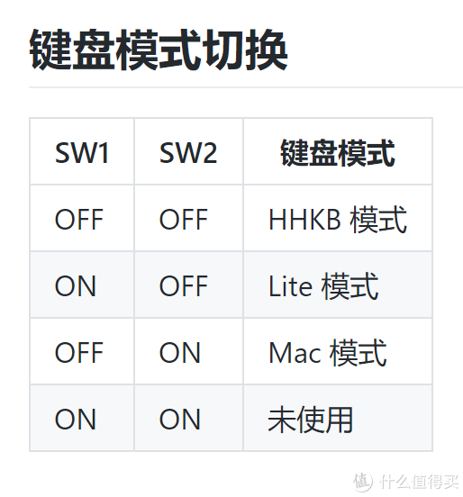
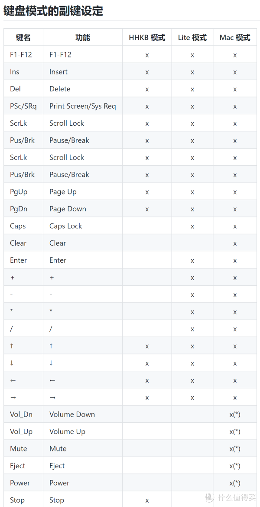
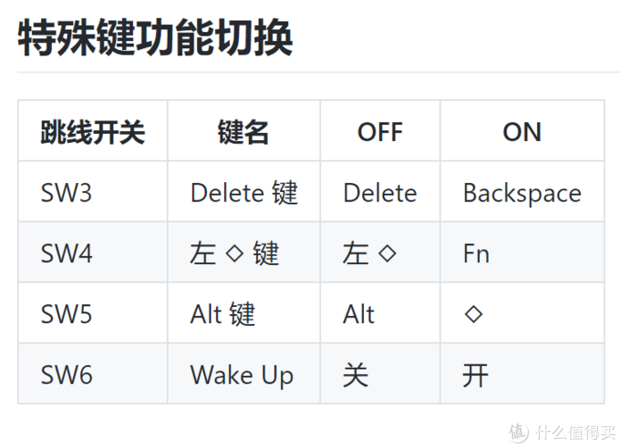
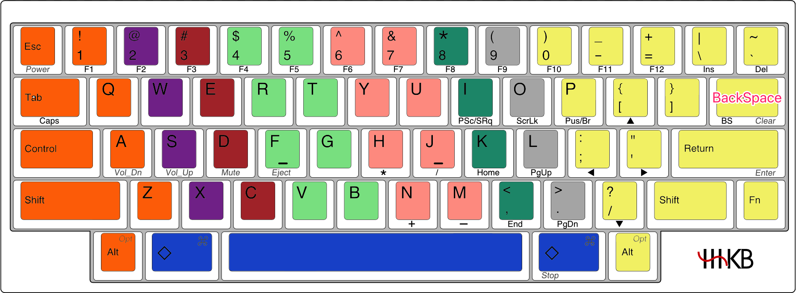
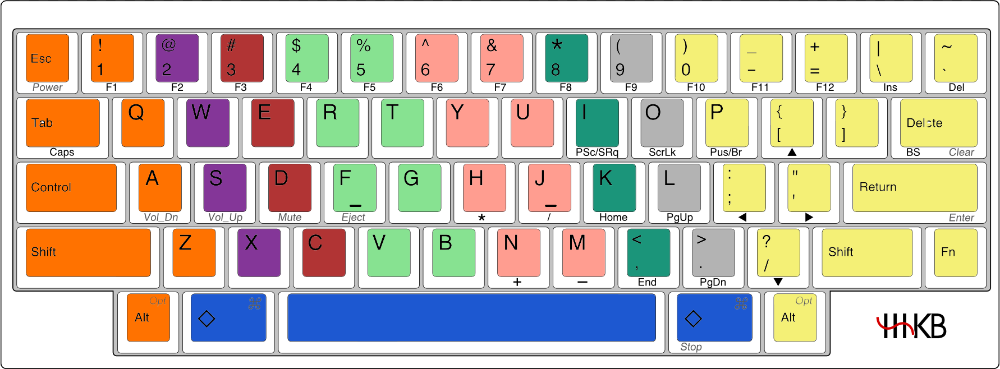

<!-- @import "[TOC]" {cmd="toc" depthFrom=1 depthTo=6 orderedList=false} -->

<!-- code_chunk_output -->

- [1. 介绍](#1-介绍)
  - [1.1. 默认布局](#11-默认布局)
  - [1.2. 跳线配置](#12-跳线配置)
    - [1.2.1. 键盘模式](#121-键盘模式)
    - [1.2.2. 特殊功能键](#122-特殊功能键)
  - [1.3. 蓝牙匹配联机](#13-蓝牙匹配联机)
- [2. 我的配置](#2-我的配置)
- [3. 打字指法纠正](#3-打字指法纠正)
- [4. Mac 中适合 HHKB 的快捷键](#4-mac-中适合-hhkb-的快捷键)

<!-- /code_chunk_output -->

# 1. 介绍

## 1.1. 默认布局

与传统键盘相比，可以看到下面几个显著的差别。

* **CAPS LOCK 键** 被取消，Control 键被放置在原 CAPS LOCK 的位置。这对于使用 emacs 等重度依赖 Control 键的用户无疑是利好消息。
* F1 - F12，以及 HOME，END 和 INS 等功能键被取消，6 排按键被压缩至 5 排。这样的设计，使用户无需离开基准键位（F 和 J）即可触及各类功能键。
* 原先处于 1 左侧的波浪键被移动至最右侧。这是为了对应数字和 F1 - F12 而做出的修改。
* 移除了退格键 Backspace，用 Delete 代替。
* 移除了光标键。
* 上述被移除的按键，均可以通过使用右下角的 Fn 加上某个按键的方式恢复出来。由 Fn 激活的功能镌刻在按键侧面，如上图所示。

## 1.2. 跳线配置

### 1.2.1. 键盘模式

HHKB 提供了 3 种模式选择, 不同模式下可用的副键不同.

### 1.2.2. 特殊功能键

* Mac 模式下 Delete 和 Backspace 效果相同
* ◇ 键在 Lite 模式下是 Windows 键, 在 Mac 模式下是 Command 键.
* Wake Up 为 OFF 时, 键盘 30 分钟没输入信号会自动断电来节省电池, USB 供电时不会自动断电.
* 当 SW4 和 SW5 为 ON 时, 左 Alt 键变成 Fn 键, 右 Alt 键变◇键.

## 1.3. 蓝牙匹配联机

方法 1、关闭已配对的其他蓝牙设备，这样，关闭电源后重新打开，就会自动连接到设备。

方法 2、如果连接 PC，先删除 PC 上的已配对蓝牙，然后按 Fn\+Q，状态灯闪烁进入配对状态, 重新进行配对。

如果要删除所有已配对的链接，按 Fn\+Q，然后按住 Fn\+Z 再加 Del 键，可以清空所有配对。

还有一点，如果同时已配对过的几个蓝牙设备一起打开，键盘会配对最近一次连接过的设备。

# 2. 我的配置

跳线设置: 011001

# 3. 打字指法纠正

标准指法如图:

# 4. Mac 中适合 HHKB 的快捷键

Ctrl\+p shell 中上一个命令, 或者文本中移动到上一行

Ctrl\+n shell 中下一个命令, 或者 文本中移动到下一行

Ctrl\+r 往后搜索历史命令

Ctrl\+f 光标前移

Ctrl\+b 光标后退

Ctrl\+a 到行首

Ctrl\+e 到行尾

Ctrl\+d 向后删除一个字符

Ctrl\+h 退格删除一个字符, 相当于通常的 Backspace 键

Cmd\+delete 删除到行首

Ctrl\+k 删除到行尾

Ctrl\+y 粘贴上一次删除的内容

Ctrl\+v 将光标下移 26 行（别问我是怎么知道的）

Ctrl\+t 将光标前的字向后移动一个单位

Ctrl\+l 类似 clear 命令效果

Ctrl\+m 某些操作环境下可以当做回车（item2）

Ctrl\+w 某些环境下删除前一个单词 (item2)
