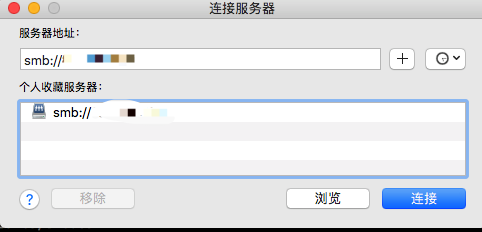

<!-- @import "[TOC]" {cmd="toc" depthFrom=1 depthTo=6 orderedList=false} -->

<!-- code_chunk_output -->

- [1 需求背景](#1-需求背景)
- [2 samba简介](#2-samba简介)
- [3 Linux配置](#3-linux配置)
  - [3.1 安装samba](#31-安装samba)
  - [3.2 共享文件夹](#32-共享文件夹)
  - [3.3 配置samba.conf](#33-配置sambaconf)
  - [3.4 添加samba账户和密码](#34-添加samba账户和密码)
  - [3.5 重启smb.service](#35-重启smbservice)
- [4 在mac上连接](#4-在mac上连接)
  - [4.1 \.DS\_Store安全隐患](#41-ds_store安全隐患)

<!-- /code_chunk_output -->

# 1 需求背景

最近需要在Mac上远程连接一台Linux服务器，管理一些文件。不仅需要进行常规的本地文件操作，还需要上传、下载、编辑。

虽然有一些付费或免费的App，也可以完成类似工作。但其实Mac OS X自带的Finder就可以搞定了！

# 2 samba简介

samba，是一个基于GPL协议的自由软件。它重新实现了SMB/CIFS协议，可以在各个平台共享文件和打印机。

# 3 Linux配置

## 3.1 安装samba

```
yum install samba
```

## 3.2 共享文件夹

先创建一个需要共享的文件夹，这里用shared\_directory。如果已经有，直接执行chmod改变它的权限。

```
mkdir /home/USER_NAME/shared_directory
sudo chmod 777 /home/USER_NAME/shared_directory
```

USER\_NAME就是你的用户名。

我是将根目录直接全部share了

## 3.3 配置samba.conf

可以直接修改/etc/samba/smb.conf，在文件末尾添加：

```
[share]
      path = /home/USER_NAME/shared_directory
      available = yes
      browseable = yes
      public = yes
      writable = yes
```

我的配置是

```
[share]
	path = /
	available = yes
	browseable = yes
	public = yes
	writable = yes
    valid users = root
    create mask = 0777
    directory mask = 0777
```

## 3.4 添加samba账户和密码

```
sudo touch /etc/samba/smbpasswd
sudo smbpasswd -a USER_NAME
```

我是用了root用户

## 3.5 重启smb.service

```
systemctl restart smb.service
```

# 4 在mac上连接

打开Finder（或在桌面），CMD + k，可以得到以下页面：




## 4.1 \.DS\_Store安全隐患

由于Finder自带的.DS\_Store包含了太多信息，如果在服务器产生.DS_Store会造成安全隐患。如果没有特殊配置，你用Finder管理远程的文件夹会自动产生.DS\_Store。

在云端检查你的共享文件夹，如果发现\.DS\_Store，立即删除！

```
ls -a /home/USER_NAME/shared_directory
```

如何让Finder不在远程连接时产生.DS\_Store？

打开Mac的Terminal，输入

```
defaults write com.apple.desktopservices DSDontWriteNetworkStores true
```

然后重启Mac，再试试远程连接。