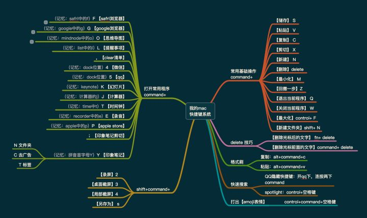
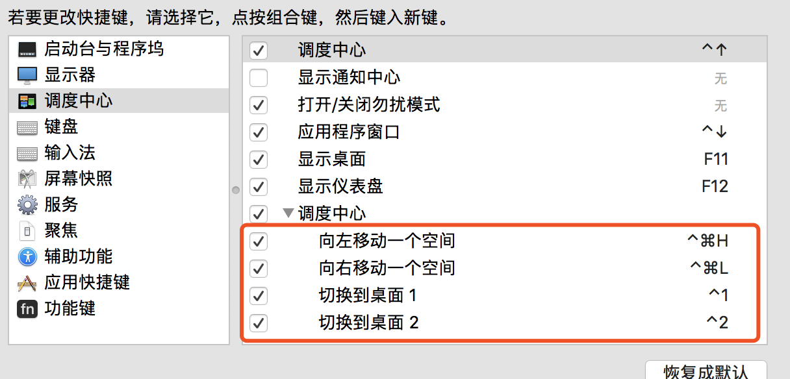

# 1 系统初始化

## 1.1 账号设置

### 1.1.1 登录iCloud账号

系统偏好设置 → iCloud

### 1.1.2 设置Mac用户

系统偏好设置 → 用户与群组

删除其它用户, 只留管理员用户, 

# 2 软件安装与设置

## 2.1 CheatSheet: 快捷键辅助软件

在任意界面只要你长按“⌘”键便可以呼出此app，它会显示当前操作下所有可执行的快捷键

## 2.2 Alfred: Mac下的Everything

### 2.2.1 Preference设置

#### 2.2.1.1 General

1. 设置自动启动

2. hotkey: 设为double CMD

3. Where are you: China

#### 2.2.1.2 Appearance

1. Theme: Dark and Smooth

### 2.2.2 

## 2.3 snap: 快捷键神器

用来自定义应用的打开快捷键

1. 基本设置

打开登录即启动


# 3 系统设置确认

放在这一步, 是因为软件安装后会对系统相关设置有影响

## 3.1 登录自动打开

系统偏好设置 → 用户与群组 → 登录项

确认自动打开的有:

- TickTick
- Clipy
- Alfred
- 印象笔记
- Snap
- CheatSheet


- snap: 快捷键神器, 可自定义

可以构建自己的快捷键



- keynote: 幻灯片

- xmind: 思维导图工具

- Noizio: 精心工具

播放各种自然地声音

- Mac 内分屏

按住任一打开的窗口左上角的绿色的全屏按钮。

按住该按钮时窗口会缩小，可以将其拖至屏幕的左侧或右侧。

松开该按钮，然后点按另一个窗口，就可以并排使用这两个窗口，也可以调整两个页面的占比。

- 截屏

cmd+shift+3：对整个屏幕进行截图；

cmd+shift+4：对自行选择的区域进行截图；

cmd+shift+4+space（空格键）：对选定的某个应用程序界面窗口进行截图。

使用 Snip滚动截图，实现对一个网页的长截图

使用腾讯"截图"

- 安装brew

首先要通过如下命令安装 brew

```
/usr/bin/ruby -e "$(curl -fsSL https://raw.githubusercontent.com/Homebrew/install/master/install)"
```

- 触发角


- 快捷键设置



- Clipy: 剪切板工具

添加Common片断用来放置常用的内容, 并给这个添加快捷键"CMD+\`"

修改快捷键:

⓵ 菜单:

- 主体: Option+CMD+V
- 历史: CMD+Esc
- 片断: 清零

⓶ 历史

- 清空历史: 清零

# 