<!-- @import "[TOC]" {cmd="toc" depthFrom=1 depthTo=6 orderedList=false} -->

<!-- code_chunk_output -->

* [1 系统初始化](#1-系统初始化)
	* [1.1 账号设置以及更新](#11-账号设置以及更新)
		* [1.1.1 登录iCloud账号以及其他互联网账户](#111-登录icloud账号以及其他互联网账户)
		* [1.1.2 设置Mac用户](#112-设置mac用户)
		* [1.1.3 系统更新](#113-系统更新)
	* [1.2 磁盘设置](#12-磁盘设置)
		* [1.2.1 基本介绍](#121-基本介绍)
			* [1.2.1.1 选择卷宗](#1211-选择卷宗)
			* [1.2.1.2 创建卷宗](#1212-创建卷宗)
			* [1.2.1.3 删除宗卷](#1213-删除宗卷)
			* [1.2.1.4 装载宗卷卸载宗卷](#1214-装载宗卷卸载宗卷)
			* [1.2.1.5 创建多个容器或者分区](#1215-创建多个容器或者分区)
			* [1.2.1.6 删除容器或者分区](#1216-删除容器或者分区)
		* [1.2.2 设置](#122-设置)
	* [1.3 触发角](#13-触发角)
	* [1.4 触控板设置](#14-触控板设置)
	* [1.5 开启三指拖移](#15-开启三指拖移)
	* [1.6 添加ll、la、l等ls别名命令](#16-添加ll-la-l等ls别名命令)
	* [1.7 安全性与隐私](#17-安全性与隐私)
		* [1.7.1 通用](#171-通用)
		* [1.7.2 隐私](#172-隐私)
	* [1.8 HomeBrew配置](#18-homebrew配置)
* [2 软件安装与设置](#2-软件安装与设置)
	* [2.1 CheatSheet: 快捷键辅助软件](#21-cheatsheet-快捷键辅助软件)
	* [2.2 Alfred: Mac下的Everything](#22-alfred-mac下的everything)
		* [2.2.1 Preference设置](#221-preference设置)
			* [2.2.1.1 General](#2211-general)
			* [2.2.1.2 Appearance](#2212-appearance)
		* [2.2.2](#222)
	* [2.3 snap: 快捷键神器](#23-snap-快捷键神器)
	* [2.4 Clipy: 剪切板工具](#24-clipy-剪切板工具)
	* [2.5 Tencent Lemon Lite: Mac清理工具](#25-tencent-lemon-lite-mac清理工具)
	* [2.6 iTerm 2: 终端软件](#26-iterm-2-终端软件)
		* [2.6.1 设置](#261-设置)
	* [2.7 搜狗输入法](#27-搜狗输入法)
	* [2.8 腾讯截图](#28-腾讯截图)
	* [2.9 soundflower](#29-soundflower)
	* [2.10 QuickTime](#210-quicktime)
	* [2.11 OBS](#211-obs)
* [3 系统设置确认](#3-系统设置确认)
	* [3.1 登录自动打开](#31-登录自动打开)
	* [3.2 bash\_profile文件](#32-bash_profile文件)

<!-- /code_chunk_output -->

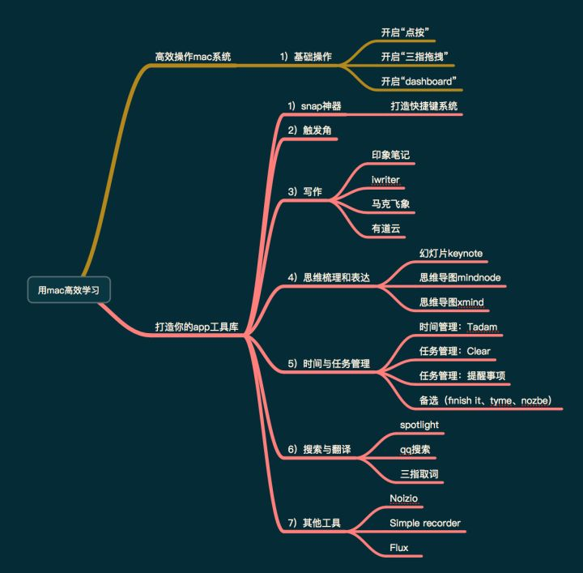

# 1 系统初始化

## 1.1 账号设置以及更新

### 1.1.1 登录iCloud账号以及其他互联网账户

系统偏好设置 → iCloud

系统偏好设置 → 互联网账户

登录"iCloud"、Outlook账户(Exchange)、Google

### 1.1.2 设置Mac用户

系统偏好设置 → 用户与群组

删除其它用户, 只留管理员用户, 关闭客人用户, 设置密码, 密码提示设为

```
不慎丢失, 请联系16601053927, 或邮件gerryleefocus@gmail.com, 万分感谢!
```

### 1.1.3 系统更新

App Store中更新

## 1.2 磁盘设置

### 1.2.1 基本介绍

#### 1.2.1.1 选择卷宗

打开"磁盘工具", 点击软件左上角的"显示"符号，然后选择显示所有设备，如图那样子，点击后看到所有的设备，分别是物理磁盘，容器以及宗卷，点击图中的Macintosh HD看到宗卷两个字。 


在Mac上面宗卷代表的是分区又不是分区。这句话是什么意思呢？因为APFS在里面加入了容器的概念。**一般**我们理解的分区就是把**硬盘分为几个部分**，在电脑上面会看到**几个盘符**，**不同的盘符代表不同的分区**。但是APFS加入了**容器**的概念，一切变得不同。注意在APFS里面，增加宗卷，或者增加分区，在finder里面都可以实现看到几个分区的效果。但是它们本质是不同的。**宗卷只能在容器**里增加或者删除，而分区则是在物理硬盘上面分的。最大的不同在于共享存储池。**容器**可以达到**共享存储空间**的效果，而**分区不能**。

举个例子：

**普通分区**的效果，把**普通的硬盘**分成**两个分区**，意味着你**其中一个分区**使用完了剩余的空间，**另外一个分区**的剩余空间则你**不能够使用**的。是属于**完全的隔离**分开的。

**APFS文件系统分区**是，先在**物理硬盘**上建立个**存储池**就是叫做**容器**的东西，然后你要**分区**的话就是**在这个容器**上面建立**一个宗卷**，等于**容器包含了宗卷**，如果**再需要分区**就**再次建立一个宗卷**。因为它们是包含的关系，意味着你可以实现**两个宗卷公用剩余空间**。不用再担心其中一个分区已经没有剩余空间了，因为是公用的关系，实际上你**写入文件**，无论把文件放到**哪个宗卷**，归根到底都是在**同一个容器内**。视觉上面看起来是不同的分区，实际上它使用的同一个容器。所以说宗卷代表的是分区又不是分区，两个分区（宗卷）剩余的容量都是一样的。这是这个新的文件系统的最大特色。

#### 1.2.1.2 创建卷宗

因为**宗卷**是在APFS中是**建立在容器上面**的，所以**点击左侧的容器**或者**宗卷**（基于容器所以可以创建），**才可以创建宗卷**，点击**硬盘**则是**灰色**。**只有**在**硬盘**上面创建了**容器**，才可以**创建宗卷**。如图

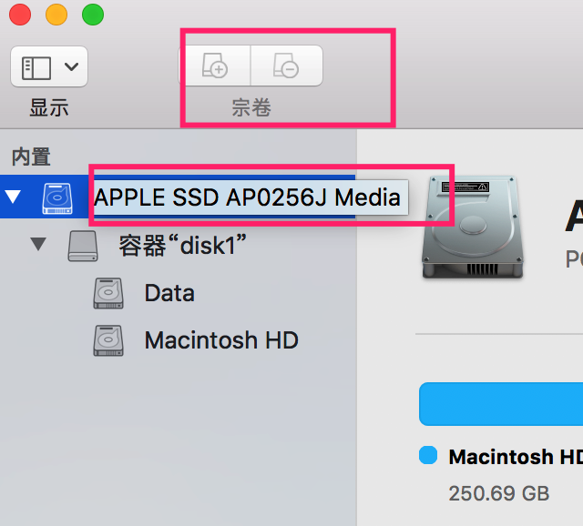

点击**宗卷的加号**，然后**输入宗卷名称**，可以中英文，注意**选择格式！！！**可以选择区分大小写, 然后点击确定即可。这时候就会创建一个**容量大小相同剩余空间相同**的**两个不同名字的宗卷**，打开磁盘工具后就会看到有了**两个宗卷分区**。但是跟普通的分区又有点不同，普通分区其中一个用完了，第二分区的剩余容量不会合并到第一分区。而容器中的两个宗卷则是恰恰相反。两个剩余的空间都是一样的。


比如下面两个, Data是区分大小写的, Macintosh HD是不区分大小写的:

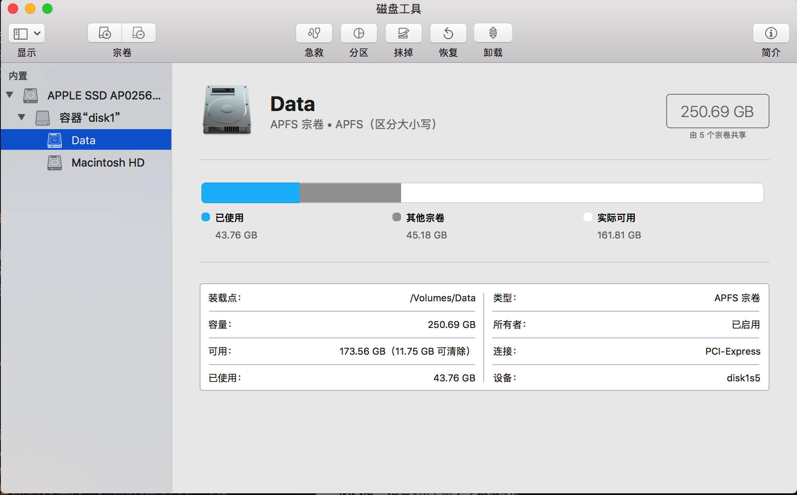


#### 1.2.1.3 删除宗卷

要删除宗卷，首先是点击**容器下面的宗卷**，然后右键选择删除即可。需要注意的是**删除后**这个**宗卷分区的数据将会消失殆尽**。

如果**点击容器选项**，那么**宗卷删除选项则是灰色**。因为**容器不是宗卷**，只能建立宗卷，要删除宗卷当然得先选择宗卷。

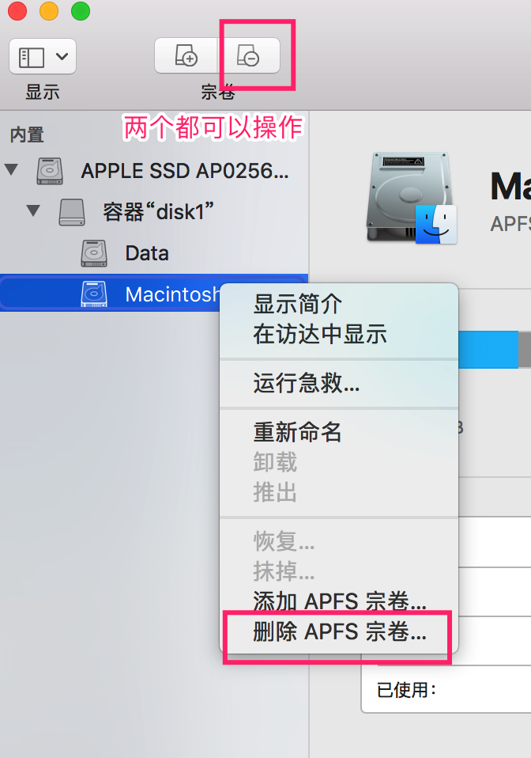

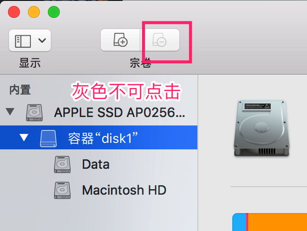

在**容器里面建立的分区**都是**剩余容量空间都是一样**的，或者**不想弄一样**的怎么办，那么就需要在创建时候选择**大小选项**，接着会有**保留大小**，**配额大小**选项，**保留大小**就是**宗卷最小的容量**是多少不会低于这个值，配额大小就是当这个宗卷设置了某个**最大值**放入的文件已经存储满了，那么容器内剩余的空间就不会再分给它。

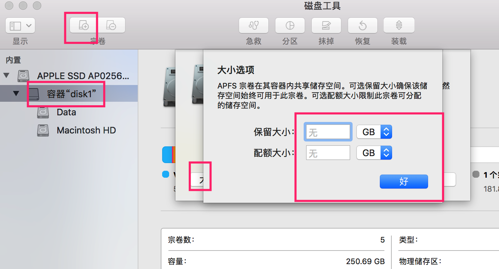

#### 1.2.1.4 装载宗卷卸载宗卷

当**创建卷宗**后, 会**自动装载到系统**, 装载点是/Volume/_卷宗name_, 卸载后重新装载也是装载在这个目录.

要实现**卸载宗卷**的功能首先是**需要最少两个宗卷才可以实现**。因为带有系统的宗卷是无法卸载的. 

点击宗卷，右键它或者点击磁盘工具右上角的卸载即可。

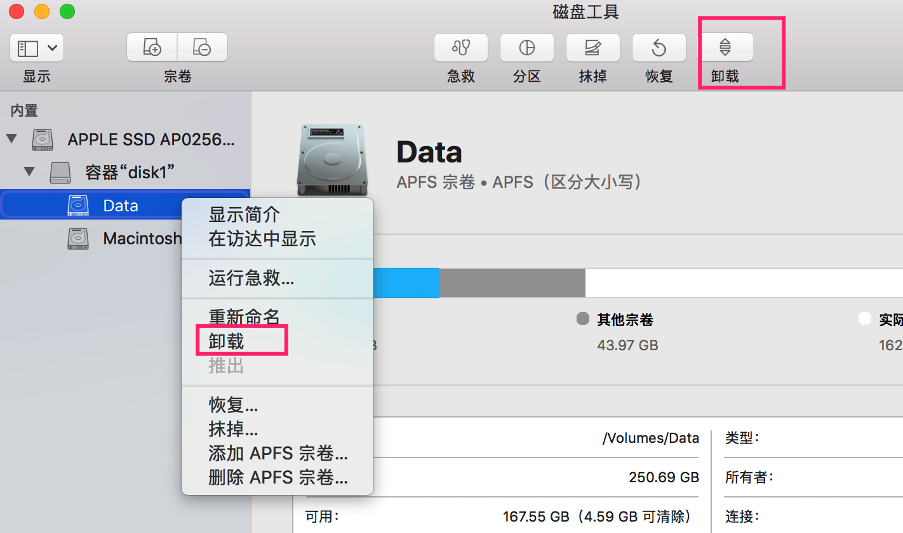

这个功能的作用是，**隐藏自己的私密文件**，在需要**查看私密文件**时候**把宗卷装载过去**，然后打开finder在设备里面看到自己创立的未命名宗卷。不需要的时候把它卸载了，那么打开finder就不会看到宗卷了。这样子就达到了隐藏文件的目的。当然这个只能针对不了解Mac的用户。

#### 1.2.1.5 创建多个容器或者分区

首先是**点击左侧的内置任意一个分区或物理磁盘**，然后**点击分区**，在**饼图**里面**点击加号**，然后**设置容器的大小**，如果**不设置**就会**把硬盘所有的剩余空间**作为**第二个容器**。如果格式选择**fat之类**就只是会生成分区，而**不会带有容器**。设置**名字**，如果是**其他类型文件系统(fat之类的**)，这里会是**分区的名字**。**APFS**下则是**宗卷的名称**，设置好了点击应用，稍等一会就会生成一个容器以及容器下面的 _name_ 宗卷。

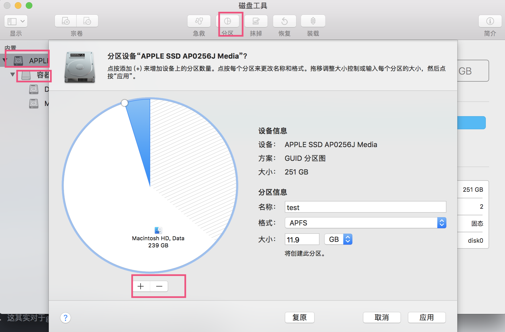

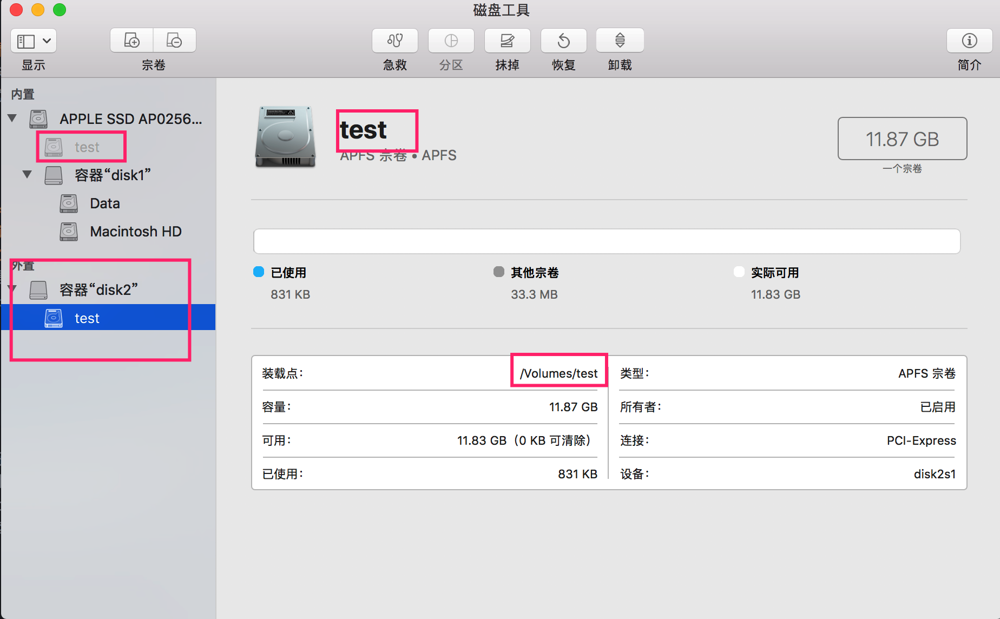

一般情况下最好是**一个硬盘**创建**一个容器**就可以了，因为这样子就可以在容器上创建分区**充分使用一个硬盘**空间。如果硬要创建**两个容器**在**一个硬盘**上面，就**等于旧的分区模式**。当然本着探索的精神，尝试一下是怎么实现的。因为Mac上面没有两个ssd，如果有的话，或者自己添加能够将**两个硬盘**只创建**一个容器**，那么这个文件系统就厉害了，类似lvm两个硬盘当一个用。

#### 1.2.1.6 删除容器或者分区

容器删除后宗卷分区也会删除. 点击**需要删除的容器对应的硬盘**，**点击分区**，然后在蓝色饼图内**点击减号**，选择应用稍微等待一会就会把容器删除了。注意只能够删除自己建立的容器，不能够删除带有系统的容器，除非使用启动盘删除。

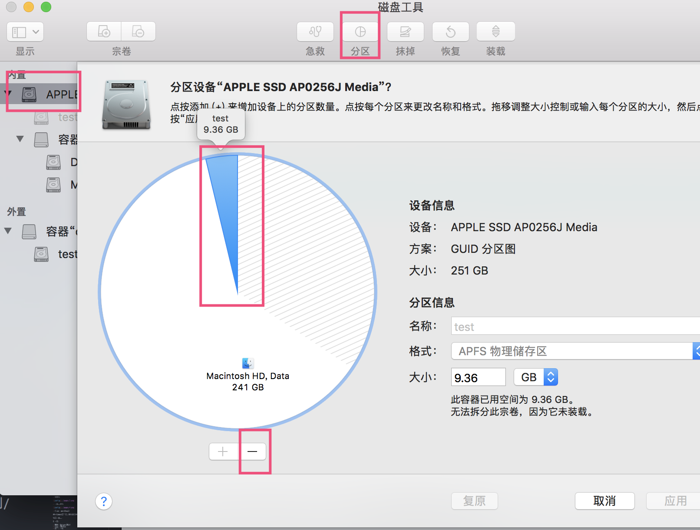

### 1.2.2 设置

因为我的电脑只有一个硬盘, 所以也就将这个硬盘作为一个容器.

Mac默认的卷宗是非区分大小写的. 这其实对于git等使用是有缺陷的, 所以这里需要建立了一个新的宗卷.

名称设为"Data", 格式"APFS(区分大小写)", 从而会创建一个宗卷并挂载到/Volume/Data, 将所有自己的数据都放在这里面, 不要放在系统卷宗中.

如下图, 打开Finder, 点击"设备"下的"Data", 分别创建文件夹:

- Codes: 存放代码
- Docs: 存放文档, 比如, 当前Study就在这个下面, 其余分别建立子目录
- Downloads: 存放下载的软件等
- Images: 存放图片, 壁纸等
- company name: 公司相关的一些文档

并将上面的目录以及Study添加到左边的个人收藏, 删除其余没用的, 保留"隔空投送" "最近使用" "应用程序" "桌面" "个人用户"


## 1.3 触发角

"系统偏好设置" → "调度中心" → "触发角"


## 1.4 触控板设置

"系统偏好设置" → "触控板"


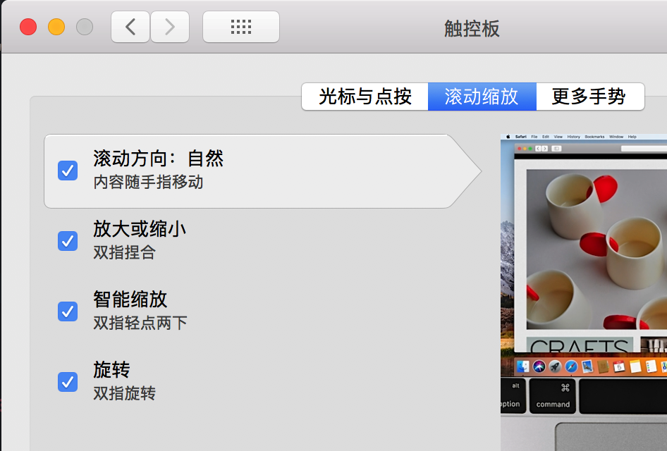

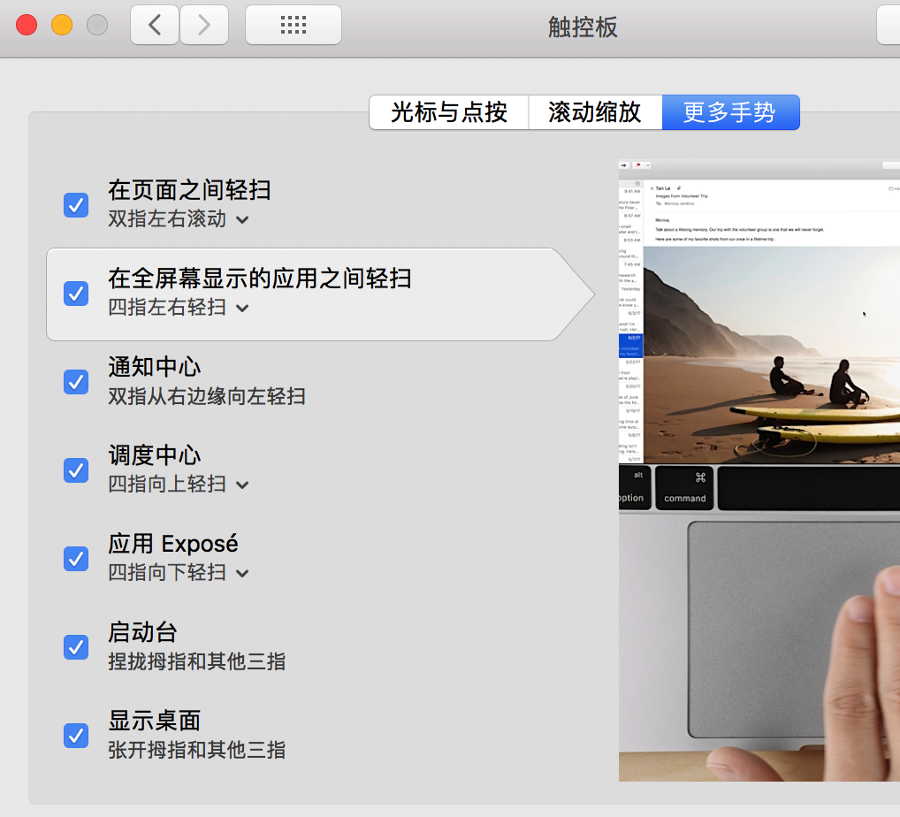

## 1.5 开启三指拖移

「系统偏好设置」-「辅助功能」-「鼠标与触控板」-「触控板选项」-「启用拖移」

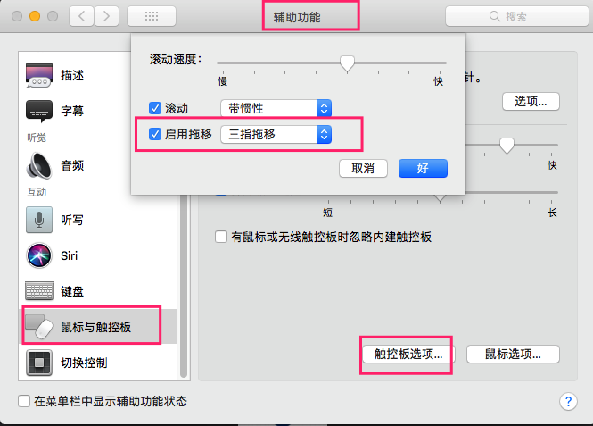

## 1.6 添加ll、la、l等ls别名命令

在\~/.bash\_profile中添加

```
alias ll='ls -alF'

alias la='ls -A'

alias l='ls -CF'
```

然后执行source \~/.bash\_profile

## 1.7 安全性与隐私

"系统偏好设置" → "安全性与隐私"

### 1.7.1 通用

"通用".


"停用自动登录", 允许"任何来源"的应用

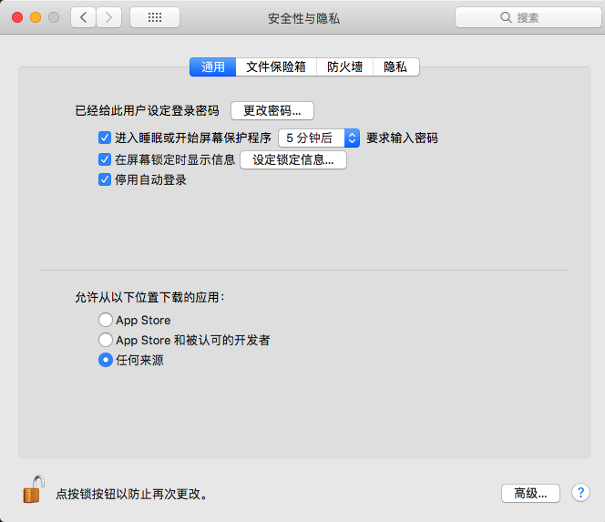

设定锁定信息, 如下:

```
Gerry Lee
16601053927
gerryleefocus@gmail.com
```

### 1.7.2 隐私

关闭"分析"中的改进

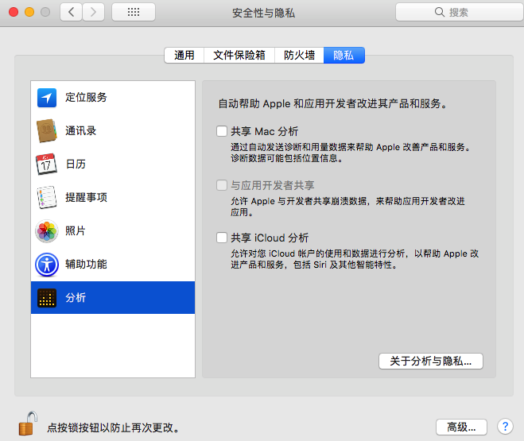

## 1.8 HomeBrew配置


# 2 软件安装与设置

## 2.1 CheatSheet: 快捷键辅助软件

在任意界面只要你长按“⌘”键便可以呼出此app，它会显示当前操作下所有可执行的快捷键

"系统偏好设置" → "安全性与隐私" → "隐私" → "辅助功能"

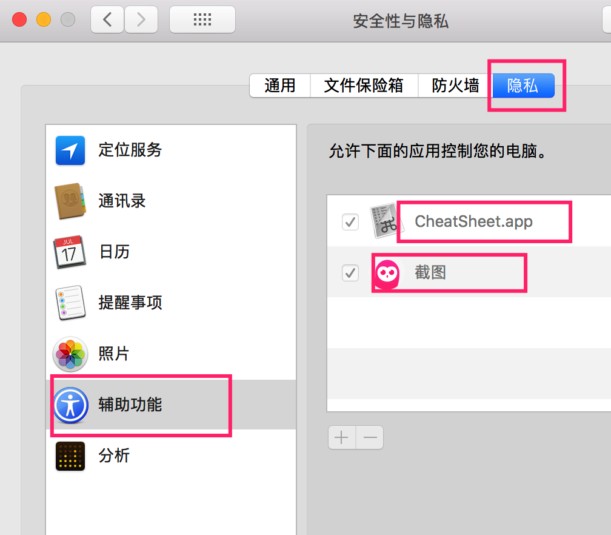

## 2.2 Alfred: Mac下的Everything

### 2.2.1 Preference设置

#### 2.2.1.1 General

1. 设置自动启动

2. hotkey: 设为double CMD

3. Where are you: China

#### 2.2.1.2 Appearance

1. Theme: Dark and Smooth

### 2.2.2 

## 2.3 snap: 快捷键神器

用来自定义应用的打开快捷键

1. 基本设置

打开: 登录即启动

关闭: 菜单栏图标显示, 因为没必要

打开: 通过 Option + _Num_ 打开dock栏的第num个应用, 因为CMD+ _num_ 会和iTerm2等冲突

2. 打开应用快捷键设置

注: 不是特别常用的可以通过"Splot"或"Alfred"搜索到

dock栏:

- 0: 永远是Finder
- 1: App Store
- 2: 印象笔记
- 3: iTerm2
- 4: 系统邮件Mail
- 5: 系统偏好设置

打开应用, 使用Ctrl+CMD+

- E【Finder访达】
- G【Google Chrome浏览器】
- O【OBS】
- P【QuickTime Player】
- V【VS Code】
- W【微信】
- X【Xmind】
- Y【网易云音乐】

## 2.4 Clipy: 剪切板工具

添加Common片断用来放置常用的内容, 并给这个添加快捷键"Option+\`"

修改快捷键:

⓵ 菜单:

- 主体: Shift+CMD+V
- 历史: CMD+Esc
- 片断: 清零

⓶ 历史

- 清空历史: 清零

## 2.5 Tencent Lemon Lite: Mac清理工具

## 2.6 iTerm 2: 终端软件

### 2.6.1 设置

Preference

1. 

3. Profile

- General

working directory: 

选择Advanced Configure; 打开新window选Directory(/Volumes/Data/); 其余选择Previous session

## 2.7 搜狗输入法

1. 登录账号

2. "外观" → "候选词字数", 选择5个, 减少对后面数字按键

3. "高级" → "词库管理", 导入词库

## 2.8 腾讯截图

https://jietu.qq.com/

"系统偏好设置" → "安全性与隐私" → "隐私" → "辅助功能", 见上图

配置如下:


## 2.9 soundflower

让macOS 下录屏，能同时保留声音, 参考: https://www.zhihu.com/question/20251726

下载soundflower, 链接: https://github.com/mattingalls/Soundflower/releases/tag/2.0b2 , 安装

打开"音频MIDI设置"

- 选中左边的“Soundflower（2ch）”, 点击右上方“输入”，“主声道”调到最大; 选中右边的“静音”，然后再取消“静音”; 点击"输出", 同样操作

- 左边选中“Soundflower（64ch）”，对它的“输入”“输出”中的“主音量”进行同样的操作。（如果64ch设了“静音”，那么2ch也没声音了。）

如果一切正常, 那么系统有声音播放时，系统设置 -> 声音 -> 输入那里的“输入电平”应该是有音量的。

- 点左下角“+”，新建一个“聚集设备”，勾选右边的“内建麦克风”和“Soundflower(2ch)”。这样, 这个"聚集设备"就同时有麦克风声音和系统的声音.


- 再新建一个“多输出设备”，勾选“内建输出”和“Soundflower(2ch)”。这个"多输出设备"就同时把声音传到"内建输出"(也就是我们听到的声音)和操作系统(系统内部识别)


系统偏好设置 -> 声音，勾选"在菜单栏中显示音量", 方便在菜单栏调整输出

- 输出，先不要选“多输出设备”, 必要时候选择。这个是决定声音的输出.


- 输入，选“聚集设备”。这样这个输入设备就同时有了麦克风声音和系统的声音. 这个决定的是声音的输入


注: 这个软件有个不完美的地方, 在切换"输出"之前, 要先调整好系统音量，因为一旦你切换设备后，将无法改变音量大小。

## 2.10 QuickTime

打开QuickTime，文件 \-> 新建屏幕录制，点小三角，麦克风选“聚集设备", 这里选的是对这个软件而言的 "输入设备"


录的时候就既有系统的声音也有麦克风的声音。

如果想只录系统的声音，则选择Soundflower（2ch）就**只有系统发出的声音**而**没有麦克风声音**了。


设置输出设备

- 如果想让我们听到(即外放), 那么设置为"多输出设备"

## 2.11 OBS

设置

"输出": 

- 录像格式设置为"mov", 因为Mac自带的quicktime player不能打开mkv

- 录像路径修改

"音频": 

- 设置桌面音频设备, 如果没有, 需要下载soundflower(在mac上面虚拟出音频设备的插件), 选择"64ch"

"视频": 

- 两个分辨率都设为"1920x1080"


# 3 系统设置确认

放在这一步, 是因为软件安装后会对系统相关设置有影响

## 3.1 登录自动打开

系统偏好设置 → 用户与群组 → 登录项

确认自动打开的有:

- TickTick
- Clipy
- Alfred
- 印象笔记
- Snap
- CheatSheet
- Mail

## 3.2 bash\_profile文件

```
cat ~/.bash_profile

export HOMEBREW_BOTTLE_DOMAIN=https://mirrors.tuna.tsinghua.edu.cn/homebrew-bottles

#export HOMEBREW_BOTTLE_DOMAIN=https://mirrors.ustc.edu.cn/homebrew-bottles
export GTAGSLABEL=pygments

alias ll='ls -alF'

alias la='ls -A'

alias l='ls -CF'
```


- snap: 快捷键神器, 可自定义

可以构建自己的快捷键


- keynote: 幻灯片

- xmind: 思维导图工具

- Noizio: 精心工具

播放各种自然地声音

- Mac 内分屏

按住任一打开的窗口左上角的绿色的全屏按钮。

按住该按钮时窗口会缩小，可以将其拖至屏幕的左侧或右侧。

松开该按钮，然后点按另一个窗口，就可以并排使用这两个窗口，也可以调整两个页面的占比。

- 截屏

cmd+shift+3：对整个屏幕进行截图；

cmd+shift+4：对自行选择的区域进行截图；

cmd+shift+4+space（空格键）：对选定的某个应用程序界面窗口进行截图。

使用 Snip滚动截图，实现对一个网页的长截图

使用腾讯"截图"

- 安装brew

首先要通过如下命令安装 brew

```
/usr/bin/ruby -e "$(curl -fsSL https://raw.githubusercontent.com/Homebrew/install/master/install)"
```

- 

- 快捷键设置


- Clipy: 剪切板工具

添加Common片断用来放置常用的内容, 并给这个添加快捷键"CMD+\`"

修改快捷键:

⓵ 菜单:

- 主体: Option+CMD+V
- 历史: CMD+Esc
- 片断: 清零

⓶ 历史

- 清空历史: 清零

# 