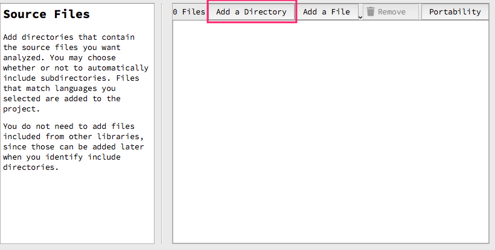
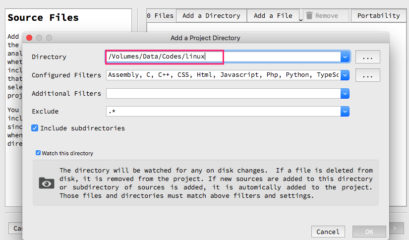
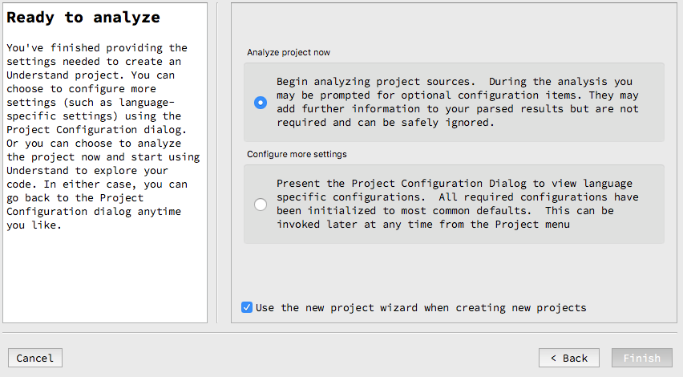
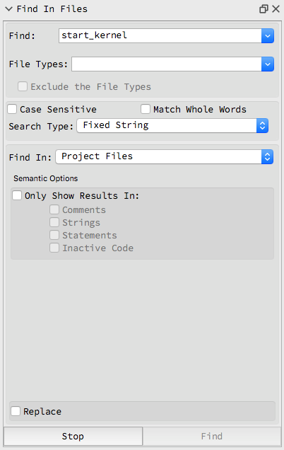
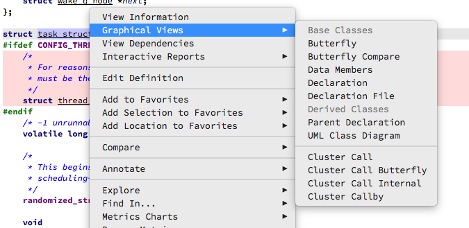

<!-- @import "[TOC]" {cmd="toc" depthFrom=1 depthTo=6 orderedList=false} -->

<!-- code_chunk_output -->

* [1 设置](#1-设置)
* [2 导入项目](#2-导入项目)
* [3 搜索功能](#3-搜索功能)
* [4 项目视图](#4-项目视图)
	* [4.1 层级关系视图分类：](#41-层级关系视图分类)

<!-- /code_chunk_output -->

# 1 设置

1. 设置字体和颜色风格

修改默认字体: Preference → Editor → Default style 

修改颜色: Preference → Editor → Styles, Predefined选为

# 2 导入项目

1. new → project, 输入项目名称(linux\-latest), understand的项目数据库(之前的目录)

2. 语言选择

Assembly、C/C\+\+、Python、Web

3. 导入文件和设置, 这里选第一个

4. 添加目录和文件, 这里添加目录

5. 代码分析

有两个选项，一个是立即分析代码，一个选择配置，对于我们来说只需要默认即可，然后点击OK按钮，此时软件开始分析代码

# 3 搜索功能

1. 搜索文件: 在这个搜索中你可以快速搜索你要查看的文件，

快捷键，鼠标点击左侧上面项目结构窗口，然后按command + F键会出现如下图所示的搜索框，在框中输入你想要的类回车即可

2. 在打开的文件中搜索: 将鼠标定位到右侧代码中，点击command + F，会弹出搜索框，输入方法回车即可：

3. 全局搜索: 快捷键F5或者去上面菜单栏中的search栏中查找

4. 实体搜索: 菜单栏的find entity, 根据结构体、方法等搜索

# 4 项目视图

项目视图包含很多的功能，能够自动生成各种流程图结构图，帮助你快速理清代码逻辑、结构等，以便快速理解项目流程，快速开发.

视图查看方式有两种，

一种是鼠标点击你要查看的类或者方法等上面，然后右键弹出菜单，鼠标移动到Graphical Views，然后弹出二级菜单，如下图所示：

另一种方式是点击要查看的类或者方法，然后找到代码上面菜单栏中的如下图标：

然后点击图标右下角的下拉箭头，弹出如下菜单，即可选择查看相关视图：

## 4.1 层级关系视图分类：

