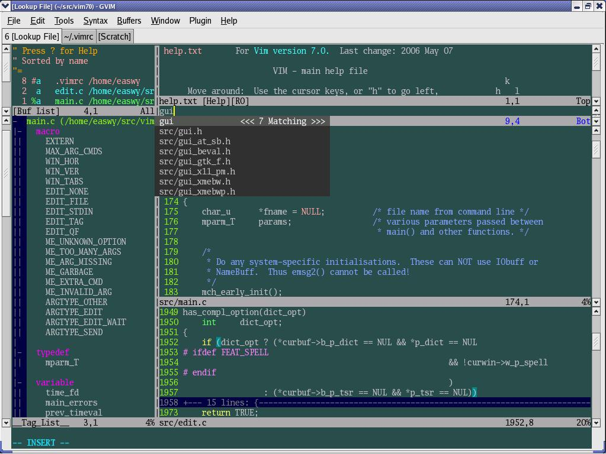

对vim的初学者提一些建议：

- 如果你的工作以文本编辑(不是指Microsoft word中的文本编辑)为主，那么学习vim或emacs是值得的；

- 刚开始使用vim或emacs的经历是很痛苦的，因为它们可能完全不同于你已经习惯的windows编辑器。我的建议是：坚持下去！咬牙坚持下去！你会获得回报的。

- vim手册 (help files) 是学习如何高效使用vim的重要资源，一定要多读手册。如果你是因为害怕读英文手册而不肯学习vim的话，那么，到[vim中文文档](http://vimcdoc.sourceforge.net/)下载vim 7.0的中文手册，安装好后，再使用”:help @cn”命令，你就可以看到中文手册了。

- 如果你是第一次接触vim，那么使用”:help tutor“或”:help tutor@cn“，你就会看到一个30分钟的vim教程，会教会你vim的一些基本命令。

- 有时间的话，一定要阅读一下Bram Moolenaar(vim的作者)写的Seven habits of effective text editing（七个有效的文本编辑习惯），你可以知道怎样提高你的编辑效率。在 http://vimcdoc.sourceforge.net/ 下载PDF格式的手册，在附录二你可以看到它的中文译本。

本系列文章都针对vim 7.0版本。源码[从vim主页](https://vim.sourceforge.io/)可以下载。

附图是我所使用vim环境，在这图中，我打开了三个标签页，一个是主编程区，一个是打开的.vimrc文件，另外一个是草稿区。在主编程标签页中有几个不同的窗口，分别是当前打开的buffer，当前文件中的tag，help窗口，lookupfile窗口，src/main.c和src/edit.c。其中使用了三个vim插件（plugin）：[winmanager](http://easwy.com/blog/archives/advanced-vim-skills-netrw-bufexplorer-winmanager-plugin/), [taglist](http://easwy.com/blog/archives/advanced-vim-skills-taglist-plugin/), [lookupfile](http://easwy.com/blog/archives/advanced-vim-skills-lookupfile-plugin/)。

从这副图中可以看出vim的一些特性：多标签支持(tab)、多窗口支持、插件支持(plugin)、[语法高亮功能(syntax)](http://easwy.com/blog/archives/advanced-vim-skills-syntax-on-colorscheme/)、[文本折叠功能(folding)](http://easwy.com/blog/archives/advanced-vim-skills-advanced-move-method/)……这些特性，以及其它数不清的特性，我都将在后续文章中尽量给予介绍。

上图是GUI界面的vim，下图是控制台(console)下的vim的抓图。使用putty远程登录到linux服务器上，使用控制台的vim开发软件：

