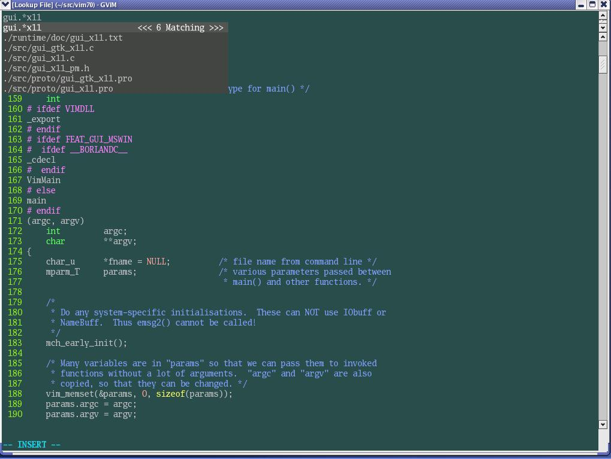

如果你在开发一个大的项目，当你想在一大堆文件中查找或者编辑指定文件时，Lookupfile插件是必不可少的。使用它，可以快速查找项目文件、可以在缓冲区查找指定文件、可以浏览指定目录等。在查找时甚至可以使用正则表达式(regex)，在你只记得部分文件名或目录名时，这可是救命的手段。

本节所用命令的帮助入口：

```
:help lookupfile
```

在文章<保存项目相关配置>中，我们讲过通过”:find“命令打开指定的文件，不过使用”:find“命令并不是非常的方便：一是如果项目比较大、文件比较多，find查找起来很慢；二是必须输入全部的文件名，不能使用正则表达式(regex)查找。

我们也介绍过vim提供的<文件浏览>插件，你可以在浏览器中根据目录去查找，但这种方式在浏览目录时比较方便，查找一个已知名字（或知道部分名字）的文件效率就比较低了。

相比之下，在source insight中查找文件非常简单，只要输入部分的文件名，就可以找到符合条件的文件。

我一直被这个问题所困扰，直到有一天，在http://www.vim.org/上发现了一个非常出色的插件，才彻底解决了查找文件效率低下的问题，它的功能毫不逊于source insight。这个插件是：lookupfile！

Lookupfile插件可以在下面的链接下载：http://www.vim.org/scripts/script.php?script_id=1581

它使用vim 7.0中插入模式下的下拉菜单补全功能，因此只能在vim 7.0及以上版本中使用。

下载该插件后，把它解压到你的~/.vim目录中，就完成了安装。然后在vim中执行”:helptags ~/.vim/doc“命令，生成help文件索引，然后就可以使用”:help lookupfile“命令查看lookupfile插件的帮助文件了。

注：windows用户需要把这个插件解压在你的$vim/vimfiles或$HOME/vimfiles目录。

Lookupfile插件还需要最新的genutils支持，因此，需要下载genutils：http://www.vim.org/scripts/script.php?script_id=197

这个插件提供了一些通用的函数，可供其它的脚本使用。它的安装方法也是在~/.vim目录解压就可以了。需要注意的是，最新版本的genutils使用了新的自动加载方式，所以和以前的版本不兼容。如果你的其它插件需要使用genutils的旧版本的话，你需要参照genutils的说明进行配置，以便使新旧两个版本能协同工作。

现在我们介绍lookupfile插件。虽然名字为lookupfile，其实这个插件它不仅能用来查找文件，还可以在打开的缓冲区中查找，按目录查找，等等。

### [项目文件查找]

Lookupfile在查找文件时，需要使用tag文件。它可以使用ctags命令生成的tag文件，不过查找效率会比较低。因此我们会专门为它生成一个包含项目中所有文件名的tag文件。

我编写了下面的shell脚本，为vim70的源代码，生成一个文件名tag文件。

```
#!/bin/sh
# generate tag file for lookupfile plugin
echo -e "!_TAG_FILE_SORTED\t2\t/2=foldcase/" > filenametags
find . -not -regex '.*\.\(png\|gif\)' -type f -printf "%f\t%p\t1\n" | \
    sort -f >> filenametags 
```

回想一下我们在”使用标签(tag)文件“一文中介绍的tag文件的格式。再对照脚本命令来看：

- echo命令用来生成filenametags文件中的”!_TAG_FILE_SORTED”行，表明此tag文件是经过排序的。

- find命令用来查找所有类型为普通文件，文件后缀名不是.png和.gif的文件，找到的文件按”文件名\t文件路径\t1″的格式输出出来。

- sort命令则把find命令的输出重新排序，然后写入filenametags文件中

在\~/src/vim70/目录下运行该脚本，会生成一个名为filenametags的文件，包含了vim70目录下的所有文件的名字及其所在目录。

现在我们需要让lookupfile插件知道到哪去找文件名tag文件。我们假定vim当前工作目录为~/src/vim70/，执行下面的命令：

```
:let g:LookupFile_TagExpr = '"./filenametags"' 
```

注：如果不设定g:LookupFile_TagExpr的值，那么lookupfile插件会以tags选项定义的文件作为它的tag文件。

现在我们就可以使用lookupfile来打开文件了，按”<F5>“或输入”:LookupFile“在当前窗口上方打开一个lookupfile小窗口，开始输入文件名（至少4个字符），随着你的输入，符合条件的文件就列在下拉列表中了。文件名可以使用vim的正则表达式，这大大方便了文件的查找。你可以用”CTRL-N“和”CTRL-P“（或者用上、下光标键）来在下拉列表中选择你所需的文件。选中文件后，按回车，就可以在之前的窗口中打开此文件。

下图是使用lookupfile插件查找文件的一个例子：

