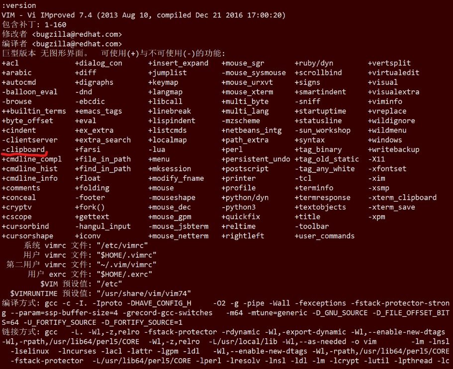

```
参考：
http://easwy.com/blog/archives/where-is-vimrc/
```

首先，让我们在Linux下的vim中输入“:version”命令



Windows下面输入“:version”查看结果


- 在windows下，有三个可选的用户vimrc文件，一个是$HOME\\_vimrc，另一个是$HOME\\vimfiles\\vimrc，还有一个是$VIM\\_vimrc。vim启动时，会先尝试执行系统的vimrc文件(通常此文件不存在)，然后将按照上述顺序查找用户vimrc，并执行所找到的第一个用户vimrc中的命令，忽略其余的用户vimrc。

- 在Linux下使用的vimrc文件名为vimrc，而在windows下因为不支持以点(.)开头的文件名，vimrc文件的名字使用\_vimrc。不过，在Linux下，如果未找到名为.vimrc的文件，也会尝试查找名为\_vimrc的文件；而在windows下也是这样，只不过查找顺序颠倒一下，如果未找到名为_vimrc的文件，会去查找.vimrc。

- 从这里可以看出，vimrc的执行先于gvimrc。所以我们可以把全部vim配置命令都放在vimrc中，不需要用gvimrc。

如果不知道$HOME或者$VIM具体是哪个目录，可以在vim中用下面的命令查看：

```
:echo $VIM 
:echo $HOME 
```

在windows版本的vim安装时，缺省会安装一个$VIM/\_vimrc的，你可以直接修改这个\_vimrc，加入你自己的配置(使用:e $VIM/\_vimrc可以打开此文件。或者，你也可以在windows中增加一个名为HOME的环境变量(控制面板->系统–>高级–>环境变量)，然后把你的vimrc放在HOME环境变量所指定的目录中。从上面:version命令的输出看到，$HOME/\_vimrc如果存在，就会执行这个文件中的配置，而跳过$VIM/\_vimrc。

如果使用”vim -u filename“命令来启动vim，则会用你指定的filename作为vim的配置文件(在调试你的vimrc时有用)；如果用”vim -u NORC“命令启动vim，则不读取任何vimrc文件：当你怀疑你的vimrc配置有问题时，可以用这种方式跳过vimrc的执行。

通过命令

```
:echo $MYVIMRC
```
查看当前vim配置文件路径