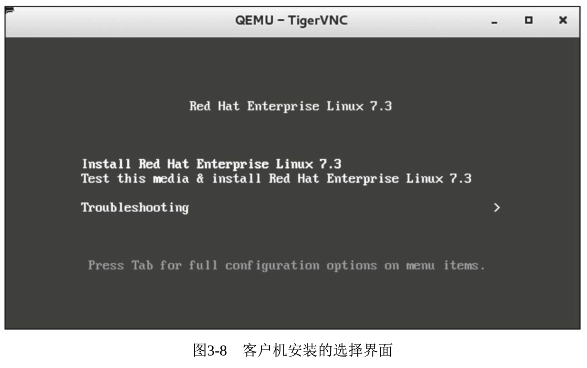

<!-- @import "[TOC]" {cmd="toc" depthFrom=1 depthTo=6 orderedList=false} -->

<!-- code_chunk_output -->

* [1 创建镜像文件](#1-创建镜像文件)
* [2 准备ISO文件](#2-准备iso文件)
* [3 启动虚拟机](#3-启动虚拟机)
* [4 安装虚拟机](#4-安装虚拟机)

<!-- /code_chunk_output -->

安装客户机（Guest）之前，我们需要创建一个**镜像文件**或者**磁盘分区**等，来存储客户机中的系统和文件。关于客户机镜像有很多种制作和存储方式（将在第4章中进行详细的介绍）。

# 1 创建镜像文件

首先，需要创建一个**镜像文件**。我们使用上节中生成好的**qemu\-img**工具来完成这个任务。它不仅用于**创建guest**，还可以在后续**管理guest image**。详见“qemu\-img \-\-help”及“man qemu\-img”。

```
[root@kvm-host ~]# qemu-img create -f raw rhel7.img 40G
Formatting 'rhel7.img', fmt=raw size=42949672960
```

上述就是用qemu\-img create命令创建了一个空白的guest image，以raw格式，image文件的名字是“rhel7.img”，大小是40G。虽然我们看到它的大小是40G，但是它并**不占用任何磁盘空间**。

```
[root@kvm-host ~]# ls -lh rhel7.img 
-rw-r--r-- 1 root root 40G Oct 15 10:44 rhel7.img

[root@kvm-host ~]# du -h rhel7.img 
0   rhel7.img
```

这是因为qemu\-img聪明地为你按实际需求分配文件的实际大小，它将随着image实际的使用而增大。

qemu\-img也支持设置参数让你可以一开始就实际占有40G（当然建立的过程也就比较耗时，还会占用你更大空间。所以qemu\-img默认的方式是按需分配的），如下：

```
[root@kvm-host ~]# qemu-img create -f raw -o preallocation=full rhel7.img 40G
Formatting 'rhel7.img', fmt=raw size=42949672960 preallocation=full

[root@kvm-host ~]# ls -lh rhel7.img 
-rw-r--r-- 1 root root 40G Oct 15 10:58 rhel7.img

[root@kvm-host ~]# du -h rhel7.img 
40G rhel7.img
```

除raw格式以外，qemu\-img还支持创建**其他格式**的image文件，比如**qcow2**，甚至是其他虚拟机用到的文件格式，比如**VMware**的**vmdk**、**vdi**、**vhd**等。不同的文件格式会有**不同的“\-o”选项**。

# 2 准备ISO文件

创建完空白guest image之后，我们将RHEL 7安装所需的ISO文件准备好。

```
[root@kvm-host ~]# ls -l  RHEL-7.2-20151030.0-Server-x86_64-dvd1.iso 
-rw-r--r-- 1 root root 4043309056 Oct 30  2015 RHEL-7.2-20151030.0-Server-x86_64-dvd1.iso
```

# 3 启动虚拟机

启动客户机，并在其中用准备好的ISO安装系统，命令行如下：

```
qemu-system-x86_64 -enable-kvm -m 8G -smp 4 -boot once=d -cdrom RHEL-7.2-20151030.0-Server-x86_64-dvd1.iso rhel7.img
```

其中，\-m 8G是给客户机分配8G内存，\-smp 4是指定客户机为对称多处理器结构并分配4个CPU，\-boot once=d是指定系统的启动顺序为首次光驱，以后再使用默认启动项（硬盘），\-cdrom\*\*是分配**客户机的光驱**。

# 4 安装虚拟机

**默认情况**下，QEMU会**启动一个VNC server端口（5900**），可以用**vncviwer工具**来连接到**QEMU的VNC端口**查看客户机。

通过启动时的提示，这里可以使用“vncviewer：5900”命令**连接到QEMU启动的窗口**。根据命令行指定的启动顺序，当有CDROM时，客户机默认会从光驱引导，启动后即可进入客户机系统安装界面，如图3\-8所示。



可以选择Install安装客户机操作系统，和安装普通Linux系统类似，根据需要做磁盘分区、选择需要的软件包等。
