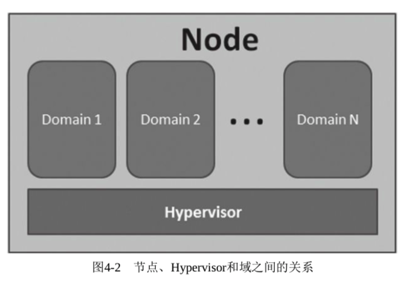

<!-- @import "[TOC]" {cmd="toc" depthFrom=1 depthTo=6 orderedList=false} -->

<!-- code_chunk_output -->

* [1 libvirt简介](#1-libvirt简介)
	* [1.1 多种虚拟化方案支持](#11-多种虚拟化方案支持)
	* [1.2 LGPL许可证](#12-lgpl许可证)
	* [1.3 编程语言支持、AMQP和加密认证](#13-编程语言支持-amqp和加密认证)
	* [1.4 基本架构](#14-基本架构)
	* [1.5 重要概念](#15-重要概念)
	* [1.6 管理功能](#16-管理功能)
		* [1.6.1 域的管理](#161-域的管理)
		* [1.6.2 远程节点的管理](#162-远程节点的管理)
		* [1.6.3 存储的管理](#163-存储的管理)
		* [1.6.4 网络的管理](#164-网络的管理)
		* [1.6.5 应用程序接口](#165-应用程序接口)
	* [1.7 libvirt组成](#17-libvirt组成)
* [2 libvirt的安装与配置](#2-libvirt的安装与配置)
	* [2.1 libvirt安装](#21-libvirt安装)

<!-- /code_chunk_output -->

# 1 libvirt简介

提到KVM的管理工具，首先不得不介绍的就是大名鼎鼎的**libvirt**，因为libvirt是目前使用最为广泛的对KVM虚拟机进行管理的工具和应用程序接口，而且一些常用的虚拟机管理工具（如**virsh**、**virt\-install**、**virt\-manager**等）和云计算框架平台（如OpenStack、ZStack、OpenNebula、Eucalyptus等）都在**底层使用libvirt的应用程序接口**。

libvirt是为了更方便地管理平台虚拟化技术而设计的开放源代码的应用程序接口、守护进程和管理工具，它不仅提供了对**虚拟化客户机的管理**，也提供了对**虚拟化网络和存储的管理！！！**。

## 1.1 多种虚拟化方案支持

libvirt支持**多种虚拟化方案**，既支持包括**KVM**、**QEMU**、**Xen**、**VMware**、**VirtualBox**、**Hyper\-V**等在内的**平台虚拟化方案**，也支持**OpenVZ**、**LXC**等**Linux容器虚拟化系统！！！**，还支持**用户态Linux（UML！！！**）的**虚拟化**。

## 1.2 LGPL许可证

libvirt是一个免费的开源的软件，使用的许可证是LGPL（**GNU宽松的通用公共许可证**），使用libvirt库进行链接的软件程序**不一定要选择开源和遵守GPL许可证**。和KVM、Xen等开源项目类似，libvirt也有自己的开发者社区，而且随着虚拟化、云计算等成为近年来的技术热点，libvirt项目的社区也比较活跃。目前，libvirt的开发主要由Redhat公司作为强大的支持，由于Redhat公司在虚拟化方面逐渐偏向于支持KVM（而不是Xen），故libvirt对QEMU/KVM的支持是非常成熟和稳定的。当然，IBM、Novell等公司以及众多的个人开发者对libvirt项目的代码贡献量也是非常大的。

## 1.3 编程语言支持、AMQP和加密认证

libvirt本身提供了一套较为稳定的**C语言应用程序接口**，目前，在其他一些流行的**编程语言**中也提供了对libvirt的绑定，在Python、Perl、Java、Ruby、PHP、OCaml等高级编程语言中已经有**libvirt的程序库**可以直接使用。libvirt还提供了为基于**AMQP（高级消息队列协议**）的**消息系统**（如Apache Qpid）提供**QMF代理**，这可以让云计算管理系统中**宿主机与客户机**、**客户机与客户机**之间的消息通信变得更易于实现。libvirt还为安全地**远程管理虚拟客户机**提供了**加密和认证**等安全措施。

正是由于libvirt拥有这些强大的功能和较为稳定的应用程序接口，而且它的许可证（license）也比较宽松，所以libvirt的应用程序接口已被广泛地用在基于虚拟化和云计算的解决方案中，主要作为**连接底层Hypervisor**和**上层应用程序**的一个**中间适配层**。

## 1.4 基本架构

libvirt对多种不同的Hypervisor的支持是通过一种**基于驱动程序的架构**来实现的。libvirt对**不同的Hypervisor**提供了**不同的驱动**：对Xen有Xen的驱动，对QEMU/KVM有QEMU驱动，对VMware有VMware驱动。在libvirt源代码中，可以很容易找到**qemu\_driver.c**、**xen\_driver.c**、**xenapi\_driver.c**、**VMware\_driver.c**、**vbox\_driver.c**这样的驱动程序源代码文件。

libvirt作为中间适配层，可以让底层Hypervisor对上层用户空间的管理工具是完全透明的，因为libvirt屏蔽了底层各种Hypervisor的细节，为上层管理工具提供了一个统一的、较稳定的接口（API）。通过libvirt，一些用户空间管理工具可以管理各种不同的Hypervisor和上面运行的客户机，它们之间基本的交互框架如图4-1所示。


## 1.5 重要概念

在libvirt中涉及几个重要的概念，解释如下：

- **节点（Node**）是一个**物理机器**，上面可能运行着多个虚拟客户机。Hypervisor和Domain都运行在节点上。
- **Hypervisor**也称**虚拟机监控器（VMM**），如KVM、Xen、VMware、Hyper\-V等，是**虚拟化中的一个底层软件层**，它可以虚拟化一个节点让其运行多个虚拟客户机（不同客户机可能有不同的配置和操作系统）。
- **域（Domain**）是在Hypervisor上运行的一个**客户机操作系统实例**。域也被称为实例（instance，如在亚马逊的AWS云计算服务中客户机就被称为实例）、客户机操作系统（guest OS）、虚拟机（virtual machine），它们都是指同一个概念。

节点、Hypervisor和域的关系可以简单地用图4\-2来表示。



## 1.6 管理功能

在了解了节点、Hypervisor和域的概念之后，用一句话概括libvirt的目标，那就是：为了**安全高效地管理节点上的各个域**，而提供一个**公共的稳定的软件层**。当然，这里的管理，既包括**本地的管理**，也包含**远程的管理**。

具体地讲，libvirt的**管理功能**主要包含如下5个部分。

### 1.6.1 域的管理

1）**域的管理**。

包括对节点上的域的各个**生命周期的管理**，如启动、停止、暂停、保存、恢复和**动态迁移**。还包括对**多种设备类型**的**热插拔操作**，包括磁盘、网卡、内存和CPU。当然不同的Hypervisor上对这些热插拔的支持程度有所不同。

### 1.6.2 远程节点的管理

2）**远程节点的管理**。

只要**物理节点**上运行了**libvirtd这个守护进程**，远程的管理程序就可以连接到该节点进程管理操作，经过认证和授权之后，**所有的libvirt功能**都可以被访问和使用。libvirt支持**多种网络远程传输类型**，如**SSH**、**TCP套接字**、**Unix domain socket**、**TLS的加密传输**等。假设使用了最简单的SSH，不需要额外的配置工作，比如，在example.com节点上运行了libvirtd，而且允许SSH访问，在远程的某台管理机器上就可以用如下的命令行来连接到example.com上，从而管理其上的域。

```
virsh -c qemu+ssh://root@example.com/system
```

### 1.6.3 存储的管理

3）**存储的管理**。

任何运行了**libvirtd守护进程的主机！！！**，都可以通过**libvirt**来管理**不同类型的存储**，如创建不同格式的客户机镜像（qcow2、raw、qde、vmdk等）、挂载NFS共享存储系统、查看现有的LVM卷组、创建新的LVM卷组和逻辑卷、对磁盘设备分区、挂载iSCSI共享存储、使用Ceph系统支持的RBD远程存储，等等。

当然在libvirt中，对存储的管理也是支持远程的。

### 1.6.4 网络的管理

4）**网络的管理**。

任何运行了**libvirtd守护进程的主机**，都可以通过libvirt来管理**物理的和逻辑的网络接口**。包括列出现有的网络接口卡，配置网络接口，创建虚拟网络接口，网络接口的桥接，VLAN管理，NAT网络设置，为客户机分配虚拟网络接口，等等。

### 1.6.5 应用程序接口

5）提供一个稳定、可靠、高效的**应用程序接口**，以便可以完成前面的4个管理功能。

## 1.7 libvirt组成

libvirt主要由3个部分组成，分别是：**应用程序编程接口库**、**一个守护进程（libvirtd**）和**一个默认命令行管理工具（virsh**）。

- **应用程序接口**是为其他虚拟机管理工具（如virsh、virt-manager等）提供虚拟机管理的**程序库支持**。
- **libvirtd守护进程**负责执行对节点上的**域的管理**工作，在用各种工具对虚拟机进行管理时，这个守护进程一定要处于**运行状态**中。而且这个守护进程可以分为两种：
    - 一种是**root权限**的**libvirtd**，其权限较大，可以完成所有支持的管理工作；
    - 一种是**普通用户权限**的**libvirtd**，只能完成比较受限的管理工作。
- virsh是libvirt项目中默认的对虚拟机管理的一个命令行工具，将在4.2节中详细介绍。

# 2 libvirt的安装与配置

## 2.1 libvirt安装

RHEL 系列中可以使用yum或rpm工具来安装对应的RPM包。

查看某系统中已经安装的libvirt相关的RPM包，命令行如下：

```

```