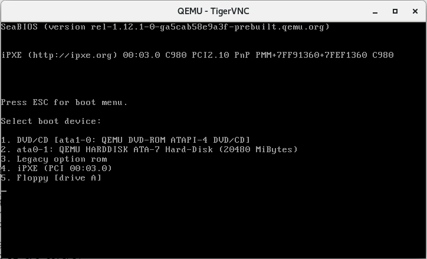

<!-- @import "[TOC]" {cmd="toc" depthFrom=1 depthTo=6 orderedList=false} -->

<!-- code_chunk_output -->

* [1 存储配置和启动顺序](#1-存储配置和启动顺序)
	* [1.1 存储的基本配置选项](#11-存储的基本配置选项)
		* [1.1.1 \-hda file](#111-hda-file)
		* [1.1.2 \-hdb file](#112-hdb-file)
		* [1.1.3 \-hdc file](#113-hdc-file)
		* [1.1.4 \-hdd file](#114-hdd-file)
		* [1.1.5 \-fda file](#115-fda-file)
		* [1.1.6 \-fdb file](#116-fdb-file)
		* [1.1.7 \-cdrom file](#117-cdrom-file)
		* [1.1.8 \-mtdblock file](#118-mtdblock-file)
		* [1.1.9 \-sd file](#119-sd-file)
		* [1.1.10 \-pflash file](#1110-pflash-file)
	* [1.2 详细配置存储驱动器的\-drive参数](#12-详细配置存储驱动器的-drive参数)
	* [1.3 配置客户机启动顺序的参数](#13-配置客户机启动顺序的参数)
	* [1.4 存储配置的示例](#14-存储配置的示例)
* [2 qemu\-img命令](#2-qemu-img命令)
	* [2.1 check: 一致性检查](#21-check-一致性检查)
	* [2.2 create: 创建镜像](#22-create-创建镜像)
	* [2.3 commit: 提交更改到后端镜像文件](#23-commit-提交更改到后端镜像文件)
	* [2.4 convert: 镜像格式转换](#24-convert-镜像格式转换)
	* [2.5 info: 镜像信息](#25-info-镜像信息)
	* [2.6 snapshot: 快照相关](#26-snapshot-快照相关)
	* [2.7 rebase: 改变后端镜像文件](#27-rebase-改变后端镜像文件)

<!-- /code_chunk_output -->

# 1 存储配置和启动顺序

QEMU提供了对多种块存储设备的模拟，包括**IDE设备**、**SCSI设备**、**软盘**、**U盘**、**virtio磁盘**等，而且对设备的启动顺序提供了灵活的配置。

## 1.1 存储的基本配置选项

在qemu命令行工具中，主要有如下的参数来配置客户机的存储。

### 1.1.1 \-hda file

将file镜像文件作为客户机中的**第1个IDE设备**（序号0），在**客户机**中表现为/**dev/hda设备**（若**客户机！！！**中使用**PIIX\_IDE驱动！！！**）或/**dev/sda**设备（若客户机中使用**ata\_piix驱动！！！**）。

如果**不指定\-hda或\-hdb等参数**，那么在前面一些例子中提到的“qemu\-system\-x86\_64 /root/kvm\_demo/rhel6u3.img”就与加上\-**hda参数**来指定镜像文件的效果是一样的。

另外，也可以将**宿主机！！！**中的**一个硬盘！！！**（如/**dev/sdb**）作为\-hda的file参数来使用，从而让**整个硬盘**模拟为客户机的**第1个IDE设备**。

如果**file文件的文件名**中包含有**英文逗号（“,**”），则在书写file时应该使用**两个逗号**（因为**逗号是qemu命令行中的特殊间隔符**），如使用“\-hda my,,file”将“my,file”这个文件作为客户机的第1个IDE设备。

### 1.1.2 \-hdb file

将file作为客户机中的**第2个IDE设备**（序号1），在客户机中表现为/**dev/hdb**或/**dev/sdb**设备。

### 1.1.3 \-hdc file

将file作为客户机中的**第3个IDE设备**（序号2），在客户机中表现为/**dev/hdc**或/**dev/sdc**设备。

### 1.1.4 \-hdd file

将file作为客户机中的第4个IDE设备（序号3），在客户机中表现为/dev/hdd或/dev/sdd设备。

### 1.1.5 \-fda file

将file作为客户机中的**第1个软盘设备**（序号0），在客户机中表现为/**dev/fd0**设备。也可以将**宿主机**中的**软驱**（/dev/fd0）作为\-fda的file来使用。

### 1.1.6 \-fdb file

将file作为客户机中的**第2个软盘设备**（序号1），在客户机中表现为/dev/fd1设备。

### 1.1.7 \-cdrom file

将**file**作为**客户机**中的**光盘CD\-ROM**，在客户机中通常表现为/**dev/cdrom设备**。

也可以将**宿主机中的光驱**（/**dev/cdrom**）作为\-cdrom的file来使用。

注意，\-**cdrom**参数不能和\-**hdc参数**同时使用，因为“\-cdrom”就是**客户机**中的**第3个IDE设备！！！**。

在通过**物理光驱中的光盘**或**磁盘中ISO镜像**文件**安装客户机操作系统**时（参见3.5节），**一般会使用\-cdrom参数**。

### 1.1.8 \-mtdblock file

使用file文件作为客户机自带的一个**Flash存储器**（通常说的**闪存**）。

### 1.1.9 \-sd file

使用file文件作为客户机中的**SD卡**（Secure Digital Card）。

### 1.1.10 \-pflash file

使用file文件作为客户机的并行Flash存储器（Parallel Flash Memory）。

## 1.2 详细配置存储驱动器的\-drive参数

QEMU还提供了“\-drive”参数来**详细定义一个存储驱动器**，该参数的具体形式如下：

```
-drive option[,option[,option[,...]]]
```

为客户机定义一个新的驱动器，它有如下一些选项：

（1）file=file

使用file文件作为镜像文件加载到客户机的驱动器中。

（2）if=interface

指定驱动器使用的接口类型，可用的类型有：**ide**、**scsi**、**sd**、**mtd**、floopy、pflash、virtio，等等。

其中，除了virtio、scsi之外，其余几种类型都在本节的前面介绍过了。virtio将在第6章中介绍。

（3）bus=bus，unit=unit

设置驱动器在客户机中的**总线编号**和**单元编号**。

（4）index=index

设置在同一种接口的驱动器中的**索引编号**。

（5）media=media

设置驱动器中**媒介的类型**，其值为“**disk**”或“**cdrom**”。

（6）snapshot=snapshot

设置是否启用“\-snapshot”选项，其可选值为“on”或“off”。

当**snapshot启用**时，QEMU**不会**将**磁盘数据的更改**写回**镜像文件**中，而是写到**临时文件**中。

当然可以在QEMU monitor中使用“**commit**”命令强制将磁盘数据的更改保存回镜像文件中。

（7）cache=cache

设置宿主机对**块设备数据**（包括**文件**或**一个磁盘**）访问中的**cache情况**，可以设置为“**none**”（或“**off**”）“**writeback**”“**writethrough**”等。

其**默认值**是“**writethrough**”，即“**直写模式**”，它是在**调用write**写入数据的**同时**将数据**写入磁盘缓存**（disk cache）和**后端块设备**（block device）中，其优点是操作简单，其缺点是写入数据速度较慢。

而“writeback”即“回写模式”，在调用write写入数据时只将数据写入磁盘缓存中即返回，只有在数据被换出缓存时才将修改的数据写到后端存储中。其优点是写入数据速度较快，其缺点是一旦更新数据在写入后端存储之前遇到系统掉电，数据会无法恢复。

“writethrough”和“writeback”在读取数据时都**尽量使用缓存**，若设置了“cache=none”关闭缓存的方式，QEMU将在调用open系统调用打开镜像文件时使用“O\_DIRECT”标识，所以其读写数据都是**绕过缓存**直接从块设备中读写的。

一些**块设备文件**（如后面即将介绍的**qcow2**格式文件）在“**writethrough**”模式下性能表现很差，如果这时对性能要求比正确性更高，建议使用“writeback”模式。

（8）aio=aio

选择**异步IO**（Asynchronous IO）的方式，有“**threads**”和“**native**”两个值可选。

- 其默认值为“threads”，即让**一个线程池**去处理**异步IO**。
- 而“native”只适用于“**cache=none**”的情况，就是使用**Linux原生的AIO**。

（9）format=format

指定使用的**磁盘格式**，在**默认**情况下QEMU**自动检测磁盘格式**。

（10）serial=serial

指定分配给**设备的序列号**。

（11）addr=addr

分配给驱动器控制器的**PCI地址**，该选项只有在使用**virtio接口**时才适用。

（12）id=name

设置该**驱动器的ID**，这个ID可以在QEMU monitor中用“**info block**”看到。

（13）readonly=on|off

设置该驱动器是否只读。

```
-drive file=rbd:volumes/volume-684a7a54-0cfc-4bf5-b1ab-8e43145b112c:id=cinder-volume:auth_supported=cephx\;none:mon_host=10.5.8.126\:6789\;10.5.8.127\:6789\;10.5.8.128\:6789,file.password-secret=virtio-disk0-secret0,format=raw,if=none,id=drive-virtio-disk0,serial=684a7a54-0cfc-4bf5-b1ab-8e43145b112c,cache=none,discard=unmap
```

## 1.3 配置客户机启动顺序的参数

前面介绍了各种存储设备的使用参数，它们在客户机中的启动顺序可以用如下的参数设定：

```
-boot [order=drives][,once=drives][,menu=on|off] [,splash=splashfile] [,splash-time=sp-time]
```

在QEMU模拟的**x86 PC**平台中，用“**a**”“**b**”分别表示**第1个**和**第2个软驱**，用“**c**”表示**第1个硬盘**，用“**d**”表示**CD\-ROM光驱**，用“**n**”表示**从网络启动**。

其中，**默认从硬盘启动**，要从**光盘启动**可以设置“\-boot order=d”。

“once”表示设置第1次启动的启动顺序，在**系统重启（reboot）后该设置即无效**，如“\-boot once=d”设置表示本次从光盘启动，但**系统重启**后从**默认的硬盘启动**。

“memu=on|off”用于设置**交互式的启动菜单选项**（前提是使用的**客户机BIOS支持！！！**），它的默认值是“menu=off”，表示不开启交互式的启动菜单选择。

“splash=splashfile”和“splash\-time=sp\-time”选项都是在“**menu=on**”时才有效，

- 将名为**splashfile的图片**作为**logo**传递给BIOS来显示；
- 而**sp\-time**是**BIOS显示splash图片的时间**，其单位是**毫秒**（ms）。

图5-5展示了在使用“\-**boot order=dc，menu=on**”设置后，在客户机启动窗口中按esc键进入的启动菜单。

```
qemu-system-x86_64 -enable-kvm -m 2G -hdb /data/images/centos7.4.20g.qcow2 -boot order=dcn,menu=on,splash=/root/t.jpeg,splash-time=20000 -daemonize
```



## 1.4 存储配置的示例

在介绍完基本的参数与启动顺序后，通过示例来看一下磁盘实际配置和在客户机中的效果。通过如下的3个等价命令之一启动一个客户机。

```
qemu-system-x86_64 -m 1024 -smp 2 rhel7.img
qemu-system-x86_64 -m 1024 -smp 2 -hda rhel7.img
qemu-system-x86_64 -m 1024 -smp 2 -drive file=rhel7.img,if=ide
```

进入启动菜单

在客户机中查看磁盘情况

# 2 qemu\-img命令

qemu\-img是QEMU的**磁盘管理工具**，在完成**QEMU源码！！！编译后**就会**默认编译**好qemu\-img这个二进制文件。

qemu-img工具的命令行基本用法如下：

```
qemu-img [standard options] command [command options]
```

它支持的命令分为如下几种。

## 2.1 check: 一致性检查

```
check [-f fmt] filename
```

对**磁盘镜像文件**进行**一致性检查**，查找镜像文件中的错误，目前**仅支持**对“**qcow2**”“**qed**”“**vdi**”格式文件的检查。其中，

- qcow2是目前使用最广泛的格式。
- qed（QEMU enhanced disk）是从QEMU 0.14版开始加入的增强磁盘文件格式，它可以在不支持空洞（hole）的文件系统和存储媒介上压缩image，避免了qcow2格式的一些缺点，也提高了性能。
- 而vdi（Virtual Disk Image）是Oracle的VirtualBox虚拟机中的存储格式。

参数\-f fmt是指定文件的格式，如果**不指定格式**，qemu\-img会**自动检测**。filename是磁盘镜像文件的名称（包括路径）。

如下命令行演示了qemu\-img的check命令的使用方法。

```
[root@kvm-host ~]# qemu-img check rhel7.3.qcow2
No errors were found on the image.
Image end offset: 262144
```

## 2.2 create: 创建镜像

```
create [-f fmt] [-o options] filename [size]
```

创建一个**格式为fmt**，**大小为size**，文件名为filename的镜像文件。

根据文件格式**fmt的不同**，还可以添加**一个或多个选项（options**）来附加对该文件的各种功能设置。

可以使用“\-o ?”来查询某种格式文件**支持哪些选项**，在“\-o”选项中**各个选项用逗号来分隔**。

如果在“\-o”选项中使用了**backing\_file**这个选项来指定其**后端镜像文件**，那么这个**创建的镜像文件**仅记录与**后端镜像文件**的**差异部分**。

**后端镜像文件不会被修改！！！**，除非在**QEMU monitor**中使用“**commit**”命令或使用“**qemu\-img commit**”命令去手动提交这些改动。在这种情况下，**size参数不是必需**的，其值**默认**为**后端镜像文件的大小**。

另外，直接使用“\-**b backfile**”参数效果也与“\-**o backing\_file=backfile**”相同。

size选项用于指定**镜像文件的大小**，其**默认**单位是**字节（bytes**），也可以支持**k（即K**）、**M**、**G**、**T**来分别表示**kB**、**MB**、**GB**、**TB**大小。另外，镜像文件的大小（**size**）也并非必须写在命令的最后，也可以写在“\-o”选项中作为**其中一个选项**。

对create命令的演示如下所示，其中包括查询qcow2格式支持的选项、创建有backing_file的qcow2格式的镜像文件、创建没有backing_file的10GB大小的qcow2格式的镜像文件。

```
[root@gerrylee ~]# qemu-img create -f qcow2 -o ?
Supported qcow2 options:
  backing_file=<str>     - File name of a base image
  backing_fmt=<str>      - Image format of the base image
  cluster_size=<size>    - qcow2 cluster size
  compat=<str>           - Compatibility level (0.10 or 1.1)
  data_file=<str>        - File name of an external data file
  data_file_raw=<bool (on/off)> - The external data file must stay valid as a raw image
  encrypt.cipher-alg=<str> - Name of encryption cipher algorithm
  encrypt.cipher-mode=<str> - Name of encryption cipher mode
  encrypt.format=<str>   - Encrypt the image, format choices: 'aes', 'luks'
  encrypt.hash-alg=<str> - Name of encryption hash algorithm
  encrypt.iter-time=<num> - Time to spend in PBKDF in milliseconds
  encrypt.ivgen-alg=<str> - Name of IV generator algorithm
  encrypt.ivgen-hash-alg=<str> - Name of IV generator hash algorithm
  encrypt.key-secret=<str> - ID of secret providing qcow AES key or LUKS passphrase
  encryption=<bool (on/off)> - Encrypt the image with format 'aes'. (Deprecated in favor of encrypt.format=aes)
  lazy_refcounts=<bool (on/off)> - Postpone refcount updates
  preallocation=<str>    - Preallocation mode (allowed values: off, metadata, falloc, full)
  refcount_bits=<num>    - Width of a reference count entry in bits
  size=<size>            - Virtual disk size

The protocol level may support further options.
Specify the target filename to include those options.

[root@kvm-host ~]# qemu-img create -f qcow2 -o backing_file=rhel7.img,size=20G  rhel7-2.qcow2
Formatting 'rhel7-2.qcow2', fmt=qcow2 size=21474836480 backing_file=rhel7.img encryption=off cluster_size=65536 lazy_refcounts=off refcount_bits=16 

[root@kvm-host ~]# qemu-img create -f qcow2 ubuntu.qcow2 10G
Formatting 'ubuntu.qcow2', fmt=qcow2 size=10737418240 encryption=off cluster_size=65536 lazy_refcounts=off refcount_bits=16
```

## 2.3 commit: 提交更改到后端镜像文件

```
commit[-f fmt]filename
```

提交filename文件中的更改到后端支持镜像文件（创建时通过**backing\_file**指定的）中。

## 2.4 convert: 镜像格式转换

```
convert[-c][-f fmt][-O output_fmt][-o options]filename[filename2[...]]output_filename
```

将fmt格式的filename镜像文件根据**options选项**转换为格式为**output\_fmt的**、名为output\_filename的镜像文件。

这个命令支持不同格式的镜像文件之间的转换，比如可以用VMware使用的**vmdk格式**文件转换为**qcow2**文件，这对从其他虚拟化方案转移到KVM上的用户非常有用。

一般来说，**输入文件格式**fmt由qemu\-img工具**自动检测**到，而**输出文件格式**output\_fmt根据自己需要来指定，**默认**会被转换为**raw文件格式**（且默认使用**稀疏文件的方式存储**，以节省存储空间）。

其中，“\-c”参数表示对输出的镜像文件进行**压缩**，不过只有**qcow2**和**qcow**格式的镜像文件才支持压缩，并且**这种压缩是只读的**，如果压缩的扇区被重写，则会被重写为未压缩的数据。

同样，可以使用“\-**o options**”来指定各种选项，如后端镜像、文件大小、是否加密等。使用backing\_file选项来指定后端镜像，使生成的文件成为copy\-on\-write的增量文件，这时必须让在转换命令中指定的后端镜像与输入文件的后端镜像的内容相同，尽管它们各自后端镜像的目录和格式可能不同。

如果使用qcow2、qcow等作为输出文件格式来转换raw格式的镜像文件（非稀疏文件格式），镜像转换还可以将镜像文件转化为更小的镜像，因为它可以将空的扇区删除，使之在生成的输出文件中不存在。

下面的命令行演示了两个转换：将VMware的vmdk格式镜像转换为KVM可以使用的raw格式的镜像，将一个raw镜像文件转化为qcow2格式的镜像。

```
[root@kvm-host ~]# qemu-img convert -O raw my-VMware.vmdk my-kvm.img
#此处并无实际存在vmdk文件，仅演示其命令行操作

[root@kvm-host ~]# qemu-img convert -O qcow2 rhel7.img rhel7-a.qcow2
```

## 2.5 info: 镜像信息

```
info[-f fmt]filename
```

展示filename镜像文件的信息。如果文件使用的是稀疏文件的存储方式，也会显示出它本来分配的大小及实际已占用的磁盘空间大小。如果文件中存放有客户机快照，快照的信息也会被显示出来。下面的命令行演示了前面进行文件转换的输入、输出文件的信息。

```
[root@kvm-host ~]# qemu-img info rhel7.img 
image: rhel7.img
file format: raw
virtual size: 40G (42949672960 bytes)
disk size: 40G
[root@kvm-host ~]# qemu-img info rhel7-a.qcow2 
image: rhel7-a.qcow2
file format: qcow2
virtual size: 40G (42949672960 bytes)
disk size: 24G
cluster_size: 65536
Format specific information:
    compat: 1.1
    lazy refcounts: false
    refcount bits: 16
    corrupt: false
```

## 2.6 snapshot: 快照相关

```
snapshot[-l|-a snapshot|-c snapshot|-d snapshot]filename
```

- “\-l”选项表示查询并列出镜像文件中的所有快照，

- “\-a snapshot”表示让镜像文件使用某个快照，

- “\-c snapshot”表示创建一个快照，

- “\-d”表示删除一个快照。

## 2.7 rebase: 改变后端镜像文件

```
rebase[-f fmt][-t cache][-p][-u]-b backing_file[-F backing_fmt]filename
```

改变镜像文件的后端镜像文件，只有qcow2和qed格式支持rebase命令。使用“-b backing_file”中指定的文件作为后端镜像，后端镜像也被转化为“-F backing_fmt”中指定的后端镜像格式。
这个命令可以工作于两种模式之下，一种是安全模式（Safe Mode），这是默认的模式，qemu-img会根据比较原来的后端镜像与现在的后端镜像的不同进行合理的处理；另一种是非安全模式（Unsafe Mode），是通过“-u”参数来指定的，这种模式主要用于将后端镜像重命名或移动位置后对前端镜像文件的修复处理，由用户去保证后端镜像的一致性。
（8）resize filename[+|-]size
改变镜像文件的大小，使其不同于创建之时的大小。“+”和“-”分别表示增加和减少镜像文件的大小，size也支持K、M、G、T等单位的使用。缩小镜像的大小之前，需要在客户机中保证其中的文件系统有空余空间，否则数据会丢失。另外，qcow2格式文件不支持缩小镜像的操作。在增加了镜像文件大小后，也需启动客户机在其中应用“fdisk”“parted”等分区工具进行相应的操作，才能真正让客户机使用到增加后的镜像空间。不过使用resize命令时需要小心（做好备份），如果失败，可能会导致镜像文件无法正常使用，而造成数据丢失。
如下命令行演示了两个镜像的大小改变：将一个8GB的qcow2镜像增加2GB的空间，将一个8GB大小的raw镜像减少1GB的空间。