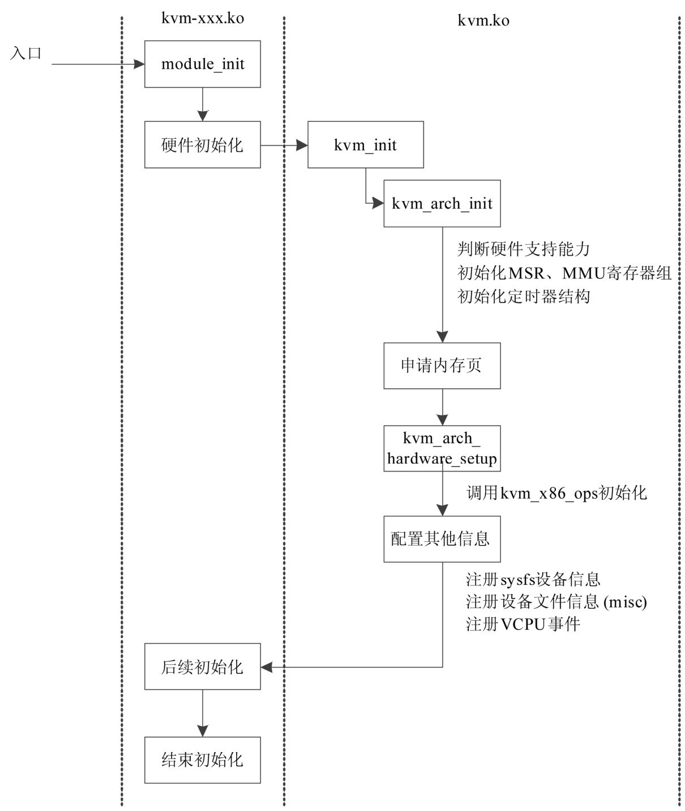

<!-- @import "[TOC]" {cmd="toc" depthFrom=1 depthTo=6 orderedList=false} -->

<!-- code_chunk_output -->

- [ 1 初始化流程](#1-初始化流程)
- [ 2 虚拟机的创建](#2-虚拟机的创建)
- [ 3 vCPU的创建](#3-vcpu的创建)

<!-- /code_chunk_output -->

# 1 初始化流程

KVM模块分为三个主要模块：kvm.ko、kvm\-intel.ko和kvm\-amd.ko，这三个模块在初始化阶段的流程如图5\-4所示。

图5\-4 KVM模块初始化阶段:


KVM模块可以编译进内核中，也可以作为内核模块在Linux系统启动完成之后加载。加载时，KVM 根据主机所用的体系架构是 Intel的 VMX技术还是AMD的SVM技术，会采用略微不同的加载流程。

Linux的子模块入口通常通过module_init宏进行定义，由内核进行调用。KVM的初始化流程如图5\-5所示。

KVM的初始化步骤分为以下三步。

1）在平台相关的KVM模块中通过module\_init宏正式进入KVM的初始化阶段，并且执行相关的硬件初始化准备。

图5\-5 KVM的初始化流程:



2）进入kvm\_main.c中的kvm\_init函数进行正式的初始化工作，期间进行了一系列子操作。

- 通过kvm\_arch\_init函数初始化KVM内部的一些数据结构：注册全局
变量kvm\_x86\_ops、初始化MMU等数据结构、初始化Timer定时器架构。
- 分配KVM内部操作所需要的内存空间。
- 调用kvm\_x86\_ops的hardware\_setup函数进行具体的硬件体系结构的初始化工作。
- 注册sysfs和devfs等API接口信息。
- 最后初始化debugfs的调试信息。

3）进行后续的硬件初始化准备操作。

# 2 虚拟机的创建

基于KVM的虚拟机创建分为虚拟机创建和虚拟CPU创建两个步骤。在下文的描述中，虚拟机对应的文件描述符为vm\_fd，虚拟CPU对应的文件描述符为vcpu\_fd。

打开/dev/kvm 文件并且获得文件描述符 fd 后，通过 ioctl 指令写入KVM\_CREATE\_KVM，即可创建一个 VM 虚拟。KVM 的该部分代码实现在kvm\_dev 的 file\_operation 结构体中，对应的代码在 kvm\_main.c 中调用 kvm\_dev\_ioctl\_creat\_vm函数实现，其代码如下：

代码5-7 KVM_CREATE_VM实现代码

```
(1880)        case KVM_CREATE_VM:
(1881)             r = -EINVAL;
(1882)             if (arg)
(1883)                  goto out;
(1884)             r = kvm_dev_ioctl_create_vm();
(1885)             break;
```

kvm\_dev\_ioctl\_create\_vm函数通过调用kvm\_create函数对KVM结构体进行创建。KVM 结构体如前文所述，保存了虚拟机运行的上下文及其他相关状态，在使用之前，需要进行一定的初始化工作。

在 x86体系架构中，KVM结构体的初始化任务在 kvm\_arch\_create\_vm函数中进行，进行了分配内存、初始化设备列表、设置中断管理和初始化 tsc 的spin\_lock的功能。在完成之后，将执行硬件初始化工作，该部分硬件初始化工作通过调用on\_each\_cpu宏，将在每个物理CPU上执行同样的操作。

该操作主要是尝试将所有的CPU切换入vitualize模式，并且设置好时钟等信息，这个过程通过 kvm\_arch\_hardware\_enable 函数完成。该函数代码(arch/x86/kvm/x86.c)如下，主要执行了两个工作：整理CPU的时钟信息；调用kvm_x86_ops的硬件相关的函数进行具体操作。
代码5-8 kvm_arch_hardware_enable函数代码

    (5799)   int kvm_arch_hardware_enable(void *garbage)
    (5800)   {
    (5801)        struct kvm *kvm;
    (5802)        struct kvm_vcpu *vcpu;
    (5803)        int i;
    (5804)
    (5805)        kvm_shared_msr_cpu_online();
    (5806)        list_for_each_entry(kvm, &vm_list, vm_list)
    (5807)             kvm_for_each_vcpu(i, vcpu, kvm)
    (5808)                  if (vcpu->cpu == smp_processor_id())
    (5809)                       kvm_make_request(KVM_REQ_CLOCK_UPDATE, vcpu);
    (5810)        return kvm_x86_ops->hardware_enable(garbage);
    (5811)   }
接下来，将初始化 KVM 的 memslot 结构体、Bus 总线结构体信息、scru读/写锁信息、eventfd事件通知信息、mmu内存管理结构体信息。
然后，调用 anon_inode_getfd 函数。该函数设置了对所有 KVM 的操作都将给予kvm_vm这个共享文件进行，该共享文件的操作封装在kvm_vm_fops结构体中，对VM的操作实际上就是对此文件的操作。因此，对其ioctl调用的是kvm_vm_fops中的成员函数。
代码5-9 调用anon_inode_getfd创建kvm-vm

```

    (1840)        fd = anon_inode_getfd("kvm-vm", &kvm_vm_fops, kvm, O_RDWR);
    (1841)        if (fd < 0)
    (1842)             kvm_put_kvm(kvm);
    (1843)
    (1844)        return fd;
```

通过anon_inode_getfd获得的fd文件描述符，就是供用户态使用的vm_fd，用户态将通过该fd进行进一步的虚拟机操作，首先要做的事情是初始化vCPU。

# 3 vCPU的创建

创建vCPU实际上就是创建vCPU的描述符，在KVM中，vCPU对应的数据结构体为kvm_vcpu。因此，创建vCPU的描述符，简单来说就是分配相应大小的内存，并且进行相应的初始化工作。kvm_vcpu中描述符包含的内容有很多，通常会包含各个平台通用的内容和平台相关的内容。

在物理CPU上电之后，需要进一步初始化才可以使用。在这个过程中，硬件会自动将CPU初始化成特定的状态。kvm_vcpu的初始化也是一个类似的过程，将 kvm_vcpu 的各个数据结构体设置成为可用的状态，通常需要包含如下内容。

- 分配vCPU标识，设置cpu_id属于哪个KVM虚拟机，并且分配对该vCPU的唯一标识符。
- 初始化虚拟寄存器组。
- 初始化 kvm_vcpu 的状态信息，设置 kvm_vcpu 在被调度前需要配置的必要标志。
- 初始化额外的信息，并且配置apic等虚拟化组件。

接下来讲述KVM中vCPU的创建过程。在获得了fd\_vm之后，通过ioctl调用KVM_CREATE\_VCPU指令，可以对该fd_vm对应的虚拟机创建vCPU，其入口函数地址在kvm_vm_ioctl函数中，通过switch之后，程序流程将选择进入kvm_vm_ioctl_create_vcpu函数中进行处理，其代码如下。

代码5-10 kvm_vm_ioctl_create_vcpu代码

```c
    (1366)   static int kvm_vm_ioctl_create_vcpu(struct kvm *kvm, u32 id)
    (1367)   {
    (1368)        int r;
    (1369)        struct kvm_vcpu *vcpu, *v;
    (1370)
    (1371)        vcpu = kvm_arch_vcpu_create(kvm, id);
    (1372)        if (IS_ERR(vcpu))
    (1373)             return PTR_ERR(vcpu);
    (1374)
    (1375)        preempt_notifier_init(&vcpu->preempt_notifier, &kvm_preempt_ops);
    (1376)
    (1377)        r = kvm_arch_vcpu_setup(vcpu);
    (1378)        if (r)
    (1379)             return r;
    (1380)
    (1381)        mutex_lock(&kvm->lock);
    (1382)        if (atomic_read(&kvm->online_vcpus) == KVM_MAX_VCPUS) {
    (1383)             r = -EINVAL;
    (1384)             goto vcpu_destroy;
    (1385)        }
    (1386)
    (1387)        kvm_for_each_vcpu(r, v, kvm)
    (1388)             if (v->vcpu_id == id) {
    (1389)                  r = -EEXIST;
    (1390)                  goto vcpu_destroy;
    (1391)             }
    (1392)
    (1393)        BUG_ON(kvm->vcpus[atomic_read(&kvm->online_vcpus)]);
    (1394)
    (1395)        /* Now it's all set up, let userspace reach it */
    (1396)        kvm_get_kvm(kvm);
    (1397)        r = create_vcpu_fd(vcpu);
    (1398)        if (r < 0) {
    (1399)             kvm_put_kvm(kvm);
    (1400)             goto vcpu_destroy;
    (1401)        }
    (1402)
    (1403)        kvm->vcpus[atomic_read(&kvm->online_vcpus)] = vcpu;
    (1404)        smp_wmb();
    (1405)        atomic_inc(&kvm->online_vcpus);
    (1406)
    (1407)   #ifdef CONFIG_KVM_APIC_ARCHITECTURE
    (1408)        if (kvm->bsp_vcpu_id == id)
    (1409)             kvm->bsp_vcpu = vcpu;
    (1410)   #endif
    (1411)        mutex_unlock(&kvm->lock);
    (1412)        return r;
    (1413)
    (1414)   vcpu_destroy:
    (1415)        mutex_unlock(&kvm->lock);
    (1416)        kvm_arch_vcpu_destroy(vcpu);
    (1417)        return r;
    (1418)   }
```

首先，在1371行，调用kvm_arch_vcpu_create函数创建一个kvm_vcpu结构体。该创建内容与架构相关，因此，直接调用kvm_x86_ops中的create_vcpu方法执行。虽然代码不同，但是AMD平台和Intel平台实现的思路都是类似的：先指定