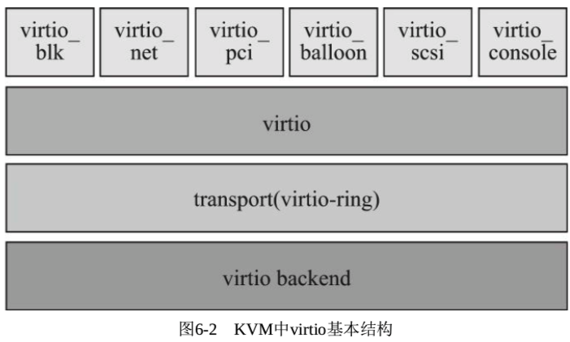

<!-- @import "[TOC]" {cmd="toc" depthFrom=1 depthTo=6 orderedList=false} -->

<!-- code_chunk_output -->

* [1 虚拟化概述](#1-虚拟化概述)
* [2 QEMU模拟I/O设备](#2-qemu模拟io设备)
	* [2.1 基本原理](#21-基本原理)
	* [2.2 优点](#22-优点)
	* [2.3 缺点](#23-缺点)
* [3 virtio的基本原理和优缺点](#3-virtio的基本原理和优缺点)
* [4 安装virtio驱动](#4-安装virtio驱动)
	* [4.1 Linux客户机中的virtio驱动](#41-linux客户机中的virtio驱动)
		* [4.1.1 virtio相关内核模块](#411-virtio相关内核模块)
	* [4.2 Windows客户机中的virtio驱动](#42-windows客户机中的virtio驱动)

<!-- /code_chunk_output -->

# 1 虚拟化概述

KVM是必须使用硬件虚拟化辅助技术（如Intel VT\-x、AMD\-V）的Hypervisor，在**CPU**运行效率方面有硬件支持，其**效率是比较高**的；

在有**Intel EPT**特性支持的平台上，**内存虚拟化**的效率也较高；

有**Intel VT\-d**的支持，其**I/O虚拟化**的效率也很高。

QEMU/KVM提供了全虚拟化环境，可以让客户机不经过任何修改就能运行在KVM环境中。不过，KVM在**I/O虚拟化**方面，**传统的方式**是使用**QEMU纯软件的方式**来**模拟I/O设备**（如第5章中提到模拟的网卡、磁盘、显卡等），其**效率并不太高**。

在KVM中，可以在客户机中使用**半虚拟化驱动**（**Paravirtualized Drivers，PV Drivers**）来提高客户机的性能（特别是**I/O性能**）。目前，KVM中实现半虚拟化驱动的方式是采用**virtio**这个Linux上的**设备驱动标准框架**。

# 2 QEMU模拟I/O设备

## 2.1 基本原理

QEMU以纯软件方式模拟现实世界中的I/O设备的基本过程模型如图6\-1所示。



在使用QEMU模拟I/O的情况下，当**客户机**中的**设备驱动程序（Device Driver**）发起**I/O操作请求**时，**KVM模块（Module**）中的**I/O操作捕获代码**会拦截这次I/O请求，然后在经过处理后将**本次I/O请求的信息**存放到**I/O共享页（sharing page**），并**通知用户空间的QEMU程序**。QEMU模拟程序获得**I/O操作的具体信息**之后，交由**硬件模拟代码（Emulation Code**）来模拟出本次的I/O操作，完成之后，将**结果放回到I/O共享页**，并通知KVM模块中的I/O操作捕获代码。最后，由KVM模块中的捕获代码读取I/O共享页中的操作结果，并把结果返回客户机中。当然，在这个操作过程中，**客户机**作为一个**QEMU进程**在**等待I/O时也可能被阻塞**。

另外，当客户机通过**DMA**（Direct Memory Access）访问**大块I/O**时，**QEMU**模拟程序将**不会把操作结果放到I/O共享页**中，而是通过**内存映射的方式**将结果**直接写到客户机的内存**中去，然后通过KVM模块告诉客户机DMA操作已经完成。

## 2.2 优点

QEMU模拟I/O设备的方式的优点是，可以通过软件模拟出各种各样的硬件设备，包括一些不常用的或很老很经典的设备（如5.5节中提到的e1000网卡），而且该方式**不用修改客户机操作系统**，就可以使模拟设备在客户机中正常工作。在KVM客户机中使用这种方式，对于解决手上没有足够设备的软件开发及调试有非常大的好处。

## 2.3 缺点

而QEMU模拟I/O设备的方式的缺点是，**每次I/O操作的路径比较长**，有**较多的VMEntry**、**VMExit**发生，需要**多次上下文切换**（context switch），也需要**多次数据复制**，所以它的**性能较差**。

# 3 virtio的基本原理和优缺点

virtio最初由澳大利亚的一个天才级程序员Rusty Russell编写，是一个在Hypervisor之上的**抽象API接口**，让**客户机**知道自己运行在虚拟化环境中，进而根据virtio标准**与Hypervisor协作**，从而在客户机中达到**更好的性能**（特别是**I/O性能**）。

目前，有不少虚拟机采用了virtio半虚拟化驱动来提高性能，如KVM和Lguest。

在QEMU/KVM中，virtio的基本结构如图6-2所示。



- 其中**前端驱动**（**frondend**，如**virtio\-blk**、**virtio\-net**等）是在**客户机**中存在的**驱动程序模块**，

- 而**后端处理程序（backend**）是在**QEMU中实现**的。QEMU中virtio相关代码在**hw**目录下, 带有**virtio关键字**的文件.

在**前后端驱动之间**，还定义了**两层**来支持**客户机**与**QEMU**之间的**通信**。

- 其中，“**virtio！！！**” 这一层是**虚拟队列接口**，它在概念上将前端驱动程序附加到后端处理程序。

**一个前端驱动**程序可以使用**0个或多个队列**，具体数量取决于需求。例如，**virtio\-net网络驱动程序**使用**两个虚拟队列**（**一个用于接收**，**另一个用于发送**），而**virtio\-blk块驱动程序**仅使用**一个虚拟队列**。虚拟队列实际上被实现为**跨越客户机操作系统和Hypervisor**的衔接点，但该衔接点可以通过任意方式实现，前提是客户机操作系统和virtio后端程序都遵循一定的标准，以相互匹配的方式实现它。

- 而**virtio\-ring**实现了**环形缓冲区（ring buffer**），用于**保存前端驱动和后端处理程序执行的信息**。

该环形缓冲区可以**一次性**保存**前端驱动的多次I/O请求**，并且交由后端驱动去**批量处理！！！**，最后实际调用**宿主机**中**设备驱动实现物理上的I/O操作**，这样做就可以根据约定实现**批量处理**而不是客户机中每次I/O请求都需要处理一次，从而提高**客户机与Hypervisor信息交换**的效率。

**virtio半虚拟化驱动**的方式，可以获得很好的**I/O性能**，其性能几乎可以达到与native（即非虚拟化环境中的原生系统）差不多的I/O性能。所以，在使用KVM之时，如果宿主机内核和客户机都支持virtio，一般推荐使用virtio，以达到更好的性能。当然，virtio也是有缺点的，它要求**客户机**必须安装**特定的virtio驱动**使其知道是运行在虚拟化环境中，并且按照**virtio的规定格式进行数据传输**。

客户机中可能有一些老的Linux系统不支持virtio，还有一些主流的Windows系统需要安装特定的驱动才支持virtio。不过，较新的一些Linux发行版（如RHEL 6.3、Fedora 17以后等）**默认**都将**virtio相关驱动编译为模块**，可直接作为客户机使用，然而主流Windows系统中都有对应的virtio驱动程序可供下载使用。

# 4 安装virtio驱动

由于**virtio的后端处理程序**是在位于**用户空间的QEMU**中实现的，所以，在**宿主机**中只需要比较新的内核即可，**不需要**特别地编译**与virtio相关的驱动**。

**客户机**需要有**特定的virtio驱动**的支持，以便**客户机**能识别和使用QEMU模拟的**virtio设备**。下面分别介绍Linux和Windows中virtio相关驱动的安装和使用。

## 4.1 Linux客户机中的virtio驱动

新Linux自带的内核一般都将**virtio相关的驱动**编译为**模块**，可以根据需要**动态地加载相应的模块**。

### 4.1.1 virtio相关内核模块

RHEL新版本都默认自动安装有virtio相关的半虚拟化驱动。可以查看内核的配置文件来确定某发行版**是否支持virtio驱动**。

以RHEL 7中的**内核配置文件**为例，其中与virtio相关的配置有如下几项：

```conf
CONFIG_VIRTIO=m
CONFIG_VIRTIO_PCI=m
CONFIG_VIRTIO_BALLOON=m
CONFIG_VIRTIO_BLK=m
CONFIG_SCSI_VIRTIO=m
CONFIG_VIRTIO_NET=m
CONFIG_VIRTIO_CONSOLE=m
CONFIG_HW_RANDOM_VIRTIO=m
CONFIG_NET_9P_VIRTIO=m
```

根据这样的配置选项，在编译安装好内核之后，在**内核模块中**就可以看到**virtio.ko**、**virtio\_ring.ko**、**virtio\_net.ko**这样的驱动，如下所示：

```
[root@kvm-guest ~]# find /lib/modules/3.10.0-514.el7.x86_64/ -name virtio*.ko
/lib/modules/3.10.0-514.el7.x86_64/kernel/drivers/block/virtio_blk.ko
/lib/modules/3.10.0-514.el7.x86_64/kernel/drivers/char/hw_random/virtio-rng.ko
/lib/modules/3.10.0-514.el7.x86_64/kernel/drivers/char/virtio_console.ko
/lib/modules/3.10.0-514.el7.x86_64/kernel/drivers/gpu/drm/virtio/virtio-gpu.ko
/lib/modules/3.10.0-514.el7.x86_64/kernel/drivers/net/virtio_net.ko
/lib/modules/3.10.0-514.el7.x86_64/kernel/drivers/scsi/virtio_scsi.ko
/lib/modules/3.10.0-514.el7.x86_64/kernel/drivers/virtio/virtio.ko
/lib/modules/3.10.0-514.el7.x86_64/kernel/drivers/virtio/virtio_balloon.ko
/lib/modules/3.10.0-514.el7.x86_64/kernel/drivers/virtio/virtio_input.ko
/lib/modules/3.10.0-514.el7.x86_64/kernel/drivers/virtio/virtio_pci.ko
/lib/modules/3.10.0-514.el7.x86_64/kernel/drivers/virtio/virtio_ring.ko

[root@gerrylee qemu]# find /lib/modules/3.10.0-957.12.2.el7.x86_64/ -name virtio*.ko.xz
/lib/modules/3.10.0-957.12.2.el7.x86_64/kernel/drivers/block/virtio_blk.ko.xz
/lib/modules/3.10.0-957.12.2.el7.x86_64/kernel/drivers/char/hw_random/virtio-rng.ko.xz
/lib/modules/3.10.0-957.12.2.el7.x86_64/kernel/drivers/char/virtio_console.ko.xz
/lib/modules/3.10.0-957.12.2.el7.x86_64/kernel/drivers/gpu/drm/virtio/virtio-gpu.ko.xz
/lib/modules/3.10.0-957.12.2.el7.x86_64/kernel/drivers/net/virtio_net.ko.xz
/lib/modules/3.10.0-957.12.2.el7.x86_64/kernel/drivers/scsi/virtio_scsi.ko.xz
/lib/modules/3.10.0-957.12.2.el7.x86_64/kernel/drivers/virtio/virtio.ko.xz
/lib/modules/3.10.0-957.12.2.el7.x86_64/kernel/drivers/virtio/virtio_balloon.ko.xz
/lib/modules/3.10.0-957.12.2.el7.x86_64/kernel/drivers/virtio/virtio_input.ko.xz
/lib/modules/3.10.0-957.12.2.el7.x86_64/kernel/drivers/virtio/virtio_pci.ko.xz
/lib/modules/3.10.0-957.12.2.el7.x86_64/kernel/drivers/virtio/virtio_ring.ko.xz
```

在一个**正在使用virtio\_net网络前端驱动**的KVM**客户机**中，已自动加载的virtio相关模块如下：

```
[root@kvm-guest ~]# lsmod | grep virtio
virtio_net             28024  0 
virtio_pci             22913  0 
virtio_ring            21524  2 virtio_net,virtio_pci
virtio                 15008  2 virtio_net,virtio_pci
```

其中**virtio！！！**、**virtio\_ring！！！**、**virtio\_pci！！！** 等驱动程序提供了对**virtio API的基本支持**，是**使用任何virtio前端驱动**都**必须使用！！！** 的，而且它们的**加载还有一定的顺序**，应该按照**virtio**、**virtio\_ring**、**virtio\_pci**的**顺序加载！！！**，而virtio\_net、virtio\_blk这样的驱动可以根据实际需要进行选择性的编译和加载。

## 4.2 Windows客户机中的virtio驱动

由于Windows不是开源的操作系统，而且微软也并没有在其操作系统中默认提供virtio相关的驱动，因此需要另外安装特定的驱动程序以便支持virtio。

可以通过Linux系统发行版自带软件包（如果有该软件包）安装，也可以到网上下载Windows virtio驱动自行安装。

（1）通过官方的RPM获得

以RHEL为例，它有一个名为**virtio\-win的RPM软件包**（在RHEL发行版的Supplementary repository中），能为主流的Windows版本提供virtio相关的驱动。

[root@kvm-host ~]# yum install virtio-win

安装完以后，在/usr/share/virtio-win目录下可以看到virtio-win-xxx.iso文件，其中包含了所需要的驱动程序。可以将virtio-win.iso文件通过网络共享到Windows客户机中使用，或者通过qemu命令行的“-cdrom”参数将virtio-win.iso文件作为客户机的光盘镜像。
