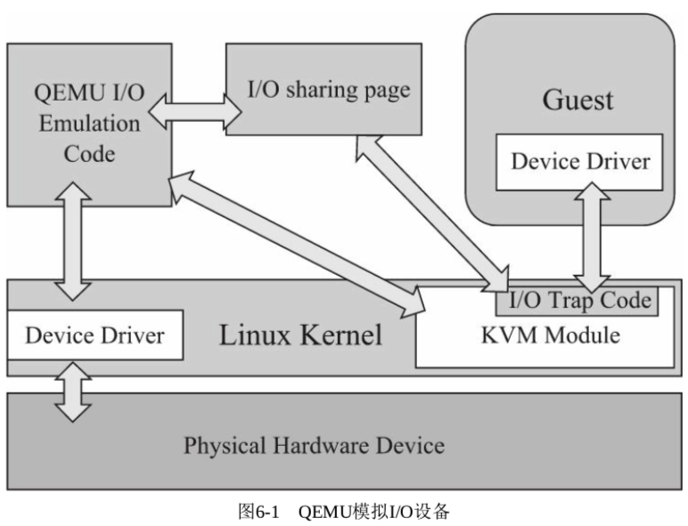

<!-- @import "[TOC]" {cmd="toc" depthFrom=1 depthTo=6 orderedList=false} -->

<!-- code_chunk_output -->

* [1 virtio概述](#1-virtio概述)
	* [1.1 QEMU模拟I/O设备的基本原理和优缺点](#11-qemu模拟io设备的基本原理和优缺点)
		* [1.1.1 基本原理](#111-基本原理)
		* [1.1.2 优点](#112-优点)
		* [1.1.3 缺点](#113-缺点)

<!-- /code_chunk_output -->

# 1 virtio概述

KVM是必须使用硬件虚拟化辅助技术（如Intel VT\-x、AMD\-V）的Hypervisor，在**CPU**运行效率方面有硬件支持，其**效率是比较高**的；

在有**Intel EPT**特性支持的平台上，**内存虚拟化**的效率也较高；

有**Intel VT\-d**的支持，其**I/O虚拟化**的效率也很高。

QEMU/KVM提供了全虚拟化环境，可以让客户机不经过任何修改就能运行在KVM环境中。不过，KVM在**I/O虚拟化**方面，**传统的方式**是使用**QEMU纯软件的方式**来**模拟I/O设备**（如第5章中提到模拟的网卡、磁盘、显卡等），其**效率并不太高**。

在KVM中，可以在客户机中使用**半虚拟化驱动**（**Paravirtualized Drivers，PV Drivers**）来提高客户机的性能（特别是**I/O性能**）。目前，KVM中实现半虚拟化驱动的方式是采用**virtio**这个Linux上的**设备驱动标准框架**。

## 1.1 QEMU模拟I/O设备的基本原理和优缺点

### 1.1.1 基本原理

QEMU以纯软件方式模拟现实世界中的I/O设备的基本过程模型如图6\-1所示。



在使用QEMU模拟I/O的情况下，当**客户机**中的**设备驱动程序（Device Driver**）发起**I/O操作请求**时，**KVM模块（Module**）中的**I/O操作捕获代码**会拦截这次I/O请求，然后在经过处理后将**本次I/O请求的信息**存放到**I/O共享页（sharing page**），并**通知用户空间的QEMU程序**。QEMU模拟程序获得**I/O操作的具体信息**之后，交由**硬件模拟代码（Emulation Code**）来模拟出本次的I/O操作，完成之后，将**结果放回到I/O共享页**，并通知KVM模块中的I/O操作捕获代码。最后，由KVM模块中的捕获代码读取I/O共享页中的操作结果，并把结果返回客户机中。当然，在这个操作过程中，**客户机**作为一个**QEMU进程**在**等待I/O时也可能被阻塞**。

另外，当客户机通过**DMA**（Direct Memory Access）访问**大块I/O**时，**QEMU**模拟程序将**不会把操作结果放到I/O共享页**中，而是通过**内存映射的方式**将结果**直接写到客户机的内存**中去，然后通过KVM模块告诉客户机DMA操作已经完成。

### 1.1.2 优点

QEMU模拟I/O设备的方式的优点是，可以通过软件模拟出各种各样的硬件设备，包括一些不常用的或很老很经典的设备（如5.5节中提到的e1000网卡），而且该方式**不用修改客户机操作系统**，就可以使模拟设备在客户机中正常工作。在KVM客户机中使用这种方式，对于解决手上没有足够设备的软件开发及调试有非常大的好处。

### 1.1.3 缺点

而QEMU模拟I/O设备的方式的缺点是，每次I/O操作的路径比较长，有较多的VMEntry、VMExit发生，需要多次上下文切换（context switch），也需要多次数据复制，所以它的性能较差。

2.virtio的基本原理和优缺点

virtio最初由澳大利亚的一个天才级程序员Rusty Russell编写，是一个在Hypervisor之上的抽象API接口，让客户机知道自己运行在虚拟化环境中，进而根据virtio标准与Hypervisor协作，从而在客户机中达到更好的性能（特别是I/O性能）。目前，有不少虚拟机采用了virtio半虚拟化驱动来提高性能，如KVM和Lguest。

在QEMU/KVM中，virtio的基本结构如图6-2所示。

图6-2　KVM中virtio基本结构

其中前端驱动（frondend，如virtio-blk、virtio-net等）是在客户机中存在的驱动程序模块，而后端处理程序（backend）是在QEMU中实现的。在前后端驱动之间，还定义了两层来支持客户机与QEMU之间的通信。其中，“virtio”这一层是虚拟队列接口，它在概念上将前端驱动程序附加到后端处理程序。一个前端驱动程序可以使用0个或多个队列，具体数量取决于需求。例如，virtio-net网络驱动程序使用两个虚拟队列（一个用于接收，另一个用于发送），而virtio-blk块驱动程序仅使用一个虚拟队列。虚拟队列实际上被实现为跨越客户机操作系统和Hypervisor的衔接点，但该衔接点可以通过任意方式实现，前提是客户机操作系统和virtio后端程序都遵循一定的标准，以相互匹配的方式实现它。而virtio-ring实现了环形缓冲区（ring buffer），用于保存前端驱动和后端处理程序执行的信息。该环形缓冲区可以一次性保存前端驱动的多次I/O请求，并且交由后端驱动去批量处理，最后实际调用宿主机中设备驱动实现物理上的I/O操作，这样做就可以根据约定实现批量处理而不是客户机中每次I/O请求都需要处理一次，从而提高客户机与Hypervisor信息交换的效率。

virtio半虚拟化驱动的方式，可以获得很好的I/O性能，其性能几乎可以达到与native（即非虚拟化环境中的原生系统）差不多的I/O性能。所以，在使用KVM之时，如果宿主机内核和客户机都支持virtio，一般推荐使用virtio，以达到更好的性能。当然，virtio也是有缺点的，它要求客户机必须安装