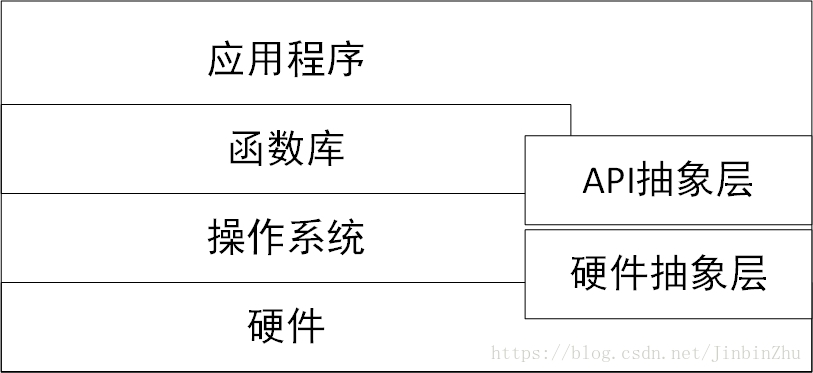

为了降低系统设计的复杂性，计算机系统被设计成**自上而下的抽象层次结构**，**每一个层次**都向**上一层次**呈现一个抽象，并且**每一层**只需知道**下层抽象的接口**，而**不需要了解其内部运作机制**。这样，**每一层**只需要考虑**本层的设计**以及**相邻层间的交互**。例如，**操作系统**所看到的**硬件**是一个**硬件抽象层**，而**不需要理解硬件的布线**或者**电气特性**等。

图 1-1 计算机系统的各个抽象层:

**硬件抽象层（Hardware Abstraction Layer, HAL**）是计算机中**软件**所能控制的**硬件的抽象接口**，通常包括**CPU的各种寄存器**、**内存管理模块**、**I/O端口**以及**内存映射的I/O地址**等。**API抽象层**是**一个进程**所能控制的**系统功能**的集合，包括创建新进程、内存申请、归还、进程间同步与共享、文件系统和网络操作系统等。

本质上，**虚拟化**是由位于**下层的软件模块**，通过向**上层软件模块**提供一个与它**原先所期待的运行环境完全一致的接口的方法**，抽象出一个**虚拟的软件或硬件接口**，使得上层软件可以直接运行在虚拟的环境上。

重要概念，在虚拟化中，**物理资源**通常有一个定语称为**宿主（Host**），而**虚拟出来的资源**通常有一个定语称为**客户（Guest**）。

各层虚拟化简介：

**硬件抽象层上的虚拟化**，通过**虚拟硬件抽象层！！！**来实现虚拟机，为客户机操作系统呈现和物理硬件相同或相近的硬件抽象层。由于**客户机操作系统**能看到的是**硬件抽象层**，因此客户机操作系统的行为和在物理平台上没什么区别。通常，**宿主机和客户机**的**ISA（Instruction Set Architecture，指令集架构**）是**相同**的，**客户机**的**大部分指令**可以在**宿主机处理器上直接运行(！！！**)，**只有部分需要虚拟化的指令(！！！**)才会由**虚拟化软件进行处理**，从而**大大降低了虚拟化开销**。另外, 客户机和宿主机的硬件抽象层的**其他部分**如**中断控制器**、**设备等**，可以是**完全不同**的, 当客户机对硬件层抽象访问时, 虚拟化软件需要对此进行截获并模拟. 比较知名的硬件抽象层的产品有VMware、Xen等。

**操作系统层上的虚拟化**，通过系统内核提供多个相互隔离的用户态实例，这些用户态实例具有自己独立的文件系统、网络、系统设置和库函数等。因为这是操作系统哦内核主动提供的虚拟化，因此操作系统层上的虚拟化比较高效，其系统开销非常小。

库函数层上的虚拟化，通过虚拟化操作系统的应用级函数的服务接口，使得应用程序不需要修改，就可以在不同的操作中无缝运行，从而提供系统间的互操作性。例如，WINE系统是在Linux上模拟了Windows的库函数接口，使得一个Windows的应用程序能够在Linux平台上运行。

编程语言级虚拟化，程序的代码由虚拟机的运行时支持系统首先翻译为硬件的机器语言，然后再执行。通常一个语言类虚拟机是作为一个进程在物理计算机系统中运行的，因此，它属于进程级虚拟化。
