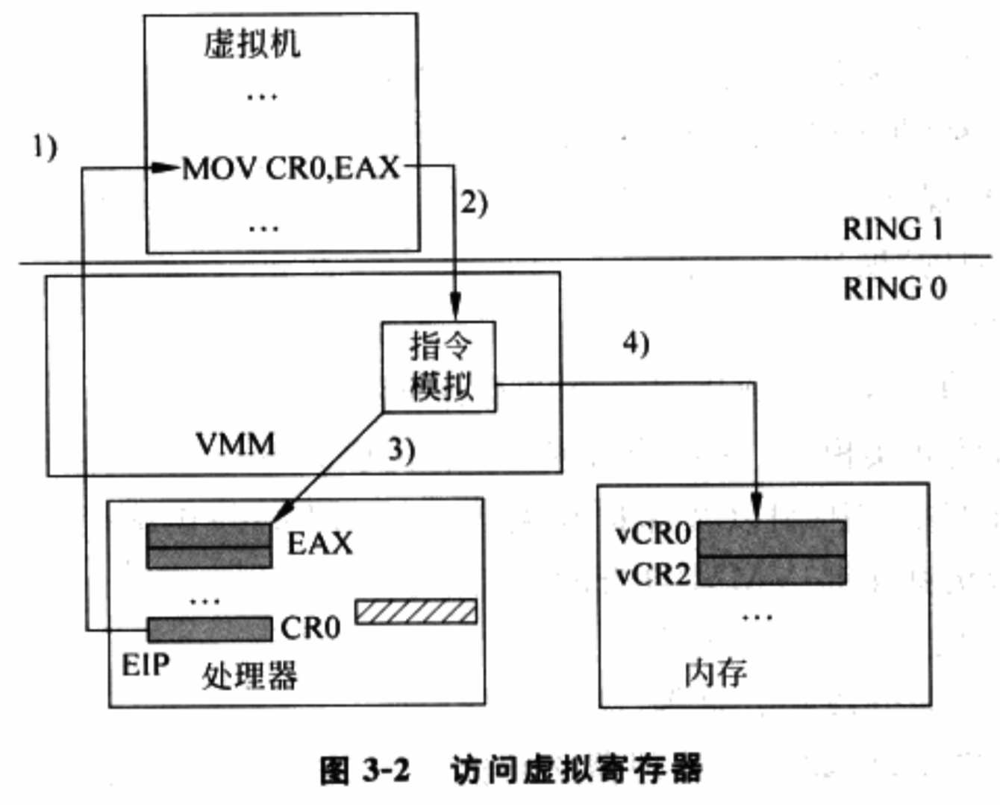
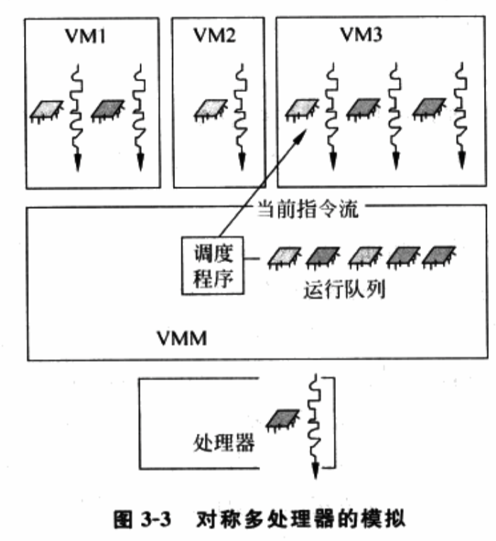

处理器虚拟化是VMM中最核心的部分, 因为**访问内存**和**I/O指令**本身就是**敏感指令**, 所以**内存虚拟化**和**I/O虚拟化**都依赖于**处理器虚拟化**的正确实现.

# 1 指令的模拟

VMM运行在最高特权级, 可以控制物理处理器上所有关键资源; 客户机OS运行在非最高特权级, 所以其敏感指令会陷入到VMM中通过软件方式进行模拟. 所以, 处理器虚拟化的关键在于正确模拟指令的行为.

介绍指令模拟之前, 我们理解三个概念: 虚拟寄存器、上下文和虚拟处理器.

从某种程度上, 物理处理器无非包括了一些存放数据的物理寄存器, 并且规定了使用这些寄存器的指令集, 然后按照一段预先写好的指令流, 在给定的时间点使用给定的部分寄存器来完成某种目的.

当**客户机OS**试图访问**关键资源！！！**的时候, 该请求并**不会真正发生在物理寄存器**上. 相反, **VMM**会通过**准确模拟物理处理器的行为**, 而**将其访问定位到**VMM为其设计与**物理寄存器对应的"虚拟"的寄存器**上. 当然, 从VMM实现来说, 这样的**虚拟寄存器往往是在内存中！！！**.

图3\-2是一个具体的**访问控制寄存器CR0的例子**. 当处理器取下一条指令**MOV CR0, EAX**后, 发现**特权级不符合！！！**, 则**抛出异常**, **VMM**会**截获这个异常**之后**模拟处理器的行为**, 读取**EAX(真实物理寄存器**)的内容并放到**虚拟的CR0**中. 由于**虚拟的CR0**存放在VMM为该虚拟机设计的**内存区域**里, 因此该指令执行的结果并**不会让物理的CR0内容发生改变**. 等到下一次, 当虚拟机试图读CR0时, 处理器也会抛出异常, 然后由VMM从虚拟的CR0而不是物理的CR0中返回内容给虚拟机.

在没有虚拟化的环境中, 操作系统直接负责物理处理器管理, 负责进程间调度和切换. 但是, VMM接管物理处理器后, 客户机OS没有管理物理处理器的权利, 可以说此时它运行在**VMM**为之设计的**虚拟处理器**之上, 管理虚拟处理器, 并在**虚拟处理器**上负责该**虚拟机内进程调度和切换**. 而调度切换, 涉及到了上下文状态, 这里是虚拟处理器上下文.

而在某个时刻, 物理处理器中的寄存器状态构成了当前进程的上下文状态.

**进程上下文**主要是**与运算相关的寄存器状态**, 例如EIP寄存器指向进程当前执行的指令, ESP存放着当前进程的堆栈指针等. 当**操作系统进行调度**时, **当前进程的上下文**, 即**上述寄存器状态被保存在进程特定的内存区域**中, 而下一个进程的上下文被恢复到相应的寄存器中.

虚拟处理器上下文比进程上下文更为复杂, 因为客户机OS本身包含很多敏感指令, 会试图访问和修改物理处理器上定义的所有寄存器, 而这种访问和修改会被VMM重定位到虚拟处理器上. 所以, 对于虚拟处理器, 其上下文包括了更多的系统寄存器, 例如CR0、CR3、CR4和各种MSR等. 当VMM在决定切换虚拟处理器的时候, 需要考虑保存和恢复的上下文也更为复杂.

虚拟处理器可以从两个角度来理解.

首先, 从**客户机OS**角度, 其在运行的**虚拟处理器**需要具备与其"**期望"的物理处理器一样的功能和行为**, 这种"期望"的前提条件甚至可以允许客户机OS的修改, 例如VMM可以修改客户机OS的源码, 使客户机OS所"期望"的与VMM所呈现的功能集合一致. 典型"期望"包括:

⓵ 指令集合与执行效果

⓶ 可用寄存器集合, 包括通用寄存器以及各种系统寄存器.

⓷ 运行模式, 例如实模式、保护模式和64位长模式等。 处理器的运行模式决定了指令执行的效果、寻址宽度和限制以及保护粒度等. 

⓸ 地址翻译系统, 例如页表级数.

⓹ 保护机制, 例如分页和分段等.

⓺ 中断/异常机制, 例如虚拟处理器必须能够正确模拟真实处理器的行为, 在错误的执行条件下, 为虚拟机注入一个虚拟的异常.

其次, 从**VMM的角度**看, **虚拟处理器**是其需要模拟完成的一组**功能集合**. **虚拟处理器功能**可以由**物理处理器**和**VMM**共同完成. 对于**非敏感指令！！！**, **物理处理器直接解码处理其请求！！！**, 并**将相关效果直接反映到物理寄存器！！！**上; 对于**敏感指令！！！**, VMM负责**陷入再模拟！！！**, 从程序角度也就是**一组数据结构与相关处理代码的集合**. **数据结构**用于存储**虚拟寄存器的内容**, 而**相关处理代码**负责**按照物理处理器的行为将效果反映到虚拟寄存器！！！**上.

VMM已经可以为虚拟机呈现与实际物理机不一致的功能和行为。 例如， 虚拟处理器的个数， 可以与物理处理器的个数不一致。

总之, 在处理器虚拟化中, 定义虚拟寄存器和虚拟处理器, 利用上下文进行虚拟处理器调度切换, 宗旨都是让虚拟机执行的敏感指令陷入下来后, 能被VMM模拟, 而不直接作用于真实硬件上.

当然, 模拟的前提是能够陷入. 

那客户机OS执行时, 是如何通知VMM的, 也就是VMM的陷入方式. 概括讲, VMM陷入是利用处理器的保护机制, 利用中断和异常来完成的, 它有以下几种方式.

⓵ 基于**处理器保护机制触发的异常！！！**, 例如前面提到的敏感指令的执行. 处理器在执行敏感指令前, 检查其执行条件是否满足, 例如当前特权级、运行模式以及内存映射关系等。一旦任一条件不满足, VMM得到陷入然后进行处理.

⓶ **虚拟机主动触发异常**, 也就是常说的陷阱. 条件满足时, 处理器会在触发陷阱的指令执行完毕后, 再抛出一个异常. 虚拟机可以通过陷阱指令来主动请求陷入到VMM中. 类虚拟化技术就是通过这种方式实现Hypercall的.

⓷ **异步中断**, 包括**处理器内部的中断源**和**外部的设备中断源**. 一旦中断信号到达处理器, 处理器会强行中断当前指令, 然后跳到VMM注册的中断服务程序中. 例如, VMM可以通过调度算法指定当前虚拟机运行时的时间片长度, 然后编程外部时钟源, 确保时间片用完时触发中断, 从而允许VMM进行下一次调度.

# 2 中断和异常的模拟及注入

中断和异常机制是处理器提供给系统程序的重要功能, **异常**保证了**系统程序对处理器关键资源的绝对控制**, 而**中断**提供了与外设之间有效地一种交互方式.

VMM对于**异常的虚拟化**需要完全遵照**物理处理器**对于**各种异常条件的定义**, 再根据虚拟处理器当时的内容, 来判断是否需要模拟出一个虚拟的异常, 并注入到虚拟环境中.

VMM通常会在**硬件异常处理程序**和**指令模拟代码**中进行**异常虚拟化的检查**. 无论哪条路径, VMM需要区分两种原因: 一是**虚拟机自身**对**运行环境**和**上下文的设置**违背了**指令正确执行的条件**; 二是**虚拟机**运行在**非最高特权级别**, 由于虚拟化的原因触发的异常. 第二种情况是由于**陷入再模拟的虚拟化方式**所造成的, 并**不是虚拟机本身的行为**. 而第一种情况的检查, **VMM**实际是在**虚拟处理器的内容**上进行, 因为它反映了**虚拟机所期望的运行环境**. 错误的异常注入会导致客户OS做出错误反应, 后果无法预知.

**物理中断的触发**来自**特定的物理中断源**, 同样, **虚拟中断的触发**来自于**虚拟设备的模拟程序！！！**. 当**设备模拟器！！！**发现**虚拟设备状态**满足**中断产生的条件**时, 会将这个**虚拟中断！！！**通知给**中断控制器的模拟程序(！！！**), 例如**模拟LAPIC**. 最后, **VMM**会在特定时候**检测虚拟中断控制器的状态**, 来决定是否**模拟一个中断的注入**. 而这里的**虚拟中断源**包括: **处理器内部中断源的模拟**, 例如**LAPIC时钟**、**处理器间中断**等; **外部虚拟设备的模拟**, 例如8254、RTC、IDE、网卡和电源管理模块等; **直接分配给虚拟机！！！**使用的**真实设备的中断！！！**, 通常来自VMM的中断服务程序; **自定义的中断类型**.

当**VMM**决定**向虚拟机注入一个中断或异常**时, 它需要**严格模拟物理处理器的行为！！！**来改变客户指令流的路径, 而且还要包含一些必需的上下文保护与恢复. **VMM**需要**首先判断当前虚拟机的执行环境**是否允许**接受中断或是异常的注入**, 假如客户机OS正好通过**RFLAGS.IF位**禁止了中断的发生, 这时VMM就**只能把中断事件暂时缓存起来**, 直到某时刻客户机操作系统重新允许了中断的发生, VMM才立即切入来模拟一个中断的注入. 而当中断事件不能被及时注入时, VMM还要进一步考虑如下因素.

⓵ 该**中断类型**是否允许**丢失中断**, 如果允许, VMM则可以将其后到达的**多个同类型中断合为一个事件**; 否则, VMM必须要**跟踪所有后续到达的中断实例**, 在客户指令流**重新允许中断**时, 将**每一个缓存的中断**一一注入.

⓶ 该中断在**阻塞期间**是否被**中断源取消！！！**, 这决定了VMM是否会**额外注入**一个已经**被取消的假中断**.

⓷ 当一次阻塞的中断实例比较多, VMM可能还要考虑客户机OS能否处理短期内大量同类型的中断注入, 因为这在真实系统中可能并不出现.

实际实现中, 还要考虑更多因素.

当模拟中断或异常的注入时, VMM需要**首先判断是否涉及到运行模式的切换**. 假如虚拟机可能运行在一个**64位兼容模式**, 而**中断/异常处理程序**运行在**64位长模式**, 这时VMM就得按照处理器的规定, 将**虚拟机的运行模式**进行**软件切换！！！**, 对保存的**客户上下文进行相应的修改！！！**. 可能需要的模式切换后, VMM还需要根据**真实处理器在该模式下的中断注入过程！！！**, 完整地进行**软件模拟**. 例如, 将**必需的处理器状态(指令地址、段选择子等**)复制压入**当前模式**下**对应中断/异常服务程序的堆栈**; 到**中断模拟逻辑**去查找发生**中断的向量号**; 根据该**向量号**来查找**相关的中断/异常服务程序的入口地址**; 最后**修改虚拟机的指令地址**为上述入口地址, 然后返回到虚拟机执行等.

总而言之, **中断/异常的虚拟化**由**中断/异常源的定义**、**中断/异常源**与**VMM处理器虚拟化模块间**的**交互机制**以及**最终模拟注入的过程**组成.

# 3 对称多处理器技术的模拟

在没有虚拟化的环境中, 对称多处理器技术可以让OS拥有并控制多个物理处理器, 它通过提供并发的计算资源和运算逻辑, 允许上层OS同时调度多条基于不同计算目的的进程并发执行, 从而有效提高系统的吞吐率与性能.

同样, 当物理计算资源足够多时, VMM也可以考虑为虚拟机呈现多个虚拟处理器, 即客户对称处理器虚拟化技术, 也称客户SMP技术. 这样, 当这些虚拟处理器同时被调度在多个物理处理器上执行时, 也可以有效提高给定虚拟机的性能. 

客户SMP引入, VMM在虚拟环境的管理和责任发生变化.

首先, VMM必须按照客户机操作系统期望的那样呈现客户SMP的存在, 这样客户机OS才不会认为其运行在单一处理器上, 才会试图初始化其它的虚拟处理器, 并在其上运行调度程序. VMM可以是模拟一个现实中的接口, 例如通过APIC表来表述; 也可以是一个自定义的接口协议, 只要客户机OS被修改来配合VMM即可.

其次, SMP的并发执行能力虽然带来了性能上提升, 但多个处理器竞争共享资源的情况也给软件带来了更多复杂性. 为保证正确性, 通常系统程序需要实现一套同步机制来协调处理器之间的步调, 从而确保任何时候只有一个处理器能对共享资源进行修改, 并且在释放修改权之前, 确保修改的效果能被每个处理器察觉到. 

在客户SMP机制引入后, 实际上VMM面临物理处理器(即主机SMP)以及虚拟处理器之间(即客户SMP)的同步问题.

⓵ 对于发生在VMM自身代码之间的同步问题, 由VMM负责协调物理处理器之间的步调来满足主机SMP的要求.

⓶ 对于发生在同一虚拟机内部, 多个虚拟处理器间的同步问题, 通常VMM不需要参与, 这是客户OS自身的职责. VMM只需要在客户机OS发起某种特权操作, 例如刷新页表时, 正确地模拟其效果即可.

⓷ 对于VMM造成的虚拟处理器之间的同步问题, 仍需要VMM来负责处理. 例如, VMM可能将N个虚拟处理器在M(M>N)个物理处理器之间迁移, 客户机OS只知道自己有N个虚拟处理器, 所以只会在这N个虚拟处理器的上下文内进行同步操作, 但当VMM将这N个虚拟处理器迁移到M个物理处理器上运行时, VMM就必须负责所有M个物理处理器上状态的同步.

最后, VMM对虚拟机管理模块也必须根据客户SMP的存在做相应修改. 例如, 挂起命令要区分挂起虚拟处理器还是挂起虚拟机, 当挂起某个虚拟机就必然挂起该虚拟机内所有指令流的执行.

下面看下在客户SMP功能被引入后初始化过程如何模拟的

通常, 对称多处理器技术定义有标准的一套初始化过程. 在没有虚拟化时, BIOS负责选取BSP(主启动处理器)与AP(应用处理器), 把所有处理器都初始化到某个状态后, BIOS在BSP上通过启动加载程序(Boot Loader)跳转至操作系统的初始化代码, 同时所有的AP处于某种等待初始化硬件信号的状态. 接下来, OS会在初始化到某个时刻时, 发出某种初始化硬件信号给所有AP, 并提供一段特定的启动代码, AP在收到初始化硬件信号后, 就会跳转到操作系统指定的启动代码中继续执行. 通过这样的一种方式, OS最终就成功按自己的方式初始化了所有处理器, 最后在每个处理器上独立地运行调度程序.

