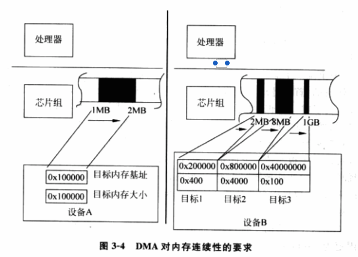

首先从一个**操作系统的角度**, 介绍其对物理内存存在的两个主要基本认识: **物理地址从0开始**和**内存地址连续性**. 而**内存虚拟化**的产生, 主要源于**VMM与客户机操作系统！！！**在**对物理内存的认识**上存在冲突, 造成**物理内存的真正拥有者**----**VMM**, 必须对客户OS所访问的内存进行一定程度的虚拟化. 

内存虚拟化既满足了客户机操作系统对于内存和地址空间的特定认识, 也可以更好在虚拟机之间、虚拟机与VMM之间进行隔离, 防止某个虚拟机内部的活动影响到其它的虚拟机甚至是VMM本身, 从而造成安全上的漏洞.

先分析没有虚拟化的环境. 这种环境, 任何一个OS都认为自己完全控制处理器, 相应的就完全拥有了内存的所有权. 所以OS总是按照一台物理计算机上内存的属性和特征对其进行管理.

**指令对于内存的访问**都是通过**处理器来转发**的, 首先**处理器**会将**解码后的信息请求**发送到**系统总线**上, 然后**由芯片组来负责进一步转发**. 为了**唯一标识**, 处理器使用**统一编址方式**将**物理内存映射成一个地址空间**, 即所谓的**物理地址空间**. 平时, 我们将**一根根内存条**插到主板上的**内存插槽**中, **每根内存条**都需要**被映射到物理地址空间中某个位置！！！**. 一般来说, **每根内存插槽！！！**在**物理地址空间的起始地址！！！**可以在**主板制造时就固定！！！**下来, 也可以通过某种方式由**BIOS加电后自动设置！！！**. 一旦**内存插槽的起始地址被固定！！！**下来, 这根内存条上**每个字节的物理地址就相应确定！！！**下来了. 总的来说, **一根根内存条**形成了一个**连续的物理地址空间**, 而**这个物理地址空间一定是从0开始！！！**的.

例如4个内存插槽的主板, 每个插槽插上256MB的内存条, 如果4根插槽的起始地址分别固定为0x00000000、0x10000000、0x20000000和0x30000000, 那么在它们上面的物理内存就被映射为0x00000000 --- 0x0FFFFFFF、0x10000000 --- 0x1FFFFFFF、0x20000000 --- 0x2FFFFFFF、0x30000000 --- 0x3FFFFFFF这4段. 总的来说, 这四根内存条组成了该系统1GB的内存, 而且这1GB内存是从0开始的连续空间, 4根内存条上每个字节都会对应到唯一的物理地址. 处理器访问任何一个字节就是通过请求一个物理地址, 芯片组收到处理器发出的内存访问请求后, 会检测内核维护的物理地址空间的分配表, 当发现目标地址落在0x00000000 --- 0x3FFFFFFF范围内时, 处理器就会进一步将请求转发给内存控制器.

在**没有虚拟化的环境**中, **OS**也会**假定物理内存是从物理地址0开始**的. 以**x86处理器上的Linux**为例. 在x86上, **Linux内核可执行文件头**里**定义了每个段的大小**、期望在**物理地址空间中被加载的位置**即**1MB**, 以及**加载后执行第一条指令的地址**等, 这些信息在**编译连接阶段就确定下来**了. 由于**加载的位置是1MB**, 那么对于后面代码, 其**访问的段**都是**基于1MB这个起始地址**的, 这也是在**编译链接阶段就确定下来**了的. 通常, 在**加载内核**时, 启动**加载程序(Boot Loader**)就会通过**对该文件格式的分析**, 将**相应的段复制到期望的位置**, 然后**跳转到内核文件指定的入口点**. 而**系统所做**的, **必须保证该指定位置存在可用内存**. 如果**物理地址空间不是从0开始**的, Boot Loader将会因指定位置找不到可用内存而拒绝加载内核, 及时加载内核到内存中, 由于内核代码在访问段时也会自身产生错误而造成整个系统的崩溃.

除此之外, **现实**中**操作系统基本上对内存连续性**存在一定程度的**依赖性**, 如**DMA**. DMA的目的就是允许**设备绕过处理器**来直接访问物理内存, 从而保证了I/O处理的高效. 目前绝大多数设备都支持DMA功能, 只是在实现上对驱动程序提出了不同的要求. 如图.

