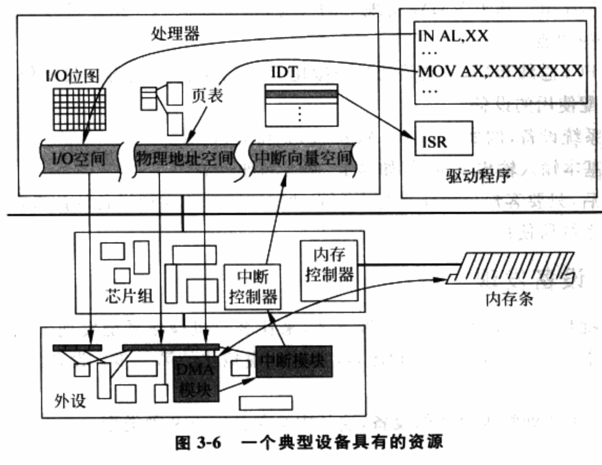
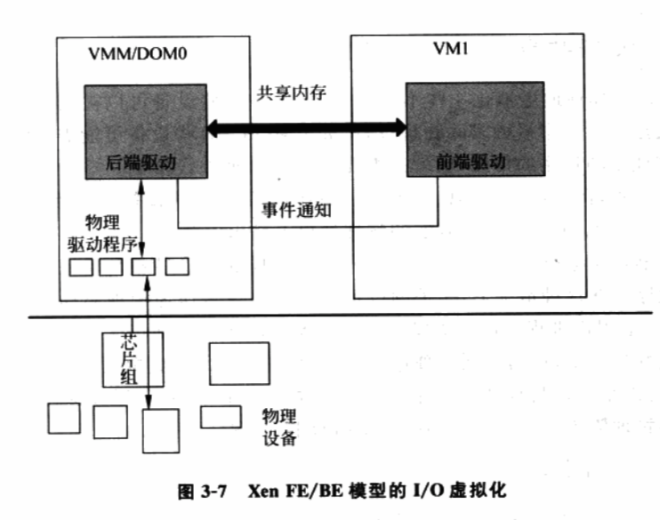

# 1 概述

没有虚拟化的情形下. 给定一个外设, 定义有自己的一套供软件访问的接口, 这些接口的属性可能是单向的, 也可能是双向的. OS有外设的驱动, 它们接收来自其他模块(如用户进程)的请求, 然后按照外设规定好的方式驱动外设完成特定任务.驱动不关心外设的逻辑电路, 只要按照定义好的接口使用外设, 外设总会通过其内部逻辑电路完成动作. 由于处理器的核心地位, 因此外设的访问接口最终也会被映射为处理器所能认识的地址空间或其他资源. 这样, 当驱动通过指令方式访问外设, 处理器才能正确识别目标对象, 然后将相关请求发送到系统总线上, 最终由芯片组转发给目标外设. 下图是典型设备可能有的资源.

⓵ I/O端口寄存器. 它被映射到I/O地址空间中, 由特殊指令IN/OUT访问. 若指令流处于最高特权级, 整个64KB的I/O地址空间都可自由访问, 驱动程序就是; 当指令流运行在其它特权级, 只有I/O位图允许的端口才能访问.

⓶ MMIO寄存器. 被映射到物理地址空间, 通过页表方式控制访问权限.

⓷ 中断. 由于外设的物理构造, 速度远低于处理器, 往往通过一步时间通知的方式来完成延后的操作, 这个通知机制通常是中断模块实现. 每个允许发生中断的外设会在处理器的中断向量空间分配一个序号.

**I/O端口**、**MMIO**和**中断模块**组成了一个**典型外设提供给软件(！！！这些都是外设的！！！**)的基本资源。图中还有一个外设中的特殊模块 --- DMA模块. DMA提供给设备不经处理器而直接访问内存的方式, 从而特别适合大批量数据的批量传输. 从访问方式来说, **DMA模块！！！**被映射在**I/O端口或MMIO中！！！**.

在虚拟环境中, I/O面临的问题是: 外设资源有限, 为满足多个客户机OS需求, VMM必须通过I/O虚拟化方式复用有限的外设资源. VMM截获客户OS对设备的访问请求, 然后通过软件方式模拟真实设备. 从处理器角度看, 外设是通过一组I/O资源(端口I/O或MMIO)来进行访问的, 所以设备相关的虚拟化又被称为I/O虚拟化. 

I/O虚拟化不需要完整虚拟化出所有外设的所有接口. 怎么做取决于设备与VMM的策略以及客户机OS的需求.

⓵ 虚拟芯片组. 基于VMM实现上考虑, 这个虚拟芯片组还可承担ACPI电源管理相关的一些功能.

⓶ 虚拟PCI总线布局, 主要是通过**虚拟化PCI配置空间**, 为客户机OS呈现或直接分配使用的设备.

⓷ 虚拟系统设备, 例如PIC、IO\-APIC、PIT和RTC等.

⓸ 虚拟基本输入输出设备, 例如显卡、网卡和硬盘等.

**I/O虚拟化**主要包含以下几个方面的虚拟化

- I/O端口寄存器(Port I/O)
- MMIO寄存器
- 中断
- DMA

虚拟完毕, 只要客户机OS有驱动按照该虚拟设备的接口定义, 就可以被客户机OS所使用.

# 2 设备发现

即让VMM提供一种方式, 来让客户机OS发现虚拟设备, 这样的客户机OS才能加载相关驱动, 这是I/O虚拟化的第一步. 设备发现取决于被虚拟的设备类型.

(1) 模拟一个所处物理总线的设备, 这其中又包括以下两种类型.

⓵ 模拟一个所处**总线类型**是**不可枚举的物理设备**，而且该设备本身所属的**资源是硬编码固定**下来的。比如**ISA设备**、**PS/2键盘**、**鼠标**、**RTC**及**传统IDE控制器**。对于这类设备，**驱动程序**会通过**设备特定的方式！！！**来**检测设备是否存在**，例如读取**特定端口的状态信息**。对于这类设备的发现，**VMM**在**给定端口**进行**正确的模拟**就可以了，即**截获客户机对该端口的访问**，**模拟出结果交给客户机**。

⓶ 模拟一个所处总线类型是**可枚举的物理设备**，而且相关设备**资源是软件可配置**的，比如**PCI设备**。由于**PCI总线**是通过**PCI配置空间**定义一套完备的**设备发现方式**，并且允许**系统软件(BIOS或操作系统**)通过**PCI配置空间**的**一些字段**对**给定PCI设备进行资源的配置**，例如**允许或禁止I/O端口和MMIO**，设置**I/O和 MMIO的起始地址**等。所以**VMM**仅模拟**自身的逻辑**是不够的，必须进一步**模拟PCI总线**的行为，包括**拓扑关系**和**设备特定的配置空间内容**，以便让客户机操作系统发现这类虚拟设备。

(2) 模拟一个**完全虚拟的设备**

这种情况下，没有一个现实中的规范与之对应，**这种虚拟设备**所处的**总线类型**完全由**VMM自行决定**，VMM可以选择将虚拟设备挂在PCI总线上，也可以完全**自定义一套新的虚拟总线协议**，这样的话**客户机操作系统**必须加装**新的总线驱动**。

# 3 访问截获

**虚拟设备**被客户机操作系统**发现**后，**客户机操作系统**中的**驱动**会按照**接口定义**访问这个虚拟设备。此时**VMM**必须**截获驱动对虚拟设备的访问**，并**进行模拟**。 可以毫不犹豫的说, 关键点在于处理器虚拟化.

对于**端口I/O**，**处理器对于端口I/O资源的控制**在于**指令流所处的特权级别**和**相关I/O位图**. 对于一个非直接分配给客户机OS使用的设备, 客户OS运行在一个非特权环境中, 所以客户OS能否访问给定I/O端口就完全由I/O位图决定. 自然地, VMM完全可以将设备的所有端口I/O从I/O位图中关闭, 这样, 当客户指令流在访问该I/O端口时, 物理处理器就会及时抛出一个保护异常, 然后VMM就能获取异常原因, 然后将请求发送给设备模拟器进行模拟. 相反, 对于一个直接分配给客户机OS的设备, VMM可以将该设备所属端口I/O从I/O位图中打开, 这样处理器就把访问发送到系统总线, 最终到达目标物理设备而不被模拟. 

对于**MMIO**，MMIO本身也是物理地址空间的一部分, 而物理地址空间的访问控制是通过页表来控制的. 对于非直接分配给客户机OS使用的设备, 在物理处理器遍历的真实页表里, **VMM**只要把**映射到该MMIO的页表项**设为**无效**，当**客户机指令流试图再访问目标地址**时, 物理处理器就会抛出**缺页异常**，从而**陷入到VMM**中，VMM遍历客户页表, 就能发现设备所属的MMIO资源, 然后将请求交给**设备模拟器进行模拟**。相反, 对于直接分配给客户OS使用的设备, VMM只需要按照客户页表的设置打开真实页表映射即可, 这样客户机OS对该设备的访问也不再被模拟.

对于**中断**. 对于非直接分配, 假设该设备可以产生中断, 那么VMM只要提供一种机制，供**设备模拟器**在接收到**物理中断**并需要**触发中断时**，可以通知到**虚拟中断逻辑**，然后由**虚拟中断逻辑模拟一个虚拟中断的注入**。相反, 对于直接分配的, VMM物理中断处理函数在接收到物理中断后, 辨认出中断源属于某个客户机, 然后通知该客户机的虚拟中断逻辑.

如果设备可以提供DMA或类似的共享内存机制, DMA允许设备绕过处理器直接访问目标内存, 而若**客户机OS驱动程序是未经修改**的, 则**设备模拟器**接收到的**DMA目标地址**是**客户机物理地址！！！**. 因此, VMM只要提供一种机制, 让设备模拟器了解各种地址之间转换关系, 从而可以把客户机物理地址映射成自己的虚拟地址, 就能真正做到DMA目标地址的访问.

# 4 设备模拟

上一步中我们已经多次提到，下面分类介绍下设备模拟。

## 4.1 基于软件的全虚拟化

**虚拟设备**与**现实设备**具有**完全一样的接口定义**。这种情况下，**VMM的设备模拟器**需要仔细研究现实设备的接口定义和内部设计规范，然后以**软件的方式**模拟真实逻辑电路来满足每个接口的定义和效果, 例如PS/2键盘、鼠标等。现实设备具有哪些资源，设备模拟器就需要呈现出同样的资源。这种情况下，**客户机操作系统原有的驱动程序无需修改**就能驱动虚拟设备。**设备访问过程**中，**VMM**通过**截获驱动程序对设备的访问进行模拟**。

举例：qemu, VMware Workstation

## 4.2 半虚拟化

给**客户机操作系统**提供一个**特定的驱动程序（称为前端, Front\-end, FE**），**VMM**中的**模拟程序称为后端(Back\-End, BE**)设备驱动，**前端**将来自于其他模块的请求通过**VMM提供的特殊通信机制**直接发送给**后端**，**后端处理完**请求后再**发回通知给前者**。

与传统设备驱动程序流程（前一种方式）比较，**传统设备程序**为了完成一次操作要**涉及到多个寄存器的操作**，使得**VMM**要**截获每个寄存器访问！！！**并进行**相应的模拟**，就会导致**多次上下文切换**。这种方式能很大程度的**减少上下文切换的频率**，提供更大的优化空间。

举例：xen virtio（virtio，主要包括virtio框架、virtio前端驱动、后端实现方式及原理、前端后端共享内存的方式）

## 4.3 基于硬件的直接分配（实际上已经不是设备模拟了）

直接将**物理设备**分配给**客户机操作系统**，由**客户机操作系统直接访问目标设备！！！**。这种情况下**实际上不存在设备模拟**，**客户机**直接通过**原有的驱动无缝**操作**真实硬件**。这种方式从**性能上说是最优**的，但这种方式需要比**较多的硬件资源**。

基于硬件的直接分配还有一种方式，**硬件本身支持虚拟化**，本身可以向**不同的虚拟机**提供**独立的硬件支持**，设备本身支持多个虚拟机同时访问。比如SR-IOV。

举例：intel的vt\-d和PCI\-SIG的SR\-IOV

一个VMM中，常常是多种虚拟化方式并存。

不同的IO虚拟化方式对比

# 5 设备共享

**设备虚拟化**中，**有些设备**可以被软件模拟器完全用**软件的方式模拟**而不用接触实际物理设备，比如**CMOS**，而有些设备需要设备模拟进一步**请求物理硬件**的帮助。**一般输入输出类设备**，如鼠标、键盘、显卡、硬盘、网卡。这些设备都涉及到**从真实设备上获取输入或者输出到真实设备**上。

对于**多个客户机**，**每个客户机**拥有自己的**设备模拟器**，多个设备模拟器需要**共享同一个物理设备**，这种情况下，**VMM**中的**真实设备的驱动程序**需要**同时接收并处理多个客户或进程的请求**，达到**物理资源的复用**。