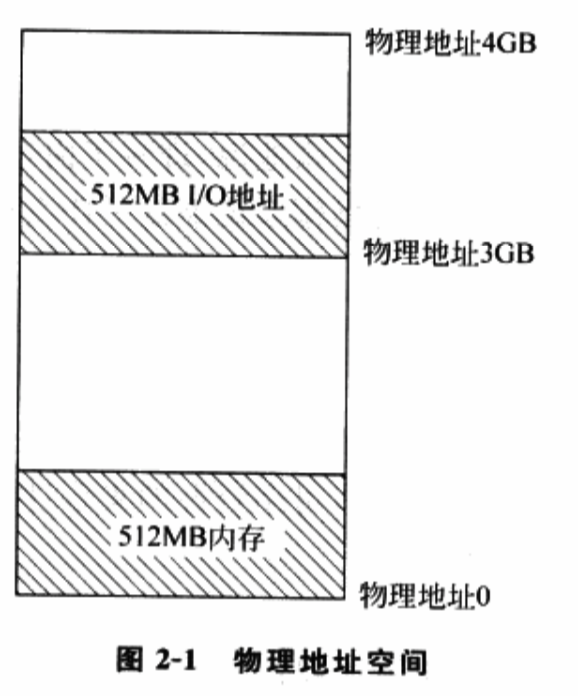

内存架构往往是硬件架构中最复杂的部分. 

# 1 地址空间

很多把内存(这里特指安插在主板上的RAM)比作一个大数组, 地址就是这个数组的索引. 类似的, 地址空间则是更大的数组, 它是所有可用资源的集合, 同样, 地址是这个数组的索引. 地址空间可以划分成如下两种类型.

## 1.1 物理地址空间

硬件平台可粗略分为三部分: CPU, 内存和其它硬件设备. 其中, CPU是平台主导者, 从**CPU的角度**来看, **内存**和**其它硬件设备**都是可以使用的**资源**. 这些**资源组合(！！！**)在一起, 分布在**CPU的物理地址空间内(！！！内存只是一部分！！！**). CPU使用**物理地址索引这些资源(！！！**). **物理地址空间的大小**, 由CPU实现的**物理地址位数**决定, **物理地址位数**和**CPU处理数据的能力(即CPU位数**)没有必然关系, 例如**16位的8086 CPU**具有**20位地址空间**.

内存和其它硬件设备分布在物理地址空间中. 假设一个平台, CPU的**物理地址空间为4GB**, 有**512MB内存**, **其它硬件设备的I/O寄存器**被映射到**512MB的I/O地址**内, 则该平台的物理地址空间可能是如图所示划分的.



如图, 512MB内存和I/O地址只占用物理地址空间的一部分, 还有大部分处于空闲. 数组再次显示了它的作用, 有一个4GB大小的数组, 其中1GB的元素具有有效值(512MB内存, 512MB I/O地址), 其它元素不存在.

## 1.2 线性地址空间

**一个平台只有一个物理地址空间**, 但**每个程序**都认为自己**独占整个平台的硬件资源**, 为让多个程序能够有效地相互隔离和使用物理地址空间的资源, 线性地址空间概念被引入. 和物理地址空间一样, 线性地址空间大小取决于CPU实现的线性地址位数, 例如实现了32位线性地址的CPU具有4GB大小的线性地址空间. 需要注意, 线性地址空间大小和物理地址空间大小没有必然关系. 例如Intel的PAE平台就具有4GB的线性地址空间, 64GB的物理地址空间.

线性地址空间会被映射到物理地址空间某一部分或整个物理地址空间. CPU负责将线性地址转换成物理地址, 使程序能正确访问到该线性地址空间所映射的物理地址空间. **一个平台**可以有**多个线性地址空间**, 在现代操作系统中, 每个进程都拥有自己的私有线性地址空间. 一个典型的线性地址空间如图.


# 2 地址

地址是访问地址空间的索引. 根据访问地址的不同, 索引可以分为线性地址和物理地址. 但由于x86特殊的段机制, 还有一个额外的地址, 逻辑地址.

## 2.1 逻辑地址

该地址即程序直接使用的地址(x86架构无法禁用段机制, 逻辑地址一直存在). 例如

```c
int a = 1;
int *p = &a;
```

这里, 指针变量p存储的就是一个逻辑地址. **逻辑地址**由一个**16位的段选择符**和一个**32位的偏移量(32位平台**)构成. 逻辑地址的转换过程在后面介绍. 在上面例子中, 指针变量p实际上存储逻辑地址的偏移部分, 该偏移对应的段选择符位于段寄存器中, 并没有在程序中反映出来.

## 2.2 线性地址

又称虚拟地址. **线性地址**是**逻辑地址转换后的结果**, 用于**索引线性地址空间**. 当CPU使用分页机制时, 线性地址必须转换成物理地址才能访问平台内存或硬件设备; 当分页机制未启用时, 线性地址等于物理地址.

## 2.3 物理地址

该地址索引物理地址空间, 是CPU提交到总线用于访问平台内存和硬件设备的最终地址. 它和上面两个地址有如下关系.

(1) 分段机制启用, 分页未启用: 逻辑地址->线性地址=物理地址

(2) 分段 分页机制同时启用: 逻辑地址->线性地址->物理地址

有些资料还有"总线地址"的提法, 因为**给设备寄存器分配的物理地址(！！！**)和**寄存器在设备上的地址(！！！**)是不同的(通常**设备的寄存器**都**认为自己是从地址0开始**的), 两者存在一个**映射关系**, 由设**备的电子线路负责转换并对CPU透明(！！！**). 由于**CPU用于访问设备的物理地址(！！！**)是**设备寄存器展现给总线的地址**, 所以在x86下有时称**物理地址为总线地址**.

# 3 x86内存管理机制

## 3.1 分段机制

分段是一种简单的内存管理机制, 它将内存划分成以起始地址(Base)和长度(Limit)描述的块, 这些内存块就称为"段". 段可以与程序最基本的元素联系起来, 例如程序可以简单的分为代码段、数据段和栈, 段机制中就有对应的代码段、数据段和栈段。

分段机制由4个基本部分组成: 逻辑地址、段选择寄存器、段描述符和段描述符表。

其核心思想是: 使用段描述符描述段的基地址、长度以及各种属性(例如读写属性、访问权限). 当程序使用逻辑地址访问内存的某个部分时, CPU通过逻辑地址中的**段选择符**索引**段描述符表**以得到该内存对应的**段描述符**, 并检测程序的访问是否合法, 合法的话, 根据**段描述符中的基地址**将逻辑地址转换为线性地址.


分段机制介绍见<architecture>下面相关内容

(4) 逻辑地址转换总结

假设程序中某条语句访问了数据段, 例如:

```c
int a = 100; //全局变量
int func(){
    int b;
    b = a;
}
```

程序从加载到变量a的逻辑地址转换为线性地址过程如下.

1. 程序加载

⓵ 通过**该进程LDT的段选择符！！！**索引**GDT**, 获得LDT的段描述符, 被加载到LDTR寄存器中.

⓶ 该进程的CS、DS、SS被加载到了相应的段选择符. 同时, CPU根据段选择符的TI字段, 索引GDT/LDT, 获得相应的段描述符并加载到CS、DS、SS对应的不可见部分.

2. 程序执行到b=a, 需要从a所在的内存中取值, 必须先把a的逻辑地址转换成线性地址,

⓵ 进行必要的属性、访问权限检查

⓶ 从DS对应的段描述符寄存器获得该段的基地址

⓷ 将变量a的32位偏移量和描述符中的基地址相加, 获得变量a的线性地址.

## 3.2 分页机制

分页是更加粒度化的内存管理机制, 分页是用粒度化的单位"页"来管理线性地址空间和物理地址空间. x86下一个典型的页大小是4KB, 则一个4GB的**虚拟地址空间**可以**划分为1024X1024个页面**. **物理地址空间的划分同理**. x86允许大于4KB的页面大小, 这里只介绍4KB页面.

同时, **分页机制**让操作系统中的**虚拟内存机制**称为可能. **一个页面**可以存在于**物理内存(！！！**)中, 也可以存放在**磁盘的交换区域！！！**(如**Linux下的Swap分区！！！**, **Windows的虚拟内存文件！！！**)中, 程序可以使用比机器**物理内存更大的内存区域！！！**.

分页机制的核心思想是通过页表将线性地址转换为物理地址, 并配合**旁路转换缓冲区(Translation Lookaside Buffer, TLB**)来加速地址转换过程. 操作系统在启动过程中, 通过将CR0寄存器的PG位置1来启动分页机制. 


