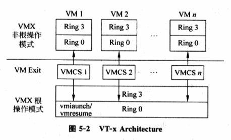
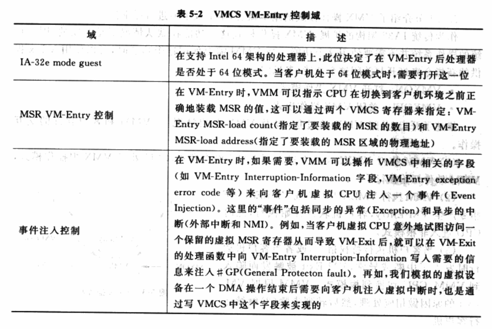
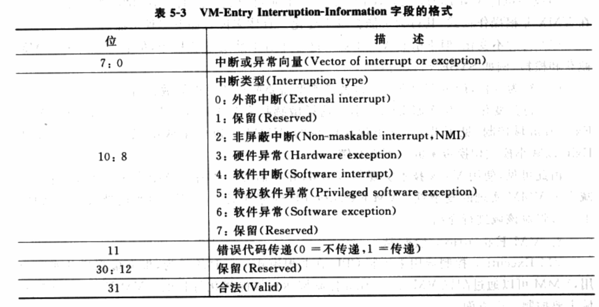
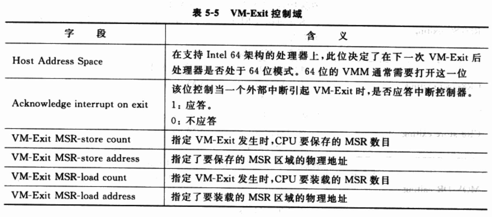

# 1 概述

VT\-x基本思想如图5\-2.

首先, VT\-x引入了两种操作模式, 统称VMX操作模式.

- 根操作模式(VMX Root Operation): VMM运行所处的模式, 简称根模式.
- 非根操作模式(VMX Non\-Root Operation): 客户机运行所处的模式, 简称非根模式.

这两种模式与IA32特权级0\~特权级3是正交的, 即每种操作模式都有相应的特权级0\~特权级3特权级. 故在VT\-x情况下, 描述程序运行在某个特权级, 必须指出当前处于根模式还是非根模式.

软件虚拟化中, 指令的虚拟化是通过"陷入再模拟"的方式实现, 而IA32架构有19条敏感指令不能通过这种方式处理, 导致虚拟化漏洞. 最直接方式就是使这些敏感指令能够触发异常. 可惜这种方式会改变这些指令的语义, 导致与原有软件不兼容. 引入新模式可以很好解决. 非根模式下所有敏感指令(包括19条不能被虚拟化的敏感指令)行为都被重新定义, 使得它们能不经虚拟化就直接运行或通过"陷入再模拟"方式来处理; 在根模式下, 所有指令的行为和传统IA32一样, 没有改变.

VT\-x中, **非根模式**下**敏感指令**引起的"**陷入**"被称为**VM\-Exit**. VM\-Exit发生时, **CPU自动！！！**从**非根模式**切换成**根模式**. 相应地, **VT\-x**也定义了**VM\-Entry**, 该操作由**VMM发起**, 通常是**调度某个客户机运行**, 此时**CPU**从**根模式**切换成**非根模式**.

其次, 为更好支持CPU虚拟化, VT\-x引入了**VMCS(Virtual\-Machine Control Structure, 虚拟机控制结构**). VMCS保存**虚拟CPU需要的相关状态**, 例如CPU在根模式和非根模式下的特权寄存器的值. **VMCS主要供CPU使用**, CPU在发生**VM\-Exit**和**VM\-Entry**时都会**自动查询和更新VMCS**. VMM可以**通过指令来配置VMCS！！！**, 进而**影响CPU的行为！！！**.

最后, VT\-x还引入了一组新的指令, 包括VMLAUCH/VMRESUME用于发起VM\-Entry, VMREAD/VMWRITE用于配置VMCS等.

# 2 VMCS

VMCS和软件的完全虚拟化中的虚拟寄存器概念类似, 可以看作是虚拟寄存器概念在硬件上的应用. 虚拟寄存器的操作和更改完全由软件执行, 但VMCS却主要由CPU操作. **VMCS**是保存在**内存中的数据结构**, 包含了**虚拟CPU的相关寄存器的内容**和**虚拟CPU相关的控制信息**, **每个VMCS**对应**一个虚拟CPU**.

**VMCS**在**使用时需要和物理CPU绑定！！！**. 在任意**给定时刻**, **VMCS**与**物理CPU**是一对一绑定的关系(！！！一对一的！！！). **VMCS**在**不同的时刻**可以**绑定到不同的物理CPU！！！**, 例如在某个VMCS先和物理CPU1绑定, 并在某个时刻解除绑定关系, 并重新绑定到物理CPU2. 这种绑定关系的变化称为VMCS的"迁移(Migration)".

VT\-x提供了两条指令用于**VMCS的绑定与解绑**.

- **VMPTRLD** <VMCS地址>: 将指定的VMCS与**执行该指令的物理CPU绑定**.
- **VMCLEAR**: 将**执行该指令的物理CPU**与它的**VMCS解绑**. 该指令会将**物理CPU缓存中的VMCS结构**同步到**内存**中去, 从而保证**VMCS**和**新的物理CPU绑定**时, 内存中的值是最新的.

**VMCS一次迁移**过程如下.

⓵ 在CPU1上执行VMCLEAR, 解绑

⓶ 在CPU2上执行VMPTRLD, 新绑定.

VT\-x定义了**VMCS的具体格式和内容**. 规定它是一个**最大不超过4KB的内存块**, 并要求**4KB对齐**. 描述了VMCS的格式, 各域描述如下.

⓵ **偏移0**是VMCS**版本标识**, 表示VMCS数据格式的版本号

⓶ **偏移4**是**VMX中止指示**, **VM\-Exit**执行**不成功！！！**时产生**VMX中止**, CPU会在此处存放**VMX中止的原因**, 以便调试

⓷ **偏移8**处是**VMCS数据域**, 该域的格式是**CPU相关**的, 不同型号CPU可能使用不同格式, 具体格式由**VMCS版本标识确定！！！**.

VMCS块格式如表5\-1所示.

VMCS主要信息存放在"**VMCS数据域**"中, VT\-x提供了两条指令用于访问VMCS.

- VMREAD <索引>: 读VMCS中"索引"指定的域
- VMWRITE <索引> <数据>: 写VMCS中"索引"指定的域.

VT\-x为**VMCS数据域**中**每个字段**也定义了**相应的"索引**", 故通过上述两条指令也可以直接访问**VMCS数据域**中的**各个域**.

具体而言, **VMCS数据域**包含下列**6大类信息**.

⓵ **客户机状态域**: 保存**客户机运行**时, 即**非根模式时的CPU状态**. 当**VM\-Exit**发生时, **CPU**自动把**当前状态**存入**客户机状态域**; 当**VM\-Entry**发生, **CPU**自动从**客户机状态域恢复状态**.

⓶ **宿主机状态域**: 保存**VMM运行**时, 即**根模式时的CPU状态**. 当**VM\-Exit**发生, CPU从**该域恢复CPU状态**.

⓷ VM\-Entry控制域: 控制**VM\-Entry的过程**.

⓸ VM\-Execution控制域: 控制处理器在**VMX非根模式**下的行为.

⓹ VM\-Exit信息域: 提供VM\-Exit原因和其他信息. 这是只读的.

⓺ VM\-Exit控制域: 控制VM\-Exit的过程.

先介绍客户机状态域和宿主机状态域.

## 2.1 客户机状态域

当**VM\-Exit**发生时, **CPU**自动把**当前CPU状态**存入**客户机状态域**; 当**VM\-Entry**发生, **CPU**自动将**客户机状态域**保存的状态加载到CPU中.

客户机状态域中首先包含一些**寄存器的值**, 这些寄存器是**必须由CPU进行切换**的, 如段寄存器、CR3、IDTR和GDTR. CPU通过**这些寄存器的切换**来实现**客户机地址空间**和**VMM地址空间的切换(！！！**). 客户机状态域**不包含通用寄存器和浮点寄存器！！！**, 它们的**保存和恢复由VMM决定！！！**, 可提高效率和增强灵活性(可见6.3.3节关于上下文切换的三个例子).

客户机状态域包含寄存器如下.

⓵ 控制寄存器CR0、CR3和CR4

⓶ 调试寄存器DR7

⓷ RSP、RIP和RFLAGES

⓸ CS、SS、DS、ES、FS、GS、LDTR、TR及影子段描述符寄存器

⓹ GDTR、IDTR及影子段描述符寄存器

除了上述寄存器外, 客户机状态域中还包含了一些**MSR内容**. 这些MSR既可以由**处理器进行切换！！！**, 也可以**由VMM进行切换！！！**. 由**谁切换**, 可以通过**VMCS的一些控制域设定！！！**. 这些MSR包括**IA32\_SYSENTR\_CS**、**IA32\_SYSENTR\_ESP**和**IA32\_SYSENTR\_EIP**等。

除此, 还包含了一些非寄存器内容, 主要用于精确模拟虚拟CPU, 例如中断状态域等.

## 2.2 宿主机状态域

保存**CPU**在**根模式**下**运行时的CPU状态**. 只在**VM\-Exit时被恢复**, 在**VM\-Entry时不用保存**. 因为**宿主机状态域内容通常几乎不需要改变！！！**, 例如**VM\-Exit的入口RIP**在**VMM整个运行期间都是不变**的. 当需要改变时, **VMM**可以直接**对该域进行修改！！！**, VMCS是保存在内存中的.

只包含寄存器值, 具体如下.

⓵ 控制寄存器CR0、CR3和CR4

⓶ 调试寄存器DR7

⓷ RSP、RIP和EFLAGES

⓸ CS、SS、DS、ES、FS、GS、TR及影子段描述符寄存器

⓹ GDTR、IDTR及影子段描述符寄存器

⓺ IA32\_SYSENTR\_CS

⓻ IA32\_SYSENTR\_ESP

⓼ IA32\_SYSENTR\_EIP

与客户机状态域相比, **宿主机状态域没有LDTR**, 正如OS内核通常不使用LDT一样, **VMM只需要使用GDT！！！**就够了.

此外, 当**VM\-Exit发生**时, **宿主机状态域**中的**CS:RIP**指定了**VM\-Exit的入口地址！！！**, **SS**、**RSP**指定了**VMM的栈地址！！！**。

# 3 VMX操作模式

默认情况下, VMX操作模式是关闭的. 当需要使用这个功能时, 可以使用VT\-x提供的新指令来打开与关闭这个功能, 参见图5\-3.

- VMXON: 打开VMX操作模式
- VMXOFF: 关闭VMX操作模式

描述了开启/关闭VMX的过程, 以及VMX开启情况, VMM和客户软件的交互操作.

⓵ **VMM**执行**VMXON**指令进行到**VMX操作模式**, CPU处于**VMX根操作模式**, VMM软件开始执行.

⓶ **VMM**执行**VMLAUNCH**或**VMRESUME**指令产生**VM\-Entry**, **客户机软件**开始执行, 此时**CPU进入非根模式**.

⓷ 当**客户机执行特权指令**, 或当**客户机**运行时发生**中断或异常**, **VM\-Exit被触发**而**陷入到VMM**, CPU切换到**根模式**. VMM根据**VM\-Exit的原因**做相应处理, 然后转到步骤⓶继续运行客户机.

⓸ 如果**VMM决定退出！！！**, 则执行**VMXOFF关闭**VMX操作模式.

# 4 VM\-Entry/VM\Exit

VMM在机器加电引导后, 会进行一些初始化工作, 并在准备就绪时通过VMXON指令进入根模式. 在创建虚拟机时, VMM会通过VMLAUNCH或VMRESUME指令切换到非根模式运行客户机, 客户机引起VM\-Exit后又切换回根模式运行VMM

## 4.1 VM\-Entry

VM\-Entry是指CPU由根模式切换到非根模式, 从软件角度, 指CPU从VMM切换到客户机执行. 这个操作通常由VMM主动发起. 发起之前, VMM会设置好VMCS相关域的内容, 例如客户机状态域、宿主机状态域等, 然后执行VM\-Entry指令.

VT\-x为**VM\-Entry**提供了**两个指令！！！**.

- **VMLAUNCH**: 用于刚执行过**VMCLEAER！！！的VMCS**的**第一次VM\-Entry**.
- **VMRESUME**: 用于**执行过VMLAUNCH！！！**的VMCS的**后续VM\-Entry**.

**VM\-Entry的具体行为！！！**由**VM\-Entry控制域！！！**规定, 该域的具体定义定义如表5\-2.

VM\-Entry控制域中的"**事件注入控制**"用到了**VM\-Entry Interruption\-Information字段！！！**, 表5\-3列出了**该字段的格式**. **每次VM\-Entry时**, 在**切换到客户机环境后**即**执行客户机指令前**, **CPU**会检查这个32位字段的最高位(即**bit 31**). 如果为**1**, 则根据**bit 10: 8**指定的**中断类型**和**bit 7:0**指定的**向量号**在当前的客户机中引发一个**异常、中断或NMI**. 此外, 如果**bit 11为1**, 表示要注入的事件有一个错误码(如Page Fault事件), **错误码**由另一个**VMCS的寄存器！！！VM\-Entry exception error code**指定. 注入的事件最终是用**客户机自己的IDT里面指定的处理函数！！！**来处理. 这样, 在客户机虚拟CPU看来, 这些事件就和没有虚拟化的环境里面对应的事件没有任何区别.

## 4.2 VM\-Entry的过程

当CPU执行VMLAUNCH/VMRESUME进行VM\-Entry时, 处理器要进行下面步骤.

⓵ 执行基本的检查来确保VM\-Entry能开始

⓶ 对**VMCS**中的**宿主机状态域**的有效性进行**检查**, 以确保**下一次VM\-Exit发生时**可以正确地从**客户机**环境切换到**VMM**环境

⓷ 检查**VMCS**中**客户机状态域**的有效性; 根据VMCS中客户机状态区域来装载处理器的状态

⓸ 根据VMCS中VM\-Entry MSR\-Load区域装载MSR寄存器

⓹ 根据VMCS中VM\-Entry事件注入控制的配置, 可能需要注入一个事件到客户机中

# 5 VM\-Exit

指CPU从非根模式切换到根模式, 从客户机切换到VMM的操作. 引发VM\-Exit原因很多, 例如非根模式执行敏感指令、中断等. 处理VM\-Exit事件是VMM模拟指令、虚拟特权资源的一大任务.

## 5.1 非根模式下的敏感指令

当成功执行VM\-Entry后, CPU就进入非根模式. **敏感指令**运行在**VMX非根模式**, 其**行为会发生变化**. 具体有三种可能.

⓵ **行为不变化**, 但**不引起VM\-Exit**: 意味着虽然是敏感指令, 但它**不需要被VMM截获和模拟**, 例如SYSENTER指令.

⓶ **行为变化**, 产生**VM\-Exit**: 典型的需要截获并模拟的敏感指令

⓷ **行为变化**, 产生**VM\-Exit可控**: 这类敏感指令是否产生VM\-Exit, 可以通过VM\-Execution域控制. 出于优化目的, VMM可以让某些敏感指令不产生VM\-Exit, 以减少模式切换带来的上下文开销.

VT\-x技术实现的VMM, 并不需要对所有敏感指令进行模拟, 大大减少了VMM实现的复杂性. VM\-Execution域的存在又为VMM的实现带来了灵活性.

## 5.2 VM\-Execution控制域

用来控制CPU在非根模式运行时的行为, 根据虚拟机的实际应用, VMM可以通过配置VM\-Execution控制域达到性能优化目的. VM\-Execution控制域主要控制三个方面.

⓵ 控制某条敏感指令是否产生VM\-Exit, 如果产生VM\-Exit, 由VMM模拟该指令.

⓶ 在某些敏感指令不产生VM\-Exit时, 控制该指令的行为.

⓷ 异常和中断是否产生了VM\-Exit.

表5\-4列举了典型的VM\-Execution控制域

## 5.3 VM\-Exit控制域

规定了VM\-Exit发生时CPU的行为.

